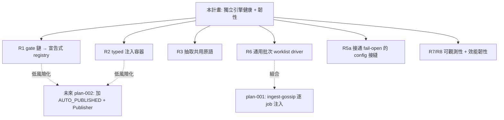

# LCP 成熟化：內部可擴展性 + 操作韌性（獨立引擎健康，非 gossip 前置）

> **誠實定位（修正自初稿）**：本計畫**不** unblock gossip。已驗證：plan-001（gossip 核心，`status: active`）用**現有人工路徑** approve→backfill 就到 `REVIEW_PENDING`，不動狀態機，且自帶批次注入入口；plan-002（auto-publish，`status: blocked`）已完整擁有並決定了 auto-publish actuator + 狀態機 + Publisher，卡在校準/後台/版權而非擴展性。本計畫的價值是**獨立的引擎健康 + 操作韌性**（你明確選的方向），並讓**未來** plan-002 的狀態機手術 + 加新 adapter 變成低風險操作。

## Problem Frame

lcp 的**內功**已成熟（功能核心/外殼分層、單一權威狀態機、~800 個真實測試、mypy 全綠、分層安全防禦），但有三類**已驗證**的成熟度缺口：

1. **擴展靠改 core**：加 gate / adapter / 文案段落都是跨多檔手術；安全/耐久關鍵的原子寫入跨 5 個模組各寫一份。
2. **config 接縫半成品**：`MediaConfig.video_fps/max_video_size_mb` 宣告了卻沒傳進 `judge_video`——**一個超大/錯 fps 的影片今天會靜默過關（真實 fail-open，不是中性的待辦）**；`LintConfig.hype_words/min_copy_chars` 同樣被 `build_lint_config` 丟棄。
3. **無通用批次/可觀測性**：沒有「一次處理所有已爬 job」的入口；無各平台抓取成功率、無 LLM 成本可見性。

這些都是**獨立成立**的引擎改善，不依賴任何「unblock」敘事。額外效益：把擴展操作從手術降為加一筆資料，會讓**未來** plan-002 的高風險改動（新狀態、新 adapter）落地更安全。

**所有權邊界（避免和兩份姊妹計畫撞車）：**
- **plan-002 擁有** auto-publish actuator、`core/state.py` 的 `AUTO_PUBLISHED`/`PUBLISH_FAILED` 邊、Publisher Protocol 與後台 HTTPS。**本 doc 不碰這些。**
- **plan-001 擁有** gossip 橋接（`ingest-gossip`）、gossip_scraper 的功能廣度（Douyin 等）、ranking 平台解耦。
- **本 doc 擁有** 通用引擎重構 + 韌性 + 通用批次 worklist driver + 跨切面 hygiene。

**今天 vs 鋪路後**（同一個動作的成本）：

| 動作 | 今天 | 鋪路後 |
|---|---|---|
| 加一個 Stage-2 gate | 在 `_process_inner` 複製貼上 ProcessResult/stopped_at 段 + 改 ReviewReason enum | GateSpec 清單加一筆 + 一個 checker |
| 加一個 adapter | 改每個 `Pipeline.__init__` + 每個測試建構式 | 註冊到 typed 注入容器 |
| 加一個文案段落 | 改 5 個檔 | 加一筆 section descriptor |
| 一次處理 N 個已爬 job | 無通用入口，推給 cron 外部 fan-out；`crawl --input` 還會靜默只取第一個 URL | `process --all-state crawled`，逐 job 獨立、續跑、`--json` 彙總 |
| （未來）plan-002 加 `AUTO_PUBLISHED` + Publisher | 在手寫 gate 鏈 + 固定 adapter 四元組上動刀（高風險） | 在 registry/容器上加一筆（低風險）——本 doc 不擁有，只是讓它更安全 |

## Requirements

> 標 **[Tier A–D]** 為優先序：A=核心去風險+韌性；B=正確性+config 完整性；C=可觀測性；D=獨立 hygiene（不 gate 主要產出，可單獨出貨）。

**可擴展性接縫（Extensibility seams）**
- **R1 [Tier A]** 把 Stage-2 gate 鏈從手寫複製貼上序列改成**宣告式 ordered gate registry**（GateSpec 清單）：順序即資料、單一 `ProcessResult` 構造、typed `stopped_at`。**registry 必須涵蓋全部 gate**（risk→media→dedup→assemble→lint+grounding），不只「會 park 人工複核」的子集（risk→BLOCKED、dedup→DUPLICATE 不是人工複核 hold）。必須保留現有 fail-closed 順序語意（最便宜的紅線先跑、壞媒體不花 token）。**驗收含**：加一個會產生新 hold-reason 的 gate 是資料層操作，不需同時改 `ReviewReason` core enum + 持久化路徑兩處（原 R11 併入此處）。
- **R2 [Tier A]** **注入式服務容器**：`Pipeline` 不再吃固定 adapter 四元組；新 adapter（未來的 publisher / notifier / metrics sink）註冊即可，不需改每個建構式與測試。**約束**：必須是 **typed adapters dataclass / Protocol-typed slots**，**不是** bare registry dict——`pipeline.py` 在 mypy strict 下，`dry_run` 強制保證靠對具名 `llm_client` 的具體型別推理，動態查表會讓 strict 無法驗證。必須保留 `dry_run` 強制（注入的 live client 不能覆寫 dry mode）。
- **R3 [Tier A]** **抽取共用原語**：`atomic_write_0600()`（目前跨 5 個模組各一份，安全/耐久關鍵路徑只能有一份）、`_SqliteBase` connect/init/chmod 樣板、`finalize_gate()` audit+persist 尾、單一 `make_delimiter()/wrap_data()`、跨 cli/gui 重複的 `_completion_advisory` 與 config 解析。
- **R4 [Tier B]** **copy-section descriptor**：加一個文案段落從「改 5 個檔」變成「加一筆宣告式描述」。

**正確性 + config 完整性（Correctness & config integrity）**
- **R5a [Tier B]** **config 接縫逐欄裁決**：① `MediaConfig.video_fps/max_video_size_mb` → **必須接通**（今天 `media_checker.py:160` 呼叫 `judge_video` 沒帶這兩個參數 = 真實 fail-open，超大/錯 fps 影片靜默過關）；② `LintConfig.hype_words/min_copy_chars` → 接通或刪除（`draft_linter.py:58` 目前丟棄）；③ `DedupScoreParams` → **已接通**（`dedup_checker.py:145`，僅記錄、不需動）。原則：config 介面不准「假裝可調」。
- **R5b [Tier B]** **修 grounding 跨 job 滯留**：`grounding.py:118` 的 process-global `@lru_cache` 在長命的 GUI 程序裡跨 job 保留 source text（PII-plaintext 系統的跨 job 滯留）。**修法是 verify 內一次性本地 memo，不是刪除 cache**——刪掉會把它本來消滅的 O(claims×|source|) 成本帶回來。

**操作韌性 + 批次（Operational robustness）**
- **R6 [Tier A]** **通用批次 worklist driver**：`process --all-state crawled`（與可選 `run --input <list>`）。**語意明確**：逐 job **獨立**處理，job N 停在自己的 hold（含未捕捉例外 → `PROCESS_FAILED` hold）**不中斷** job N+1；最後輸出 aggregate `--json` 彙總。順帶修 `crawl --input` 讀整份清單卻靜默只用第一個 URL 的 footgun。CLI 與 GUI 雙邊鏡像。**與 plan-001 關係**：plan-001 的 `ingest-gossip` + `run --job-id` 是逐 job 注入；本通用 driver 是它可組合的上層（不重疊、不搶所有權）。
- **R8 [Tier C]** **效能約束（非設計）**：MinHash 不得每次 dedup 從頭重建整個 index；`reconcile()` 的 connection-per-call 與每 job marker `stat` fan-out 須收斂。具體做法（LSH 持久化 vs adapter memoize）**留 planning**。

**可觀測性（Observability）**
- **R7 [Tier C]** **結構化、PII-free、`--verbose` 後啟用的 log**：payload 帶 `job_id + action + outcome + timing`；各平台抓取成功/失敗 rollup（給 plan-001 R15 的健康監控；plan-001 的 health 是 scraper 側 log，本項是 lcp 抓取側）；LLM token/延遲/model/outcome；各 rule 觸發計數。**PII-free 約束具體化**：`outcome` 等欄位只用 **enum code（如 `OUTCOME_TRUNCATED_BY_TOKEN_LIMIT`），絕不自由文字**，遵守 CLAUDE.md「hashes + enum codes only」；不得記 source URL/正文片段。

**獨立 hygiene / 機制化不變式（不 gate 主要產出）**
- **R10 [Tier D]（已對齊現況）** gossip_scraper 真缺口（**功能廣度/ranking 解耦屬 plan-001，本項只補工程衛生**）：① 加進 pyproject `[tool.mypy] files`（目前 `files=["src/lcp"]` 排除了它）；② `douyin.py:49`/`bilibili.py:44`/`toutiao.py:45` 把標題以 raw f-string 內插進 URL，須用 `urllib.parse.quote`；③（可選）`typing.Protocol` scraper 契約 + `BaseScraper` 去 httpx 重複。**已完成、勿重做**：git 追蹤（19 檔已 commit）、`tests/gossip_scraper/`（dedup/ranking/health/douyin 已存在）。
- **R12 [Tier D]** **CLI↔GUI 1:1 鏡像 parity test**：枚舉 public `Api` methods（用既有 `public_routes(Api)`）對應 Click commands，明列 shell-only 例外（`gui`、`init`）。
- **R13 [Tier D]** 為 `text_sanitize.py` 等安全關鍵但無專屬測試的 core 模組補測試。
- **R14 [Tier D]** **CONTRIBUTING / 擴展指南**：把「decision in core → I/O in adapter → wire in pipeline → expose in both shells」配方與 `persist_gate_state` seam 紀律寫成人類可讀文件。
- **R-opt [Tier D，可選]** 修打包時 `web/` 資產沒進 wheel（`[tool.setuptools.package-data] lcp=["web/*"]`，確認後一行修）——歸在韌性下：**你自己**從乾淨非 editable 安裝時 `lcp gui` 要能起。（LICENSE 不納入：只在對外分發時才咬人，而分發已明確 de-scope。）

## Success Criteria

- 「加一個 gate」「加一個 adapter」「加一個文案段落」各自只動 1–2 處 + 測試，不再是多檔手術（R1–R4）。
- `atomic_write_0600` 等安全/耐久原語全專案只剩一份實作（R3）。
- 一次 `process --all-state crawled` 能跑 N 個 job、各自獨立、停在各自 hold 不互相中斷、輸出 `--json` 彙總（R6）。
- 超大/錯 fps 影片**不再靜默過關**（R5a①），且每個宣告的 config knob 不是真接通、就是被移除（R5a）。
- 各平台抓取成功率與 LLM 成本可見（R7）；grounding 不再跨 job 滯留 source text（R5b）。
- gossip_scraper 進 mypy 閘且 URL 內插安全（R10）。
- **既有行為零回歸**：~800 測試全綠、mypy 全綠（R1 重構以現有測試為行為基準）。

## Scope Boundaries

- **不碰 auto-publish actuator / `core/state.py` 新邊 / Publisher**——**plan-002 擁有**（已決定 `AUTO_PUBLISHED`+`PUBLISH_FAILED`+retract、`PublisherConfig` 擴展、校準），卡在它自己的前置。本 doc 只透過 R1/R2 讓那場手術更安全。
- **不碰 gossip 橋接 / gossip_scraper 功能廣度 / ranking 解耦**——**plan-001 擁有**。本 doc 對 gossip_scraper 只做 R10 的工程衛生。
- **不做跨語言/領域泛化（B 方向）**：業務政策維持現有常數，本期只接通既有 config 旗標。
- **不做對外分發**（無 LICENSE/PyPI）。唯一保留 `web/` wheel 修復（歸韌性，非分發）。
- **不解 JS SPA 爬取**（抖音/百度深爬）——plan-001 的 feasibility 驗證。
- **不改去水印**（2026-06-17 已 CUT）。

## Key Decisions

- **方向 = 內部可擴展 + 操作韌性，獨立成立**：證據顯示單一 operator、中文專用，「打包給陌生人」不是真需求。
- **誠實更正：本工作不 unblock gossip**。gossip Stages 1-3（plan-001）用現有路徑、未被卡；auto-publish（plan-002）卡在校準/後台/版權。本工作價值是引擎健康+韌性，並去風險化未來 plan-002 的手術。
- **刪除原 R9（auto-publish 接縫）**：plan-002 已完整擁有，保留只會造成 `core/state.py` 兩個主人 + 合規立場矛盾。
- **R2 用 typed dataclass 不用 dynamic dict**：守住 mypy strict 下的 `dry_run` 強制保證。
- **R5a 媒體接縫是「必須接通」不是「接通或刪」**：因為它是已驗證的 fail-open，不是中性待辦。

## Dependencies / Assumptions

- 維持 functional-core/imperative-shell 紀律與兩層 mypy 閘；所有改動 test-first（zero-mock、真實 gate 鏈）。
- R1 重構必須行為等價：現有 ~800 測試是行為基準，重構後全綠。
- 不得與 plan-001 / plan-002 的所有權重疊（見 Scope）。

## Outstanding Questions

### Resolve Before Planning

- 無實質阻塞：初稿的 ownership/合規衝突已因**刪除 R9** 而化解（auto-publish 全歸 plan-002）。唯一需你拍板的是**優先序**——本引擎健康工作 vs 推 plan-001（active）到完成——這偏排程偏好，你提出本需求時已隱含選擇先做本工作；planning 不被它阻塞。

### Deferred to Planning

- [R5a][Technical] 逐欄最終裁決：`LintConfig.hype_words/min_copy_chars` 接通還是刪除（媒體欄位已定為必接）。
- [R7][Technical] 結構化 log 的格式與 sink（stderr JSON line？檔案？）+ PII-free enum 詞彙表。
- [R8][Needs research] MinHash 增量化做法（LSH 持久化 vs adapter memoize）。
- [R2][Technical] 注入容器的精確形狀（adapters dataclass 欄位 vs Protocol-typed slots），前提不破壞 dry_run 強制與 mypy strict。
- [R1][Technical] `stopped_at` typing 與 `ReviewReason` 可擴展性的交互設計。

## Next Steps

→ `Resolve Before Planning` 無實質阻塞 → `/ce:plan` 進入結構化實作規劃（建議以 Tier A 為第一階段）。
