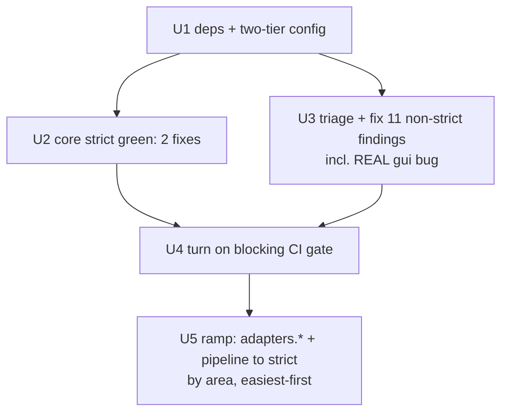

# refactor: Introduce mypy type gate — core strict + adapters ramp

## Overview

Add `mypy` (Python 的靜態型別檢查工具) as a **CI-blocking** gate over the whole
`src/lcp` package, with a **two-tier** policy:

- **Global baseline = non-strict, but enforced clean.** Every module (adapters,
  pipeline, the CLI/GUI shells) is checked at mypy's default level and must be
  error-free.
- **Core zone (`lcp.core.*`) = strict.** The pure functional core is held to
  `--strict`.
- **Ramp (Phase 4): adapters → strict, module by module.** Each adapter
  sub-package earns its own strict override over time, until `lcp.adapters.*`
  matches the core's bar. The thin I/O shells (`cli.py`, `gui.py`) stay
  non-strict on purpose (Click/webview glue — strict ROI is low there).

This plan grew from a core-only scope after the user asked to fold adapters in.
Measurement (mypy 1.20.2 against the full dependency set in `.venv`) is the
backbone of every decision below — see the baselines. The headline: bringing the
**whole package** under a non-strict gate is small (**11 findings**) and
**high-value**, because the gate surfaced at least one **real shipped bug** plus
several robustness gaps that tests never caught.

This is the last identified *pure-engineering* round from the MVP work
(`docs/plans/2026-06-16-001-feat-local-content-processor-mvp-plan.md`). It changes
no product behavior **except** where the type checker exposes genuine bugs that
must be fixed to make the gate green — those fixes are called out explicitly.

## Problem Frame

There is **no static type check** anywhere in the toolchain: `pyproject.toml`
has no `[tool.mypy]`, `mypy` is not a declared dependency, and CI only runs
`pytest`. The codebase is ~72% annotated and cleanly layered (functional-core /
imperative-shell), but type regressions — and latent type-level bugs — land
silently. The GUI launch bug below (`webview.start(host=...)`) is exactly such a
case: never exercised by tests, shipped broken.

We want a permanent type-safety ratchet: strongest on the core (where every
adapter and the LLM grounding depend), enforced-but-lenient everywhere else, with
a concrete path to tighten the adapters to strict.

## Requirements Trace

- **R1.** Introduce `mypy` as a static type-check gate (absent today).
- **R2.** Two-tier policy: **strict** on `lcp.core.*`; **non-strict but
  enforced-clean** globally (whole package checked). (User decision, 2026-06-16:
  fold adapters into scope.)
- **R3.** Make the gate **green** at both tiers: fix the 2 core `[type-arg]`
  gaps; triage and resolve the 11 global non-strict findings (including the real
  bugs); configure third-party stub handling (`types-PyYAML`, `datasketch`
  override).
- **R4.** Provide a **sequenced, sized ramp** to bring `lcp.adapters.*` to strict
  (Phase 4), area by area, with the thin shells (`cli.py`/`gui.py`) explicitly
  left at non-strict.
- **R5.** Behavior change is limited to **genuine bugs the checker exposes**
  (e.g. the GUI host kwarg) and annotation-only edits. No speculative
  refactors. Do not over-claim "fully typed"; `py.typed` (publishing types to
  downstream importers) is deferred.

## Scope Boundaries

- **Non-goal:** making `cli.py` / `gui.py` strict. They are Click/webview glue
  shells (30 + 20 strict errors, mostly decorator/3rd-party friction, low ROI).
  They stay at the enforced non-strict tier.
- **Non-goal:** shipping a `py.typed` marker / exposing the package's types to
  external consumers. This is an app, not a published library. Deferred.
- **Non-goal:** enabling `--strict` globally.
- **Non-goal:** changing pydantic model runtime behavior or adding runtime
  validation beyond what's needed to close a real bug the checker finds.
- **Non-goal:** vendoring a local stub for `datasketch` (one stub-less import;
  use `ignore_missing_imports`).
- **Non-goal (this round, unless time permits):** Phase 4 may ship as a
  follow-up round. Phases 1–3 are the committed deliverable; Phase 4 units are
  fully planned and independently shippable.

## Context & Research

### Measured Baselines (planning-time, mypy 1.20.2, full deps in `.venv`)

> The `.venv` has all functional deps (`scrapy`, `pillow`, `openai`, `keyring`,
> `datasketch`, `pyyaml`, `pydantic`, `pywebview`) — it mirrors what CI installs,
> so these numbers are CI-representative. (mypy itself was pip-installed into
> `.venv` for measurement.)

| Configuration | Result |
|---|---|
| `lcp.core` strict | **2** `[type-arg]` (config.py) + 1 yaml `import-untyped` |
| **whole `src/lcp`, non-strict** | **11 errors in 7 files** |
| whole `src/lcp`, strict | **116 errors in 16 files** |

Whole-package strict, by area (sizes the ramp): `gui.py` 30, `cli.py` 20,
`crawler` 19, `processor` 16, `publisher` 9, `storage` 7, `media` 6, `llm` 5,
`config` 3, `pipeline` 1. **Adapters-only** (excl. cli/gui/pipeline/config) ≈
**62**, mostly `[type-arg]` (61 total) + `[no-untyped-def]` (30 total) —
mechanical, low-risk.

### The 11 non-strict findings — triaged

| # | Site | mypy code | Triage |
|---|------|-----------|--------|
| 1 | `gui.py:555` `webview.start(..., host=SERVER_HOST)` | `call-arg` | **🔴 REAL BUG.** pywebview 6 `start()` has **no `host` param** (verified via introspection). Runtime `TypeError` on launch; the loopback-pinning security claim in the adjacent comment is **not enforced**. Fix: route host via the supported mechanism (`server_args`) or remove + re-pin correctly. Security-relevant. |
| 2–5 | `signoff.py:218,219,297,298` `body/title_sha256` `Any|None`→`str` | `arg-type` | **🟠 Robustness gap.** `_freeze_hashes(...).get(...)` can yield `None` if a freeze record is malformed; `None` then flows into `SignoffRecord` (typed `str`). Body is partly guarded by the hash-mismatch check; title/cover are not. Fix: fail-closed guard if a bound hash is missing. Security-adjacent (sign-off binding). |
| 6 | `gui.py:149` `CrawlRunnerCrawler`→`Crawler | None` | `arg-type` | **🟡 Protocol conformance.** `CrawlRunnerCrawler` doesn't structurally match the `Crawler` Protocol. Align the signature or the annotation. |
| 7 | `pipeline.py:519` `proc.draft: Draft|None`→`Draft` | `arg-type` | **🟡 Narrowing.** Draft is non-None by construction at `target==review`; make it explicit (guard/assert) so the type holds. |
| 8 | `net_guard.py:86` `info[4][0].split(...)` on `str|int` | `union-attr` | **🟢 Mechanical.** getaddrinfo sockaddr typing; narrow to `str(...)`. Not a runtime bug. |
| 9 | `media_checker.py:198` `list[str]`→`list[str|Path]` | `arg-type` | **🟢 Mechanical.** List invariance; widen `make_cover`'s param to `Sequence[str|Path]`. |
| 10 | `ffprobe.py:295` `int(value)` + stale `# type: ignore[arg-type]` | `call-overload` (+`unused-ignore` under strict) | **🟢 Mechanical.** Fix the ignore code / annotate `value`. |
| 11 | `config.py:12` `import yaml` | `import-untyped` | **🟢 Tooling.** Add `types-PyYAML` to dev deps (gives real yaml types for the strict core). |

Two findings (1, 2–5) touch **security-relevant** paths and may require small
behavior changes (fail-closed guards / correct API usage). They must be treated
as bug-fixes with care, not silenced with `# type: ignore`.

### Relevant Code and Patterns

- **`src/lcp/core/`** (13 files, ~2200 LOC): clean of upward imports (verified) →
  scoping is natural. Strict gaps only at `config.py:208,233`.
- **`pyproject.toml`**: `dev` extra is where `mypy` + `types-PyYAML` go; mirrors
  the existing `[tool.pytest.ini_options]` TOML style. No `[tool.mypy]` yet.
- **`.github/workflows/ci.yml`**: single `test` job; installs
  `-e ".[crawl,media,llm,dedup,dev]"` (note: **omits `gui`**). To check `gui.py`
  meaningfully (and catch finding #1), the typecheck needs `pywebview` installed
  — pip-installing the package suffices for mypy (no GTK/Qt runtime needed).

### Institutional Learnings

- `docs/solutions/` is empty — no prior typing learnings.

### External References

- mypy `[[tool.mypy.overrides]]` per-module config — the mechanism enabling the
  two-tier policy and the incremental ramp. No further external research needed;
  decisions are grounded in the measured baselines.

## Key Technical Decisions

- **Two-tier config: global non-strict (enforced) + `lcp.core.*` strict
  override, whole package in `files`.** The strict bundle lives in the core
  override so "global non-strict" is genuine for the shells and for not-yet-ramped
  adapters. Ramp = add a new strict override per adapter sub-package.
- **Whole package is checked and must be clean — even at non-strict.** An
  enforced non-strict tier is what turns the 11 findings (incl. the real bug)
  into a build failure today, not someday.
- **Install `pywebview` (the `gui` extra) for the typecheck step**, so `gui.py`
  is genuinely analyzed (this is what catches finding #1). If GTK/Qt makes the
  pip install unreliable in CI, fall back to a `webview.*` override + a local
  re-confirm of #1; default is to install it.
- **`types-PyYAML` in dev** (real yaml types for the strict core);
  **`datasketch` → `ignore_missing_imports`** (no stubs exist).
- **mypy as a blocking CI step**, pinned `mypy>=1.18,<2` to avoid version drift
  turning the gate red on a minor bump.
- **Shells (`cli.py`, `gui.py`) stay non-strict**; **`pipeline.py` joins strict
  in Phase 4** (only 1 strict error — nearly free, and it's orchestration worth
  the guarantee).
- **Defer `py.typed`** — distribution concern for library consumers; not an app
  need, avoids over-claiming "fully typed."
- **Findings that are real bugs are fixed as bugs** (fail-closed where
  security-relevant); only true false-positives may use a scoped `# type: ignore`
  with a reason.

## Open Questions

### Resolved During Planning

- *Strictness?* → core strict, global non-strict-but-enforced, adapters ramp to
  strict (user, 2026-06-16).
- *Is folding in adapters large?* → **No** for the non-strict gate (11 findings);
  **~62 mechanical errors** for the full adapters-strict ramp.
- *Does `gui.py:555` host kwarg work?* → **No** — verified pywebview 6 `start()`
  lacks `host`. Real bug (finding #1).
- *Does yaml need stubs?* → **Yes** in the CI-representative env (mypy 1.20.2);
  add `types-PyYAML`.

### Execution Outcome (Phases 1–3 shipped 2026-06-16)

Units 1–4 implemented and committed on `feat/local-content-processor-mvp`
(`0092306`..`e163423`): mypy 0 errors (49 files), pytest **479 passed** (+2 new
tests), secret scan clean. Code review (security / correctness / kieran-python)
returned **no P0/P1**; the real GUI bug and the sign-off fail-closed were
confirmed sound (pywebview's built-in server bind to 127.0.0.1 verified against
the installed package). The one acted-on finding: added `strict_bytes` so the
core bundle truly equals `--strict`.

Watch-items (documented, not fixed — bounded/non-reproducing in the pinned range):
- **Pillow stub drift:** `normalizer.exif_transpose` is typed `Image | None` in
  old Pillow stubs (10.x); green on the pinned `pillow>=12.2,<13`. If the pin
  moves, guard the `exif_transpose` result.
- **cli.py `run` crawler join-inference:** green on both mypy 1.18.2 and 1.20.2
  with the real config; if a future mypy bump surfaces a branch-join `[assignment]`
  error, annotate `crawler: CrawlerProtocol` at first assignment (note: doing so
  emits an `annotation-unchecked` note while `run` stays untyped).

### Deferred to Implementation

- The correct pywebview mechanism to re-pin the server host (finding #1) —
  confirm against the pinned `pywebview>=6,<7` at fix time.
- Exact per-error edit forms (annotations / guards) for findings 2–10.
- Whether the mypy CI step is a step in the `test` job or a separate `typecheck`
  job — default: a step in `test` (reuses the env); either satisfies R1.
- Whether Phase 4 ships this round or as a follow-up — decide after Phases 1–3
  land and the round's remaining budget is clear.

## High-Level Technical Design

> *Directional guidance for review, not implementation specification.*

```toml
[tool.mypy]
python_version = "3.11"
files = ["src/lcp"]              # whole package under the checker
warn_unused_configs = true
# global baseline = NON-STRICT but ENFORCED (must be clean).

[[tool.mypy.overrides]]
module = "lcp.core.*"           # tier 2: strict (enforced)
disallow_untyped_defs = true
disallow_incomplete_defs = true
check_untyped_defs = true
warn_return_any = true
warn_unused_ignores = true
no_implicit_optional = true
warn_redundant_casts = true

# RAMP (Phase 4): add one block per adapter sub-package as it is cleaned, e.g.
# [[tool.mypy.overrides]]
# module = "lcp.adapters.storage.*"
# <same strict bundle>

[[tool.mypy.overrides]]
module = ["datasketch.*"]       # ships no type information
ignore_missing_imports = true
```



## Implementation Units

- [x] **Unit 1: Add deps + two-tier `[tool.mypy]` config (gate stood up, red by design)**

**Goal:** Make `mypy` runnable over the whole package with the two-tier policy
and third-party stub handling.

**Requirements:** R1, R2, R4.

**Dependencies:** None.

**Files:**
- Modify: `pyproject.toml` — add `mypy>=1.18,<2` and `types-PyYAML` to the `dev`
  extra; add `[tool.mypy]` + `lcp.core.*` strict override + `datasketch`
  override, with the RAMP comment.

**Approach:** Per the design sketch. Strict bundle in the core override; global
stays lenient. `files = ["src/lcp"]`.

**Test scenarios:** Test expectation: none — pure tooling config. Correctness via
Verification.

**Verification:** Running mypy checks all 49 source files and surfaces **exactly**
the known baseline: 2 core `[type-arg]` + the 11 global findings (no yaml error,
since `types-PyYAML` is now present; no datasketch error). This expected-red state
is what Units 2–3 drive to green.

---

- [x] **Unit 2: Core strict green (fix 2 `type-arg` in config.py)**

**Goal:** `lcp.core.*` passes strict with 0 errors.

**Requirements:** R3, R5.

**Dependencies:** Unit 1.

**Files:**
- Modify: `src/lcp/core/config.py` (annotate bare `dict` at ~208 `_merge_list`
  param and ~233 `raw`; add `Any` to typing import if needed).
- Test: existing config/settings tests are the behavioral guard (no new test).

**Approach:** `dict` → `dict[str, Any]`. Runtime-identical; annotation-only.

**Execution note:** Run the existing config tests before/after — annotation-only,
must be behavior-preserving.

**Test scenarios:**
- Integration (existing): `update_llm_config_file` / `_merge_list` tests still
  pass — proves YAML-merge behavior unchanged.

**Verification:** mypy reports 0 errors under the `lcp.core.*` strict override;
`pytest -q` green.

---

- [x] **Unit 3: Triage + resolve the 11 non-strict findings (incl. real bugs)**

**Goal:** Global non-strict tier passes with 0 errors; genuine bugs fixed, not
silenced.

**Requirements:** R3, R5.

**Dependencies:** Unit 1.

**Files (by finding):**
- Modify: `src/lcp/gui.py` (#1 host kwarg — **real bug**; #6 Crawler Protocol),
  `src/lcp/adapters/publisher/signoff.py` (#2–5 None-hash guard),
  `src/lcp/pipeline.py` (#7 draft narrowing),
  `src/lcp/adapters/crawler/net_guard.py` (#8),
  `src/lcp/adapters/processor/media_checker.py` (#9 + likely
  `src/lcp/adapters/media/normalizer.py` `make_cover` signature),
  `src/lcp/adapters/media/ffprobe.py` (#10).
- Test: add/extend tests for the **behavior-changing** fixes — `tests/` for
  signoff None-hash fail-closed; a GUI launch-args test for #1 (assert host is
  pinned via the correct mechanism / no `TypeError`).

**Approach:** Work the triage table. Mechanical (#8–10) → narrow/annotate.
Real/robustness (#1, #2–5, #6, #7) → fix as bugs, fail-closed where
security-relevant. A `# type: ignore[code]` is allowed only for a confirmed
false-positive, with a one-line reason.

**Execution note:** Findings #1 and #2–5 are security-relevant — treat as
bug-fixes with tests, and surface them to the user if a fix implies a
behavior/contract change beyond a guard.

**Test scenarios:**
- Error path (#2–5): a freeze record missing `title_sha256` → sign-off refuses
  (fail-closed) instead of binding `None`.
- Integration (#1): `launch()` arg construction pins the server to loopback via
  the supported pywebview mechanism and raises no `TypeError`.
- Happy path (#8–10): existing crawler/media tests still pass after narrowing.

**Verification:** Whole-package non-strict mypy = 0 errors; `pytest -q` green;
the two security-relevant fixes have explicit test coverage.

---

- [x] **Unit 4: Turn on the blocking CI gate**

**Goal:** Regressions at either tier fail the build.

**Requirements:** R1, R2.

**Dependencies:** Units 2 + 3 (CI must be green before the gate blocks).

**Files:**
- Modify: `.github/workflows/ci.yml` — add `pywebview` to the install for the
  typecheck (so `gui.py` is checked), add a `Type-check` step running `mypy`
  (no args; reads config).

**Approach:** Step in the existing `test` job after install. If `pywebview` pip
install is unreliable in CI, fall back to a `webview.*` override (documented) and
keep #1 covered by the Unit 3 test.

**Test scenarios:** Test expectation: none — CI config.

**Verification:** CI shows a green mypy step. Local sanity: inject a temp type
error in a core file → mypy fails; revert (do not commit).

---

- [ ] **Unit 5 (Phase 4 ramp): Promote `lcp.adapters.*` (+ `pipeline.py`) to strict, area by area**

**Goal:** Bring the adapter layer to the core's bar; shells stay non-strict.

**Requirements:** R4.

**Dependencies:** Unit 4. Each area is an independent increment (own commit).

**Files (one increment per area, easiest-first by error count):**
- `pipeline.py` (1) → `adapters/llm` (5) → `adapters/media` (6) →
  `adapters/storage` (7) → `adapters/publisher` (9) → `adapters/processor` (16)
  → `adapters/crawler` (19). ~63 errors total, mostly `[type-arg]` +
  `[no-untyped-def]`. For each: add a strict `[[tool.mypy.overrides]]` block,
  fix that area's errors, run its tests, commit.

**Approach:** Mechanical annotation work; no logic changes expected. Treat any
*new* real bug surfaced the same as Unit 3 (fix as a bug). Leave `cli.py` /
`gui.py` at non-strict (documented non-goal).

**Execution note:** Independent, resumable increments — safe to split across
sessions. `log`/note any area deferred so coverage isn't silently overstated.

**Test scenarios:** Per area: existing tests for that adapter remain green after
annotation; no behavioral diff.

**Verification:** Each promoted area passes its strict override; full suite green;
`lcp.adapters.*` (and `pipeline`) under strict, shells under enforced non-strict.

## System-Wide Impact

- **Interaction graph:** Phases 1–2 + Unit 5 are annotation/config only. Unit 3
  changes runtime behavior **only at the bug sites**: GUI launch args (#1) and
  sign-off None-handling (#2–5) — both toward more-correct / fail-closed.
- **Error propagation:** #2–5 makes sign-off fail-closed on a malformed freeze
  (stronger, consistent with the existing hash-mismatch guard).
- **State lifecycle:** No persisted-state/schema changes.
- **API surface parity:** #1 fixes the GUI launch contract (loopback pinning);
  no public CLI/API change.
- **Integration coverage:** New tests for #1 and #2–5 (the cross-layer
  bug-fixes); existing suites guard the mechanical edits.
- **Unchanged invariants:** All three architectural redlines untouched (LLM
  zero-capability; auto-judgements advisory; attacker-shapeable text never
  regains capability). Core stays pure; the mypy core-scope *reinforces* the
  no-upward-import redline. #1 actually **restores** an intended security
  invariant (loopback pinning) that was silently broken.

## Risks & Dependencies

| Risk | Likelihood | Impact | Mitigation |
|------|-----------|--------|------------|
| #1 fix (pywebview host) changes GUI launch semantics | Med | Med | Confirm correct `server_args` mechanism against pinned pywebview; add a launch-args test; surface to user if contract shifts. |
| #2–5 fail-closed guard rejects a previously-accepted edge | Low | Low | Only triggers on a malformed freeze (our own writer produces complete records); add an explicit test. |
| `pywebview` uninstallable in CI (GTK/Qt) → #1 not gated | Med | Low | mypy needs only the package on disk, not a working backend; fallback = `webview.*` override + the Unit 3 test still covers #1. |
| mypy version drift turns the gate red | Med | Low | Pin `mypy>=1.18,<2`; bump deliberately. |
| `datasketch` `ignore_missing_imports` masks a misuse | Low | Low | Narrow blind spot in pure rule code already unit-tested; revisit only if it bites. |
| Phase 4 over-runs the round | Med | Low | Phase 4 is independently shippable per area; can land as a follow-up without blocking Phases 1–3. |
| Committing Unit 1 before 2–3 leaves transient red CI | — | Low | Land 1–3 together; Unit 4 turns the gate on only when green. |

## Phased Delivery

- **Phase 1 — Stand up the gate:** Unit 1.
- **Phase 2 — Green the baseline:** Units 2 + 3 (incl. the real bug-fixes).
- **Phase 3 — Enforce:** Unit 4 (blocking CI).
- **Phase 4 — Ramp:** Unit 5 (adapters → strict, area by area). May be a
  follow-up round.

## Documentation / Operational Notes

- The ramp pattern lives as inline comments in `[tool.mypy]` (Unit 1).
- No production/runtime monitoring needed for the tooling/config; the GUI/sign-off
  bug-fixes are exercised by new tests. The only ongoing signal is a CI check.
- Optional future (out of scope): `pre-commit` mypy hook; eventually making the
  shells strict if Click/webview typing friction is resolved.

## Sources & References

- Related plan (completed): `docs/plans/2026-06-16-001-feat-local-content-processor-mvp-plan.md`
- Baselines: mypy 1.20.2 against `src/lcp` with full `.venv` deps (planning-time).
- Real bug: `src/lcp/gui.py:555` vs. pywebview 6 `start()` signature (verified).
- Robustness: `src/lcp/adapters/publisher/signoff.py:171-220`.
- Config/CI surfaces: `pyproject.toml`, `.github/workflows/ci.yml`.
