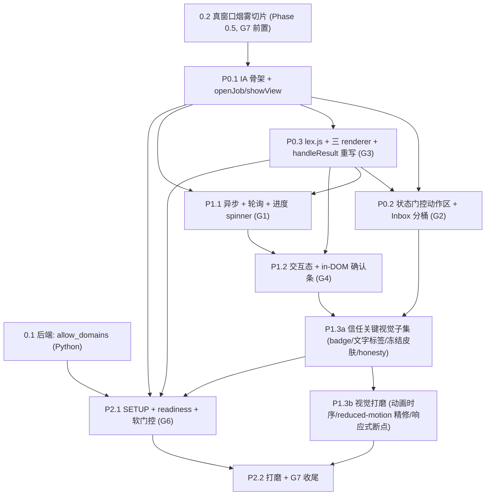

# feat: Operator GUI UI/UX rebuild

## Overview

把 `lcp` 操作者 GUI 从「管道接通但体验从零」（7 个 section 同时摊在一屏、所有动作按钮永远可见、长任务冻结窗口、错误是机器码、CSS 仅 14 行）重做成一个**状态驱动、说人话、不冻结、视觉可信、首跑有引导**的操作者界面，供**非技术经营者**每天使用。

实现严格遵守既有约束：vanilla JS + 外部 CSS、**零构建步骤 / 零框架 / 零 CDN / 零新依赖**、严格 CSP、`textContent`-only 渲染、CLI/GUI 对等、禁 `alert/confirm/prompt`。**后端只读**，唯一改动是 Phase 0 一行只读扩展（`get_settings()` 返回 `allow_domains`）。

工作分四阶段、每阶段单独可在真实 pywebview 窗口验证（直接攻 G7「从没真人端到端跑过」；注：P0 的窗口验证限 dry-run/短路径——见 Phased Delivery 注）：Phase 0（后端单行）→ **Phase 0.5（真窗口烟雾切片，最先做，前置 G7）** → P0（让它跑 + 状态驱动 + 易读性）→ P1（异步 + 交互态 + 视觉系统）→ P2（onboarding + 打磨 + G7 收尾）。

## Problem Frame

操作者是单机、单人、**非工程背景的经营者**，不读状态机、读中文。后端（16 个 `JobState` 枚举 = 15 持久态 + 1 瞬态 `processing`、fail-closed 合规闸、冻结保证、不自动发布）是正确且诚实的，但当前 GUI 把这套机器的**原始词汇**直接糊在脸上 —— 这是 #1 弃用风险。核心矛盾（见 origin: `## Problem Frame`）：**后端把「fail-closed = 替你拦下、停着等你看」做对了；GUI 必须把这种「停下」读成「已替你停好，等你判断」，绝不能读成「失败 / error」。** 整套配色、文案、动作区都是这句话的落地。

源需求文档（`docs/brainstorms/2026-06-16-frontend-ui-ux-deep-plan.md`）已完成深度设计与跨维度对抗校验（completeness 判定 = complete），并把缺口固化为 G1–G7。本计划是它的**实现分解与排序**，不重新发明产品行为。

## Requirements Trace

主缺口（origin: `## Problem Frame`，每个都被某阶段关闭）：
- **G1 冻结窗口** — 长爬取/LLM 调用期间窗口卡死、无进度（异步后端已存在但 app.js 没用）。→ P1
- **G2 无状态驱动可供性** — 所有动作按钮永远可见，操作者须先懂状态机。→ P0
- **G3 机器话** — worklist 显示原始 reason 码、错误显示 `error (3): …`，无人话解释/下一步。→ P0（#1 弃用风险）
- **G4 缺失交互态** — 无 empty/loading/success 态、终态/不可逆动作无确认。→ P1
- **G5 无视觉设计** — 14 行 CSS，无状态色彩语义、无层级、无信任视觉。→ P1
- **G6 无 onboarding** — 裸 settings 表单，不提示运行前必备前置（空 reviewer 白名单会静默让全部签核失效）。→ P0（最小空-reviewer 守卫）+ P2（全量）
- **G7 从未跑过** — 整套需在真实 pywebview 窗口端到端验证。→ 每阶段验证 + P2 收尾

关键约束（origin: `## Constraints Honored`，实现必须保持）：R41 渲染纪律（textContent-only / 严格 CSP / 惰性来源链接）、R40 loopback-only、浏览器对话框禁令、R30 CLI/GUI 对等、R33 技术/日常拆分（P3/P4 config-only）、R19 secret 纪律、R25 reviewer 署名、R26 不暗示机器已发布、R36 dedup 诚实、R18 待校阅 framing。

成功标准（origin: `## Success Criteria`，本计划的验收）：
- SC1. 非技术操作者无需读状态机即可完成一次完整日常循环，全程不见 enum 值/reason 码/`error (N)`。
- SC2. 窗口在长爬取/LLM 期间不冻结；spinner 在任何 `job_status` 形态下都正确终止，绝不无限转。
- SC3. 面对 hold（needs_human_review）操作者知道下一步；绝无「approve anyway」可点。
- SC4. 被机器拦下的 job（blocked/duplicate）在 Inbox 展开可见、永不静默消失，JOB 视图只读零按钮 + 人话「为什么」。
- SC5. 首跑立即看到 4 个前置就绪状态，缺失时被软门控 + 一行提示挡住，而非在流水线深处撞 exit 3；空 reviewer 显式解释（指向 config.yaml）。
- SC6. 冻结的 review packet 视觉上明确不可编辑（靛蓝皮肤 + FROZEN ribbon + hash 徽章）。

## Scope Boundaries

- **后端只改一行**（Phase 0 `get_settings()` 返回 `allow_domains`）。状态机、pipeline、adapters、所有 `Api` 方法签名（除 `get_settings` 的**新增**返回字段）**不动**。
- **不加 JS 测试框架 / 构建步骤 / 框架 / CDN / 新依赖**（见 D1）。
- **P3/P4（crawler allowlist、reviewer 白名单）不做 GUI-可编辑** —— 它们是合规/安全边界，刻意保持 config.yaml-only（R33，见 D7）。本计划只让其**状态可见**并以文案交接。
- **不做** dark mode（YAGNI，单机 light 窗口）、多用户、主题引擎、SPA 路由、感知哈希查重、Stage 5/6 自动发布。
- **不喂** `get_packet().source_urls`（今为 `[]`，inert-link 样式就绪但无数据）—— 后端 feed 缺口，延后（见 Deferred）。

## Context & Research

> 外部研究：**跳过**。源文档已是一次 24-agent、代码级深研的产物；本地模式充足（既有 `Api`、CLI、状态机、GUI 测试约定齐全）。本计划补充的是实现分解所需的精确文件/约定 grounding。

### Relevant Code and Patterns

- `src/lcp/web/index.html`（148 行）—— 当前 7-section 单滚动 + 严格 CSP `<meta>`（不动）。改为顶栏 nav + 3 视图根。
- `src/lcp/web/app.js`（307 行）—— 渲染收口 `el/setText/clear/renderField/renderList`（**复用，textContent 纪律不动**）；`handleResult`（line 50-57，P0 重写）；`bind/init`（line 231-307）；同步 `create_and_crawl`/`process` 调用（line 239/251，P1 改异步）；`loadSettings/saveSettings`（line 198-229，P2 扩展 + secret 清除模式 line 222 复用）。
- `src/lcp/web/app.css`（14 行）—— P1 整体重写为 ~230 行（token + 组件）。
- `src/lcp/gui.py` `Api` —— 9 个操作方法（1:1 镜像 CLI）+ `get_settings`（line 466-480，Phase 0 加一行）+ 既有但未用的 `create_and_crawl_async`/`process_async`/`job_status`（line 229-254，P1 接上）。返回 dict 形状见 origin: `## State & Message Legibility` C 表与 `## Interaction & Async States` 6-shape 表。
- `src/lcp/core/state.py` `_TRANSITIONS` —— 状态门控动作的**唯一权威来源**（G2，逐边导出，不发明边）。
- `src/lcp/core/models.py` —— `JobState`（16 个枚举 = 15 持久态 + 瞬态 `processing`）、`ReviewReason`（risk/dedup/grounding）枚举；`lex.js` 完整性测试的真值来源。
- `src/lcp/core/errors.py` —— `LcpError` 子类 + exit_code（1-5 桶，lex.js C 表来源）。
- 测试约定：`tests/test_gui_settings.py`（239 行，模式 = `Api(config_path=str(tmp_path/"config.yaml"))` → 调方法 → 断言返回 dict；monkeypatch keyring/config）、`tests/test_gui_api.py`（508 行）。Phase 0 测试入此处。

### Institutional Learnings

- `docs/solutions/` 不存在 —— 无既有学习可引用。

### External References

- 无（外部研究已跳过，理由见上）。

## Key Technical Decisions

- **D1 — 不加 JS 测试框架；前端 JS 验证走真窗口手动 QA（G7）+ 跨语言完整性测试。** 纯 Python 项目无 `package.json`/node；加 JS runner 违反「零构建/零依赖」约束。代价：app.js / lex.js 无自动化单测。缓解：①尽量把逻辑留在已被 pytest 覆盖的 Python `Api`，JS 保持薄；②`lex.js` 为纯数据 + 纯渲染，其**完整性**由一个 pytest（读 lex.js 文本、断言每个 `JobState`/`ReviewReason`/exit-code 枚举值都有条目 + 有 unknown 回退）守护 —— 专防最易回归的「新后端枚举 → 空白 UI」；③每个前端单元的「测试场景」写成**真实 pywebview 窗口的手动 QA 场景**（具体 input→action→expected），每阶段末执行，是约束下右尺寸的覆盖。
- **D2 — 视图切换、worklist 为中心的三视图 IA（INBOX/JOB/SETUP）**，用 `element.hidden` + 顶栏按钮切换，**非路由/框架/构建步骤**（origin: `## Information Architecture`）。杀掉共享 `#job-id` 文本框 → 选择 = `openJob(job_id)` 设 `currentJobId` 模块变量；杜绝「签核中误打错 job」一整类错误，并是状态门控的结构性使能。
- **D3 — 状态门控动作从 `state.py` `_TRANSITIONS` 逐边导出**，只渲染合法动作、非法的**直接不渲染**（非置灰）。删两条不存在的伪造边（`crawled`→re-crawl、`crawl_failed`→`ingest_dir`）；`blocked/duplicate` 零按钮（其 `_TRANSITIONS` 为空 frozenset）；`needs_revision` 出口刻意排除 reject（无该边）。按钮集每态从映射表导出一次，**绝不手抄**（origin: `## State & Message Legibility` 守卫注）。
- **D4 — `lex.js` 客户端翻译表（闭合枚举）。** switch on `exit_code`（**非**消息文本）；未知枚举回退到原始 token（前向兼容）。三个渲染点：worklist Reason 单元格、JOB 状态横幅、inline 错误块（origin: `## State & Message Legibility`）。
- **D5 — 复用既有异步后端，不加后端。** `create_and_crawl_async`/`process_async`/`job_status` 已存在；P1 只在前端接上。`ingest_dir` 无 `_async` 孪生（本地无网络，保持同步 + busy 锁）。
- **D6 — Phase 0 单行只读后端扩展（`allow_domains`）= 做**（已拍板，origin: `## Resolve Before Planning`）。把 onboarding P3 从 `unknown`/C-partial 翻成真信号，删除「假绿色」风险与 C-partial 双路径。
- **D7 — P3/P4 保持 config.yaml-only，不做 GUI-可编辑。** 让非技术操作者从文本框拓宽爬虫 allowlist 是合规 footgun（SSRF/own-site 边界）；reviewer 白名单是签核归属（R25）。这是刻意的 R33 拆分；GUI 只展示状态 + 文案交接「怎么改」。
- **D8 — 所有确认用 in-DOM 确认条（arm→commit→disarm），禁 `alert/confirm/prompt`**（会阻塞 pywebview 桥）。同时只 arm 一个（origin: `## Interaction & Async States`）。

## Open Questions

### Resolved During Planning

- **Phase 0 `allow_domains` 只读扩展是否做？** → **做**（D6，已拍板）。
- **轮询节奏 1500ms / 上限 ~90s 是否先验证？** → 作为默认值进实现；**P1 第一项验证 = 真实窗口跑一次真实 `process`、实测耗时后校准**（不阻塞，origin: `## Resolve Before Planning`）。
- **前端 JS 怎么测？** → 不加 JS runner；手动 QA + lex.js 完整性 pytest（D1）。
- **`get_settings` 加字段会不会破坏既有测试？** → 不会，**纯新增字段**，向后兼容；`tests/test_gui_settings.py` 既有断言不涉及 `allow_domains`。

### Deferred to Implementation

- **`get_packet().source_urls` 今为 `[]`（gui.py 硬编码）** —— inert-link 视觉就绪但无数据；是否/何时让 GUI 喂 source_urls 是后端 feed 缺口（origin: `## Deferred to Planning`）。
- **`ingest_dir` 无 `_async`** —— 若实测大资料夹 ingest 显冻结，`ingest_dir_async` 是后端 follow-up。
- **CLI parity gap P2（`crawl --input` URL-list 文件）** —— GUI 走重复 NEW job 扇出（已知接受缺口）；批量入口 post-MVP。
- **重启后仍真在处理且上会话崩溃的 job** —— `PROCESSING` 永不持久化，报最后静止态；更强崩溃恢复 UI 是否需要，实现时定。
- **Inbox 非实时**（刷新仅 on-entry + 手动，无 timer，YAGNI）—— 确认单操作者无需轻量定时刷新。
- **`needs_revision` 不显示原始 `finish_reason` 值**（仅 `get_packet()` 暴露）—— 是否把 `finish_reason` 加入 `process()`/`list_jobs` 返回，实现时定。
- **跨维度 tone 约定（已锁定，非延后）** —— `lex.js` 的 `tone`：fail-closed 态（`needs_human_review`/`crawled_warn`）映射到 **calm 琥珀（AMBER「需要你/已停好」），绝非 alarming 红**；红专留死路终态（blocked/duplicate/rejected）。这是 P0.3 lex.js 的**硬约定**（design-lens 指出这是操作者面文案不可由实现者即兴决定的项），不进 Deferred。`needs_revision` 截断交叉引用句、崩溃恢复句一并在 P0.3 lex 条目中给定，不临场撰写。
- **WebKitGTK 字形 tofu / 最窄窗口 sticky header 高度** —— 一次性目检（P2 G7）。

## High-Level Technical Design

> *以下为方向性指引，供 review 验证「形状」，非实现规范。实现 agent 应视为 context，不照抄。完整设计见 origin 文档对应章节。*

**三视图 IA（D2）** —— 持久外壳（sticky header：标题 + 3 nav 按钮 + 诚实声明 + 就绪 pill）之下，`#view-inbox` / `#view-job` / `#view-setup` 恰有一个 `hidden=false`：

```
init() --get_settings+reviewers--> ready? --no--> [SETUP] (首跑自动开)
                                      |yes
                                      v
   [INBOX 收件匣] --Open-->  openJob(id): currentJobId=id; showView('job')
   (4-band 分桶:                state <- job_status / list_jobs (永远可解析)
    需要你/被机器拦下/            packet body <- get_packet (pre-draft 返回 error -> 隐藏面板)
    进行中/已结案)         --> [JOB 工作台] renderStateBanner + renderActions(状态门控)
                                      |
   [+ New job] --create mode--> 同一视图重渲染为该 id 工作台
```

**一个 in-flight job 的 transport 状态机（D5，修 G1）** —— 叠在后端 16 个 JobState（15 持久 + 瞬态 processing）之上，纯由 `job_status(jobId)` 的 **6 种响应形态**驱动（origin: `## Interaction & Async States` 6-shape 表）。轮询器**必须在 switch 前先守卫顶层 `{error}`、并有显式 `default:` fail-safe**，否则 spinner 永转：

```
提交 -> *_async() -> {status:"running"} -> RUNNING (每 1500ms 轮询 job_status)
  job_status 形态 -> 顶层{error}?=FAILED | running=续轮询
                   | done -> 先看 result.error；无 error 再看 result.state：
                       hold/终态(blocked|duplicate|needs_human_review|needs_revision)=PARKED(走 hold 文案·琥珀「已停好」)
                       否则=DONE(.ok 成功横幅)
                   | error(嵌套 result)=FAILED | idle(读 SQLite state)=SETTLED | unknown=LOST
                   | 其他/缺失=FAILED(default fail-safe)
  硬轮询上限 ~120 次/~90s -> 停 spinner + 「比平常久，让它继续或看 worklist」
```

**翻译层（D4，修 G3）** —— 一张 `lex.js`（**16 个 `JobState`**——含 transient `processing`，其文案仅用于 in-flight banner、不作 worklist 行——+ 3 `ReviewReason` + 5 exit-code，纯数据）→ 三个瘦 renderer。完整映射见 origin: `## State & Message Legibility` A/B/C 表。已对照 `state.py`：`blocked/duplicate` 为空 frozenset（零按钮）、`needs_revision`→{processing, superseded}（无 reject）、`approved`→{published_recorded, superseded}、`review_pending` 无回 processing 边（冻结）。

## Implementation Units

依赖关系（非线性，含 Phase 0 旁路与 P1.3 并行）：



> 含义说明：**U0.5（Phase 0.5 烟雾切片）先于一切前端构建**，用现有同步 GUI 在真窗口验证平台假设（G7 前置）；**P1.3 拆为 6a 信任关键子集（随 P0/早-P1，SC4/SC6 必需）+ 6b 纯打磨（含窄窗口响应式断点，可后置）**。

---

### Phase 0 — 后端单行只读扩展

- [ ] **Unit 0.1: `get_settings()` 返回 `allow_domains`（只读、已转义）**

**Goal:** 把 onboarding 前置 P3（crawler allowlist 是否就绪）从「无法核对」翻成真信号，删除「假绿色」风险与 C-partial 双路径。

**Requirements:** D6；支撑 SC5、G6（P2 的真绿 gate banner）。

**Dependencies:** 无（可与 P0 并行）。

**Files:**
- Modify: `src/lcp/gui.py`（`Api.get_settings`，约 line 466-480 的返回 dict）
- Test: `tests/test_gui_settings.py`

**Approach:**
- 在 `get_settings()` 返回 dict 加**恰好一个**新键 `allow_domains`，值 = `crawler.allow_domains` 经 `escape_html` 的列表（复用文件内既有 `escape_html` 与 `c.config.crawler` 访问模式）。**只读、无写入路径、无 secret。**纯新增字段，向后兼容（既有 `loadSettings` 不受影响）。
- **范围守卫**：**不**借「additive」之名顺手多塞 `reviewers`/`storage`/其他 config 字段（回归测试断言返回 dict 的键集为已知固定集）。这些值**仅供** onboarding 的 P3 结构性判断（`len>0`）与 handoff 卡显示（前端经 `textContent` 渲染——原始值即已中和 markup）；**绝不**拿这些（可能已转义的）值与真实 domain 做匹配（adversarial/feasibility 指出转义会破坏 round-trip——但因仅作存在性判断 + textContent 显示，escape 在此无害且与 `allowed_hosts` 一致）。

**Patterns to follow:**
- 同文件 `get_settings()` 已有的 `[escape_html(h) for h in llm.allowed_hosts]` 列表转义模式（gui.py:475）。
- 配置访问 `c.config.crawler.allow_domains`（与 `SourceRegistry.from_config(c.config.crawler)` 同源，crawl 路径已用）。

**Test scenarios:**
- Happy path：config.yaml 设 `crawler.allow_domains: ["a.example", "b.example"]` → `Api(config_path).get_settings()` 返回的 dict 含 `allow_domains == ["a.example", "b.example"]`。
- Edge case：空 allowlist（默认 `[]`）→ `get_settings()["allow_domains"] == []`（onboarding 据此判 P3 缺失/MISSING）。
- Edge case（转义防御）：allowlist 含带 HTML 特殊字符的值（如 `"a&b<x"`）→ 返回值经 `escape_html`（与 `allowed_hosts` 一致），不原样穿透。
- Regression：既有 `test_gui_settings.py` 全绿（断言 base_url/model/api_key_set 不变；新增字段不破坏）。

**Verification:** `./.venv/bin/python -m pytest tests/test_gui_settings.py -q` 通过；`mypy` 门（core/adapters/pipeline 严格；gui.py 非严格基线）仍绿。

---

- [ ] **Unit 0.2: 真窗口烟雾切片（Phase 0.5 —— G7 平台前置，先于一切前端构建）**

**Goal:** 在投入 IA/lex/异步/视觉之前，**先用现有同步 GUI 在真实 pywebview 窗口跑通一次**，拆掉「窗口从没真人端到端跑过」(G7) 这个压在全部 P0–P2 之下的平台未知。

**Requirements:** G7（前置 de-risk）；支撑把 SC1 提前为 P0 出口 gate。

**Dependencies:** 无（用既有代码；建议**最先**做，与 Unit 0.1 可并行）。

**Files:**
- 无代码改动（验证单元）。用既有 `src/lcp/gui.py` `launch()` + `src/lcp/web/*`。如发现 `launch()` 在目标 webview 上的真实 bug（如已修过的 `host=` 类），就地最小修复。

**Approach:**
- 在目标桌面（含目标 Linux/WebKitGTK，若适用）`launch()` 真窗口，用**现有同步**路径跑一次最短闭环：`create_and_crawl`（或 `ingest_dir` 短资料夹）→ `process --dry-run`（R32 不连 LLM，避免外部依赖）→ `make_review_packet` → `approve`。
- **逐项确认平台假设**：js_api 桥双向通；严格 CSP 不挡 `app.js`/`app.css`/`cover.jpg`（同源加载成立）；OS 字体栈渲染中文 + 安全字形子集不 tofu；sticky header 与基本布局成立；`textContent` 渲染如期。记录任何崩裂点。

**Execution note:** 这是 spike/验证，非功能实现——产出是一份「平台假设是否成立」的确认 + 必要的 `launch()` 最小修复，不是新 UI。

**Test scenarios:** Test expectation: none —— 验证单元，无新行为逻辑；覆盖 = 下方真窗口确认清单。

**Verification:** 真窗口完成一次 dry-run 闭环且无桥/CSP/字体/布局崩裂；任何 blocker 在进入 P0 前已知并记录（若平台假设被推翻，P0 设计据此调整——这正是前置它的目的）。

---

### Phase P0 — 让它跑 + 状态驱动 + 易读性（弃用修复，关闭 G2/G3，使 G7 首次可端到端）

- [ ] **Unit P0.1: IA 三视图骨架 + 导航 + `openJob`（杀 `#job-id` 输入框）**

**Goal:** 把 7-section 单滚动改为 INBOX/JOB/SETUP 三视图，用 `element.hidden` 切换；用 `openJob(job_id)` + `currentJobId` 模块变量取代共享 `#job-id` 文本框。

**Requirements:** D2；G2 的结构性前置；R30（对等：动作只重组可见时机，不删）。

**Dependencies:** 无（P0 第一单元）。

**Files:**
- Modify: `src/lcp/web/index.html`（加顶栏 `<nav>` 3 按钮 + 3 视图根 `<section>` 包裹既有内容；JOB 工作台标题取代 `#job-id` 输入）
- Modify: `src/lcp/web/app.js`（`showView()`/`currentView`/`currentJobId`/`openJob()`；worklist「select」改为 `openJob`；`init` 据 `get_settings+reviewers` 决定首视图）

**Approach:**
- 导航 = 纯 JS 状态变量 `currentView` + `showView(name)` 切三视图根的 `.hidden`；活动按钮加 `aria-current="page"`（`setAttribute`）。**无 URL、无 history API**（桌面窗口）。
- `openJob(jobId)`：设 `currentJobId`、`showView('job')`、状态来自 `job_status`/`list_jobs`（**非** packet——pre-draft 状态 `get_packet` 返回 error），再 `renderStateBanner`/`renderActions`（P0.2）+ 可选 `get_packet`（有 error 则隐藏 packet 面板，绝不渲染 error 卡）。
- `[+ New job]` 以 create 模式打开 JOB 视图（design-lens 指出须把这一日常入口说清）：**二选一控件**（radio/segmented，标签「爬一个网址」/「匯入资料夹」）决定显示哪个字段（URL 输入 vs 资料夹路径）+ job-id + dry-run 勾选；**每分支前端校验**（job-id 非空；URL 分支非空且非明显畸形；资料夹分支路径非空）。**提交后分支不同**：URL 分支 → 进度模式 + spinner（`create_and_crawl_async`，P1.1）；资料夹分支 → busy 锁 + 静态「正在匯入…」notice（`ingest_dir` 同步，P1.1）。成功后**同一视图重渲染为该 id 工作台**（无需二次输入 id）。`supersede` 的「新 job id」输入保留（操作者新撰写的 id ≠ 选择现有 job）。

**Patterns to follow:** 既有 `bind()`/`init()` 的 `addEventListener` 绑定（app.js:231-307，**绝不**内联 `onclick`）；既有 `$()/clear()` helper。

**Test scenarios（手动 QA — 真实 pywebview 窗口，见 D1）:**
- 启动 → 恰好一个视图可见；点顶栏 Inbox/Setup 切换，活动按钮高亮。
- worklist 点一行「Open」→ JOB 视图打开该 id，标题显示只读 job id（无文本输入框），不串到其他 job。
- `[+ New job]` → JOB create 模式；建成后**同一视图**重渲染为该 id 工作台，无需二次输入 id。
- 慢桥/无 `window.pywebview`：页面不抛错（既有 `api()` 守卫），显示干净 empty 态而非未样式化 HTML。

**Verification:** 真窗口中三视图切换正常、`#job-id` 文本框已不存在、选择=打开 job 行为正确。

---

- [ ] **Unit P0.2: 状态门控动作区 + Inbox 4-band 分桶（G2）**

**Goal:** JOB 工作台只渲染当前状态合法的动作（从 `_TRANSITIONS` 导出）；Inbox 按派生分组（需要你 / 被机器拦下 / 进行中 / 已结案）分桶，blocked/duplicate 始终展开。

**Requirements:** G2、SC3、SC4；R30；fail-closed 视觉（无 approve-anyway）。

**Dependencies:** P0.1（JOB 视图 + openJob）、P0.3（lex 人话标签）。

**Files:**
- Modify: `src/lcp/web/app.js`（`STATE_ACTIONS` 表 + `renderActions(state, review_reason)`；Inbox 分桶器替换 `refreshSummary`/`refreshJobs` 的平表渲染）
- Modify: `src/lcp/web/index.html`（Inbox 视图的 band 容器；JOB 动作区容器）

**Approach:**
- `STATE_ACTIONS`：每态 → 合法按钮集（origin: `## State & Message Legibility` 「state → 可供性绑定」表，逐行对照 `_TRANSITIONS`）。`needs_human_review` 按 `review_reason` 分支（risk/dedup 无 relint；grounding 有「重新检查」+「人工放行」）。`blocked/duplicate/rejected/superseded/published_recorded` → **零按钮**（只读检视）。`needs_revision` → `{重新处理, 作废}`，**刻意无 reject**。
- Inbox 分桶（客户端从 `list_jobs()` + `summary()` 计算，**非新后端调用**）：4 band；终态拆两组（「被机器拦下」blocked/duplicate **始终展开**、「已结案」rejected/superseded/published_recorded 折叠）；NEW 入「进行中」；`processing` 永不出现（transient）。

**Approach 守卫（防实现陷阱）:** 按钮集**每态从映射表导出一次，绝不把 reject 复制到 `needs_revision`**（会撞 `state.py` 无 `NEEDS_REVISION→REJECTED` 边而报错）。不发明 `crawled`→re-crawl / `crawl_failed`→`ingest_dir` 边（不存在 + 撞 R11）。
- **`_TRANSITIONS` 给的是「目标状态」，不是「动作」——需一张显式「目标态→Api 方法」映射**（按钮才能生成；feasibility/scope-guardian 指出）：`→PUBLISHED_RECORDED`=backfill、`→SUPERSEDED`=supersede、`needs_revision→PROCESSING`=重新处理(process)、`needs_human_review→PROCESSED`=resolve。规则：**`_TRANSITIONS` 闸定「该动作是否被提供」，Api 方法执行它**。特别地，grounding 的「重新检查」由 `Api.resolve(relint=True)` 支撑（**不是**一条 `NEEDS_HUMAN_REVIEW` 出边——它通过 lint 重跑回到 `PROCESSED`），故「逐边导出、不发明边」指的是 gating，不是 1:1 边=按钮。完整性 pytest 同时断言此 action-map 的定义域 = `_TRANSITIONS` 的键集。
- **空 reviewer 守卫（G6 最小子集，在此 P0 落地）**：`reviewers()` 返回 `[]` 时，签核/resolve 动作区**以 onboarding banner 取代** reviewer 下拉与 approve/reject/resolve/backfill 按钮（指向 config.yaml 的 `publisher.reviewers`）——让操作者**在投入一整轮流程前**就知道还不能签核，而非做完 packet 才发现。富 SETUP 就绪清单仍在 P2.1。

**Patterns to follow:** `_TRANSITIONS`（`src/lcp/core/state.py`）为唯一权威；既有 `el/setText/clear` 渲染收口。

**Test scenarios（手动 QA + 自动）:**
- 自动（防回归，pytest）：一个测试断言 `STATE_ACTIONS`（或其源数据）覆盖全部 16 个 `JobState` 成员（含瞬态 `processing` → 映射到「无动作按钮·进度模式」），且 `blocked/duplicate` 映射到空动作集、`needs_revision` 不含 reject（见 D1 完整性测试，与 P0.3 合并实现）。
- 手动 QA — Happy path：`review_pending` job → 只见 核可/退件/作废；`approved` → 只见 回填/作废。
- 手动 QA — Edge：`blocked` / `duplicate` job → JOB 视图零按钮、只读、有人话「为什么」；Inbox「被机器拦下」band 展开可见。
- 手动 QA — 分支：`needs_human_review` reason=`grounding` 见「重新检查 + 人工放行」；reason=`risk`/`dedup` 见「人工放行(需理由)」，**绝无** approve-anyway。
- 手动 QA — Edge：`needs_revision` 只见 重新处理/作废（**无退件**）。

**Verification:** SC3/SC4 满足；真窗口逐态点验每态按钮集与 `_TRANSITIONS` 一致，无非法按钮。

---

- [ ] **Unit P0.3: `lex.js` 翻译层 + 三 renderer + `handleResult` 重写（G3）**

**Goal:** 把后端闭合枚举（16 个 JobState 含瞬态 processing + 3 reason + exit-code 桶）翻成人话（标题 + 为什么 + 下一步），三个渲染点消费；取代 `error (N): …` 与原始 reason 码。

**Requirements:** G3（#1 弃用风险）、SC1；R36（dedup 诚实）、R34（截断）、R26、R41（披露机制）。

**Dependencies:** P0.1（渲染结构）。

**Files:**
- Create: `src/lcp/web/lex.js`（~120 行纯数据对象字面量 + 无逻辑）
- Modify: `src/lcp/web/index.html`（`<script src="lex.js">` 在 `app.js` 前；同源，CSP `script-src 'self'` 已允许，无内联）
- Modify: `src/lcp/web/app.js`（三 renderer：worklist Reason 单元格 / JOB 状态横幅 / inline 错误块；**重写** `handleResult`（line 50-57）为 `exit_code`-keyed 表，**删除**旧 `"error (" + exit_code + "): "` 拼接；backfill 错误特例）
- Test: `tests/test_lex_completeness.py`（新增，跨语言完整性守卫）

**Approach:**
- `lex.js` = 同源对象字面量（A/B/C 表，origin: `## State & Message Legibility`）。**用纯查表（object lookup `MAP[key] || FALLBACK`）而非 `switch`** —— 「有键」即「会被路由到」，杜绝 switch 漏 case（feasibility/adversarial 指出 switch 路由无法被 grep 测试覆盖）。错误 framing 按 `exit_code` 查表（**非**消息文本）。未知枚举/未知 code 一律回退到**显式 `FALLBACK` 条目**（非原样 token 拼接、非空白）。
- **exit_code 是粗粒度基层（仅 5 桶）：** 多个不同条件塌缩到同一码（坏 job id / 缺 draft / backfill 缺勾 / 缺 URL 都是 exit 2）。故 lex C 表是 framing 基层，**条件级措辞靠服务器稳定短语拦截叠加**（见下 backfill 特例）。注：`exit 1`(USAGE) **只在 `cli.py` raise、经 Api 桥不可达**，C 表保留它作防御但运行时只会出现 2/3/4/5——完整性测试只须断言 2-5 + 通用 FALLBACK 覆盖任何未来码。
- 三 renderer 流经既有 `setText`/`el` → 仍 `textContent`-only。「技术细节」披露 = `<button>` + `addEventListener` 切兄弟 `.hidden`（或原生 `<details>`），**绝不**内联 `onclick`/innerHTML。
- backfill 错误特例：按服务器稳定短语拦截（消息含 `attestation required` / `published URL is required`），**不**靠「state 仍 approved」检测（该成功 payload 永不到达，origin: C 表特例）。
- **dedup 诚实句单一来源（design-lens 指出）**：「查重仅代表本工具处理过、非全站」这句承重合规文案在三处出现（duplicate 状态的「为什么」、dedup hold 警语、packet 的 `.honesty-callout`）——在 `lex.js` 指定**一个**规范键，三处**按键引用同一条**，不手写三份变体，杜绝措辞漂移。

**Patterns to follow:** 错误响应 = 任何带 `error` 键的 dict（`{error, exit_code}`）；既有 `escape_html` 已在服务器侧施加，前端只 `textContent`。

**Test scenarios:**
- 自动（pytest，`tests/test_lex_completeness.py`，**核心防回归**）：`from lcp.core.state import JobState, ReviewReason` 遍历**全部 16 个 `JobState` 成员（含 `processing`）**、3 个 `ReviewReason`、exit-code **2/3/4/5**（`from lcp.core.errors`；exit 1 桥不可达，断 2-5）。**结构性断言（非裸 substring grep——substring 会被 `{"review_pending":"review_pending"}` 这类「枚举回显自己」或注释里的命中骗过）**：对每个枚举值断言 lex.js 中存在一个**键**等于该值（如 `"review_pending":`），其映射的人话标题/为什么**非空且不等于枚举 token 本身**；断言存在 `FALLBACK`/`unknown` 键且与所有枚举键不同。专防「后端加枚举 → 前端空白 UI」与「翻译留白/回显原码」。
- 手动 QA — Happy：`review_pending` job 在 worklist/横幅显示「已冻结·待签核」+ 为什么 + 下一步，**不见** enum 字面值。
- 手动 QA — Error：触发一个 input 错误（如坏 job id）→ 显示「你填的内容要修」+ 可展开技术细节，**不见** `error (2): …`。
- 手动 QA — backfill 特例：approved job 不勾 attest 点回填 → 「尚未完成：你没勾…工作仍停在『已签核』」（非成功横幅、非原始错误）。
- 手动 QA — dedup 诚实：dedup hold 永远显示「查重仅代表本工具处理过…非全站」诚实警语。

**Verification:** SC1 满足（全程无 machine-speak）；`pytest tests/test_lex_completeness.py` 通过。

---

### Phase P1 — 异步/进度 + 交互态 + 视觉系统（关闭 G1/G4/G5）

- [ ] **Unit P1.1: 异步管道 + `job_status` 轮询 + 进度 spinner（G1）**

**Goal:** 长爬取/LLM 调用不再冻结窗口；6-shape `job_status` 安全解包，spinner 永不无限转。

**Requirements:** G1、SC2、D5；R32（dry-run 不连 LLM）、R29/R34（安全重试）。

**Dependencies:** P0.1（JOB 进度模式）、P0.3（错误/状态人话）。

**Files:**
- Modify: `src/lcp/web/app.js`（`create_and_crawl`→`create_and_crawl_async`（~line 239）、`process`→`process_async`（~line 251）；新增 `pollUntilSettled`、`setBusy`、`mountSpinner`）
- Modify: `src/lcp/web/index.html`（`<div id="inflight">` aria-live 区）

**Approach:**
- `pollUntilSettled`：**先守卫顶层 `{error}` → 再 6-shape switch → 显式 `default:` fail-safe**（origin: 6-shape 表）。固定 1500ms `setTimeout` 链（非 `setInterval`，防堆叠卡死单线程桥）。每 job 一个轮询器（模块级 `Map<jobId,…>`，再提交 no-op）。`idle` = 合法终点（读 SQLite `state`、停轮询，**非**错误、**非**空转等 done）。**有界轮询错误容忍**（抛出的桥错误 ≤3 次重试 → FAILED「与本机引擎失去联系」）。**硬轮询上限** ~120 次/~90s → 停 spinner + 「比平常久」。
- 进度 spinner = **CSS-only `@keyframes`**（无 GIF/远程，`img-src 'self'`）；**reduced-motion 回退** = JS 读 `matchMedia('(prefers-reduced-motion: reduce)')`，匹配则改每 tick 写 `textContent` 循环字形 `◐◓◑◒`。无假百分比（后端无 sub-progress）；显式「视窗不会卡死」安抚句。
- `init` 重启恢复 = 对 `currentJobId` **单次探测**（非扫所有行——`PROCESSING` 永不持久化）。**明确限制**：重启后只能报**最后持久化的静止态**；上一会话真在跑、随会话被杀的 job 在结构上不可表示（`PROCESSING` 不入库），单探测**无法续接已死的后台线程**——更强崩溃恢复 UI 留 Deferred，但此限制在本单元点名（非只藏在 Deferred）。同步调用（make_review_packet/approve/reject/resolve/backfill/supersede）也上 busy 锁防双击。
- **视图切回须重绑进度（no-router 陷阱，adversarial 指出）**：因 D2 用 `element.hidden` 切视图、且 RUNNING 时允许「切回 Inbox」，`showView('job')` 打开一个在轮询 `Map` 里有 live 条目的 id 时，**必须从 Map 重渲染当前 RUNNING + elapsed**（不只在 submit 时渲染），否则切走再切回会显示空白/陈旧进度而轮询其实仍在跑。
- **`ingest_dir` 的进度（修 G1 的剩余同步路径，design-lens 指出）**：`ingest_dir` 无 `_async` 孪生，但大资料夹匯入仍会卡。同步调用期间在同一 `#inflight` aria-live 区显示静态「正在匯入資料夾…可能需要一點時間（视窗不会卡死）」+ busy 锁（无轮询）。若实测真冻结到不可接受，`ingest_dir_async` 是已点名的 Deferred 后端 follow-up。

**Patterns to follow:** 既有 `Api.create_and_crawl_async`/`process_async`/`job_status`（gui.py:229-254，已存在）；既有 `api()` 守卫。

**Test scenarios（手动 QA — 真窗口，含**实测校准**，见 Resolved 第 2 项）:**
- **校准前置**：跑一次真实 `process`、实测耗时，确认 1500ms 不让 elapsed 滞后、~90s 上限不在合法慢调用误触。
- Happy：点 Process → 立即进度模式、elapsed `mm:ss` 走动、可切回 Inbox、完成后落正确状态徽章 + 成功横幅。
- Edge — idle：处理中关程式重开 → 不空转等 done，读 SQLite 静止态显示「上次已完成」。
- Edge — unknown：删 job 目录后探测 → 「此 job 已不在磁碟上」，不 spinner。
- Edge — 顶层/嵌套 error：LLM 5xx → 人话「外部服务暂时不通…安全重试」+ Retry，spinner 停。
- Edge — 上限：模拟超长 → ~90s 触顶停 spinner + 「比平常久」文案。
- reduced-motion：开启系统 reduced-motion → spinner 退为 textContent 字形循环，无 CSS 旋转。
- 防双击：处理中狂点 Process → no-op（按钮禁用 + Map 守卫）。

**Verification:** SC2 满足（任何 job_status 形态下 spinner 都正确终止）。

---

- [ ] **Unit P1.2: 交互态（empty/loading/success）+ in-DOM 确认条（G4）**

**Goal:** 补齐空/载入/成功态；终态/不可逆动作（reject/supersede/backfill-attest）用 in-DOM 确认条，禁对话框。

**Requirements:** G4、SC4、D8；R37（backfill 具结）、R25。

**Dependencies:** P1.1（busy/确认与异步整合）、P0.3（lex）。

**Files:**
- Modify: `src/lcp/web/app.js`（`handleResult` → 3 变体横幅；`arm/commit/disarm` 确认条三件套；empty-row / loading-row helper）
- Modify: `src/lcp/web/index.html`（Reject/Supersede/Backfill 下 `<div class="confirm" hidden>` 槽）

**Approach:**
- 成功横幅 3 变体（`.ok`/`.warn`/`.err`，CSS 类无内联 style），`aria-live="polite"`，~6s 视觉淡出但文本留 DOM。**来源纪律**：横幅只断言 result dict 实际字段——`process()` 返回 `{state, stopped_at, dry_run, notes[]}`，**不**携带 `blocking_reasons`；故 blocked/duplicate 横幅只命名 `stopped_at` + `notes[]`，更丰富原因指向 worklist/`get_packet().review_reason`。
- Empty 态：Inbox 空 band「收件匣已清空」（首跑→「建立第一个 job」）；worklist 过滤无果提示；reviewer `<select>` 为空 → **以 onboarding banner 取代 reviewer 下拉与签核/resolve 动作**（**统一一种机制：替换，不要「禁用下拉 + 灰按钮」并存**，消除 coherence 指出的措辞不一）；banner 指向 config.yaml 的 `publisher.reviewers`。**此守卫已在 P0.2 落地**（见该单元 reviewer 守卫——避免操作者做完整流程才发现无法签核）；此处仅补全文案。
- Loading 态：init 拉取面板先插「Loading…」占位行，结果到时清除；Refresh 拉取期间禁用。
- in-DOM 确认条：arm（前端校验前置：reject 需非空理由 + reviewer）→ 显示红框确认条 → 第二次点异标按钮 commit；Escape/Cancel disarm；**同时只 arm 一个**。**backfill 的「忘勾 / 缺 URL」是 ERROR dict（exit 2），不是带 `attested:false` 的成功 dict**——已核对 `signoff.backfill_published_url`：`attested=False` 或空 URL 时 `raise InputValidationError`（消息含 `attestation required` / `published URL is required`），跨桥为 `{error,exit_code:2}`。故**按 P0.3 的稳定短语拦截**（**不**靠返回的 `attested` 布尔、**不**靠「state 仍 approved」——后者无法区分忘勾与全新 approved，且该成功 payload 永不到达，与 P0.3 一致）。backfill 成功（`state→published_recorded`）→ `.ok` 横幅；从 worklist 打开的全新 approved job → 中性「已签核——先手动上架再回填」。确认条强制「你是在**具结**，不是证明，我们不会抓取此 URL」。

**Patterns to follow:** D8（禁 `confirm()`）；既有 `el/setText/clear`。

**Test scenarios（手动 QA）:**
- Empty：全新库 Inbox 显示「建立第一个 job」；空 reviewer → 签核动作禁用 + 显式提示。
- Loading：刷新时占位行出现/清除，Refresh 期间禁用。
- Success 变体：approve → `.ok` 横幅；crawled_warn → `.warn`；input 错误 → `.err`。
- 来源纪律：blocked 落地横幅只显示 stopped_at + notes，不伪造拦截原因。
- 确认条：点 Reject → 红框确认条；缺理由时 commit 键不出现；Esc 解除；同时只一个 arm。
- backfill 布尔分支：忘勾 attest → 警告「未记录…仍在等」；全新 approved → 中性「先手动上架再回填」（不吓人）。

**Verification:** SC4 部分（终态确认路径）；所有确认均 in-DOM、无 `alert/confirm/prompt`。

---

- [ ] **Unit P1.3: 视觉系统 —— `app.css` 重写（G5）**

> **本单元拆两层（B，product-lens vs scope-guardian 折中）：6a 信任关键子集（SC4/SC6 必需，随 P0/早-P1 落地）+ 6b 纯打磨（可后置到首轮真用之后）。** 下方 Approach 标注每条归 6a/6b。

**Goal:** 14 行 CSS → ~230 行（token + 组件 + 信任视觉），6 色族状态语义，全部静态同源、严格 CSP 内。

**Requirements:** G5、SC4、SC6；R41（class/属性而非内联 style）、R18/R25/R36（信任视觉）、a11y（WCAG 1.4.1/1.4.11、focus-visible、reduced-motion）。

**Dependencies:** P0.2（badge/lane class hook）、P1.2（banner/confirm class hook）。可先起 token 块，落地于 JS 设好 class hook 后。6b 依赖 6a。

**Files:**
- Modify: `src/lcp/web/app.css`（整体重写）
- Modify: `src/lcp/web/app.js`（少量 class hook：`el.className`/`setAttribute('class',…)`/`setAttribute('data-glyph',…)`——皆 R41 允许的属性写入，**绝非** innerHTML/内联 style）

**Approach:**
- **[6a]** token 块（origin: `## Visual Design System`）：字阶/间距/中性暖灰/6 状态色族（GREY/BLUE/AMBER/RED/INDIGO/SLATE）。**琥珀=需要你（非失败）、红专留死路、靛蓝=已冻结**——把 fail-closed 读作「已停好」。
- **[6a]** 三条渲染纪律 pin 死：①state→class 有 `default` 分支发 `.badge--unknown`/`.lane--unknown`（未来枚举可见标记）；②字形仅装饰，非颜色信号落在**人类文字标签**（textContent）；③show/hide 仅经原生 `hidden` 属性（CSS `[hidden]{display:none}` 作安全网）。
- **[6a]** 信任关键组件：`.badge`（pill + `border:1px solid currentColor` **强制 WCAG 1.4.11**）+ 文字标签；worklist 4px 左色条；按钮三意图（primary/secondary/`.btn-danger.is-armed`）；`button[disabled]`；状态横幅 `.banner--success/error/empty`（静态版即可）。
- **[6a]** 信任视觉（SC6 必需）：sticky 诚实声明 header；`.pending-ribbon`（待校阅）；`.card.is-frozen`（2px 靛蓝 + 霜底 + CSS-drawn「已凍結 FROZEN」corner ribbon + `.hash-chip` mono）**刻意无编辑可供性**；inert-link 拆 `.inert-link__tag`（不可选）+ `.inert-link__url`（mono、虚线、`user-select:all`）；`.honesty-callout`（dedup 诚实）。
- **[6b]** 纯打磨（可后置到首轮真用之后）：CSS-only 不确定进度动画 `@keyframes` + reduced-motion 静态收（功能性已由 P1.1 的 textContent 字形回退保底，此处仅美化升级）；横幅淡出时序；ribbon/间距精修。
- **[6b] 窄窗口响应式断点（C，design-lens）**：加**一个**断点 `@media (max-width: ~40rem)`——worklist 行从多列折成**堆叠卡片**（job-id + 状态徽章 + 「为什么/下一步」各占一行）、sticky header 可预期 reflow（不挤成两行重叠）；并在文档/CSS 注释**定一个最小支持窗口宽度**。非断点路径维持现 `max-width:64rem`。

**Patterns to follow:** 既有 `<meta>` CSP（不动）；OS 字体栈（无 web font）。

**Test scenarios（手动 QA — 真窗口，见 D1）:**
- Happy：各状态徽章显示正确色族 + 文字标签；色弱模拟下文字标签仍可辨（颜色非唯一信号）。
- SC6：`review_pending` 显示靛蓝冻结皮肤 + FROZEN ribbon + hash 徽章，无编辑入口。
- Edge — unknown 回退：注入一个未映射 state（或临时改 lex）→ 显示 `.badge--unknown` 而非无样式/崩溃。
- a11y：键盘 Tab → focus-visible 3px ring 永在；reduced-motion 开 → 进度收为静态。
- WebKitGTK 字形：在目标 Linux webview 目检字形子集不 tofu、FROZEN ribbon 是文字非 emoji（移至 P2 收尾）。
- **[6b] 窄窗口（C）**：把窗口拖到 < ~40rem → worklist 行折成堆叠卡片（每行可读、无横向溢出/列挤压）、sticky header 不重叠；拖回宽窗恢复多列。低于记录的最小宽度不保证（已文档化）。

**Verification:** SC4/SC6 满足（6a）；CSP 不变（无内联 style、无 CDN、无 web font）；徽章对比 ≥4.5:1；窄窗口断点下 worklist 可用（6b）。

---

### Phase P2 — onboarding + 打磨（关闭 G6 全量、完成 G7）

- [ ] **Unit P2.1: SETUP 视图 + 就绪清单 + 软门控（G6）**

**Goal:** 把裸 settings 换成「Setup & readiness」：4 行前置就绪清单 + 4 变体 gate banner + config.yaml 交接卡 + advisory 校验；缺前置时软门控相关按钮 + 一行提示，而非深处撞 exit 3。

**Requirements:** G6、SC5、D6/D7；R33（技术/日常拆分）、R19（secret 纪律）。

**Dependencies:** Unit 0.1（`allow_domains` 真信号）、P0.1（SETUP 视图）、P0.3（错误 framing）、P1.3（gate banner 样式）。

**Files:**
- Modify: `src/lcp/web/index.html`（SETUP 视图：`<tbody id="readiness-body">`、LLM 编辑器复用既有 3 字段、handoff 卡 `<pre>`、静态预声明提示 span `#setup-hint-pipeline`/`#setup-hint-signoff`）
- Modify: `src/lcp/web/app.js`（`computeReadiness()` + `applyGating()` + `setGroup()`；advisory 内联 base_url 校验；首跑自动开 SETUP + 字段聚焦）

**Approach:**
- `computeReadiness()`（origin: `## Onboarding & Settings` 伪码）：P1 endpoint(`base_url`&`model`) / P2 key(`api_key_set`) / P3 allowlist(`'allow_domains' in s ? len>0 : 'unknown'`——Phase 0 落地后为真布尔) / P4 reviewers(`reviewers().length>0`)。坏 YAML → Variant A + 逐字转义消息。
- gate banner **4 变体杜绝假绿**：A（P1/P2 缺）/ B（仅 config 项缺）/ C-partial（P3 `unknown`，**绝不绿**，Phase 0 落地后不可达）/ C（四项正向确认才真绿）。精确选择：P1‖P2 false→A；否则 config 缺→B；否则 P3 `unknown`→C-partial；否则→C。
- `applyGating()` **幂等**（既设又清 `disabled`）：pipeline 按钮组 gate on P1&P2；签核按钮组 gate on P4（P3 `unknown` 不阻塞——首爬是测试）。仅属性写入（CSP-safe）；静态提示 span 仅 show/hide，禁用按钮永不无提示。无 timer。
- advisory base_url 校验（`input` 事件，**非** `validate_llm_base_url` 重实现）：镜像服务器规则（空/非 http(s)/`http://` 非 loopback 须 https/`replace(/\/+$/,"")` 不以 `/v1` 结尾）；分歧时服务器消息胜出。
- handoff 卡（P3/P4）：`get_settings().config_path`（已转义）+ 要加的 YAML 作 **inert 可选复制 `<pre>`**（textContent，无 innerHTML、无剪贴板 JS）；文案陈述空 list 后果 + 「署名非身分验证」framing。

**Patterns to follow:** 既有 `saveSettings`（app.js:213-229，含 secret 存后清 DOM line 222 复用）；既有 `get_settings`/`reviewers` 调用。

**Test scenarios（手动 QA — 真窗口，G7 首跑）:**
- SC5 首跑：裸机 → Variant A + base_url 聚焦 + pipeline 按钮软禁用；填 LLM + Save → Variant 重算 + 按钮启用。
- Variant B：P1/P2 已设但 reviewer 空 → 「需一次性技术设定」+ 指向 handoff 卡 + 诚实「无法在此修」。
- Variant C（Phase 0 已落地）：四项齐 → 真绿细条；空 allowlist → P3 = MISSING（非假绿）。
- advisory 校验：输 `http://example.com`（缺 /v1、http 非 loopback）→ 即时 advisory 提示；Save 时服务器权威消息胜出。
- secret 纪律：填 key Save → DOM 清除、pill 显「key: set」、key 永不回显。
- 幂等门控：缺→设齐→缺，按钮 disabled 状态正确翻转，无陈旧禁用残留。

**Verification:** SC5 满足；空 reviewer 指向 config.yaml（非假装 GUI 可修）；P3/P4 保持 config-only（D7）。

---

- [ ] **Unit P2.2: 打磨 + G7 端到端收尾**

**Goal:** 收尾动画/a11y/跨 webview 渲染细节，并在真实窗口完整验证所有路径（直接关闭 G7）。

**Requirements:** G7、全部 SC 的真窗口确认；a11y 约束。

**Dependencies:** P1.3、P2.1（全部前置完成）。

**Files:**
- Modify: `src/lcp/web/app.css`（动画时序、reduced-motion 全覆盖、最窄窗口 sticky header）
- 无新文件；以验证 + 微调为主。

**Approach:**
- 成功/淡出动画时序统一；reduced-motion 全路径覆盖核查；最窄窗口下 sticky header 两行高度目检；WebKitGTK 字形子集一次性目检（防 tofu，FROZEN 用 CSS ribbon 非 emoji）。
- **G7 完整 QA**：裸机 → 填 LLM → 空 reviewer 提示 → 改 config.yaml → Re-check → 全绿 → 完整日常循环（crawl→process→packet→approve→手动上架→backfill）→ 所有终态/不可逆确认路径 + 所有 hold 分支。

**Test scenarios:** Test expectation: none —— 本单元是验证 + 视觉微调，无新行为逻辑；覆盖 = 下方 G7 QA 清单（SC1–SC6 全验）。

**Verification（G7 验收清单 = 全部 SC）:** SC1（无 machine-speak 完成循环）/ SC2（不冻结、spinner 正确终止）/ SC3（hold 知道下一步、无 approve-anyway）/ SC4（拦下 job 可见 + 只读）/ SC5（首跑就绪可见 + 软门控）/ SC6（冻结皮肤不可编辑）—— 在真实 pywebview 窗口逐条确认。

## System-Wide Impact

- **Interaction graph:** `app.js` ↔ pywebview `js_api` 桥 ↔ `Api`（Python，gui.py）。Phase 0 只触 `get_settings`（只读）。**不触**状态机/pipeline/adapters/任何其他 `Api` 方法。
- **API surface parity (R30):** CLI/GUI 对等维持；`Api` 方法签名不变，唯 `get_settings` **新增**返回字段（additive，向后兼容）。`run --until`（CLI parity P1）由 JOB 引导序列复现；`crawl --input` 文件（P2）GUI 走重复 NEW job 扇出（已知接受缺口）。
- **Error propagation:** 错误仍以 `{error, exit_code}` dict 跨桥（不抛异常过桥）；lex.js 把 exit_code 映人话 framing。轮询的抛出型桥错误是唯一 try/catch 处。
- **State lifecycle risks:** 轮询 Map + idle/unknown 处理 + 重启单探测恢复（`PROCESSING` 永不持久化，不扫 transient 行）；硬轮询上限防 spinner 泄漏。
- **Unchanged invariants:** 状态机（`state.py`）、pipeline、所有 adapters、安全模型（严格 CSP / textContent-only / 惰性链接 / loopback）、`Api` 方法签名（除 `get_settings` additive）。冻结保证（REVIEW_PENDING 无回边）在 UI 层以「无编辑可供性」呼应，不改后端。
- **Integration coverage:** 单元测试覆盖不到的关键路径（异步轮询的 6-shape、in-DOM 确认、状态门控按钮集）由真窗口 G7 QA 证明（D1）。

## Risks & Dependencies

| Risk | Mitigation |
|------|------------|
| 前端 JS 无自动化测试，回归只能靠手动 QA | 逻辑尽量留 Python `Api`；JS 保持薄；`lex.js`/`STATE_ACTIONS` 完整性由 pytest 跨语言守卫（D1）；每阶段强制 G7 QA 清单；code review 盯死 textContent/CSP 纪律 |
| G7 从未验证 —— pywebview 真窗口行为未知（字形 tofu、sticky header、桥时序） | 每阶段末在真窗口验证；P2.2 含显式视觉目检；CSS 字形限跨-webview 安全子集，FROZEN 用 CSS ribbon |
| 轮询节奏 1500ms/90s 未对真实 LLM 延迟验证 | P1.1 第一项 = 真窗口跑一次真实 process 实测校准（Resolved 第 2 项） |
| CSP/textContent 纪律须跨全部新 JS 维持，一处 innerHTML/内联 style 即重开 XSS 面 | 复用 `el/setText/clear` 收口；严格 CSP 在运行时拦内联；review gate；披露用 `<button>`+addEventListener 非 `onclick` |
| 设计极详尽 → 镀金/范围蔓延风险 | 阶段独立可交付；P0 = 弃用关键最小集；P3/P4 GUI-编辑明确排除（D7）；超范围项进 Deferred |
| 状态门控手抄 `_TRANSITIONS` 出错（如把 reject 复制到 needs_revision）→ 运行时报错 | 按钮集每态从映射表导出一次、完整性 pytest 守卫、守卫注写入 P0.2 |

## Phased Delivery

- **Phase 0**（Unit 0.1，~1 行后端）：可与 Phase 0.5/P0 并行；解锁 P2.1 真绿。
- **Phase 0.5**（Unit 0.2，真窗口烟雾切片，**最先做**）：用现有同步 GUI 在真窗口跑通一次 dry-run 闭环，确认平台假设（桥/CSP/字体/布局）成立，**再**投入 P0+ 的构建。若平台假设被推翻，在最便宜处发现并据此调 P0 设计（前置 G7）。
- **P0**（Unit P0.1–P0.3）：弃用关键 —— 让它跑 + 状态驱动 + 说人话。**注意（adversarial 指出）：P0 仍调同步 `create_and_crawl`/`process`，真实 crawl/LLM 期间窗口会冻结（正是 G1 症状）——P0 的端到端验证因此限 `--dry-run` / 已抓取 / 短路径；G1（不冻结）明确留到 P1.1。** **P0 出口 gate（提前 SC1）：一个不懂状态机的人能在真窗口用 dry-run/短路径走完 create→process→packet→approve 全程、全程不见 enum/reason 码/`error (N)`**——这是最重要的产品问题，提前到 P0 回答（而非拖到 P2.2），不行就早改向（product-lens 指出）。
- **P1**（Unit P1.1–P1.3）：异步不冻结 + 交互态 + 视觉系统。其中 **P1.3 拆 6a/6b：6a 信任关键子集（状态徽章+文字标签、靛蓝冻结皮肤+hash chip、honesty-callout——SC4/SC6 必需）随 P0/早-P1 落地；6b 纯打磨（动画时序、reduced-motion 精修、窄窗口响应式断点）可后置到首轮真用之后**（product-lens vs scope-guardian 的折中：信任关键不延后，纯美化按真用反馈再投）。
- **P2**（Unit P2.1–P2.2）：onboarding 全量 + G7 收尾验收（全部 SC，含 SC1 的完整真实-后端循环，非仅 dry-run）。

每阶段单独可在真实 pywebview 窗口验证（P0 限 dry-run/短路径——见上）。

## Documentation / Operational Notes

- 完成后更新 `README.md` 的 GUI 段（line 138-140）：移除「window must launch on a real desktop / 仅 headless 可测」的免责，改述已验证的操作者流程与首跑 onboarding。
- 若 Phase 0 落地，`README.md` 的「Deferred / not in MVP」GUI 项与 `config.example.yaml` 的 allowlist 注释可顺带对齐。
- 无迁移、无 rollout flag、无监控变更（单机本地工具）。

## Sources & References

- **Origin document:** [docs/brainstorms/2026-06-16-frontend-ui-ux-deep-plan.md](docs/brainstorms/2026-06-16-frontend-ui-ux-deep-plan.md)（含完整 IA 线框、A/B/C 翻译表、6-shape 轮询表、视觉 tokens、onboarding 伪码）
- Related code: `src/lcp/web/{index.html,app.js,app.css}`、`src/lcp/gui.py`（`Api`）、`src/lcp/core/state.py`（`_TRANSITIONS`）、`src/lcp/core/models.py`（`JobState`/`ReviewReason`）、`src/lcp/core/errors.py`（exit_code）
- Related tests: `tests/test_gui_settings.py`、`tests/test_gui_api.py`
- Related PRs: #1（`feat/local-content-processor-mvp`）
