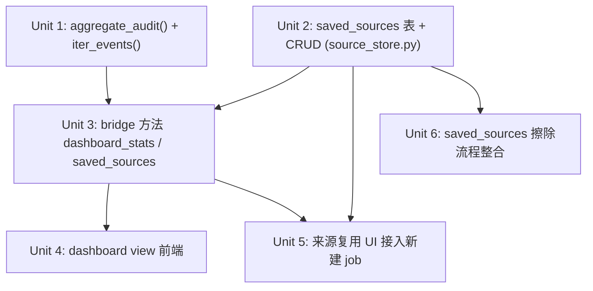

# feat: Accumulation Dashboard + Saved-Sources Reuse

## Overview

为 `lcp` 操作者增加「累积感」与「输入复用」:Dashboard 作为**第 4 个并列导航 view**(非预设落地页),让操作者随时切过去看产能/拦截趋势;并把绑定过的来源存进 SQLite 以便复用——全部在**现有 pywebview + 127.0.0.1 回环 + 严格 CSP** 外壳内完成,零架构变动。

> **R41 加固** = 既有安全基线:严格 CSP、bridge 输出净化(`escape_html`/`inert_link`)、textContent-only 渲染、inert 来源连结(详见前期计划)。本计划维持 R41 不回退,但**诚实声明**:新增 `saved_sources` 表带来**一个有界、明文 PII 的净增表面**(存明文 source URL/path),须以「纳入擦除流程」为前置条件(见 Risks 与 Unit 6),不是「零安全回退」。

底层持久化已存在(`data/lcp.db` 的 jobs 表 + `audit.jsonl`),本计划补的是**呈现层**(第 4 个 dashboard view + audit 聚合函式 `aggregate_audit()`)与**输入复用**(新 `saved_sources` SQLite 表 + bridge 方法 + 复用 UI)。

## Problem Frame

操作者觉得 app「每次打开都像一个全新的服务」:看不到累积、每次要重填来源、无法从历史做洞察。资料其实都在,只是没被聚合呈现,且输入未被保存。详见 origin 文件的 Problem Frame。

## Requirements Trace

- R1. 新增 Dashboard 视图,作为可感知累积的**第 4 个并列导航 view**(非预设落地页) (see origin: R1)
- R2. 聚合产能指标:累计 job 数、状态分布、各闸门拦截率、阶段耗时趋势,只读既有 `lcp.db` + `audit.jsonl` (see origin: R2)
- R3. 呈现时间趋势(按日/周),非仅当下快照 (see origin: R3)
- R4. 给出「后续优化方向」线索(高频拦截原因、重复来源、最耗时阶段) (see origin: R4)
- R5. 新增 SQLite `saved_sources` 表,持久化绑定/输入过的来源以便复用 (see origin: R5)
- R6. 在新建 job 入口提供「从已存来源选取」复用路径 (see origin: R6)
- R7. 复用表遵守既有 PII / sanitization 约束 (see origin: R7)
- R8. 维持 pywebview + 回环外壳,不改 web server (see origin: R8)
- R9. 维持 R41 加固:CSP、bridge 净化、textContent-only、inert 来源连结 (see origin: R9)
- R10. 复用既有 pipeline / storage 适配器,不引入新框架/build/CDN (see origin: R10)

## Scope Boundaries

- 不改成浏览器可访问的 web server(无远程/多人需求)。
- 不换前端框架、不加 build step / CDN。
- 不新增资料采集管线;Dashboard 只聚合既有 `lcp.db` 与 `audit.jsonl`。
- 不为 `saved_sources` 加密;沿用「OS 全碟加密 + 0600 权限」模型。
- **MVP 不新增 audit 事件栏位**(如 `duration_ms`);阶段耗时用相邻事件时间差近似(见 Key Technical Decisions)。

## Context & Research

### Relevant Code and Patterns

- **Bridge 只读聚合范本** `Api.summary()` (`src/lcp/gui.py:434`):`try → self._ctx() → pl.batch_summary(c.store) → dict / _error_dict(e)`。新 `dashboard_stats()` / `saved_sources()` 照抄此骨架。
- **错误回传** `_error_dict()` (`src/lcp/gui.py:84`):例外永不跨桥,回 `{"error": escape_html(str(err)), "exit_code": ...}`。
- **三个 sanitizer** (`src/lcp/adapters/processor/sanitizer.py`):`escape_html`(每个可被攻击者塑形的纯量)、`inert_link`(URL 永不解析/fetch/做 anchor)、`sanitize_draft`。
- **状态分布免费**:`JobStore.counts_by_state()` (`src/lcp/adapters/storage/job_store.py:287`)、`list_all()`。
- **SQLite 存取范式** `JobStore._connect()` (`src/lcp/adapters/storage/job_store.py:112`):WAL + `busy_timeout`,每方法 `try/finally: conn.close()`。新表照此。
- **jobs 表 schema** (`job_store.py:37`):`job_id, state, created_at, updated_at, source_html_sha256, source_text_sha256, error_code, review_reason`;`idx_jobs_state`。
- **前端 view 切换** (`src/lcp/web/app.js:91`):`VIEWS=["inbox","job","setup"]`,原生 `hidden` 属性切换;`NAV` 映射导航按钮。
- **安全渲染** (`app.js:30`):`setText()`/`el()` 纯 `createElement`+`textContent`;`innerHTML` 被静态测试禁止。
- **bridge 调用**:`window.pywebview.api` 经 `api()` helper,全 `await`,每次 `if (isError(res))` 守。
- **lex.js**:`LEX` 与 `STATE_ACTIONS` 为无注解 JSON literal,被 `test_lex_completeness.py` 从 Python 端解析。新增字串放**独立命名空间** `LEX.dashboard`,勿塞进 `LEX.state`/`exit`。

### Audit 事件结构(聚合依据)

`audit.jsonl` append-only + sha256 hash-chain,每事件单一 `ts`。各 gate `extra` 关键栏位:

| event | extra 关键栏位 |
|---|---|
| `RISK_GATE` | status, flag_count, review_reason, recommended_action |
| `DEDUP_GATE` | status, reliability, matched_job_ids[], review_reason |
| `GROUNDING_GATE` | status, ungrounded_quote_count, review_reason |
| `LINT_GATE` | status, error_count, warning_count, score |

`append()` 拒绝 PII key(title/body/url/author/domain/email…)。

### PII-free 约束(直接约束 saved_sources)

`job_store.py` docstring:jobs 表只放低风险索引栏位;**禁止栏位(title / body / source URL / author / domain / review_reason 文字)永不进 SQLite**。`saved_sources` 要存的 source URL/path 正属禁止栏位 → 见 Key Technical Decisions 的决策。

### Institutional Learnings

- `docs/solutions/` 未发现直接相关条目;遵循既有 R41 加固与 PII-free 设计即可。

## Key Technical Decisions

- **Dashboard 数据走「现成只读聚合 + 新增 audit 聚合纯函式」**:状态分布用 `counts_by_state()`;拦截率/计数新增纯函式 `aggregate_audit(events)`(纯函式,无 I/O 副作用,可单元测试)。理由:与既有「pure core + imperative shell」一致,聚合逻辑可 headless 测试。
- **audit 读取契约必须在 Unit 1 拍板,不可 defer**:`AuditLog` 目前**只有私有 `_read_lines()` / `verify_chain()`,无公开 reader**。决策:新增公开 `AuditLog.iter_events()`(包装 `_read_lines`),`aggregate_audit()` 消费它;**不**让聚合函式自己 reach 进私有方法。Gate 事件常数(`EVENT_RISK_GATE`/`EVENT_DEDUP_GATE`/`EVENT_GROUNDING_GATE`/`EVENT_LINT_GATE`/`EVENT_MEDIA_GATE`,携带 `extra.status`)定义在 processor 模组而非 `audit_log.py`,聚合时从正确位置 import。
- **聚合 reader 必须容忍并发撕裂行**:`append()` 持 `fcntl.flock` 写,但读侧 `_read_lines()` 不持锁;background crawl/process 执行绪 append 时,dashboard_stats 可能读到尚未 fsync 的半行 → `json.loads` 抛错。决策:逐行 `json.loads` 包 try/except,**跳过无法解析的行**(不仅是缺 `extra`/未知 event)。
- **拦截率分母必须明确且可跨 gate 比较**:`intercept_rate[gate] = 该 gate flagged/blocked 数 / 到达该 gate 的 job 数`(不是 / 全部 job)。理由:早闸门 BLOCKED 的 job 不会到达后闸门,用「全部 job」当分母会让后闸门率虚低、误导 R4 的「优化方向」。UI 须同时显示「到达数」让比较诚实。
- **阶段耗时改为「gate-to-gate 间隔(含操作者等待)」,且排除在 R4 优化提示外**:`ts` 是 caller 在 Api 边界铸的操作者动作时间(非计算耗时),crawl 与 process 是操作者分别触发、可能相隔数小时;两 gate 事件时间差主要是人等待时间。决策:(a) 聚合前**先按 `job_id` 过滤**再相减(`audit.jsonl` 全局交错);(b) UI 明确标注为「闸门间隔(含等待)」而非「阶段耗时」;(c) **不**让它进入 R4「最耗时阶段」提示,以免误导。精准计算耗时需新增 `duration_ms`(延后到验证有需求)。
- **R4「重复来源」提示改用 jobs 的 sha256 / `saved_sources`,不用 audit**:audit 的 `_PROHIBITED_KEYS` 禁 `url`/`source_url`/`domain`,audit 里**没有 source 识别符**;`matched_job_ids` 是 dedup 信号(此 job 与既有 job 重复),**不等于**「操作者反复提交同一来源」。决策:重复来源若要做,从 `source_html_sha256`/`source_text_sha256` 或 `saved_sources` 计;否则 MVP 明确不做,不让 R4 暗示 `matched_job_ids` == 重复来源。
- **`saved_sources` 走独立 SQLite 表 + 明文 source_ref + 明确 PII 注记**(非存 hash):复用必须能取回原始 URL/path 重新提交 crawl,存 hash 无法复用。因此 `saved_sources` 是刻意的 PII 例外表:(1) 模组 docstring 明确标注此表含明文 source、需纳入删除/擦除流程;(2) bridge 回传一律 `inert_link(source_ref)`;(3) 与 jobs 表物理分离,不污染 PII-free 索引。理由:功能正确性要求可取回原值,故选 origin 文件 R7 deferred 问题的 (b) 路径。
- **saved_sources 放 SQLite 而非 config.yaml**:config 是声明式静态合规边界(operator 一次性设),saved_sources 是 runtime 累积的动态使用者资料,属 `JobStore`/SQLite 职责。
- **第 4 个 view 用既有 `hidden` 切换范式**:不引入 router/框架,沿用 `VIEWS`/`NAV` 阵列扩展。

## Open Questions

### Resolved During Planning

- saved_sources 存 hash 还是明文?→ 明文(独立例外表),因复用需可取回原值。
- saved_sources 放哪个档?→ **独立新档 `src/lcp/adapters/storage/source_store.py`**(非塞进 `job_store.py`),以物理凸显「明文 PII 例外」边界,与 PII-free 的 jobs 表分离。
- 阶段耗时怎么算?→ 改为「闸门间隔(含等待)」语意,先按 `job_id` 过滤,排除在 R4 提示外(见 Key Technical Decisions)。
- 拦截率分母?→ 每 gate「到达该 gate 的 job 数」,并显示到达数(见 Key Technical Decisions)。
- audit 读取契约?→ 新增公开 `AuditLog.iter_events()`,聚合器消费它,不 reach 私有方法。
- Dashboard 是落地页还是第 4 视图?→ 第 4 个并列 view(`nav-dashboard`),不强改预设落地逻辑。
- `saved_sources` 擦除归属?→ **不再 defer**:per-URL 擦除经 `delete_saved_source`,全量擦除经新 Unit 6 钩入既有删除流程(见 Unit 6)。

### Deferred to Implementation

- `aggregate_audit()` 回传 dataclass 的确切栏位命名(契约/事件来源已定,见 Key Technical Decisions)。
- 「最耗时阶段」语意改为闸门间隔后,具体排序/阈值呈现待有真实资料微调。
- saved_sources ↔ job 的**双向关联**(例如「此 job 来自某 saved source」),MVP 不做;但**per-URL 擦除不依赖此关联**(以 `source_ref` 为键)。

## Implementation Units

> **两增量交付**:Dashboard 链(U1→U3→U4)与复用链(U2→U5)是不相交的依赖链,可拆成两个独立 PR 先后落地。**但 U6(擦除整合)是 U2 落地的前置门槛**:`saved_sources` 明文表在 U6 完成前不应进入常态使用,否则造成无法擦除的 PII 残留。建议复用链以 U2→U6→U5 顺序交付。

- [ ] **Unit 1: `aggregate_audit()` 纯聚合函式**

**Goal:** 从 audit 事件序列计算 Dashboard 所需指标(各 gate 拦截率、各 reason 计数、阶段耗时近似、按日/周分桶),纯函式无 I/O。

**Requirements:** R2, R3, R4

**Dependencies:** None

**Files:**
- Create: `src/lcp/adapters/storage/audit_aggregate.py`(或就近放 `audit_log.py` 同模组——实作时择一)
- Test: `tests/test_audit_aggregate.py`

**Approach:**
- **新增公开 `AuditLog.iter_events()`**(包装私有 `_read_lines()`)作为 reader;`aggregate_audit(events)` 消费它。Gate 事件常数 `EVENT_RISK_GATE`/`EVENT_DEDUP_GATE`/`EVENT_GROUNDING_GATE`/`EVENT_LINT_GATE`/`EVENT_MEDIA_GATE`(携 `extra.status`)从 processor 模组 import,非 `audit_log.py`。
- 输入:audit 事件 iterable;输出:dataclass/dict,key 全为 int/enum/数字。
- 拦截率:`flagged|blocked at gate / 到达该 gate 的 job 数`,**同时回传到达数**(分母语意见 Key Technical Decisions)。
- 闸门间隔(非「阶段耗时」):**先按 `job_id` 分组**再相邻相减(audit 全局交错);语意为「含操作者等待」,**不**进 R4 提示。
- 时间趋势:按 `ts` 日期分桶产量与拦截率。
- 「优化方向」线索:高频 `review_reason`(enum code)、最慢闸门间隔(标注含等待);**重复来源不由 audit 计**(audit 禁 url/domain 键),改由 jobs sha256 / `saved_sources`(MVP 可不做)。
- **MVP 约束**:不修改 audit schema / `append()` 逻辑、不新增 `duration_ms`(对应 Scope Boundaries)。

**Patterns to follow:** core 纯函式风格(`src/lcp/core/rules/*`);无 I/O、可 headless 测试。

**Test scenarios:**
- Happy path:含 risk/dedup/grounding/lint 事件的序列 → 各 gate 拦截率(含正确分母=到达数)与状态分布。
- Edge case:空事件序列 / `audit.jsonl` 不存在 → 全零/空指标,不抛错。
- Edge case:零 gate 事件 → 拦截率分母为 0 时回 `None`/`—`,不产生 NaN/除零。
- Edge case:多 job 事件全局交错 → 闸门间隔仅在同 `job_id` 内计算,不跨 job 相减。
- Edge case:单一 job 仅一个 gate 事件 → 闸门间隔为空/None,不抛错。
- Error path:**撕裂的尾行(半写未 fsync)→ 该行 `json.loads` 失败被跳过,仍回有效统计、不返回 error**。
- Error path:缺 `extra` 栏位或未知 event 类型 → 跳过该事件而非崩溃。

**Verification:** 给定固定事件 fixture,拦截率/分母/分桶与手算一致;含撕裂尾行的 fixture 不致整体失败。

- [ ] **Unit 2: `saved_sources` SQLite 表 + CRUD**

**Goal:** 新增持久化来源复用表,提供 add/list/delete,遵守独立 PII 例外表约束。

**Requirements:** R5, R7

**Dependencies:** None

**Files:**
- Create: `src/lcp/adapters/storage/source_store.py`(**独立新档**,凸显「明文 PII 例外」边界,与 PII-free 的 `job_store.py` 分离)
- Test: `tests/test_source_store.py`

**Approach:**
- Schema:`saved_sources(id TEXT PK, label TEXT, source_ref TEXT, created_at TEXT)`;`source_ref` 为明文 URL/path。
- **模组 docstring 明确标注 PII 边界**:(1) 此表含明文 `source_ref` **与可能含 PII 的自由文字 `label`**(操作者可能输入人名/备注),两者**同属 PII 例外、同走擦除流程**;(2) 与 PII-free 的 jobs 表物理分离;(3) **诚实声明删除为 best-effort**:SQLite `DELETE` 不清零 WAL/freelist 页(对齐 jobs 的 `BestEffortDeletionResult`),保护依赖 OS 全碟加密 + 0600,**不可在文档宣称为加密擦除**。
- **CRUD 不写 audit,或仅记不透明 `id`**:绝不把 `source_ref`/`label` 经任何键写进 `audit.jsonl`(`append()` 虽拒部分 PII 键,仍须主动避免)。
- 沿用 `_connect()`(WAL + busy_timeout)+ `try/finally: conn.close()`。
- `id` 用不透明本地 id(非 URL 派生)。

**Patterns to follow:** `JobStore._connect()` / `counts_by_state()` (`job_store.py:112,287`);删除诚实度对齐 `BestEffortDeletionResult`。

**Test scenarios:**
- Happy path:add → list 回传该笔;delete → list 不再含。
- Edge case:重复 label/source_ref 的处理(允许或去重——实作时定,测试断言所选行为)。
- Edge case:空表 list → 回空 list,不抛错。
- Edge case:delete 不存在 id → 无副作用,不抛错。
- Error path:**add/delete 后 `audit.jsonl` 不含 `source_ref`/`label` 任何子串**(防明文渗入审计)。
- Integration:写入后新连线 list 仍读得到(WAL 跨连线持久)。

**Verification:** CRUD 往返正确;`source_ref` 原值可完整取回(复用前提);审计无明文渗入。

- [ ] **Unit 3: bridge 方法 `dashboard_stats()` 与 `saved_sources()`**

**Goal:** 在 `Api` 暴露两个只读/CRUD 方法,所有跨桥字串经 sanitizer。

**Requirements:** R2, R4, R5, R6, R9

**Dependencies:** Unit 1, Unit 2

**Files:**
- Modify: `src/lcp/gui.py`(加 `dashboard_stats`、`saved_sources`、`add_saved_source`、`delete_saved_source`)
- Test: `tests/test_gui_api.py`

**Approach:**
- `dashboard_stats()`:照 `summary()` (`gui.py:434`) 骨架;组合 `counts_by_state()` + `aggregate_audit(读 c.audit)`;回传 key 全为数字/enum,无需 escape;`except LcpError → _error_dict`。
- `saved_sources()` 等:每个字串栏位过 `escape_html`,`source_ref` 用 `inert_link`。
- 各方法各开自有 SQLite 连线(per-call,勿与背景执行绪共用 handle)。

**Patterns to follow:** `Api.summary()`、`_error_dict()`、`gui.py` 内既有 sanitize 范式。

**Test scenarios:**
- Happy path:有 job/audit 资料 → `dashboard_stats()` 回正确 dict shape(拦截率、分布、趋势)。
- Happy path:`add_saved_source` → `saved_sources()` 回含该笔;`delete_saved_source` 后消失。
- Edge case:无资料 → `dashboard_stats()` 回零值 dict,不报 error。
- Error path:含恶意字串的 label(如 `<script>`)→ 回传值为 escaped;`source_ref` 为 inert。
- Error path:core 抛 `LcpError` → 回 `{"error":..., "exit_code":...}`,例外不跨桥。
- 静态守卫:`test_gui_api.py` 既有 `innerHTML`/`0.0.0.0`/CSP/lazy-import 守卫仍通过。

**Verification:** 新方法回传通过 XSS escape 断言;错误路径回 error dict 而非例外。

- [ ] **Unit 4: dashboard view 前端**

**Goal:** 新增第 4 个 view,渲染 Dashboard 指标与趋势,纯 `createElement`/`textContent`。

**Requirements:** R1, R2, R3, R4, R9, R10

**Dependencies:** Unit 3

**Files:**
- Modify: `src/lcp/web/index.html`(加 `<button id="nav-dashboard">` + `<section id="view-dashboard" class="view" hidden>` 内含 `
`)
- Modify: `src/lcp/web/app.js`(`VIEWS`/`NAV` 各加 `dashboard`;`bind()` 加 nav 监听;新增 `openDashboard()` 调 `dashboard_stats()` 并用 `el()/setText()` 渲染)
- Modify: `src/lcp/web/lex.js`(`dashboard` 作为**既有 `const LEX = {...}` 物件内的一个 key**,**不可**新增顶层 `const`——`test_lex_completeness._extract` 以 `split("const LEX = ")...split("\n};")` 抓取,新增顶层 const 或提前出现 `\n};` 会让 parser 截断、既有测试失败;保持双引号、无尾逗号、无行内注解的合法 JSON literal)
- Modify: `src/lcp/web/app.css`(dashboard 区块样式,沿用既有 card/视觉规范)
- Test: `tests/test_gui_api.py`(静态断言)、`tests/test_lex_completeness.py`

**Approach:**
- 沿用 `showView()` 的 `hidden` 切换;不引入 router。
- 指标用 `el("div", String(n))` 类纯节点;趋势以简单表格/条状(纯 DOM,无 chart 库/CDN)。
- 闸门间隔区块标注「含操作者等待」文案(对应 Unit 1 决策),不呈现为「阶段耗时」。
- **空态/首次启动设计(直击问题)**:job 数为 0 时**不渲染一整片 0**,改显引导态文案(如「指标会随你处理 job 累积」),让首次印象传达「会累积」而非复现「像个全新服务」的空白感——这正是本计划要解决的核心问题。
- 所有文本走 `setText`,严禁 `innerHTML`(静态测试禁止)。

**Patterns to follow:** `app.js:30`(`setText`/`el`)、`app.js:91`(`VIEWS`/`showView`)、`lex.js` 既有命名空间结构。

**Test scenarios:**
- Test expectation:前端无单元测试框架——以 `test_gui_api.py` 静态守卫覆盖(无 `innerHTML`、CSP 存在、`LEX.dashboard` 为合法 JSON literal)。
- Integration(经 bridge):`dashboard_stats()` 回的 dict 能被渲染逻辑消费(透过 Unit 3 测试间接保障 shape)。
- `test_lex_completeness.py` 仍通过:`dashboard` 作为 `LEX` 内 key 不破坏 `_extract` 的 `\n};` 抓取与既有 state/exit 命名空间对齐。

**Verification:** 手动启动后,nav 切到 dashboard 显示真实累积数据;**零 job 时显示引导态而非满屏 0**;静态测试全绿。

- [ ] **Unit 5: 来源复用 UI 接入新建 job**

**Goal:** 在新建 job 入口提供「从已存来源选取」,选取即带入,免重填;并可把当前输入存为来源。

**Requirements:** R5, R6

**Dependencies:** Unit 2, Unit 3

**Files:**
- Modify: `src/lcp/web/app.js`(新建 job 流程加「选已存来源」下拉/列表 + 「存为来源」按钮,调 `saved_sources()`/`add_saved_source()`)
- Modify: `src/lcp/web/index.html`(复用 UI 容器)
- Modify: `src/lcp/web/lex.js`(`LEX.dashboard` 或新增复用相关字串命名空间)
- Test: `tests/test_gui_api.py`(bridge 行为已由 Unit 3 覆盖;此处补静态守卫)

**Approach:**
- **具体钩点(既有 create-job 是 id-first)**:`openCreate()`/`btn-create` 先验证必填 `create-job-id`,再以 url/dir radio 切模式。复用 picker **只 pre-fill** 对应模式的输入框(`create-url-row` 或 `create-dir-row`),**不**触碰 `create-job-id`(仍由操作者填),并据 `source_ref` 形态自动选对 create-mode radio。
- **关键合规契约:复用绝不绕过手动路径的校验**。pre-fill 后由操作者经**既有 `btn-create` 提交**,跑与手动输入**完全相同**的校验(URL 解析、`allow_domains`、`respect_robots_txt`、sanitization)。一个数月前存的来源若现已不在 `allow_domains`,复用提交时**与手动输入一样被拒**——绝不缓存或沿用旧的 allow 决定。
- 「存为来源」→ 在 `btn-create` 成功后调 `add_saved_source(label, source_ref)`(捕获点明确)。
- 渲染来源列表时 `source_ref` 经 `inert_link`(永不做 anchor/fetch)。

**Patterns to follow:** 既有 `openCreate()`/`btn-create`/create-mode radio + `setText`/`el` 渲染;Unit 3 的 sanitize 回传。

**Test scenarios:**
- Happy path(经 bridge,Unit 3):选取已存来源 → 取回 `source_ref` 原值 pre-fill 到对应输入框,`create-job-id` 不被覆盖。
- Edge case:无已存来源 → 复用入口显示空态,不阻断手动输入。
- Error path:**复用一个现已不在 `allow_domains` 的来源 → 与手动输入同样被拒**(校验未被绕过)。
- Error path:存为来源时 label 为空 → 行为明确(拒绝或用 source_ref 当 label,实作时定并测)。
- 静态守卫:复用列表渲染无 `innerHTML`,`source_ref` 为 inert。

**Verification:** 操作者可存一次来源,下个 session 从列表选取 pre-fill 提交,无需重输;复用路径的合规校验与手动输入一致。

- [ ] **Unit 6: `saved_sources` 擦除流程整合(PII 例外的前置条件)**

**Goal:** 把 `saved_sources` 明文表接入既有删除/擦除流程,使 PII 例外表真正可被擦除——这是允许明文 source 落地的**前置条件**,非可选项。

**Requirements:** R7, R9

**Dependencies:** Unit 2

**Files:**
- Modify: `src/lcp/adapters/storage/job_store.py` 的 `delete_job`(或既有 erase 流程):全量擦除时一并清 `saved_sources`
- Modify: `source_store.py`(暴露 `delete_by_source_ref(source_ref)` 供 per-URL 擦除)
- Modify: `docs/security/pii-inventory.md`(登记 `saved_sources` 为明文例外表 + 擦除路径 + best-effort 声明)
- Test: `tests/test_source_store.py`、`tests/test_job_store.py`

**Approach:**
- **现况缺口**:唯一擦除机制 `delete_job()` 以 `job_id` 为键、rmtree job 目录 + 删 jobs 行,**没有触及 `saved_sources` 的路径**;若不补,数据主体擦除会留下明文 `source_ref`。
- **擦除语意明确两条**:(a) **per-URL** 擦除经 `delete_saved_source` / `delete_by_source_ref(source_ref)`(不依赖 job 关联,故 saved_sources↔job 双向关联仍可延后);(b) **全量/重置** 擦除时,既有流程一并清 `saved_sources`。
- best-effort 删除诚实度对齐 jobs(见 Unit 2)。

**Patterns to follow:** `delete_job` / `BestEffortDeletionResult` / ERASURE audit event;`pii-inventory.md` 既有条目格式。

**Test scenarios:**
- Happy path:`delete_by_source_ref(url)` → 该 source 行消失;再 list 不含。
- Integration:全量擦除流程执行后 → `saved_sources` 同步清空,不残留明文。
- Edge case:擦除一个不存在的 `source_ref` → 无副作用,不抛错。
- Error path:擦除后审计记录为 ERASURE(或等效),且不含明文 `source_ref`/`label`。

**Verification:** 数据主体擦除请求(per-URL 与全量)后,`saved_sources` 不残留对应明文;`pii-inventory.md` 已登记此表与擦除路径。

## System-Wide Impact

- **Interaction graph:** 新增 4 个 bridge 方法(`dashboard_stats`、`saved_sources`、`add_saved_source`、`delete_saved_source`)挂在既有 `Api`;dashboard view 经 `showView()` 进既有导航;新建 job 复用走既有 crawl/ingest pipeline,无新管线。
- **Concurrency:** `dashboard_stats()` 在主执行绪读 `audit.jsonl`,background crawl/process 执行绪同时 `append()`(持 flock,读侧不持锁)→ 可能读到撕裂尾行;聚合器逐行 `json.loads` 须 try/except 跳过(见 Unit 1)。这是操作者「开 dashboard 时正好有 job 在跑」的常见时刻,必须不崩。
- **Performance:** 每次开 dashboard 全量读 `audit.jsonl` 为 O(N) 历史;`verify_chain()` 亦全量。MVP 接受;资料量大时再做增量聚合/快取(Deferred,且应设「同步 bridge 调用变卡」的阈值)。
- **Error propagation:** 沿用 `_error_dict()`,例外永不跨桥;新聚合函式对脏 audit 事件(缺栏位/未知类型/撕裂行)采「跳过而非崩溃」。
- **State lifecycle risks:** `saved_sources` 为独立表,不影响 jobs 状态机;含明文 `source_ref` 与自由文字 `label`,**经 Unit 6 纳入删除/擦除流程**(per-URL + 全量),否则成为不可擦除的 PII 残留点。
- **API surface parity:** CLI 目前无对应「saved sources / dashboard」命令——MVP 仅 GUI;若日后要 CLI 对等,需另行规划(本计划不做,记于此供日后参考)。
- **Integration coverage:** WAL 跨连线持久性(Unit 2 integration 测试);bridge sanitize(Unit 3 escape/inert 测试)。
- **Unchanged invariants:** jobs 表 PII-free 约束不变;CSP、回环绑定、textContent-only、lazy `import webview` 全部不动;既有三视图行为不变。

## Risks & Dependencies

| Risk | Mitigation |
|------|------------|
| `saved_sources` 明文(source_ref + label)成为不可擦除 PII 残留点 | 独立 `source_store.py` + docstring PII 标注 + **Unit 6 擦除整合(前置门槛)** + `pii-inventory.md` 登记 + best-effort 删除诚实声明 + bridge `inert_link` |
| 「闸门间隔」被误读为「阶段耗时」误导优化方向 | 重命名「闸门间隔(含等待)」+ 先按 job_id 分组 + **排除在 R4 提示外**;精准耗时延后(需 `duration_ms`) |
| 拦截率分母不一致使跨 gate 比较失真 | 分母固定「到达该 gate 的 job 数」+ UI 同列到达数 |
| 并发 append 撕裂尾行使 dashboard 崩溃 | 聚合器逐行 `json.loads` try/except 跳过 + 撕裂尾行 fixture 测试 |
| 复用绕过 allow_domains/robots 校验 | 复用仅 pre-fill,经既有 `btn-create` 跑相同校验;测试断言越界来源被拒 |
| 新 `LEX.dashboard` 破坏 `test_lex_completeness.py` parser | `dashboard` 作为既有 `const LEX` 内 key(非顶层 const),保持合法 JSON literal |
| 「零安全回退」overclaim 让擦除依赖被忽略 | Overview 改「一个有界明文 PII 净增表面,以擦除整合为前置」;Unit 6 为门槛非可选 |
| 首次启动满屏 0 复现「全新服务」观感 | 空态显引导文案而非 0(Unit 4),列为验证项 |
| audit.jsonl 增长导致聚合变慢 | MVP 全量读;资料量大时加快取/增量聚合(Deferred,设卡顿阈值) |
| 误触 `innerHTML` 静态守卫 | 全程 `setText`/`el`;沿用既有渲染范式 |

## Documentation / Operational Notes

- 更新 `docs/security/pii-inventory.md`:登记 `saved_sources`(明文 source_ref + label)为 PII 例外表,记录 per-URL 与全量擦除路径、best-effort 删除诚实声明(Unit 6)。
- 更新 `data/` 删除/擦除流程文档,纳入 `saved_sources` 表。
- 若 `config.example.yaml` 有功能清单,补注 Dashboard / saved sources 为 GUI-only。

## Sources & References

- **Origin document:** docs/brainstorms/2026-06-17-accumulation-dashboard-requirements.md
- Related code: `src/lcp/gui.py:434` (`summary`), `:84` (`_error_dict`); `src/lcp/adapters/storage/job_store.py:37,112,287`; `src/lcp/adapters/storage/audit_log.py`; `src/lcp/web/app.js:30,91`; `src/lcp/web/lex.js`; `src/lcp/adapters/processor/sanitizer.py`
- Tests: `tests/test_gui_api.py`, `tests/test_job_store.py`, `tests/test_audit_log.py`, `tests/test_lex_completeness.py`, `tests/test_config.py`
