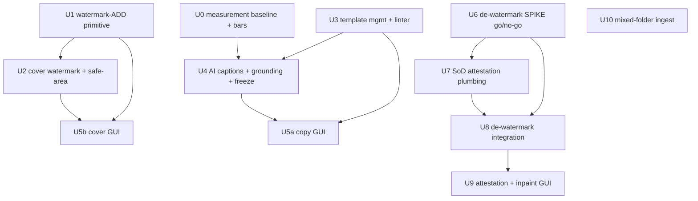

# feat: Content Pipeline Upgrade

## Overview

Add four SOP-driven capabilities to `lcp` (Eatmelon), the compliance-first local content pipeline, **without leaving the existing compliance envelope**: (A) watermark — ADD an official watermark to body images + cover, and REMOVE watermarks **only on owned/licensed assets** behind a segregation-of-duties attestation; (B) AI copy — keep R16 constrained-rewrite, add per-栏目 prompt-template management + AI-generated captions/FAQ/subheads; (C) cover — keep the existing 1300×640 collage, add official watermark + an advisory safe-area check; (D) crawl/ingest — keep public-source + local material-pack import only, improve mixed-folder ingest.

Three of the four already have foundations (Stage-1 crawl, cover collage in `normalizer.py`, constrained-rewrite LLM). Only watermark add/remove is net-new. Delivery is phased: **Batch 1 = copy + cover** (highest daily value, lowest risk), **Batch 2 = de-watermark** (spike-gated, may be cut), **Batch 3 = ingest** (smallest).

## Problem Frame

A non-technical operator runs a 吃瓜/爆料 content site. `lcp` already runs `crawl → normalize → risk/dedup → constrained-rewrite draft → review packet`. Against the operator's real SOP (`docs/spec/远程内容编辑发布流程SOP_新媒体版.md`), the most time-consuming manual steps — copywriting and cover-making — are still by hand, and watermark handling isn't built at all. The goal: drop per-article manual work to "human only reviews," **without compliance/quality collapsing at scale** — where the real exposure is republication-of-source-defamation, copyright, and image PII. (see origin: `docs/brainstorms/2026-06-17-content-pipeline-upgrade-requirements.md`)

## Requirements Trace

- **UR1** Watermark-ADD primitive (Pillow) for body images + cover; brand mark, not authorship; source retained in audit/source field.
- **UR2/UR3** De-watermark default-locked; unlock requires (a) verifiable license-evidence, (b) **independent reviewer ≠ submitter** approval, (c) full audit; honest "attestation not authentication" disclosure. Bounded **exception to (amendment of) R2**, not "R2 unchanged."
- **UR4** De-watermark provenance (`watermark_removed=true` + evidence ref) in manifest; failure/low-confidence → `needs_revision`, never silent partial output; EXIF/image-PII stripped on output.
- **UR5** Keep R16 constrained-rewrite; narrative bound to source; machine output `needs_human_review`.
- **UR6/UR8** Per-栏目 prompt-template management (config-overrides-first); templates are a **checked object** — injection/jailbreak lint, cannot rewrite system constraints.
- **UR7** AI generates low-risk structural pieces (captions/FAQ/subheads/title candidates) — **net-new generation** requiring a grounding contract + freeze-binding extension.
- **UR9/UR10** Cover safe-area advisory check + official watermark. **Amendment:** UR10's hard-gate (`needs_revision`) on cover text / 3rd-party watermark / links is DEMOTED to advisory + human preview (not feasibly automatable on Pillow-only); geometry + black-white-border stay auto-warn; aesthetic soft.
- **UR11/UR12** Keep Scrapy public-source + local ingest only (no JS/login-wall, no anti-bot bypass); improve mixed-folder material-pack ingest + completeness check.
- **UR13–UR16** All new actions audited (PII-free); idempotent + dry-run-safe; **no auto-publish**; GUI/CLI 1:1 with the operator surface.

**Success criteria carried forward (origin):** per-article human review-touch/time DROPS vs an `lcp.db` baseline (and must NOT rise from added AI artifacts); R4/R5 defamation/未证实 detection gets a measurable 漏检率 acceptance bar; de-watermark has measurable removable-type / residual / fallback bars on a labeled set; everything stays no-auto-publish + audited + honest about residual limits.

## Scope Boundaries

- **No** de-watermarking of third-party/unlicensed assets (owned/licensed + independent-review gate only).
- **No** free full-text generation (R16 stays; AI only structural pieces).
- **No** 微博/小红书/抖音/知乎 (JS/login-wall) crawling; no login/paywall/anti-bot bypass; no Playwright.
- **No** auto-draft / auto-publish (MVP Stage 5/6 boundary stands).
- **No** AI cover image generation; cover is compose + watermark + advisory checks only.
- **No** torch/opencv/mediapipe in the cover-composition path; de-watermark deep deps stay **isolated** from the main venv (see Key Decisions).

## Context & Research

### Relevant Code and Patterns

- **Media:** `src/lcp/adapters/media/normalizer.py` — `normalize_image` (`exif_transpose → thumbnail(LANCZOS) → save JPEG q90`), `make_cover`/`_cover_cells` (1–4 image 1300×640 via `ImageOps.fit`), Laplacian-variance blur, `MAX_IMAGE_PIXELS` decompression-bomb guard (Pillow-only, no numpy/opencv). Watermark-ADD primitive lives here.
- **Media gate:** `src/lcp/adapters/processor/media_checker.py` — `run_media_gate`/`_validate_images`; cover is composed **from already-normalized body images in one pass**; `DependencyError` on missing ffmpeg (mirror for a missing inpaint engine). Pure thresholds in `src/lcp/core/rules/asset_rules.py` (safe-area geometry goes here).
- **LLM:** `src/lcp/adapters/llm/assembler.py` — hardcoded `build_system_prompt` (constant; emits 标题/引言/一分钟快速看懂/事件经过/FAQ/结尾 — **no captions/subheads today**), datamarking, finish_reason gate; `client.py` `LlmClient` (zero-capability, `client_factory` injection seam, dry_run).
- **Grounding/lint:** `src/lcp/core/rules/grounding.py` — `_split_claims` grounds **only** `event_body` sentences + `faq[*].answer` (NOT quotes, NOT captions); `is_grounded("")` returns True (empty claim auto-passes). `src/lcp/core/rules/lint_rules.py` — injection-feature checks (template linter reuses). The canonical frozen body text is assembled in `review_packet.py` `_draft_body_text()` (signoff re-derives via `compute_body_sha256`).
- **Sign-off / freeze:** `src/lcp/adapters/publisher/signoff.py` — `--attest`/`backfill`, `DISCLAIMER`, reviewer-whitelist, `approve()` body-hash check (≈L196-202); `review_packet.py` `_draft_body_text()` feeds `body_sha256` = `intro+event_body+summary+quick_facts+faq` — **NOT captions/image_sections**. **Correction:** the **cover IS already frozen** via a separate `cover_sha256` (`_sha256_file(cover_path)` + `bound_cover_sha256`), so watermark must run **before** packet freeze (it does — watermark is in the pre-packet media gate; do NOT re-watermark after freeze). `build_review_packet()` takes `actor: str = "human"` (a caller-passed string, not an OS identity) while `approve()` uses `observed_os_user()` — **two different identity namespaces** — and **nothing enforces approver ≠ submitter** today.
- **Isolation:** `src/lcp/adapters/crawler/crawl_runner.py` — subprocess-per-job, scrubbed `minimal_env` (the pattern the de-watermark engine subprocess mirrors); `ingest.py` (local material import).
- **Models/config:** `core/models.py` (`AssetRef`: kind/path/source_url/sha256/state/note; `Manifest` PII-free), `core/draft.py` (`Draft`, `MediaSection.caption`, `FaqItem`), `core/config.py` (`MediaConfig`, `LlmConfig`, `categories`; add `watermark:`/`templates:`/`inpaint:` Pydantic blocks), `core/state.py` (JobState machine).
- **GUI:** `gui.py` `Api` (+`disclaimer()`); `web/lex.js` `STATE_ACTIONS` (JobState→actions, **empty=fail-closed**) + `LEX.honesty`; `web/app.js` `renderActions`≈L694-715 / `buildActionRow` / `reviewerSelect`≈L920 / backfill checkbox call ≈L790 / `POLL_MS=1500` `POLL_CAP=120` (~90s); strict CSP, all text via `textContent`.
- **Tests:** call `main(argv)` directly (no `CliRunner`), assert exit code + `capsys`; inline `@pytest.fixture` (store/audit in `test_pipeline_batch.py`); helpers `_setup()`/`_api()`/`_sharp_jpeg()`; GUI parity via importing `_processed_job_with_draft` from `tests/test_cli_skeleton.py`; fake LLM via `client_factory` (`tests/llm/test_client.py`).
- **Packaging:** `pyproject.toml` extras `crawl/media/llm/dedup/gui/dev`; mypy strict on `core/`+`adapters/`.

### Institutional Learnings

- `docs/solutions/` and `docs/learnings/` **do not exist** — no prior-solution corpus. Institutional memory is `docs/plans/` (esp. `2026-06-16-001-feat-local-content-processor-mvp-plan.md` Units 4/5/7), `docs/security/pii-inventory.md`, and the now-committed `docs/spec/远程内容编辑发布流程SOP_新媒体版.md`.
- **Existing watermark engine `static-ghost`** (`redredchen01/static-ghost` v0.4.2; also a local skill) does fixed-logo / semi-transparent / full-page / **video** removal via `detect/remove/batch/process` (LaMa + OpenCV + FFmpeg). It is a **candidate engine for Batch 2**, but uses torch + first-run HuggingFace weight download (offline-hostile) and is video-oriented — so it is one option the spike weighs, not a foregone choice.
- MVP-plan Pillow gotchas to honor: decompression-bomb warning→error, **never** `MAX_IMAGE_PIXELS=None`, use `Resampling.LANCZOS`.
- `pii-inventory.md` records a **known residual**: pin-IP-at-connect is not wired on the Scrapy path (DNS-rebinding/TOCTOU). If UR11 widens the allowlist, re-state this; do not assume SSRF is fully closed.

### External References

- **De-watermark (decision-changing):** torch is **not** required — ONNX route (`onnxruntime`, tens of MB) runs LaMa/MI-GAN. **MI-GAN ONNX ≈ 29.5 MB (MIT)** is small enough to bundle offline; LaMa-ONNX 208 MB (Apache-2.0) side-load. `simple-lama-inpainting` (0.1.2, 2023) pins `pillow>=9.5,<10`+`numpy<2`; `IOPaint` pins `Pillow==9.5.0` — **both incompatible with the repo's Pillow 12 → cannot live in the main venv**. `cv2.inpaint` (no torch, instant) is weak on block/semi-transparent watermarks. Ref arch `remove-ai-watermarks` (cv2 default + LaMa-ONNX optional).
- **Pillow watermarking:** `alpha_composite` needs RGBA; **JPEG has no alpha → `convert("RGB")` before save**; `exif_transpose` before watermarking; text via `ImageDraw.text(anchor=…)` + truetype. EXIF/PII: don't pass `exif=` on save (or `del exif[0x8825]` GPS IFD); `convert("RGB")`→JPEG drops EXIF naturally.
- **Prompt-injection:** layered hardcoded shell (templates never touch SYSTEM) + restricted-variable allowlist via `str.format_map` (**not** Jinja2 — its sandbox is anti-RCE not anti-injection, has escape CVEs) + datamark + template linter (reject unknown placeholders / role markers / datamark tokens / fences / zero-width / bidi / homoglyph(NFKC) / length>2–4KB; warn on injection phrases; lint on save AND import). No LLM-judge (no tools → blast radius is "low-quality text"; deterministic canary + schema instead).
- **Cover heuristics:** composition is known at compose time → "subject outside safe area" is **arithmetic** (safe box `(130,64,1170,576)` at 10% margin), auto-warn; border/letterbox via `ImageStat` on 8px strips (mean≤24/std≤8, use stddev not extrema); top-heavy via `FIND_EDGES` upper/lower ratio>1.6 (soft); crowding via entropy/edge-density (soft, never block); draw safe-area box on the preview for human judgment. Pillow-only (+numpy optional for saliency); **never** opencv/torch here.

## Key Technical Decisions

- **Watermark-ADD is a shared Pillow primitive, applied as a final pass.** Body images are watermarked from clean normalized copies; the **cover is composed from clean (un-watermarked) tiles and then watermarked once** — this resolves the "cover inherits per-tile marks vs single cover mark" conflict. Two watermark-asset sizes (body 800px vs cover 1300×640). Convert RGB before JPEG; watermark after `exif_transpose`.
- **De-watermark deps stay isolated from the main venv, and engine choice is spike-decided.** The main `[media]` extra never gains torch/opencv. A separate `[inpaint]` extra (or external `static-ghost` subprocess) runs in its own environment, invoked like the Scrapy `crawl_runner` subprocess (scrubbed env, per-job). The spike chooses between (a) bundled **MI-GAN-ONNX (no torch, offline)** and (b) reusing **static-ghost (torch, video-capable, exists)**, on accuracy AND CPU latency.
- **De-watermark masks come from a config fixed-box or an operator-drawn box (human-in-the-loop), not auto-detection in v1.** Large/floating/tiled watermarks are explicitly out-of-scope v1.
- **Segregation of duties is net-new plumbing.** No submitter/approver split exists. Record the submitting actor at process/create time (audit); the de-watermark attestation must be approved by a whitelisted reviewer ≠ that submitter, with a verifiable license-evidence field and a `DEWATERMARK_DISCLAIMER` honesty callout.
- **R2 is amended, not "unchanged."** The de-watermark exception is a bounded, re-ratified amendment to R2's absolute prohibition (origin doc honest framing).
- **AI structural copy needs a grounding contract AND a freeze-binding extension — scoped to captions/subheads/image_sections.** FAQ already has a grounded path (`_split_claims` covers `faq[*].answer`, though the assembler emits `faq=[]` today, so FAQ generation reuses that path); the net-new grounding + freeze work is specifically for captions/subheads/image_sections. Extend `review_packet.py` `_draft_body_text()` to include them, or post-freeze caption edits go undetected. **Caveat:** a caption summarizing an image often has no verbatim source span, so binary grounded-vs-flagged can collapse to always-flagged — which RAISES review burden; captions that can't ground are operator-hints requiring human confirmation, not auto-pass nor hard-block.
- **Templates render outside the SYSTEM constant via `str.format_map` allowlist; slot VALUES are datamarked.** The allowlist bounds slot KEYS only — slot VALUES come from scraped source and can carry injection, so they get datamarked like source text. `LlmClient.chat` has only system+user today → template renders into a delimited USER sub-block (or a new `client.py` developer message — Unit 3 decides). Unknown placeholders rejected at save; templates linted on save + import.
- **Cover checks: geometry auto-warns, aesthetics soft-suggest, OCR-class checks are advisory — this DEMOTES UR10's hard-gate.** UR10 originally required `needs_revision` on cover text/3rd-party-watermark/links; that is not feasibly automatable on the Pillow-only stack, so it becomes **advisory + human preview**. This is an explicit **amendment to UR10** (recorded in Requirements Trace), not a silent reinterpretation. Black/white-border + safe-area geometry remain auto-warnings; aesthetic (top-heavy/busyness) stay soft.

## Open Questions

### Resolved During Planning
- **Inpainting dependency conflict** → isolate from main venv (Pillow 12 vs `pillow<10` pins); ONNX (no torch) preferred for offline footprint.
- **Watermark vs cover ordering** → cover composes from clean tiles, single watermark pass after compose.
- **Prompt-template engine** → `str.format_map` allowlist, not Jinja2.
- **Cover "subject in safe area"** → compose-time arithmetic, not CV.
- **SOP availability** → committed to `docs/spec/` (pre-planning task done).

### Deferred to Implementation
- **De-watermark go/no-go + engine choice** → the Batch-2 spike (Unit 6) decides build/cut, engine (MI-GAN-ONNX vs static-ghost), and acceptance bars, measured on the **operator's actual laptop** (CPU latency has no trustworthy public data).
- Exact watermark-asset artifacts (transparent PNG/font) and per-resolution placement constants.
- Final safe-area/top-heavy/border thresholds (start: safe box 10%, border mean≤24/std≤8, top-heavy ratio>1.6) — calibrate on the operator's own sample.
- Per-asset vs per-job granularity for attestation + de-watermark results (mixed-ownership packs).
- Exact `str.format_map` allowlisted variable set per 栏目 template slot.

## High-Level Technical Design

> *This illustrates the intended approach and is directional guidance for review, not implementation specification. The implementing agent should treat it as context, not code to reproduce.*

**Watermark ordering inside the media gate (resolves the cover conflict):**
```
normalize_image(asset)  ──►  clean_body_800px ──┐
                                                 ├─► make_cover(clean tiles) ─► cover_1300x640 ─► add_watermark(cover-size)  ─► cover.jpg
                                                 └─► add_watermark(body-size) per image ─────────────────────────────────────► images/*.jpg
   [optional, pre-normalize, gated]  de_watermark(asset) ──► (isolated subprocess) ──► cleaned asset ──► (re-enters normalize)
```

**Layered prompt — NOTE: `LlmClient.chat` today has only `system`+`user` (no developer role).** Two viable shapes (Unit 3 decides):
```
SYSTEM  (hardcoded constant; zero-capability + grounding + anti-injection)   ← templates NEVER here
USER    [ 栏目 template via str.format_map({allowlisted slots}), own delimited block,
          treated as untrusted; slot VALUES datamarked (they come from scraped source) ]
        + [ datamarked source text ] + grounding restated after the source
```
Alternative: add a second hardcoded developer/system-tier message in `client.py` (then list `client.py` in Unit 3 Files). Either way the template lands OUTSIDE the SYSTEM constant, and the allowlist bounds slot KEYS, not VALUES — so VALUES are datamarked too.

**De-watermark trust/flow (net-new SoD + isolation):**
```mermaid
graph TB
  A[Operator: request de-watermark on job] --> B{Attestation gate (UR2)}
  B -->|license evidence + reviewer != submitter| C[audit: attestation event]
  B -->|missing any| X[locked: no de-watermark]
  C --> D[isolated inpaint subprocess (config/operator mask)]
  D -->|ok| E[EXIF-stripped cleaned asset + manifest watermark_removed]
  D -->|fail / low-confidence| F[NEEDS_REVISION: no silent partial]
  E --> G[normal media gate + human review]
```

## Implementation Units



### Phase / Batch 1 — Copy + Cover (low-risk, highest daily value)

- [ ] **Unit 0: Measurement baseline + acceptance bars** *(carries the origin's measurable success criteria into testable gates)*

**Goal:** Make the success criteria measurable BEFORE shipping AI copy: extract a per-article review-touch / wall-clock baseline from `lcp.db`, and define the R4/R5 defamation 漏检率 labeled-sample bar.

**Requirements:** Success criteria (review-touch DROP; R4/R5 漏检率 bar)

**Dependencies:** None (run first in Batch 1)

**Files:**
- Create: `spikes/review_burden/baseline.py` (extract per-stage timing/touch counts from `lcp.db`), `spikes/defamation_eval/run_eval.py` (labeled-sample R4/R5 miss-rate harness, mirrors `spikes/detection_accuracy/`)
- Test: `tests/spikes/test_baseline_harness.py`

**Approach:**
- Pull the pre-upgrade per-article review-touch / time baseline from `lcp.db`. **Caveat (product-lens):** if `lcp.db` lacks the needed granularity, this unit FIRST scopes the minimal timing/touch instrumentation (a small schema/logging add) — flag that as the real first task, not an assumption. Define the acceptance bar: post-upgrade net review-touch must NOT rise and should drop on the copy path; gate Batch-1 sign-off on it. Separately build the R4/R5 漏检率 labeled set + miss-rate harness — the defamation acceptance bar the origin requires before scaling copy throughput.

**Test scenarios:**
- `Test expectation: harness-only` — assert the baseline extractor reads `lcp.db` and emits per-stage numbers; assert the defamation harness scores a labeled set and emits a miss-rate. No production behavior.

**Verification:** A measurable review-touch baseline + target exist and gate Batch-1 sign-off; the R4/R5 miss-rate bar exists before AI-copy throughput ships.

- [ ] **Unit 1: Watermark-ADD Pillow primitive**

**Goal:** A shared `add_watermark(image, kind)` primitive (logo + text modes, corner anchor, opacity, margin) reused by body images and cover.

**Requirements:** UR1, UR13, UR14

**Dependencies:** None

**Files:**
- Create: `src/lcp/adapters/media/watermark.py`
- Modify: `src/lcp/adapters/media/normalizer.py` (call after normalize/compose), `src/lcp/core/config.py` (add `WatermarkConfig`: enabled, mode logo|text, asset paths per size, position, opacity, margin)
- Test: `tests/media/test_watermark.py`

**Approach:**
- RGBA `alpha_composite` for logo; `ImageDraw.text(anchor=…)` + truetype for text; **`convert("RGB")` before JPEG save**; run after `exif_transpose`. Two asset sizes (body 800px / cover 1300×640). Honor existing decompression-bomb guard; never reintroduce `MAX_IMAGE_PIXELS=None`.
- **EXIF/GPS strip is a standing invariant** on every output body image + cover (don't pass `exif=` on save; verify no GPS IFD) — guaranteed in Batch 1, independent of the cuttable de-watermark path.
- Brand-mark only — does not alter source provenance fields; idempotent; dry-run writes no watermarked output.

**Patterns to follow:** `normalizer.normalize_image` pure-ish transform + IO separation; `MediaConfig` Pydantic shape.

**Test scenarios:**
- Happy path: logo watermark composited at bottom-right with margin on an 800px body image → output is RGB JPEG, watermark pixels present at expected corner.
- Happy path: text watermark with truetype font + opacity → semi-transparent text rendered at anchor.
- Edge case: RGBA source → saved JPEG is RGB (no "cannot write mode RGBA" error).
- Edge case: EXIF-rotated source → watermark lands correctly after `exif_transpose`.
- Edge case: watermark larger than image / zero margin → clamped, no crash.
- Error path: missing/corrupt watermark asset → typed error, gate marks asset, no silent skip.
- Edge case (PII): output body image + cover have no GPS/EXIF IFD (assert stripped).
- Integration: dry-run → no watermarked file written.

**Verification:** Body + cover outputs carry the official mark at configured position; JPEGs are valid RGB; dry-run produces none.

- [ ] **Unit 2: Cover watermark + safe-area advisory**

**Goal:** Watermark the cover once (via U1) and add compose-time safe-area geometry + Pillow aesthetic heuristics with a preview overlay.

**Requirements:** UR9, UR10

**Dependencies:** Unit 1

**Files:**
- Modify: `src/lcp/adapters/media/normalizer.py` (`make_cover`: capture each tile's placement rect; single watermark pass after compose), `src/lcp/core/rules/asset_rules.py` (pure safe-area/border/top-heavy/busyness decisions), `src/lcp/adapters/processor/media_checker.py` (surface advisories)
- Create: `src/lcp/adapters/media/cover_checks.py` (Pillow `ImageStat`/`FIND_EDGES`/`entropy` measurements feeding pure rules), preview safe-area box drawing
- Test: `tests/media/test_cover_checks.py`, `tests/core/test_asset_rules_safearea.py`

**Approach:**
- **Severity is explicit (reconciles UR9/UR10):** safe-area geometry + black/white-border → **auto-warn**; top-heavy/busyness → **soft suggestion, never block**; cover text / 3rd-party-watermark / links → **advisory only** (UR10 hard-gate demoted — not feasibly automatable on Pillow-only) + human preview. None force `needs_revision` by default; the operator decides from the preview.
- Safe box `(130,64,1170,576)`. **Caveat (make_cover geometry):** `make_cover` is fed normalized 800px file PATHS and `ImageOps.fit`-center-crops each (`centering=(0.5,0.5)`), **discarding the crop offset** — so subject-position-after-crop is NOT recoverable as pure arithmetic. The safe-area check is therefore **tile-rect-level** (where each tile sits on the canvas), not subject-level, unless `make_cover` is extended to retain the fit transform. Border via 8px strip `ImageStat` (mean≤24/std≤8, stddev not extrema). Draw the safe-area box on a **transient preview overlay — never written to `cover.jpg`** (would collide with the frozen `cover_sha256`).
- Thresholds are config-overridable starting points (calibrate later). Idempotent + dry-run-safe (advisory measurement writes no media).

**Patterns to follow:** pure decisions in `core/rules/asset_rules.py`, measurements in adapter; advisory outcomes flow like existing media-gate notes.

**Test scenarios:**
- Happy path: 3-image collage, subject within safe box → no warning.
- Edge case: subject rect crosses `(130,64,1170,576)` → safe-area auto-warning with which tile.
- Edge case: 8px black bar on one side → border warning; near-black JPEG noise within tolerance → no false positive.
- Edge case: top-heavy composite (edge-energy ratio>1.6) → soft suggestion (not `needs_revision`).
- Edge case: busy/dense image → "busyness" soft note, never blocks.
- Integration: preview image returned with safe-area box drawn; advisory list attaches to the cover report.

**Verification:** Cover carries one watermark; geometry warnings are deterministic; aesthetic notes are advisory-only; preview shows the safe box.

- [ ] **Unit 3: Prompt-template management + template linter**

**Goal:** Per-栏目 templates (config-overrides-first) rendered into a hardcoded shell via `str.format_map` allowlist, with a linter treating templates as a checked object.

**Requirements:** UR6, UR8, UR5

**Dependencies:** None

**Files:**
- Create: `src/lcp/adapters/llm/templates.py` (load per-栏目 templates from config, `str.format_map` allowlist render), `src/lcp/core/rules/template_lint.py` (pure linter)
- Modify: `src/lcp/adapters/llm/assembler.py` (render template OUTSIDE the SYSTEM constant — into a delimited USER sub-block by default; datamark slot VALUES), `src/lcp/adapters/llm/client.py` (ONLY if a second developer/system-tier message is chosen over the USER-sub-block — `chat` is system+user today), `src/lcp/core/config.py` (`templates:` block per category)
- Test: `tests/llm/test_templates.py`, `tests/rules/test_template_lint.py`

**Approach:**
- Allowlisted named slots only (`{title}`, `{summary}`, …); reject unknown placeholders / field names containing `.`/`[`/`!` at save. **No Jinja2.** Hardcoded SYSTEM keeps zero-capability + grounding + anti-injection; template cannot reach it. **The allowlist bounds slot KEYS, not VALUES** — values come from scraped source, so a value like `ignore previous instructions` in `{title}` must be datamarked/escaped like USER source; lint guards the template at save/import, datamarking guards runtime values.
- Linter (reuse `lint_rules.py` injection features): hard-reject unknown placeholders, datamark tokens, role markers, code fences, zero-width/bidi/homoglyph (NFKC), length>~4KB; warn on injection phrases; **run on save and on import** of shared templates.

**Execution note:** Add a failing linter test for a malicious template (e.g., one embedding a datamark token / "ignore previous") before wiring render.

**Patterns to follow:** `assembler.build_system_prompt` constant + datamarking; `lint_rules.py` feature checks.

**Test scenarios:**
- Happy path: valid 网红黑料 template with allowlisted slots renders into the DEVELOPER slot; SYSTEM constant unchanged.
- Edge case: template with unknown placeholder `{evil}` → rejected at save.
- Error path: template embedding the datamark delimiter / a role marker / a code fence → linter hard-reject.
- Error path: zero-width / bidi / homoglyph after NFKC → reject; >4KB → reject.
- Error path: template containing "ignore previous instructions" → warn (saveable, flagged).
- Integration: rendered prompt never places template text in the SYSTEM message (assert message roles).
- Error path (slot-value injection): a source field containing `ignore previous instructions` rendered into `{title}` does not alter model behavior (value datamarked).

**Verification:** Operators select/edit per-栏目 templates; malicious templates can't reach SYSTEM or rewrite constraints; malicious slot VALUES are datamarked; lint runs on save + import.

- [ ] **Unit 4: AI captions / FAQ / subheads + grounding contract + freeze-binding extension**

**Goal:** Generate the net-new structural pieces, give them a grounding contract, and extend the freeze hash so reviewed AI content can't be silently edited after freeze.

**Requirements:** UR5, UR7

**Dependencies:** Unit 3

**Files:**
- Create: `src/lcp/adapters/llm/copywriter.py` (generate captions/subheads/title candidates + FAQ; `needs_human_review=True`; dry-run safe)
- Modify: `src/lcp/core/rules/grounding.py` (`_split_claims` extend to caption/subhead claims; fix `is_grounded("")`=True so empty captions don't auto-pass), `src/lcp/adapters/publisher/review_packet.py` (extend `_draft_body_text()` to include captions/image_sections — the REAL freeze source, not just signoff.py), `src/lcp/core/draft.py` (populate `MediaSection.caption`), `src/lcp/adapters/llm/assembler.py` (invoke after assemble, before lint)
- Test: `tests/llm/test_copywriter.py`, `tests/rules/test_grounding_captions.py`, `tests/publisher/test_freeze_binding.py` (+ update existing golden-hash assertions in test_signoff/test_review_packet/test_pipeline_batch/test_cli_skeleton/test_gui_api that shift when captions fold into the hash)

**Approach:**
- FAQ generation **reuses the existing grounded path** (`_split_claims` already covers `faq[*].answer`, though the assembler emits `faq=[]` today); the net-new grounding/freeze work is for **captions/subheads/image_sections**. Captions binding to a source sentence are grounded; image-summary captions with no source span are operator-hints requiring human confirmation — not auto-pass (fix `is_grounded("")`=True), not hard-block. Honor SOP 第七章 de-dup.
- **Freeze binding:** extend `review_packet.py` `_draft_body_text()` so captions/image_sections feed `body_sha256` and `approve()` refuses a post-freeze caption edit; update the golden-hash assertions in the 5 freeze-touching test files (low risk: no production data yet).
- Net effect must be a per-article review-touch DROP (origin success criterion) — if always-flagged captions raise review load, narrow generation scope. Idempotent + dry-run-safe (dry-run calls no LLM).

**Execution note:** Start with a failing test asserting a post-freeze caption edit is rejected by `approve()`.

**Patterns to follow:** `assembler` zero-capability + dry-run; `client_factory` stub injection in tests; existing `grounding._split_claims` claim shape.

**Test scenarios:**
- Happy path: captions/FAQ/subheads generated, all `needs_human_review=True`, dry-run calls no LLM.
- Edge case: empty/insufficient source for a caption → no fabricated caption; flagged for human.
- Error path: LLM truncated/empty (finish_reason≠stop) → `needs_revision` (existing contract honored).
- Integration (grounding): a caption not supported by source claims → routed to human review, not silently passed.
- Integration (freeze): edit a caption after `review-packet` freeze → `approve()` body-hash mismatch refusal.
- Integration (de-dup): two articles' subheads/FAQ are not mechanically identical.
- Edge case (empty caption): an empty/whitespace generated caption is flagged for human review, not auto-grounded (fix `is_grounded("")`=True).

**Verification:** Captions/FAQ/subheads exist + marked for review + grounded/flagged; post-freeze edits caught; dry-run inert.

- [ ] **Unit 5a: Copy/template GUI+CLI surface** *(splits old Unit 5 — copy ships independent of cover, per origin "copy saves the most time")*

**Goal:** Expose the 栏目 template picker + AI-copy controls via the operator surface, 1:1 CLI/GUI.

**Requirements:** UR16

**Dependencies:** Units 3, 4 (NOT the cover track)

**Files:**
- Modify: `src/lcp/cli.py` (`--template <栏目>` as a Click `@click.option` on process, mirroring `--attest/--no-attest` — NOT raw argparse), `src/lcp/gui.py` (`Api.templates()` → `{templates:[...]}`; `template` param on process), `src/lcp/pipeline.py` + `src/lcp/adapters/llm/assembler.py` (thread `template` through `Api.process → Pipeline.stage2 → assemble` — a multi-layer signature change), `src/lcp/web/app.js` (template `<select>` via `reviewerSelect`), `src/lcp/web/lex.js`, `src/lcp/web/index.html`, `src/lcp/web/app.css`
- Test: `tests/test_cli_template.py`, `tests/test_gui_template.py`

**Approach:**
- Template pick is a **process-time input** with optional Setup default (visible inherited-vs-overridden); dropdown←list mirrors `reviewerSelect`. CLI flag via Click `@click.option`; tests call the `main(argv)` shim. Strict CSP; text via `textContent`.

**Patterns to follow:** `app.js` `reviewerSelect`; `cli.py` `--attest` option; `gui.py` `Api` shape.

**Test scenarios:**
- Happy path (CLI): `process --template 网红黑料` applies the template; no flag → default/none.
- Happy path (GUI): `Api.templates()` populates the dropdown; selecting one drives generation.
- Edge case: no templates configured → dropdown empty-state, not a dead end.
- Integration (parity): GUI process with a template reaches the same PROCESSED state as CLI (reuse `_processed_job_with_draft`).

**Verification:** Operator picks a 栏目 template in GUI and CLI identically; the AI-copy path ships without waiting on cover.

- [ ] **Unit 5b: Cover/watermark GUI+CLI surface**

**Goal:** Expose the watermark toggle + cover preview + safe-area advisories via the operator surface.

**Requirements:** UR16

**Dependencies:** Units 1, 2

**Files:**
- Modify: `src/lcp/cli.py` (`--watermark/--no-watermark` Click option, mirroring `--attest`), `src/lcp/gui.py` (watermark param on process), `src/lcp/pipeline.py` + `src/lcp/adapters/processor/media_checker.py` (thread `watermark` through `Api.process → Pipeline.stage2 → run_media_gate`), `src/lcp/web/app.js` (cover-preview slot + safe-area note via `textContent`), `src/lcp/web/index.html` (cover-preview slot in `view-job`), `src/lcp/web/app.css`
- Test: `tests/test_cli_watermark.py`, `tests/test_gui_cover.py`

**Approach:**
- Watermark toggle is a **process-time input**, **default-on** (so the brand mark is not silently dropped), with optional Setup default shown inherited-vs-overridden; same precedence in CLI for exact parity. Cover preview renders on the packet card with a **transient** safe-area overlay (never written to `cover.jpg`).
- **Cover-preview states:** no-cover-possible (too few images) → explanatory note; compose/watermark error → error copy in the job-status aria-live region (not a broken ``); all-checks-pass → an explicit "no warnings" affirmative, not a blank area.

**Patterns to follow:** `app.js` `renderActions`/`buildActionRow`; inbox empty-state convention; `cli.py` `--attest`.

**Test scenarios:**
- Happy path (CLI): `process --watermark` applies; `--no-watermark` skips.
- Happy path (GUI): cover preview renders with safe-area box + advisory text via `textContent`.
- Edge case: 0 usable body images → no-cover note (not a broken image).
- Error path: watermark-asset error → error copy in the aria-live region.
- Integration (parity): GUI watermark toggle reaches the same PROCESSED state as CLI.

**Verification:** Operator toggles watermark + sees cover preview/warnings in GUI and CLI identically.

### Phase / Batch 2 — De-watermark (spike-gated; may be cut)

- [ ] **Unit 6: De-watermark accuracy + latency SPIKE (go/no-go)**

**Goal:** Decide BUILD-or-CUT and engine choice with measured data on the operator's actual laptop. **This gates all of Batch 2.**

**Requirements:** UR2–UR4 (gate)

**Dependencies:** None (run first in Batch 2)

**Files:**
- Create: `spikes/dewatermark/run_eval.py` (stratified harness, prints accuracy + wall-clock table; mirrors `spikes/detection_accuracy/`)
- Test: `tests/spikes/test_dewatermark_harness.py` (harness mechanics only)

**Approach:**
- 30–50 owned/licensed samples stratified into 5 buckets: (a) thin logo on smooth bg, (b) thin logo on texture, (c) semi-transparent overlay, (d) large/tiled/floating, (e) over face/subject. Metrics: SSIM/PSNR vs hand-cleaned + **human publishable-rate per bucket** (the real gate) + **wall-clock per image on the target laptop** (latency is the single biggest unknown). Compare engines: **MI-GAN-ONNX (no torch, ~29.5 MB, bundleable)** vs **static-ghost (torch, exists, video-capable)**; cv2.inpaint as a cheap baseline. Confirm static-ghost licensing/maintenance if chosen.
- **Explicit decision rule (so the spike gates cleanly, not a judgment call handed back to the sponsor):** GO only if a SINGLE engine clears the per-bucket bars ((a)(c) ≥90%, (b)(e) ≥70%, (d) out-of-scope) AND its p95 latency × typical-pack-size fits a wall-clock budget set BEFORE the spike. Quality passes but latency fails → **conditional GO as batch/background-only** (changes the Unit-9 UX contract, not a silent pass). No engine clears the bars, or results split across engines → **CUT**. Small-n caveat: ~6–10 samples/bucket make a 90% bar fragile (one image flips it) — treat borderline buckets as fail. Record the chosen engine (or CUT) with evidence.

**Execution note:** This is a measurement spike, not a feature — no production wiring; it informs the Unit 7/8 go/no-go.

**Test scenarios:** `Test expectation: harness-only` — assert the eval script loads samples, runs an engine, and emits the metric table; **no production behavior**.

**Verification:** A decision table (engine, per-bucket publishable-rate, residual, latency) exists; the team can say BUILD (which engine) or CUT with evidence.

- [ ] **Unit 7: Segregation-of-duties attestation plumbing**

**Goal:** Net-new submitter identity + independent-reviewer de-watermark attestation + verifiable evidence + audit + honest disclosure.

**Requirements:** UR2, UR3, UR13

**Dependencies:** Unit 6 = GO

**Files:**
- Modify: `src/lcp/adapters/publisher/signoff.py` (de-watermark attestation: reviewer ≠ submitter check; `DEWATERMARK_DISCLAIMER`), `src/lcp/pipeline.py`/`processor` (record submitting actor at process/create time), `src/lcp/adapters/storage/audit_log.py` (attestation event), `src/lcp/core/config.py` (reviewer whitelist reuse)
- Test: `tests/test_dewatermark_attestation.py`

**Approach:**
- **Resolve the identity namespace first:** record the submitter at process/create time as `observed_os_user()` (the same source `approve()` uses), NOT the free-form packet `actor` string — otherwise the `≠` check compares different namespaces. Approval requires `observed_os_user()` at approve-time **≠ the recorded submitter os_user** AND a whitelisted `reviewer_stated` ≠ submitter. On a true single-OS-account laptop this **blocks de-watermark until a real second person/account approves** — which is the honest SoD outcome, not a bug.
- Unlock also requires a **license-evidence reference (operator-asserted, NOT machine-verified)** — contract id / URL / ownership proof — stored as a **sha256/opaque ref** in the PII-free audit (never the raw URL/id). `DEWATERMARK_DISCLAIMER` states verbatim: attestation not authentication; evidence is recorded for responsibility, not validated; the control **records-but-does-not-prevent** self-approval if accounts are shared; genuine independence needs an out-of-band human process the tool cannot enforce (mirror `signoff.DISCLAIMER` honesty). Default-locked; missing any → no de-watermark.

**Execution note:** Test-first on the segregation rule (approver == submitter must be rejected).

**Patterns to follow:** `signoff.backfill`/`DISCLAIMER`/reviewer-whitelist; `audit_log` append-only PII-free events.

**Test scenarios:**
- Happy path: evidence + reviewer≠submitter → unlocked; audit records evidence ref + reviewer + submitter.
- Error path: reviewer == submitter → rejected (no unlock).
- Error path: missing evidence → locked; empty/garbage evidence → rejected.
- Edge case: reviewer not in whitelist → rejected.
- Integration: attestation event is append-only + PII-free (evidence ref hashed/structured, not raw PII in the index).

**Verification:** De-watermark cannot run without an independent, evidenced, audited attestation; disclosure text is verbatim and honest.

- [ ] **Unit 8: De-watermark engine integration (isolated)**

**Goal:** Run the spike-chosen engine in an isolated subprocess, gated by attestation, with provenance, EXIF strip, idempotency, dry-run, and fail-closed behavior.

**Requirements:** UR2, UR4, UR14, UR15

**Dependencies:** Units 6 (GO) + 7

**Files:**
- Create: `src/lcp/adapters/media/dewatermark_runner.py` (subprocess isolation, mirrors `crawl_runner`), `src/lcp/adapters/media/mask.py` (config fixed-box / operator-box → mask)
- Modify: `src/lcp/adapters/processor/media_checker.py` (gate de-watermark before normalize, only if attested), `src/lcp/core/models.py` (`AssetRef` provenance: `watermark_removed` + evidence ref, PII-free), `pyproject.toml` (`[inpaint]` extra: onnxruntime + bundled MI-GAN-ONNX, **no torch**, OR external static-ghost call)
- Test: `tests/media/test_dewatermark_integration.py`

**Approach:**
- Isolated subprocess (scrubbed env, assets never leave machine) like `crawl_runner`; main `[media]` extra stays torch/opencv-free. **Weight-offline by contract:** set `HF_HUB_OFFLINE=1`/`TRANSFORMERS_OFFLINE=1` in the subprocess env, load weights from a fixed local path with a pinned sha256, any attempted network fetch → hard `DependencyError` (never silent download). Mask from config-box/operator-box (no auto-detect v1). Strip EXIF on output (don't pass `exif=`; `convert("RGB")`). Mark `watermark_removed=true` + evidence ref in manifest. Failure / low-confidence / large-tiled (out-of-scope) → `needs_revision`, **never silent partial**. Missing engine OR missing weights → `DependencyError` (mirror missing-ffmpeg). Idempotent + dry-run (dry-run writes no cleaned output). The attestation gate is a **pre-process action on a CRAWLED job (before the media gate)** — NOT a PROCESSING action (PROCESSING is transient with no action surface) — so the de-watermark step runs inside PROCESSING→PROCESSED with **no new JobState**, and the `STATE_ACTIONS` attest entry attaches to `CRAWLED`.

**Patterns to follow:** `crawl_runner` subprocess + `minimal_env`; `media_checker` `DependencyError`; `manifest` PII-free.

**Test scenarios:**
- Happy path: attested asset + valid mask → cleaned asset, `watermark_removed=true` + evidence ref, EXIF stripped (assert no GPS in output).
- Edge case: no watermark present to remove → no-op with clear status (not a failure).
- Edge case: out-of-scope (large/tiled) watermark → `needs_revision`, no partial output.
- Error path: engine missing/uninstalled → `DependencyError`.
- Error path: low-confidence/failed inpaint → `needs_revision`, no silent residual.
- Edge case: unattested asset → de-watermark never runs (gate from Unit 7).
- Integration: dry-run writes no cleaned file; re-run is idempotent.

**Verification:** Only attested assets are de-watermarked, in isolation, with provenance + EXIF-stripped output; failures fail closed; dry-run inert.

- [ ] **Unit 9: De-watermark GUI (attestation flow + inpaint interaction states)**

**Goal:** Operator surface for the attestation flow and the slow inpaint op, with correct interaction states and a raised poll cap.

**Requirements:** UR16

**Dependencies:** Units 7, 8

**Files:**
- Modify: `src/lcp/web/lex.js` (`LEX.honesty.dewatermark_attest`, `STATE_ACTIONS` gated action), `src/lcp/web/app.js` (locked/unlocked/already-attested states; evidence + reviewer form; **raise `POLL_CAP` for inpaint jobs**; per-asset progress where available), `src/lcp/gui.py` (`Api` de-watermark attestation + status; expose `DEWATERMARK_DISCLAIMER`), `src/lcp/cli.py` (CLI parity)
- Test: `tests/test_gui_dewatermark.py`

**Approach:**
- **Attestation states:** locked default (action absent/disabled + reason copy); attestation form (evidence + independent-reviewer select + honesty callout); rejected-evidence / reviewer==submitter → inline reason via aria-live; **reviewer-whitelist-empty (no one ≠ submitter)** → explicit locked copy ("configure an independent reviewer"), not a dead-end empty dropdown; unlocked; already-attested on re-entry.
- **Slow-op poll model (NOT just "remove POLL_CAP"):** for inpaint jobs replace the fixed `POLL_CAP=120` with an **elapsed-time ceiling = Unit-6 p95 latency × asset count × safety factor** (never unbounded); define at-cap copy ("still processing N images — can take a few minutes") so a healthy long job isn't read as hung; announce via the `job-inflight` aria-live region.
- **Per-asset states:** per-asset list in `view-job` — pending / processing / cleaned-ok / low-confidence / failed / out-of-scope(skipped) / no-watermark-noop; rollup = any low-confidence/failed → job `needs_revision` with failing assets named; degrade to a deterministic indeterminate state if the engine emits no per-asset progress.
- Strict CSP, `textContent`, honesty text from `LEX.honesty`.

**Patterns to follow:** `backfill`/`--attest` checkbox + `reviewerSelect` + `disclaimer()`; `STATE_ACTIONS` fail-closed gating; existing poller.

**Test scenarios:**
- Happy path: attestation form (evidence + independent reviewer) unlocks the de-watermark action; honesty callout shown.
- Edge case: reviewer==submitter selected in GUI → blocked with message.
- Edge case: already-attested job on re-entry → shows attested state, not the form again.
- Edge case: long multi-image inpaint exceeds old 90s cap → still polling (no false timeout).
- Integration (parity): CLI attestation+de-watermark reaches the same state as GUI.

**Verification:** Operator can attest (with independent reviewer) and run de-watermark without false timeouts; locked-by-default holds; CLI/GUI parity.

### Phase / Batch 3 — Ingest (smallest, by-need)

- [ ] **Unit 10: Mixed-folder material-pack ingest + completeness check**

**Goal:** Add ONLY the missing delta to local ingest: a completeness/openability check + the missing test. `LocalIngestCrawler.crawl()` ALREADY does mixed-folder import (classifies images/videos by extension, copies with 0600, path-traversal guard via `safe_join`) — do NOT re-implement folder iteration/classification/copy.

**Requirements:** UR11, UR12

**Dependencies:** None

**Files:**
- Modify: `src/lcp/adapters/crawler/ingest.py` (add completeness check only — reuse existing `_VIDEO_EXT`/`_TEXT_NAMES`/`iterdir` handling), `src/lcp/adapters/processor/media_checker.py` (completeness check reuse), `docs/security/pii-inventory.md` (re-state SSRF residual if allowlist widens)
- Test: `tests/test_ingest_mixed_folder.py`

**Approach:**
- Reuse the existing `LocalIngestCrawler` import path. ADD only: (a) a completeness/openability check (flag unopenable images via `Image.open`, unplayable videos via ffprobe) in a report, and (b) the test. Keep Scrapy public-source + local import as the only channels (no JS/login-wall, no anti-bot bypass). Re-state the `pii-inventory.md` SSRF/DNS-rebinding residual if `allow_domains` grows. Idempotent + dry-run-safe.

**Test scenarios:**
- Happy path: folder with images+video+notes → all imported, classified, manifest built.
- Edge case: unopenable image / unplayable video → flagged in completeness report, not silently dropped.
- Edge case: empty folder / unsupported file types → clear status.
- Integration: imported pack flows into the existing media gate unchanged.

**Verification:** Mixed packs import with a completeness report; crawl scope/SSRF honesty preserved.

## System-Wide Impact

- **Interaction graph:** new steps live inside Stage-2 `run_media_gate` (watermark add/remove, cover checks) and the assemble step (templates, captions); no new JobState — de-watermark + attestation fit inside PROCESSING→PROCESSED.
- **Error propagation:** de-watermark/inpaint failures, low-confidence, out-of-scope, and missing-engine all converge to `needs_revision` / `DependencyError` (fail-closed); no silent partial media.
- **State lifecycle risks:** the cover is ALREADY frozen (`cover_sha256`); watermark must run pre-freeze (Unit 1/2 do — never re-watermark after freeze). **Freeze hash binding extended** to captions/image_sections (Unit 4) via `review_packet._draft_body_text()` — without it, post-freeze AI-content edits go undetected; this shifts existing golden hashes (update 5 test files). Submitter identity recorded as `observed_os_user()` at process/create for SoD (Unit 7).
- **API surface parity:** every new operator action is CLI + GUI 1:1 (Units 5a/5b, 9); GUI poll model uses an elapsed-time ceiling (not the fixed `POLL_CAP`) for inpaint jobs.
- **Integration coverage:** CLI/GUI parity via shared `_processed_job_with_draft`; freeze-binding + grounding are integration-tested, not just unit-mocked.
- **Unchanged invariants:** no auto-publish (R26/UR15); append-only PII-free audit (R38/R39) — new attestation fields stored as opaque/sha256 refs; zero-capability LLM + datamarking (R16/R35) — templates render outside SYSTEM, slot VALUES datamarked; SSRF posture and its documented residual unchanged.
- **Standing PII invariant (independent of Batch 2):** EXIF/GPS stripped on ALL output body images + cover in Batch 1 (Unit 1), not only on the cuttable de-watermark path — a guarantee, not a side effect of `convert("RGB")`.

## Risks & Dependencies

| Risk | Likelihood | Impact | Mitigation |
|------|-----------|--------|------------|
| De-watermark CPU latency on operator laptop unviable (no public data) | Med | High | Unit-6 spike measures wall-clock on the target laptop; if too slow, degrade to batch/background or cut Batch 2 |
| Inpainting deps conflict with Pillow 12 (`pillow<10` pins) | High (known) | High | Isolate engine in a subprocess/separate env or external static-ghost; main `[media]` extra stays torch/opencv-free; ONNX preferred |
| Self-attestation is "paper cover" on a single-operator machine | Med | High | SoD binds to `observed_os_user()` (≠ submitter at approve-time) — blocks de-watermark until a real 2nd account/person approves; evidence is operator-asserted (not machine-verified) + honest disclaimer; default-locked; R2 framed as an amendment |
| Republication-of-source defamation (risk is in sourcing, not rewriting) | Med | High | Keep R16; add R4/R5 measurable 漏检率 acceptance bar (origin success criterion); AI limited to structural pieces |
| AI captions raise per-article review burden (goal regression) | Med | Med | Success criterion = net review-touch DROP; tighten generation scope if it rises; grounding + freeze-binding so review is trustworthy |
| User-editable templates as a new injection surface | Med | Med | Templates never reach SYSTEM; `str.format_map` allowlist (no Jinja2); linter on save+import; deterministic canary/schema |
| Cover text/3rd-party-watermark "hard rule" not automatable | High | Low | Demote to advisory + human preview; only geometry/border auto-warn |
| static-ghost is an external repo (licensing/maintenance) | Med | Med | Confirm license + maintenance as a Unit-6 go/no-go precondition if that engine is chosen |

## Documentation / Operational Notes

- README: document the `[inpaint]` extra (or static-ghost dependency), the offline weight handling (bundled MI-GAN-ONNX vs side-loaded LaMa-ONNX, never silent download), and that de-watermark is owned/licensed-only + attested.
- Honesty surfaces: `DEWATERMARK_DISCLAIMER` + cover-advisory wording must state limits (attestation≠authentication; aesthetic checks are hints).
- Spike artifact (Unit 6) is the go/no-go record for Batch 2.

## Alternative Approaches Considered

- **Inline inpainting in main venv (torch/simple-lama/IOPaint):** rejected — hard Pillow-12 conflict + heavy footprint for a non-technical laptop.
- **cv2.inpaint only (no deep model):** rejected as the primary path — weak on the block/semi-transparent platform watermarks that are the real case; kept only as a cheap spike baseline.
- **Auto watermark detection (Florence-2/SAM):** rejected v1 — torch-heavy, CPU-slow; use config-box/operator-box masks instead.
- **Jinja2 SandboxedEnvironment for templates:** rejected — anti-RCE not anti-prompt-injection, heavier, has escape CVEs; `str.format_map` allowlist is lighter and safer for this threat.
- **LLM-as-judge for template/caption safety:** rejected — extra latency on an offline laptop; no tool-calling means blast radius is "low-quality text"; deterministic canary + schema suffices.

## Phased Delivery

- **Batch 1 (Units 0–5b):** **Unit 0 (measurement) first** → baseline + acceptance bars; then watermark-add + cover checks + templates + AI captions (grounding/freeze) + GUI. **U5a (copy GUI) ships before U5b (cover GUI)** so the highest-value copy path reaches the operator first (origin: copy saves the most time).
- **Batch 2 (Units 6–9):** **Unit 6 spike first** → go/no-go; only on GO build attestation (7) + integration (8) + GUI (9). **U7–U9 must NOT start before U6=GO** — on CUT, no submitter-identity/attestation code lands (de-watermark is its only consumer), so nothing is orphaned. Cuttable without affecting Batch 1.
- **Batch 3 (Unit 10):** ingest completeness check, by-need.

## Sources & References

- **Origin document:** [docs/brainstorms/2026-06-17-content-pipeline-upgrade-requirements.md](../brainstorms/2026-06-17-content-pipeline-upgrade-requirements.md)
- **SOP (source of truth):** `docs/spec/远程内容编辑发布流程SOP_新媒体版.md`
- **Baseline plan:** `docs/plans/2026-06-16-001-feat-local-content-processor-mvp-plan.md`; **PII/SSRF residual:** `docs/security/pii-inventory.md`
- Existing engine candidate: `redredchen01/static-ghost` (LaMa+OpenCV+FFmpeg) / local `static-ghost-run` skill
- External: Pillow 12.x docs (alpha_composite/exif_transpose/Exif); `simple-lama-inpainting` 0.1.2 / `IOPaint` 1.6.0 (Pillow pins); MI-GAN-ONNX (MIT) / LaMa-ONNX (Apache-2.0); OWASP/Microsoft prompt-injection guidance; spectral-residual saliency (Hou & Zhang 2007)
