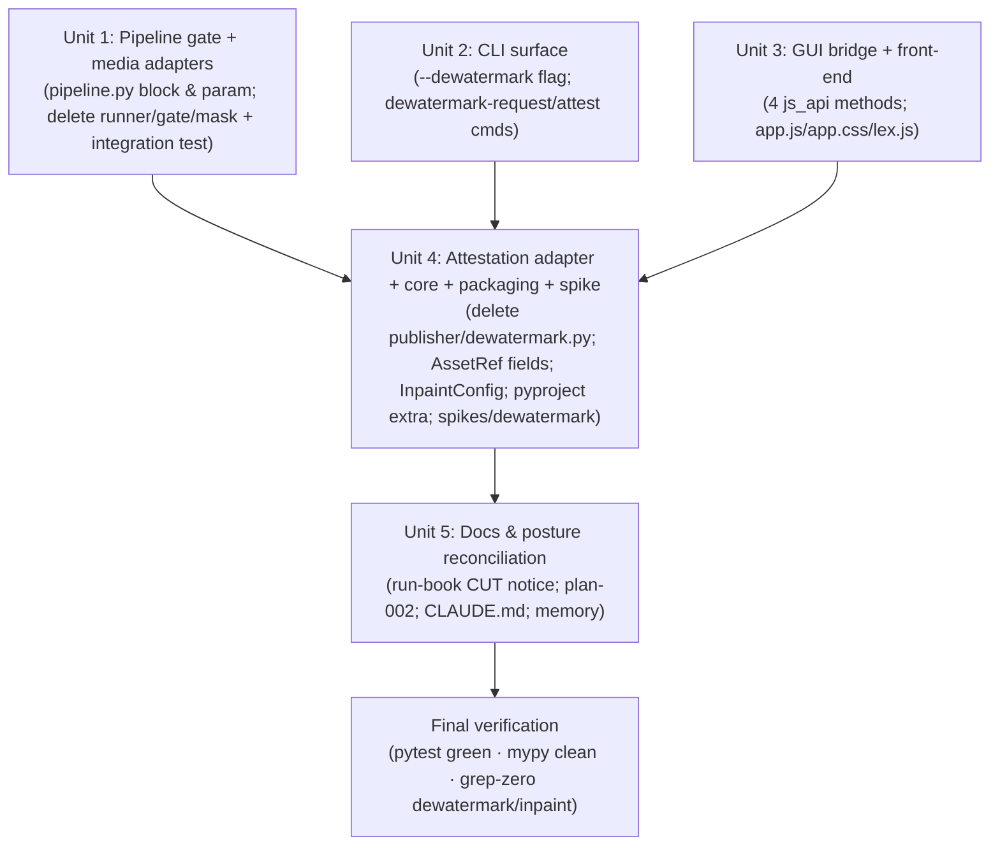

# refactor: CUT de-watermark (Batch 2) and deliver the compliance-first pipeline

## Overview

The content-pipeline-upgrade (PR #5) shipped to `main` with one capability left behind a go/no-go gate: the **de-watermark / inpaint engine (Batch 2)**. The operator has decided **CUT** — the run-book's explicitly sanctioned safe endpoint ("CUT 是合法且安全的选择 … 要彻底干净，后续可移除 Batch 2 代码").

This plan **removes the de-watermark capability entirely** (engine runner, Stage-2 gate, segregation-of-duties attestation, CLI commands, GUI/front-end flow, config, packaging extra, measurement spike, and tests), leaving a clean, compliance-first pipeline (`crawl/ingest → process → review packet → human sign-off`) fit for **first-party authorized content**. The capability is removed, not merely disabled, so the tree honestly carries no third-party-watermark-removal path.

This is a deletion/refactor. It adds no behavior. Success = the suite is green, the type gate is clean, and no de-watermark/inpaint surface remains in `src/`, `tests/`, packaging, or spikes.

## Problem Frame

The pipeline's de-watermark feature exists to strip third-party watermarks so content can be republished (SOP §4: 去除第三方水印 → 加本平台水印; SOP §7: rewrite to avoid similarity detection). Left in the tree — even default-locked — it is a latent content-laundering capability: flip `inpaint.enabled` + set `engine_cmd` and it is back online. The operator chose CUT to deliver the compliance pipeline without that capability. Removing the code (vs. lock-only) makes the CUT **not re-enableable by a config flip** — git history is preserved as named restore points, so the residual risk is a future revert, not a config change (see the re-introduction guardrail in Key Technical Decisions).

The de-watermark code **ships default-locked + engine-absent** (`InpaintConfig.enabled=False`, empty `engine_cmd` → `DependencyError`), so it cannot run on a clean install and this is a clean-tree refactor, not an incident fix. Caveat on "never used": the *shipped default* is verifiable, but whether the capability was ever exercised on the operator's machine (the go/no-go run-book invites `enabled=true` + an `engine_cmd` to run the spike) is only knowable from the gitignored `data/` tree this plan does not inspect — which is why the Unit 5 operator-sweep notice matters.

## Requirements Trace

- R1. Remove every de-watermark / inpaint touch point from `src/` so the capability cannot run or be re-enabled by config alone. (origin: run-book "BUILD or CUT 决策" → CUT)
- R2. Remove the de-watermark gate from Stage-2 while preserving the rest of the chain. The **current** order is `risk → [de-watermark] → media → dedup → assemble → lint/grounding`; after removal it becomes `risk → media → dedup → assemble → lint/grounding`, with every surviving gate parking fail-closed exactly as before and the state machine unchanged.
- R3. Preserve adjacent, legitimate features: the **watermark-ADD** brand-mark feature (`WatermarkConfig`, `--watermark` toggle) and the **publish backfill attestation** (`backfill --attest`, `lex.backfill_attest`) — neither is part of the de-watermark line.
- R4. Keep the suite green and the `mypy` gate clean at the end; remove (not skip) the de-watermark tests.
- R5. Reconcile the docs and posture artifacts so they no longer describe a capability that is gone (run-book, plan-002, CLAUDE.md, memory).

## Scope Boundaries

- **Not** building or wiring any inpaint engine (that is the path the operator explicitly declined).
- **Not** touching the watermark-ADD feature (`WatermarkConfig`, `media/watermark.py`, `--watermark`, `cover` checks). If the operator later wants a fully clean-hands posture they may revisit add-watermark separately — out of scope here (see Open Questions).
- **Not** touching `backfill --attest` / sign-off attestation — that is the publish-loop attestation, unrelated to de-watermark.
- **Not** changing the `JobState` / `ReviewReason` enums — de-watermark added no states (it parked at the existing `NEEDS_REVISION`).
- **Not** altering the crawler, dedup, risk, lint, or grounding gates.
- **Not** removing the separate `spikes/detection_accuracy/` harness — only `spikes/dewatermark/` goes.

## Context & Research

### De-watermark touch-point map (first-hand grep audit, 2026-06-17)

This is the authoritative removal surface. Reference counts are de-watermark/inpaint mentions per file.

**Adapter files to DELETE outright:**
- `src/lcp/adapters/media/dewatermark_runner.py` — isolated subprocess engine runner (Unit 8).
- `src/lcp/adapters/processor/dewatermark_gate.py` — the Stage-2 gate; imports `..media.mask.write_box_mask` and reads `AssetRef.watermark_removed`.
- `src/lcp/adapters/media/mask.py` — L-mode box-mask builder; exports **both** `write_box_mask` (used by `dewatermark_gate.py`) and `build_box_mask` (used by `tests/media/test_dewatermark_integration.py`); only those two import it (confirmed: not used by `media/watermark.py`). Grep at symbol granularity for **both** names, not just `write_box_mask`.
- `src/lcp/adapters/publisher/dewatermark.py` — segregation-of-duties attestation (Unit 7): `request_dewatermark`, `attest_dewatermark`, `read_attestation`, `read_submitter`.

**Files to EDIT (surgical removal):**
- `src/lcp/pipeline.py` (10) — the `if dewatermark and self.config.inpaint.enabled:` block in `_process_inner` (the only place importing `dewatermark_gate` + `publisher.dewatermark.read_attestation`, both lazy/in-block), the `dewatermark` param on `process` / `_process_inner`, and the `dewatermark=` thread-through. Note `run_until` (~563-569) also calls `process()` but does **not** pass `dewatermark` — no edit needed there; just confirm it still resolves once the param defaults away.
- `src/lcp/cli.py` (16) — the `--dewatermark` flag + `dewatermark=` arg on `process` (lines ~181-198); the `dewatermark-request` (~219) and `dewatermark-attest` (~233) commands. **Keep** `backfill --attest` (~379-395).
- `src/lcp/gui.py` (20) — js_api methods `dewatermark_disclaimer`, `dewatermark_status`, `request_dewatermark`, `attest_dewatermark` (~382-434). **Two non-import couplings the import-greps will miss:** (a) `dewatermark_status` reads `c.config.inpaint.enabled` / `.engine_cmd` (~402); (b) the GUI's *own* `process` wrapper declares `dewatermark: bool = False` (~205), `process_async` threads it **positionally** through a lambda (~277), and the wrapper passes `dewatermark=bool(dewatermark)` into `Pipeline.process` (~220). gui.py is the **non-strict** shell (not in the strict mypy bundle), so a surviving `config.inpaint` read is NOT caught by `mypy` — only at runtime; the per-unit grep MUST include `inpaint`. **Keep** `backfill` (~510).
- `src/lcp/core/config.py` (4) — `class InpaintConfig` (~62-74) and the `inpaint: InpaintConfig` field on `Config` (~119).
- `src/lcp/core/models.py` (1) — `AssetRef.watermark_removed` and `AssetRef.watermark_evidence_sha256` (+ the provenance comment). **Confirmed safe:** the only readers are `dewatermark_gate.py` and `test_dewatermark_integration.py`, both deleted by this plan.
- `src/lcp/web/app.js` — `renderDewatermark()` + its call site (~638), `POLL_CAP_INPAINT` + the `process_dewatermark` poll-kind branch (~183-187), and the attestation panel (~641-665). **Keep** the `"attestation required"` needle (~125) — that is the sign-off/backfill message, not de-watermark.
- `src/lcp/web/app.css` — the "De-watermark attestation panel" block (~273-280).
- `src/lcp/web/lex.js` — the `dewatermark_attest` honesty string (~60). **Keep** `backfill_attest` (~59).
- `pyproject.toml` — the `inpaint = ["onnxruntime>=1.17"]` extra + its comment (~20-23).

**Spike + tests to DELETE:**
- `spikes/dewatermark/` (whole dir: `run_eval.py`, `make_mask.py`, `README.md`, `samples/`).
- `tests/media/test_dewatermark_integration.py`, `tests/test_dewatermark_attestation.py`, `tests/test_gui_dewatermark.py`, `tests/spikes/test_make_mask.py`, `tests/spikes/test_dewatermark_harness.py`.
- Confirmed **keep**: `tests/test_cli_watermark_template.py` (watermark-ADD + 栏目 template; no de-watermark refs).

**Docs referencing de-watermark (reconcile, don't delete history):**
- `docs/2026-06-17-dewatermark-go-no-go-runbook.md`, `docs/2026-06-17-content-pipeline-upgrade-PR5-review-guide.md`, `docs/plans/2026-06-17-002-feat-content-pipeline-upgrade-plan.md`, and `CLAUDE.md` (its "Subprocess isolation" section prominently documents the de-watermark runner). README is already clean (confirmed).

### Relevant patterns to follow

- Functional-core / imperative-shell + the CLI↔GUI 1:1 mirror (`src/lcp/pipeline.py` docstring, CLAUDE.md). Any surface removed from the CLI must be removed from the GUI in lockstep — R3 parity in reverse.
- The Stage-2 gate-chain shape in `Pipeline._process_inner` — removing one gate is a localized block deletion; the other gates and the `persist_gate_state` seam are untouched.

### Institutional Learnings

- No `docs/solutions/` directory exists yet — no prior solution notes to mine.
- Memory `feedback-mypy-gate-workflow`: run `mypy` from `.venv` (CI-matching deps), never pyenv (stale Pillow → false positives). Applies to this plan's verification.

## Key Technical Decisions

- **Clean removal, not lock-only.** Lock-only (leave the code, trust `enabled=False`) is lower-effort and reversible, but leaves a latent laundering capability re-enableable by a one-line config flip — which defeats the stated goal of *delivering* a compliance pipeline. Full removal makes the CUT honest and config-proof. The run-book names removal as the "彻底干净" path. **Rejected alternative:** lock-only — recorded because it is the cheaper option and a reviewer may ask why it was not chosen; it fails R1's "cannot be re-enabled by config alone."
- **Keep watermark-ADD and backfill-attest.** The operator scoped the CUT to the *de-watermark (removal)* line. Adding a brand mark to one's own published content (`WatermarkConfig`) and recording a human's publish attestation (`backfill --attest`) are independent, defensible features. Removing them is out of scope (and would be a larger product decision).
- **Remove import sites before deleting the modules they import.** `pipeline.py`, `cli.py`, and `gui.py` import `publisher/dewatermark.py` (and `pipeline.py` imports `dewatermark_gate.py`) lazily. Sequence the units so every importer is gone before the imported module is deleted — keeping the suite green at each unit boundary. This drives the dependency order below (Units 1-3 strip surfaces and the in-block imports; Unit 4 deletes the now-orphaned attestation adapter + core/packaging). **Beyond imports there is one config-shape coupling:** `gui.py` reads `config.inpaint.*` directly (an attribute dependency, not an import), and gui.py is the non-strict shell so `mypy` will NOT flag a leftover reference. It must be cleared in Unit 3 and the per-unit verification greps must include `inpaint` — otherwise Unit 4's `InpaintConfig` deletion breaks only at runtime.
- **Re-introduction guardrail (forward-looking).** The de-watermark *engine* (commit `755d6a8`) and its two-party *segregation-of-duties attestation* (submitter ≠ reviewer, commit `3209191`) are removed together and MUST only ever be re-introduced together. Deletion is reversible by git (history is preserved), so the real residual risk is a future revert/cherry-pick that restores the engine WITHOUT the attestation gate — an uncontrolled laundering path with no submitter/reviewer split, the precise control this plan removes. Invariant for any future BUILD: no engine path may exist unless the independent-reviewer attestation gate refuses to run it un-attested.
- **Delete tests with the code they cover, in the same unit.** Avoids a red suite between units and avoids a separate "delete dangling tests" cleanup.
- **Verify the model-field removal against persisted data.** Removing `AssetRef` fields is safe for code (no surviving readers), but on-disk manifests written during prior runs may still contain those keys. Confirm pydantic ignores unknown keys on load (default unless `extra="forbid"`) so older `data/jobs/*/manifest` files still deserialize — captured as a Unit 4 test scenario.

## Open Questions

### Resolved During Planning

- *Lock-only or full removal?* → Full removal (see Key Decisions; aligns with R1 and the run-book).
- *Does CUT touch the state machine?* → No. De-watermark added no `JobState`/`ReviewReason`; it parked at the existing `NEEDS_REVISION` and raised `DependencyError` when engine-absent. Removing the gate removes a branch only.
- *Is `mask.py` shared with watermark-ADD?* → No (grep-confirmed: only the de-watermark gate + its integration test import it). Safe to delete.
- *Are there `watermark_removed` readers that would break?* → No (grep-confirmed: only the deleted gate + deleted test). Safe.
- *Does `--dewatermark` removal affect `backfill --attest`?* → No; they are unrelated attestations. Backfill is preserved.

### Deferred to Implementation

- Exact line ranges shift as edits land; the touch-point map names the symbols/blocks, not brittle line numbers — re-locate by symbol when editing.
- Whether any `data/jobs/*/` runtime artifacts (e.g., persisted attestation/submitter files) should be swept is an **operator** action on a gitignored, machine-local tree — note it in the run-book CUT notice; do not script deletion of operator data here.
- Whether the operator additionally wants the **watermark-ADD** feature reviewed for a fully clean-hands posture — a separate product decision, out of this plan's scope.

## High-Level Technical Design

> *This illustrates the intended approach and is directional guidance for review, not implementation specification. The implementing agent should treat it as context, not code to reproduce.*

Removal order, driven by the "strip importers before deleting imported modules" decision. Units 1-3 run independently (different layers); Unit 4 fans in after all importers are gone; Unit 5 reconciles docs to the new reality.

## Implementation Units

- [ ] **Unit 1: Remove the Stage-2 de-watermark gate and media adapters**

**Goal:** Excise the engine path: the pipeline gate block + param, and the three adapter modules it drives.

**Requirements:** R1, R2

**Dependencies:** None

**Files:**
- Modify: `src/lcp/pipeline.py` (remove the `if dewatermark and self.config.inpaint.enabled:` block in `_process_inner`; remove the `dewatermark` param from `process` and `_process_inner`; remove the `dewatermark=` thread-through)
- Modify: `src/lcp/cli.py` (drop the `dewatermark=` kwarg passed into `Pipeline.process`, ~198) and `src/lcp/gui.py` (drop the `dewatermark=bool(dewatermark)` kwarg into `Pipeline.process`, ~220). The CLI flag, the GUI js_api methods, and the GUI's own `process`/`process_async` wrapper signatures (which also carry `dewatermark`) are removed with their surfaces in Units 2/3 — Unit 1 only stops the value reaching the now-removed `Pipeline.process` param, keeping the suite green.
- Delete: `src/lcp/adapters/processor/dewatermark_gate.py`
- Delete: `src/lcp/adapters/media/dewatermark_runner.py`
- Delete: `src/lcp/adapters/media/mask.py`
- Test: delete `tests/media/test_dewatermark_integration.py`

**Approach:**
- The block is self-contained and its imports (`run_dewatermark_gate`, `read_attestation`) are lazy and inside it, so removal also drops `pipeline.py`'s only references to `dewatermark_gate` and `publisher.dewatermark`.
- Confirm the remaining gate order (`risk → media → dedup → assemble → lint/grounding`) is byte-for-byte unchanged in behavior.

**Patterns to follow:** `Pipeline._process_inner` gate-block structure; leave `persist_gate_state` usage untouched.

**Test scenarios:**
- Happy path: `pytest tests/test_state_machine.py tests/processor -q` (and the media gate tests) stay green — the surviving gate chain is unaffected.
- Edge case: `Pipeline.process(...)` invoked without any de-watermark argument still reaches `PROCESSED` on clean input and still parks fail-closed on a risk/media/dedup/lint failure.
- Capability-absence: `inspect.signature(Pipeline.process)` has no `dewatermark` parameter.
- Removed: the de-watermark integration tests are gone (not skipped).

**Verification:** Suite green after this unit; `grep -rnE "dewatermark_gate|dewatermark_runner|adapters\.media\.mask|(build|write)_box_mask" src/` returns nothing, AND `grep -nE "dewatermark|inpaint" src/lcp/pipeline.py` returns nothing (catches a stale `self.config.inpaint.enabled` guard left by a partial block edit); the other Stage-2 gates behave identically.

- [ ] **Unit 2: Remove the CLI de-watermark surface**

**Goal:** Drop the operator CLI commands and flag for de-watermark.

**Requirements:** R1, R3

**Dependencies:** None (can land alongside Unit 1; must precede Unit 4)

**Files:**
- Modify: `src/lcp/cli.py` — remove the `--dewatermark` option on `process`, and the `dewatermark-request` + `dewatermark-attest` commands (and their lazy imports of `publisher.dewatermark`). **Keep** `backfill --attest`.
- Test: any CLI assertions for these commands move out with them; confirm `tests/test_cli_watermark_template.py` (watermark-ADD/template) still passes unchanged. Note: the only *behavioral* test of `dewatermark-request`/`dewatermark-attest` lives in `tests/test_gui_dewatermark.py` (it drives the CLI via `main([...])`), which is deleted in Unit 3 — so after Unit 3 the CLI removal rests on the grep + capability-absence check below, which is acceptable for a deletion.

**Approach:** Pure shell deletion (cli.py is the non-strict Click glue layer). After this unit, `cli.py` no longer imports `publisher.dewatermark`.

**Patterns to follow:** existing Click command definitions in `cli.py`; preserve the error-contract exit codes for the surviving commands.

**Test scenarios:**
- Capability-absence: invoking `dewatermark-request` / `dewatermark-attest` exits as an unknown command; `process --help` shows no `--dewatermark`.
- Regression: `backfill --attest` still records the publish attestation; `--watermark` toggle still present and working.

**Verification:** `grep -rn "dewatermark" src/lcp/cli.py` returns nothing; CLI watermark/template/backfill tests green.

- [ ] **Unit 3: Remove the GUI bridge + front-end de-watermark flow**

**Goal:** Drop the de-watermark js_api methods and the front-end panel/poll wiring, keeping CLI↔GUI parity (now both have no de-watermark).

**Requirements:** R1, R3

**Dependencies:** None (can land alongside Units 1-2; must precede Unit 4)

**Files:**
- Modify: `src/lcp/gui.py` — remove the four js_api methods (`dewatermark_disclaimer`, `dewatermark_status`, `request_dewatermark`, `attest_dewatermark`, including the `config.inpaint.*` reads inside `dewatermark_status` ~402); remove the `dewatermark` parameter from the GUI's *own* `process` (~205) and `process_async` (~271) wrapper signatures and the positional `dewatermark` in the `process_async` lambda (~277). (The kwarg into `Pipeline.process` ~220 was already dropped in Unit 1.) **Keep** `backfill`.
- Modify: `src/lcp/web/app.js` — remove `renderDewatermark()` + its call site (~638); remove the **entire** `POLL_CAP_INPAINT` region (~183-187: the comment, the `const`, AND the `process_dewatermark` ternary selector at ~187 — deleting only the `const` leaves an undefined-identifier reference that `node --check` will NOT catch). Fall back to the default `POLL_CAP`. **Keep** the `"attestation required"` sign-off needle (~125).
- Modify: `src/lcp/web/app.css` — remove the "De-watermark attestation panel" block.
- Modify: `src/lcp/web/lex.js` — remove `dewatermark_attest`. **Keep** `backfill_attest`.
- Test: delete `tests/test_gui_dewatermark.py`.

**Approach:** Mirror Unit 2's CLI removal exactly (parity). After this unit, `gui.py` no longer imports `publisher.dewatermark`. Re-run `node --check` on `app.js`/`lex.js` (the handoff used this as the front-end smoke check).

**Patterns to follow:** the GUI js_api shell in `gui.py`; the front-end render/poll structure in `app.js`.

**Test scenarios:**
- Capability-absence: the GUI `Api` has no `dewatermark_*` attributes (`hasattr` is False for all four).
- Integration: the review/sign-off panel still renders and `backfill` still works through the bridge (the de-watermark panel simply no longer appears).
- Front-end: `node --check src/lcp/web/app.js` and `node --check src/lcp/web/lex.js` are clean; no dangling reference to `renderDewatermark`/`POLL_CAP_INPAINT`/`process_dewatermark`.

**Verification:** `grep -rniE "dewatermark|inpaint" src/lcp/gui.py src/lcp/web/` returns nothing (the `inpaint` needle is what catches the non-import `config.inpaint` reads); `node --check` clean on `app.js`/`lex.js`; GUI tests (minus the deleted one) green.

- [ ] **Unit 4: Delete the attestation adapter, core config/model, packaging extra, and spike**

**Goal:** With all importers gone (Units 1-3), delete the orphaned attestation adapter and strip the remaining core/packaging/spike surface.

**Requirements:** R1, R4

**Dependencies:** Units 1, 2, 3 (they remove every importer of `publisher/dewatermark.py`)

**Files:**
- Delete: `src/lcp/adapters/publisher/dewatermark.py`
- Modify: `src/lcp/core/models.py` — remove `AssetRef.watermark_removed` + `AssetRef.watermark_evidence_sha256` (+ comment)
- Modify: `src/lcp/core/config.py` — remove `class InpaintConfig` and the `inpaint` field on `Config`
- Modify: `pyproject.toml` — remove the `inpaint = ["onnxruntime>=1.17"]` extra + its comment; **leave** the strict-bundle `[[tool.mypy.overrides]]` for `lcp.core.*`/`lcp.adapters.*` (still valid for surviving modules)
- Delete: `spikes/dewatermark/` (entire directory)
- Test: delete `tests/test_dewatermark_attestation.py`, `tests/spikes/test_make_mask.py`, `tests/spikes/test_dewatermark_harness.py`

**Approach:** Deletion-first; this is where the suite would go red if an importer survived, so it gates on Units 1-3. After this, `core.config` and `core.models` are part of the strict mypy bundle — confirm no leftover references to the removed symbols there.

**Patterns to follow:** `core/config.py` pydantic `BaseModel` config classes; `core/models.py` `AssetRef`.

**Test scenarios:**
- Capability-absence: `from lcp.core.config import Config; Config()` has no `inpaint` attribute; `InpaintConfig` import raises `ImportError`.
- Edge case (persisted data): round-trip an old manifest through the **real `read_manifest`/`write_manifest` path** (not a bare `AssetRef(**dict)`): one that still carries `watermark_removed`/`watermark_evidence_sha256` keys loads without error (confirmed: no model sets `extra="forbid"`, so pydantic v2 ignores unknown keys; assert `AssetState.OK`). **Consequence to state, not gloss:** `extra="ignore"` *drops* those keys, so the next `write_manifest` silently discards the historical de-watermark provenance. This is accepted — the capability and its provenance are both cut, and a symbol-grep confirmed no surviving consumer reads those fields — but it is a one-way data change (see Risks).
- Optional (defense-in-depth): a test asserting the audit event vocabulary can no longer *produce* `DEWATERMARK_*` events — detects a future silent re-introduction at the audit layer, not just via grep.
- Packaging: `pip install -e ".[crawl,media,llm,dedup,dev]"` resolves with no `inpaint`/`onnxruntime` reference; CI matrix unaffected.
- Removed: attestation + spike tests gone.

**Verification:** `grep -rniE "dewatermark|inpaint|onnxruntime" src/ pyproject.toml spikes/` returns nothing; `./.venv/bin/mypy` clean; full suite green.

- [ ] **Unit 5: Reconcile docs and posture artifacts**

**Goal:** Make the written record match the cut: the capability is gone, and that is intentional and safe.

**Requirements:** R5

**Dependencies:** Units 1-4 (docs should describe the final state)

**Files:**
- Modify: `docs/2026-06-17-dewatermark-go-no-go-runbook.md` — prepend a CUT notice (decision: CUT on 2026-06-17; capability removed; operator-data sweep note) rather than deleting the history.
- Modify: `docs/plans/2026-06-17-002-feat-content-pipeline-upgrade-plan.md` — annotate the Batch 2 / de-watermark units as **CUT (see this plan)**, preserving the historical record and completed checkboxes.
- Modify: `docs/brainstorms/2026-06-17-content-pipeline-upgrade-requirements.md` (plan-002's `origin`) — prepend a CUT notice that the de-watermark line (UR2–UR4) **and the R2 bounded-exception amendment it records** were CUT on 2026-06-17, so the brainstorm no longer reads as a live sanction for de-watermark. Annotate, don't delete.
- Modify: `docs/2026-06-17-content-pipeline-upgrade-PR5-review-guide.md` — note the de-watermark sections are superseded by the CUT.
- Modify: `CLAUDE.md` — update the "Subprocess isolation" section (crawler subprocess pattern stays; drop the de-watermark engine as a live example); remove the now-dead Command examples — the `pytest -k dewatermark -q` line (~15) and the `spikes/dewatermark/run_eval.py` reference (~22, leaving only `spikes/detection_accuracy/run_eval.py`) — plus the `inpaint` extra mention. The security-invariants section stays.
- Modify: memory `project_content_pipeline_upgrade.md` + `MEMORY.md` pointer — record CUT as the resolution of the "remaining = de-watermark go/no-go → engine wiring" line.

**Approach:** Documentation only — preserve history (annotate/supersede, don't erase decisions). No code.
- **Posture rollback:** state explicitly that CUT lapses the R2 bounded-exception amendment recorded in the 2026-06-17 brainstorm; R2 reverts to its baseline absolute prohibition (`不得以任何方式掩蓋權利人來源 — 不做去水印掩蓋`, `docs/brainstorms/2026-06-16-local-content-processor-requirements.md`). If the CLAUDE.md security-invariants posture referenced the exception, re-assert the un-amended rule.

**Execution note:** Test expectation: none — documentation/memory only, no behavioral change.

**Verification:** No doc claims a live de-watermark capability; CLAUDE.md "Subprocess isolation" no longer presents an engine that does not exist; memory reflects CUT. `grep -rniE "dewatermark|inpaint" CLAUDE.md docs/brainstorms/ docs/plans/2026-06-17-002*` returns only explicit CUT/historical annotations, never a live instruction or runnable command.

## System-Wide Impact

- **Interaction graph:** Only the Stage-2 gate chain loses a branch (`_process_inner`). No callback/observer/middleware is affected. The CLI↔GUI mirror loses one matched pair of surfaces (parity preserved).
- **Error propagation:** The de-watermark path's failure modes (`DependencyError` when engine-absent, `NEEDS_REVISION` on engine failure) disappear with the path. All other gate error mapping (e.g., LLM `ExternalServiceError → PROCESS_FAILED`) is untouched.
- **State lifecycle risks:** None new. No `JobState`/`ReviewReason` change. Existing on-disk manifests with stale `watermark_*` keys must still deserialize (Unit 4 edge-case test).
- **API surface parity:** CLI and GUI both lose the de-watermark surface together (R3 parity in reverse). The `pyproject` `inpaint` extra is removed from the public install surface — acceptable, as it pulled an isolated engine never installed in the main venv.
- **Integration coverage:** A full `pytest -q` run + a front-end `node --check` are the cross-layer proof that nothing dangles; the per-unit greps catch orphaned references unit tests would not — and **must include the `inpaint` needle**, since the `config.inpaint` coupling in non-strict `gui.py` is invisible to both the module-name greps and `mypy`.
- **Unchanged invariants:** The functional-core/imperative-shell boundary, the freeze-via-edge-absence guarantee, the PII-free SQLite/manifest/audit, the LLM zero-capability + SSRF guards, the watermark-ADD feature, and `backfill --attest` are all explicitly **unchanged** by this plan.

## Risks & Dependencies

| Risk | Mitigation |
|------|------------|
| A surviving importer of a deleted module → red suite mid-refactor | Dependency order (Units 1-3 strip all importers before Unit 4 deletes the adapter); `grep` gate at each unit's verification |
| A surviving **non-import** `config.inpaint` reference (esp. gui.py, which is non-strict → `mypy` won't catch it) → runtime break at Unit 4 | Clear `config.inpaint` in Unit 3; per-unit verification greps include `inpaint`, not just the module names |
| Removing `AssetRef` fields breaks deserialization of older persisted manifests | Unit 4 edge-case test asserts unknown-key tolerance via the real `read_manifest`/`write_manifest` path (confirmed no `extra="forbid"`) |
| Historical de-watermark provenance (`watermark_removed`/evidence) silently dropped on next manifest re-save (`extra="ignore"`) | **Accepted + documented** (Unit 4): capability and provenance both cut; symbol-grep confirms no surviving reader |
| Front-end edit leaves a dangling `renderDewatermark`/poll reference (silent in Python tests) | `node --check` on `app.js`/`lex.js` + grep gate in Unit 3 |
| Docs/CLAUDE.md keep describing a removed capability → future agent reintroduces it | Unit 5 reconciliation is a required unit, not optional cleanup |
| Over-removal of the adjacent watermark-ADD or backfill-attest features | Explicit scope boundary + grep-confirmed separation; `test_cli_watermark_template.py` kept as the watermark-ADD regression guard |
| A future revert restores the engine (`755d6a8`) WITHOUT the two-party attestation (`3209191`) → uncontrolled laundering path | Re-introduction guardrail (Key Decisions): the two only ever return together; named restore-point commits make a partial cherry-pick visible in review |

## Documentation / Operational Notes

- The run-book CUT notice should **enumerate the actual machine-local artifacts** under `data/jobs/*/review/` the operator may sweep (gitignored; not handled by code here): `dewatermark_request.json`, `dewatermark_attestation.json`, and **especially `dewatermark_evidence.txt`, which holds the RAW operator-asserted license reference (e.g. a contract id / URL / ownership-proof string) at `0600`, not just its SHA-256** — the one sensitive residual most likely to be overlooked.
- The notice must also state that the **append-only, hash-chained audit (`audit.jsonl`) permanently retains** any historical `DEWATERMARK_REQUESTED` / `DEWATERMARK_ATTESTED` events (carrying submitter/reviewer names + `evidence_sha256`). This is by design — the audit is tamper-evident and must not be rewritten. The CUT removes the code path, not past history; an operator who must purge those records does so out-of-band, accepting that it breaks the hash chain from that point.
- No rollout/monitoring concerns: the feature **ships default-locked + engine-absent**, so it cannot run on a clean install. Whether it was ever exercised on the operator's local machine is only knowable from the gitignored `data/` tree this plan does not inspect — which is exactly why the sweep notice above matters. This is otherwise a tree-cleanliness refactor.
- `.github/workflows/ci.yml` installs `.[crawl,media,llm,dedup,dev]` (no `inpaint`) — confirmed; removing the `inpaint` extra leaves CI unaffected.
- After merge, a single PR titled `refactor: CUT de-watermark (Batch 2)` cleanly captures the removal; the branch is already `feat/content-pipeline-upgrade`.

## Sources & References

- **Origin document:** [docs/2026-06-17-dewatermark-go-no-go-runbook.md](docs/2026-06-17-dewatermark-go-no-go-runbook.md) — BUILD-or-CUT decision; CUT is the sanctioned safe endpoint.
- Halt rationale + resume condition: [docs/2026-06-17-session-handoff.md](docs/2026-06-17-session-handoff.md)
- Superseded plan (Batch 2 units): [docs/plans/2026-06-17-002-feat-content-pipeline-upgrade-plan.md](docs/plans/2026-06-17-002-feat-content-pipeline-upgrade-plan.md)
- Architecture invariants: `CLAUDE.md` (functional-core/imperative-shell, subprocess isolation, security posture)
- De-watermark commits being reverted in spirit: `3209191` (Unit 7 attestation), `755d6a8` (Unit 8 engine), `ec8dc4b` (Unit 9 GUI/CLI), `c8b5a94`/`f3ac6c6` (hardening)
