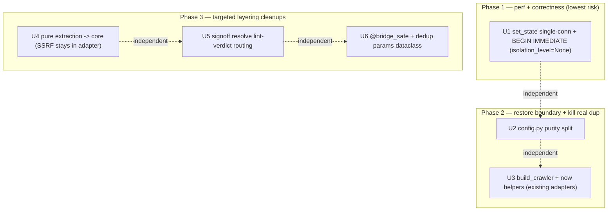

# refactor: Surgical architecture / performance / type-gate cleanup

## Overview

`local-content-processor` (`lcp`) is already a mature, cleanly-layered codebase:
functional-core / imperative-shell is honored, a two-tier strict mypy gate is
live (`pipeline` + `adapters.*` + `core.*` strict; `cli.py`/`gui.py`
intentionally non-strict), the SQLite hot paths have been optimized once, and
~600 tests are green. **This is not an architecture rewrite.** It is a small,
sequenced set of *surgical, behavior-preserving* refactors that fix the gaps a
research + deepening + document-review pass found.

**Scope was deliberately right-sized after a deepening review (2026-06-17).** An
initial draft proposed 8 units; three independent reviewers (architecture,
data-integrity, simplicity) found that much of the proposed work was
*re-organization and gate-appeasement that leaves the codebase the same size or
larger, with more indirection* — the exact failure mode of a "full surgical"
mandate, and a direct conflict with the project's "simple over clever" rule.
Concretely, of the original 8 units: **2 were cut entirely** (a shared
`GateResult` base; an `audit_aggregate` cache) and **4 were trimmed to their
high-value core** (the `signoff` file-split → only the `resolve` lint-coupling
fix; the `gui.py` strict-graduation + 27 `TypedDict`s → only a `@bridge_safe`
decorator; the `lcp/app` use-case package → two small helpers; the risk-keyword
relocation → optional). The result is **6 units**. The cuts and their evidence
are preserved in **Deferred / Dropped** below, so the decision is auditable and
reversible.

Correctness defects the deepening/review surfaced are fixed regardless of scope
and are baked into the units below:

- **The original `set_state` "single connection closes the TOCTOU" claim was
  false.** Python's `sqlite3` uses deferred transactions — the write lock is
  taken at the first `UPDATE`, *after* validation — so one connection only
  *narrows* the read→update race. Closing it requires an explicit `BEGIN
  IMMEDIATE`, which on Python 3.11 means setting `isolation_level=None` so the
  driver's legacy autocommit layer doesn't fight the manual transaction.
- **Routing the gate "what counts as passing" set through a shared outcome would
  silently corrupt the audit vocabulary** (`media` emits an ad-hoc `"pass"`
  literal, `dedup` emits `"unique"`) — so that consolidation is dropped.
- **The `LINT_GATE` audit event carries the reviewer's identity as its `actor`,
  not a literal `"human"`** — earlier drafts mis-stated this; U5 preserves the
  per-reviewer accountability identity.
- **`extract_content` is not actually pure** — it reaches `net_guard` (DNS) for a
  second-order SSRF check — so U4 moves only the genuinely-pure parts to core and
  keeps the SSRF guard in the adapter.

Three goals, mapped to the kept units:

- **架构 / 拆分逻辑:** restore the one true core-purity violation
  (`core/config.py` does I/O, U2); kill the *genuine* shell duplication (the
  crawler-construction block ×3, `_now()` ×2, U3); move the *pure* parts of
  content-extraction judgement out of the crawler adapter into `core/` (U4); stop
  the publisher (`signoff.resolve`) from re-deciding a lint verdict it doesn't own
  (U5).
- **效能:** remove the redundant second SQLite connection in `JobStore.set_state`
  and *actually* close its read→update race (U1).
- **可编译性 (type-gate hygiene):** collapse the ~21 repeated bridge `try/except
  LcpError` blocks in `gui.py` into one `@bridge_safe` decorator, and replace one
  `**kwargs: Any` seam in an already-strict adapter with an explicit params
  dataclass (U6). (We do **not** graduate `gui.py` to strict — see Deferred /
  Dropped.)

## Problem Frame

A research + deepening + document-review pass audited the ~10,755-LOC package.
The boundary is largely honored; the kept work targets the debts that are *real
simplifications*, not re-orgs:

1. **`core/config.py` breaks the core's "no I/O" redline** — file reads, OS
   keyring, env, and a full atomic-write dance inside the pure-core package the
   strict gate depends on being pure.
2. **Two shells duplicate real wiring** — the crawler-construction block
   (`SourceRegistry.from_config` → `CrawlRunnerCrawler(CrawlRunner(...))` →
   `SourceSpec`) appears **three times** verbatim (`cli.crawl`, `cli.run`,
   `gui.create_and_crawl`); `_now()` is duplicated byte-for-byte.
3. **Pure judgement is entangled with I/O in the crawler adapter** —
   `scrapy_impl.extract_content`/`_classify_media_url` (L51–142) mixes pure
   extraction policy with a `net_guard` SSRF check; the pure part belongs in
   `core/`.
4. **The publisher re-decides lint** — `signoff.resolve` (L358–387) reaches into
   `processor.draft_linter` + `core.rules.lint_rules` via function-local imports
   and inspects `LintStatus`; lint PASS/FAIL is a processor concern.
5. **One concrete perf+correctness defect** — `set_state` opens two connections
   per call (job_store.py L205 read, L214 update) with a read→update race between
   them.
6. **`gui.py` repeats the same error-handling boilerplate ~21×** and one adapter
   exposes a `**kwargs: Any` seam.

## Requirements Trace

- **R1.** Performance + correctness: single-connection read-validate-update in
  `JobStore.set_state` under `BEGIN IMMEDIATE` (with `isolation_level=None`) to
  remove the redundant connection *and* close the read→update race; preserve the
  `TRANSIENT_STATES` refusal and the single direct-edge transition validation;
  keep `set_state` marker-free. (`persist_from_processing`'s identical latent race
  is **deferred** — it interleaves filesystem marker I/O; see Deferred / Dropped.)
- **R2.** Restore functional-core purity: remove all I/O from `core/config.py`
  into `adapters/storage/config_io.py`, preserving the secret-resolution order and
  the `client._resolved_api_key` redaction binding, without moving file/subprocess
  work ahead of `apply_hardening()`.
- **R3.** Eliminate the *genuine* shell duplication: one `build_crawler(...)`
  factory and one shared `now()`, placed in existing strict-covered adapter
  modules (no new top-level package).
- **R4.** Move the *pure* parts of content-extraction judgement from
  `scrapy_impl.py` into `core/rules/extraction.py` (adapter→core, no upward
  import), leaving the `net_guard` SSRF check in the adapter.
- **R5.** Stop `signoff.resolve` from re-deciding lint: the PASS/refuse verdict
  moves into a processor function returning a plain boolean; `signoff` drops its
  `core.rules.lint_rules` import but **keeps** the operator-facing refusal
  (`InputValidationError` message + exit code) and the per-reviewer-`actor`
  `LINT_GATE` audit event.
- **R6.** Type-gate hygiene: one `@bridge_safe` decorator replaces the ~21
  repeated `try/except LcpError` blocks (preserving the methods that deliberately
  catch more); replace `dedup_checker`'s `**score_params: Any` with an explicit
  params dataclass.
- **R7.** Behavior preservation: the full `pytest` suite stays green and `mypy`
  (run from `.venv`) stays clean at every unit boundary; no documented invariant
  (state machine, PII-free index, dry-run safety, gate order, hardening-first, no
  `core → adapter` import, audit vocabulary, secret redaction) is broken.
  **Note:** the green suite proves correctness, not the absence of lock-contention
  regressions — U1 adds a targeted contention check for that (see U1).

## Scope Boundaries

Explicit non-goals (each is a thing the deepening/review showed is churn,
behavior-touching, version-fragile, or premature — see Deferred / Dropped):

- **No shared `GateResult`/`GateOutcome` base class** and **no change to
  `_GATE_PASS_STATUS`'s matched vocabulary** (it would corrupt the media/dedup
  audit strings).
- **No `audit_aggregate` cache** (deferred until measured).
- **No `persist_from_processing` `BEGIN IMMEDIATE` hardening in this plan** — it
  interleaves filesystem marker I/O between read and update, so the change is not
  the "one-liner" `set_state` is; deferred with the correct approach recorded.
- **No `gui.py` strict graduation and no bridge `TypedDict`s** — the shells are
  deliberately non-strict.
- **No `signoff.py` file split** — 551 LOC of one cohesive module; only the
  `resolve` lint-coupling is fixed.
- **No `lcp/app` package / `viewmodels` / `usecases` layer** — the two real
  helpers go in existing adapter modules; the GUI's per-field `escape_html()` is a
  load-bearing XSS obligation, not shared formatting.
- **No cli/gui parity restoration** (behavior-adding; deferred to a `feat` plan).
- **No state-machine changes; no collapsing connection-per-call; no merging
  `source_store` into `job_store`; no gate-reordering; no `strict = true`; no mypy
  bump; no deleting `net_guard.pinned_ip`/`revalidate_redirect`; no LLM
  batching/tools.**
- **No product-behavior change anywhere.**

## Context & Research

### Relevant Code and Patterns

- **Single-connection template:** `JobStore.persist_from_processing` (job_store.py
  L301–358) — copy its *structure* for U1, but note it is **not** TOCTOU-proof
  itself and is **not** hardened in this plan (it has marker I/O inside the
  read→update window).
- **Purity precedent:** `core/text_sanitize.py` was deliberately moved *down* into
  core to kill a prior `core → adapters` upward import — the direction U2/U4
  follow.
- **The SSRF entanglement (U4):** `scrapy_impl.extract_content` (L86–142) calls
  `_media_url_is_safe` (L60–83) → `net_guard.validate_url` → `socket.getaddrinfo`
  (net_guard.py L76–90). The DNS check is I/O and must **not** move to core.
- **Relint seam already exists (U5):** `draft_linter.relint_after_grounding_cleared`
  (L157–185) returns `job_state=None` (no persist), handing the lint result back;
  it emits the `LINT_GATE` audit event (L205–217) whose `actor` is the **reviewer**
  passed through by `signoff.resolve` (the `"human"` in the signature is only a
  default the live caller overrides).
- **The redaction binding (U2):** `client._ensure_client` sets
  `self._resolved_api_key = api_key` right after resolving the key;
  `_as_external_error` uses that exact string to scrub a leaked key from provider
  error text. The U2 call-site swap must keep that binding intact.
- **Injection seam:** `Pipeline.__init__` *receives* `store`/`audit` already built
  (pipeline.py L124–133); `Pipeline.build_packet` (L469–490) and
  `Pipeline.run_until` (L494–583) are the freeze/orchestration owners U3 should
  route through (never `build_review_packet` directly).
- **Error contract:** `core/errors.py` `LcpError.exit_code`; CLI maps centrally in
  `main()` (cli.py L492–511); GUI repeats `try/except LcpError → _error_dict`
  ~21× — **but** `cover_report` (L348–375) also catches `OSError`/`ValueError` and
  `dashboard_stats` (L514–549) has a bare-`Exception` guard; `@bridge_safe` must
  not flatten those.

### Institutional Learnings

`docs/solutions/` **does not exist** (no learnings sink) and there is **no
measured performance baseline** anywhere in the repo. Both shape the plan: U1 is
justified on correctness + work-reduction, proven by a deterministic
connection-count test (not a latency number), and it adds a targeted contention
check because the existing concurrency test is sequential (commits before the
second read) and cannot observe lock contention. The unmeasured dashboard-render
cost is explicitly **not** optimized here (see Deferred / Dropped → audit cache).
Sourced constraints carried forward:

- **mypy two-tier config is a fixture, not a target** (`docs/plans/2026-06-16-002-…`,
  *completed*): keep flags enumerated (never `strict = true`). The override
  wildcards `lcp.core.*` and `lcp.adapters.*`, so a module placed under an
  existing adapter package inherits strict with **no** pyproject change — which is
  why U3's helpers go there rather than in a new `lcp/app` package.
- **Verify with `./.venv/bin/mypy` only** (`feedback-mypy-gate-workflow`): pyenv's
  stale Pillow gives false positives. Do not bump mypy as part of this work.
- **`no_implicit_reexport` is ON** for strict modules — any re-export must be
  `from x import y as y`.
- **The CUT-dewatermark plan** (`docs/plans/2026-06-17-003-…`, *completed*) is the
  in-repo playbook: dependency-order the units, grep-gate each boundary (including
  non-import couplings the type gate misses), keep every unit independently green.

### External References

None required — repo-internal structural work over a well-understood stack; every
pattern to follow already exists in-tree.

## Key Technical Decisions

- **`set_state`: one connection + `BEGIN IMMEDIATE` + `isolation_level=None`.**
  Under SQLite/WAL the deferred-transaction default takes the write lock only at
  the `UPDATE`; `BEGIN IMMEDIATE` before the `SELECT` takes it up front so a
  competing writer blocks (on the per-connection `busy_timeout`, 5000ms) and the
  read-validate-update is atomic. On Python 3.11 `sqlite3` defaults to
  `isolation_level=''` (a legacy auto-`BEGIN` layer); the connection used here
  must set `isolation_level=None` so the manual `BEGIN IMMEDIATE` is the sole
  transaction control (relying on the legacy layer's suppression is
  version-fragile). `set_state` has **no** interleaved I/O, so the lock spans only
  SELECT + validate + UPDATE (microseconds); WAL readers are never blocked. This
  reverses the module's "minimal lock-hold, one connection per statement"
  micro-stance *for this method only*, justified because the redundant read is
  removed and the few multi-actor transitions (`approve`/`reject`/`supersede`)
  genuinely race today.
- **`persist_from_processing` is NOT hardened here.** It has the same latent race
  but calls `mark_processing()` (mkdir + `touch()`, L333) between read and update
  and `clear_processing()` after commit (L348). `BEGIN IMMEDIATE` there would hold
  the write lock across filesystem I/O and change rollback semantics — not a
  one-liner. Deferred with the correct approach recorded (see Deferred / Dropped).
  This plan therefore does **not** cite `persist_from_processing` as proof of the
  pattern's safety.
- **`config.py` split keeps pydantic models + `validate_llm_base_url` in core; all
  I/O moves to `adapters/storage/config_io.py`.** `resolve_api_key(config)`
  preserves the exact resolution order (keyring → `LCP_LLM_API_KEY` →
  `DependencyError`), the deliberate keyring-exception swallow (so a backend error
  echoing a secret never surfaces), and **returns** the secret so
  `client._ensure_client` still sets `self._resolved_api_key` (preserving the
  `_as_external_error` redaction). `has_api_key(config)` stays a status-only
  probe that never returns/logs the secret. `config_io.py` has **no module-level
  I/O** (so an early import can't beat `apply_hardening()`) and imports only from
  core + stdlib/yaml/keyring (a grep-gate confirms no `adapters/storage →
  adapters/llm` cycle once `client.py` imports it).
- **`signoff.resolve`'s lint *interpretation* becomes a processor boolean; the
  *refusal* stays in `signoff`.** Add (e.g.) `relint_clears_hold(...) -> bool` to
  `draft_linter`; `signoff` consumes the boolean, keeps the state transition, the
  `EVENT_NHR_RESOLVED` event, and — critically — keeps raising the existing
  operator-facing `InputValidationError` ("re-lint still fails … re-edit or
  supersede instead") with its exit code on the fail path. `signoff` drops its
  `core.rules.lint_rules` import. The `LINT_GATE` audit event is emitted **once**
  with the **reviewer** as `actor` (unchanged) and the same `status` —
  `audit_aggregate`'s intercept counts key on `extra["status"]` vs
  `_GATE_PASS_STATUS`, **not** on `actor`.
- **The two shared helpers go in existing strict-covered adapters, not a new
  package.** `build_crawler(config, audit, ts)` → `adapters/crawler/factory.py`
  (crawler wiring, already under `lcp.adapters.*` strict); `now()` →
  `adapters/clock.py` (wall-clock is nondeterministic, so it cannot live in pure
  core). No new top-level package, no new strict-override literal, no pyproject
  change, no future `CLAUDE.md` map entry.
- **`@bridge_safe` reproduces the exact current error dict + exit-code mapping**
  and is applied only to the methods whose sole guard is `except LcpError`;
  `cover_report` and `dashboard_stats` keep their broader handlers.

## Open Questions

### Resolved During Planning / Deepening / Review

- **How aggressive a refactor?** → Right-sized keep-list of 6 units (user,
  2026-06-17, after deepening showed much of the original 8-unit proposal was
  churn: 2 cut, 4 trimmed).
- **Does single-connection close the `set_state` TOCTOU?** → No; `BEGIN
  IMMEDIATE` + `isolation_level=None` is required (data-integrity + adversarial).
- **Harden `persist_from_processing` too?** → Deferred (marker I/O inside the
  window makes it non-trivial).
- **Is `extract_content` pure?** → No (it calls `net_guard`); U4 moves only the
  pure parts and leaves the SSRF check in the adapter (feasibility P0).
- **Shared `GateResult` base / `_GATE_PASS_STATUS` reroute?** → Dropped.
- **New `lcp/app/` package vs existing adapters?** → Existing adapters
  (`adapters/crawler/factory.py`, `adapters/clock.py`); no new package (scope).
- **Graduate `gui.py` to strict?** → No.

### Deferred to Implementation

- Exact `build_crawler` / `now()` / `relint_clears_hold` signatures (bare `bool`
  vs a tiny `cleared`-carrying outcome) — decide against real call sites; ensure
  `build_crawler` takes only the union of what all three sites pass (don't accrete
  caller-specific optional params).
- The precise `isolation_level` wiring for the `set_state` connection (set on the
  shared `_connect` result vs a dedicated connect path) — an implementation
  detail; the requirement is that the manual `BEGIN IMMEDIATE` is the sole
  transaction control and `in_transaction` is false after commit.

### Deferred / Dropped (with rationale — auditable, reversible)

- **DROPPED — shared `core/rules/_result.py` `GateResult`/`GateOutcome` base.**
  The six results use different status vocabularies (`unique/duplicate/uncertain`,
  `AssetState`, a 2-valued grounding enum, template-lint has no status enum) and
  carry non-shareable fields (`reliability`, `score`). A unified base forces
  `Any`/Protocol detail fields (which `disallow_any_generics` fights) or generics
  machinery to save ~20 lines of boilerplate — net-negative readability; the
  shared `BLOCKED` value would be semantically empty (risk-BLOCKED terminal vs
  lint-BLOCKED → NEEDS_REVISION).
- **DROPPED — `_GATE_PASS_STATUS` consolidation.** It matches audit *event status
  strings*; `media_checker` emits an ad-hoc `"pass"` literal (L283), `dedup_checker`
  emits `"unique"` (L127). A shared "pass" reroute breaks media/dedup intercept
  counting, and changing the emitted strings touches the hash-chained audit
  vocabulary — not behavior-preserving.
- **DEFERRED — `persist_from_processing` `BEGIN IMMEDIATE`.** Same latent
  read→update race as `set_state`, but `mark_processing()` (filesystem touch +
  mkdir) runs between the read and the update and `clear_processing()` runs after
  commit. The safe approach when it is eventually done: hoist `mark_processing()`
  **out** of (before) the `BEGIN IMMEDIATE` block so the write lock never spans
  filesystem I/O; set `isolation_level=None`; add tests that (a) a marker-touch
  failure rolls back the row cleanly and (b) the marker is cleared consistently
  with the committed row under contention.
- **DEFERRED — `audit_aggregate` caching.** Single-operator tool, no measured perf
  problem, and a cache over a tamper-evident log can *mask* tampering. If ever
  justified, the only safe design: key on `(last_seq, last_tail_hash)` via the
  existing O(1) `_tail()`; serve iff `new_seq >= cached_seq` **and** the event at
  `cached_seq` still hashes to `cached_last_hash`; **full recompute on
  invalidation, never incremental** (a middle-line edit leaves the tail hash
  unchanged); treat a *decreasing* seq (per-job `delete_job`, the only seq-reset
  vector — there is no log rotation) as invalidation.
- **DROPPED — `gui.py` → strict + 27 bridge `TypedDict`s.** The shells are
  documented as deliberately non-strict; typing dicts serialized to dynamic JS
  buys no runtime safety.
- **DROPPED — `signoff.py` file split.** 551 LOC, highly cohesive; only the
  `resolve` lint-coupling is a real wart (fixed in U5).
- **DROPPED — `lcp/app/` package + `usecases.py`/`viewmodels.py`.** GUI projections
  escape every field for the XSS bridge; CLI projections don't — not a shared
  shape. Forwarding functions would be the same length as the calls they wrap. The
  two real helpers go in existing adapter modules instead.
- **OPTIONAL — risk-keyword-table relocation** (`risk_rules.py` →
  `risk_detectors.py`): the tables are already isolated behind `KeywordRiskDetector`
  in-file; marginal value. Not in U4; do only if it pays for itself.
- **DEFERRED — cli/gui parity restoration** (behavior-adding): GUI gains
  `run`/`crawl --input`/`review-packet --source-url`; CLI gains `saved-source`
  add/delete + `save_settings`. Recommend a follow-up `feat` plan; U3's
  `build_crawler` factory is a small precondition that makes it cheaper.
- **DEFERRED — stand up `docs/solutions/`** as the compounding-knowledge sink
  (each plan re-discovers the mypy/`.venv` + `isolation_level` gotchas by hand).
  Flagged for `ce:compound` after execution.

## High-Level Technical Design

> *This illustrates the intended approach and is directional guidance for review,
> not implementation specification. The implementing agent should treat it as
> context, not code to reproduce.*

**Unit dependency graph** (phases are stop points; within a phase, units are
independent):



**Config split — before / after (U2):**

```
core/config.py  (mixed: schema + I/O)        core/config.py  : pydantic models + validate_llm_base_url  (PURE)
  ├ models + validate_llm_base_url  ───────►
  ├ load_config (file read)         ───────┐  adapters/storage/config_io.py :
  ├ update_llm_config_file (atomic) ───────┼─►   load_config / set_llm_api_key /
  └ Config.llm_api_key/has_api_key  ───────┘     update_llm_config_file / resolve_api_key(Config) / has_api_key(Config)
                                               (NO module-level I/O; keyring→env→DependencyError order preserved;
                                                returns the secret so client keeps self._resolved_api_key redaction)
callers repointed: cli.py:49, gui.py:105 (load_config); client.py:216 (resolve_api_key);
                   gui.py:648/671-683 (has_api_key / validate_llm_base_url / set / update)
```

## Implementation Units

### Phase 1 — Performance + correctness (lowest risk)

- [x] **Unit 1: `JobStore.set_state` single-connection + `BEGIN IMMEDIATE`**

**Goal:** Replace the two-connection `set_state` with one connection that, under
an explicit `BEGIN IMMEDIATE` (with `isolation_level=None`), reads → validates →
updates → commits — removing the redundant connection *and* closing the read→update
race. Preserve the `TRANSIENT_STATES` refusal, the single direct-edge
`validate_transition`, and the marker-free property.

**Requirements:** R1, R7

**Dependencies:** None.

**Files:**
- Modify: `src/lcp/adapters/storage/job_store.py` — `set_state` (L191–239): fold
  the L205 `get_job` read and the L214 `UPDATE` into one connection; set
  `isolation_level=None` on it; `BEGIN IMMEDIATE` → read → `validate_transition`
  (single, direct-edge, L208) → keep the `TRANSIENT_STATES` refusal (L209–213) →
  `UPDATE` → commit; `finally: close()`. **Do not** add `mark_processing`/
  `clear_processing` or the double `current→PROCESSING→target` validation that
  belong to `persist_from_processing`. **Do not** touch `persist_from_processing`
  in this unit (deferred).
- Test: the job-store test module under `tests/` (mirrored location)

**Approach:**
- Honest framing: one connection alone only *narrows* the race; `BEGIN IMMEDIATE`
  + `isolation_level=None` is what closes it on Python 3.11. The deterministic win
  to assert is the connection count; the race outcome is asserted with a barrier;
  contention is asserted by an explicit multi-writer check (not timing).

**Execution note:** Characterization-first — pin current `set_state` behavior
(returned `JobRecord`, illegal-transition error type, transient-state refusal)
before touching connection logic.

**Patterns to follow:** `persist_from_processing` single-connection *structure*
(L301–358), adapted — **not** copied verbatim (it is not TOCTOU-proof and has
marker I/O).

**Test scenarios:**
- Happy path: a legal transition returns the updated `JobRecord` (new state +
  `updated_at`); `in_transaction` is false after commit (manual transaction
  control is correct).
- Edge case: `set_state(job, PROCESSING)` (any `TRANSIENT_STATES` target) still
  raises — the refusal survived the fold.
- Edge case: `set_state` issues **zero** `mark_processing`/`clear_processing`
  calls (spy) and exactly **one** direct-edge `validate_transition` (not routed
  through `PROCESSING`).
- Error path: an illegal transition raises the same error type and leaves the row
  unchanged (no partial write).
- Perf (deterministic): a spy on `_connect` shows exactly **one** connection per
  call (was two), and it is the `_connect`-built connection (so `busy_timeout` is
  set).
- Concurrency (barrier-driven): two threads race the same `REVIEW_PENDING` row
  (`→ APPROVED` vs `→ REJECTED`); exactly one wins, the loser re-reads/validates
  against the committed state — no double transition.
- Contention (the trade-off `BEGIN IMMEDIATE` introduces): N concurrent writers
  under `busy_timeout` complete without raising `OperationalError`/`SQLITE_BUSY` —
  so a longer-held-write-lock regression is observed, not assumed.

**Verification:** Full suite green; connection-count test proves 1; transient-
refusal + marker-free + contention tests pass; `./.venv/bin/mypy` clean.

### Phase 2 — Restore the core boundary + kill the real duplication

- [x] **Unit 2: Split `core/config.py` into pure schema + I/O adapter**

**Goal:** Remove all I/O from the pure core into `adapters/storage/config_io.py`,
preserving the secret-resolution order, the keyring-exception swallow, the
`client._resolved_api_key` redaction binding, and the atomic-write guarantees.

**Requirements:** R2, R7

**Dependencies:** None (repoints a small, enumerated set of call sites).

**Files:**
- Modify: `src/lcp/core/config.py` (keep models L21–108 + `validate_llm_base_url`
  L187; remove `load_config` L139, `update_llm_config_file` L242 incl. the atomic
  write L283–290, `set_llm_api_key` L167, `Config.llm_api_key()`/`has_api_key()`
  L110–120/133)
- Create: `src/lcp/adapters/storage/config_io.py` (moved I/O; `resolve_api_key(config)`
  + `has_api_key(config)`; **no module-level I/O**; keyring import stays
  function-local)
- Modify (call sites): `src/lcp/cli.py` L49, `src/lcp/gui.py` L105 (`load_config`);
  `src/lcp/adapters/llm/client.py` L216 (`self._config.llm_api_key()` →
  `resolve_api_key(self._config)` — keep the next-line `self._resolved_api_key =
  api_key` binding intact; new `adapters/llm → adapters/storage` edge);
  `src/lcp/gui.py` L648/L671–683
- Test: `tests/core/test_config.py` (schema/validator stay); new
  `tests/storage/test_config_io.py`

**Approach:**
- The atomic-write/`0600`/`fsync` block and the `llm.pop("api_key")` strip move
  **verbatim** (compliance behavior, not a simplification candidate).
- Startup ordering is unaffected (call order lives in the untouched shell entry
  point); the guard is "no module-level I/O in `config_io`".
- Under `no_implicit_reexport`, any facade re-export uses `from x import y as y`.

**Execution note:** Characterization-first on the I/O behavior (file mode `0600`,
atomic replace, keyring-before-file ordering in `save_settings`, **and** the
provider-error secret redaction) before moving it.

**Test scenarios:**
- Happy path: `load_config` yields the same `Config`; `validate_llm_base_url`
  (pure, in core) accepts/rejects the same URLs; `resolve_api_key(config)` reads
  keyring then falls back to `LCP_LLM_API_KEY`, in that order.
- Edge case: missing config file, missing keyring entry, env-only key, and a
  keyring backend that raises (swallowed, no secret in any surfaced message) —
  all behave as today.
- Security: a provider error string echoing the API key is still scrubbed by
  `_as_external_error` after the move (the `_resolved_api_key` binding survived);
  `has_api_key` returns a bool and never returns/logs the secret.
- Error path: malformed `config.yaml` raises the same error type; a failed atomic
  write leaves the prior `0600` file intact.
- Integration: `save_settings` writes keyring **before** the config file; file is
  `0600`.
- Boundary: `core/config.py` has zero file/keyring/env I/O (grep); `config_io.py`
  has no module-level I/O; no `adapters/storage → adapters/llm` import (grep-gate,
  so `client.py → config_io` introduces no cycle).

**Verification:** Full suite green; grep proves core purity + no cycle; redaction
test passes; `./.venv/bin/mypy` clean.

- [x] **Unit 3: Two shared wiring helpers (`build_crawler` + `now`)**

**Goal:** Extract the only genuinely-duplicated wiring — the 3× verbatim
crawler-construction block and the 2× `_now()` — into existing strict-covered
adapter modules. Leave the shell-specific context wrappers and the
(security-escaping) output projections in their shells.

**Requirements:** R3, R7

**Dependencies:** None.

**Files:**
- Create: `src/lcp/adapters/crawler/factory.py` (`build_crawler(config, audit, ts)`
  returning the `CrawlRunnerCrawler(CrawlRunner(...))` the three sites build) and
  `src/lcp/adapters/clock.py` (`now()`) — both inherit `lcp.adapters.*` strict
  with **no** pyproject change
- Modify: `src/lcp/cli.py` (`crawl`, `run`, `_now` L39–42), `src/lcp/gui.py`
  (`create_and_crawl`, `_now` L80–83) → call the new helpers
- Test: `tests/crawler/test_factory.py`, `tests/adapters/test_clock.py` (mirrored)

**Approach:**
- `build_crawler` takes only the union of what all three sites pass — no
  Click/webview types leak in, no caller-specific optional params accrete.
- Where shared packet/run calls remain in the shells, route them through
  `Pipeline.build_packet` / `Pipeline.run_until` (never `build_review_packet`
  directly), converging the two current direct `build_review_packet` callers onto
  the single freeze owner.
- ~30 LOC net; no new package, no `lcp/app`, no strict-override change.

**Execution note:** Characterization-first — the existing cli/gui tests assert
identical CLI stdout/exit codes and GUI bridge dicts before/after; also confirm
`Pipeline.build_packet`/`run_until` add no audit/freeze step the direct callers
didn't already trigger (else routing through them is a silent behavior change).

**Test scenarios:**
- Happy path: `build_crawler` produces the same crawler + `SourceSpec` shape the
  three former sites built (one parametrized test replaces three copies).
- Edge case: dry-run flows unchanged (LLM not called) through the shared factory.
- Integration: a `crawl → process → review-packet` run via the shared helpers +
  `Pipeline.build_packet` lands the same final state and writes the same PII-free
  audit events as before.
- Boundary: the crawler-construction block exists in exactly one place (grep).

**Verification:** Full suite green; cli/gui output snapshots identical pre/post;
single crawler-construction site; `./.venv/bin/mypy` clean (helpers strict via the
existing `lcp.adapters.*` wildcard).

### Phase 3 — Targeted layering cleanups

- [x] **Unit 4: Move the *pure* extraction judgement into `core/rules/extraction.py`**

**Goal:** Relocate only the genuinely-pure extraction policy (title/body fallback,
`_classify_media_url` extension classification, in-list media de-dupe) out of the
crawler adapter into `core/`. The `net_guard` SSRF media-URL check (DNS I/O) stays
in the adapter.

**Requirements:** R4, R7

**Dependencies:** None.

**Files:**
- Create: `src/lcp/core/rules/extraction.py` (the pure parts of
  `extract_content`/`_classify_media_url`, scrapy_impl.py L51–142, minus the
  `net_guard` call)
- Modify: `src/lcp/adapters/crawler/scrapy_impl.py` — keep scrapy plumbing
  (L149–246), bundle persistence (L249–392), entrypoint (L395–444), **and** the
  `_media_url_is_safe` → `net_guard.validate_url` SSRF check; call the pure core
  extractor and apply the SSRF filter in the adapter (or pass a validator callback
  into the core function so core stays I/O-free — implementer's choice)
- Test: `tests/rules/test_extraction.py` (new, pure, no scrapy); existing crawler
  tests stay green

**Approach:**
- The move is adapter→core (safe direction); **no `core → adapter` import** is
  introduced — `extraction.py` must not import `net_guard` or any adapter. The
  SSRF guard's home post-move is explicit: the adapter.
- Acknowledged: `extract_content` is **not** pure today (it reaches `net_guard`);
  this unit's whole point is to separate the pure policy from that I/O check.

**Execution note:** Characterization-first — snapshot `extract_content` output for
representative HTML fixtures (including pages with internal/metadata media URLs)
before splitting.

**Patterns to follow:** `text_sanitize.py`'s adapter→core relocation.

**Test scenarios:**
- Happy path: the pure extractor returns the same title/body/media-classification
  for fixture HTML (snapshot).
- Edge case: empty body, title-only, media-only pages extract identically;
  in-list de-dupe and extension classification unchanged.
- Security (the SSRF guard's new home): a page advertising an internal/`169.254.169.254`
  metadata media URL still has it dropped after the split (the adapter's
  `net_guard` filter still runs).
- Integration: a crawl through `scrapy_impl` produces the same `RawJobBundle`
  manifest hashes as before.
- Boundary: `core/rules/extraction.py` imports nothing from `adapters` (grep).

**Verification:** Full suite green; `scrapy_impl.py` free of *pure* extraction
judgement but **retaining** the SSRF check; extraction strict-checked under
`lcp.core.*`; `./.venv/bin/mypy` clean.

- [x] **Unit 5: Route `signoff.resolve`'s lint verdict through the processor**

**Goal:** Stop the publisher from re-deciding a lint verdict. Add a
processor-owned boolean (e.g. `relint_clears_hold(...) -> bool`); `signoff.resolve`
consumes it, drops its `core.rules.lint_rules` import, and **keeps** the state
transition, the audit event, and the operator-facing refusal.

**Requirements:** R5, R7

**Dependencies:** None.

**Files:**
- Modify: `src/lcp/adapters/processor/draft_linter.py` — add the boolean verdict
  over the existing `relint_after_grounding_cleared` (L157–185, returns
  `job_state=None`); preserve its single `LINT_GATE` audit event (L205–217) with
  the **reviewer** as `actor` — no double-emit, no actor change
- Modify: `src/lcp/adapters/publisher/signoff.py` (`resolve` L358–387) — consume
  the boolean; drop the `core.rules.lint_rules` / `LintStatus` import; keep
  `store.set_state(... PROCESSED ...)` L399, the `EVENT_NHR_RESOLVED` event, and
  the existing `InputValidationError` refusal (message + exit code) on the
  lint-fail path
- Test: `tests/publisher/` resolve tests + `tests/processor/` draft_linter tests

**Approach:**
- The seam already exists (`relint_after_grounding_cleared` hands the result back
  with no persist); U5 moves only the *interpretation* (PASS/refuse) into the
  processor. `signoff` still owns the transition, the audit event, and the
  operator-facing refusal — a plain bool decides *which* path, it does not carry
  the message/exit code.

**Execution note:** Characterization-first on the **audit stream** for the
resolve-relint path: assert the `LINT_GATE` event is emitted exactly once with the
reviewer `actor` and the same `status` (audit_aggregate counts key on `status`,
not `actor`), and pin the exact `InputValidationError` message + exit code on the
fail path (not just "refuses").

**Test scenarios:**
- Happy path: `resolve` on a job whose relint clears lands PROCESSED and emits the
  same audit events as before.
- Error path: `resolve` on a job whose relint still fails raises the **same**
  `InputValidationError` (exact message + exit code) as today.
- Integration: the `LINT_GATE` event is emitted once, `actor=<reviewer>`, same
  `status`; `audit_aggregate` gate counts unchanged.
- Boundary: `signoff*.py` no longer imports `core.rules.lint_rules` (grep).

**Verification:** Full suite green; grep confirms the dropped import; audit-stream
+ refusal-message/exit-code characterization match; `./.venv/bin/mypy` clean.

- [x] **Unit 6: `@bridge_safe` decorator + `dedup_checker` params dataclass**

**Goal:** Collapse the ~21 repeated `try/except LcpError → _error_dict` blocks in
`gui.py` into one `@bridge_safe` decorator (reproducing the exact error dict +
exit-code mapping), and replace `dedup_checker.run_dedup_gate(**score_params: Any)`
with an explicit params dataclass.

**Requirements:** R6, R7

**Dependencies:** None.

**Files:**
- Modify: `src/lcp/gui.py` (add `@bridge_safe`; apply only to the ~21 methods whose
  **sole** guard is `except LcpError`; **leave** `cover_report` L348–375
  (`OSError`/`ValueError`) and `dashboard_stats` L514–549 (bare-`Exception`) with
  their broader handlers; keep the `getattr(err, "exit_code", EXIT_INTERNAL)`
  fallback)
- Modify: `src/lcp/adapters/processor/dedup_checker.py` (`run_dedup_gate`
  `**score_params: Any` → explicit frozen params dataclass)
- Test: `tests/` GUI bridge tests (`importorskip("webview")`); existing dedup tests

**Approach:**
- `@bridge_safe` is the only `gui.py` change — **no** bridge `TypedDict`s, **no**
  strict graduation (the shell stays non-strict). The dedup params dataclass lives
  in a strict adapter, so it is fully typed.

**Execution note:** Verify exclusively with `./.venv/bin/mypy` (CI deps); do not
bump mypy.

**Test scenarios:**
- Error path: `@bridge_safe` turns an `LcpError` into the identical error dict +
  exit-code field the ~21 inline handlers produced (one parametrized test).
- Edge case: a non-`LcpError` exception is handled exactly as the old
  `getattr(err, "exit_code", EXIT_INTERNAL)` fallback did; `cover_report` and
  `dashboard_stats` still catch their broader types (assert the decorator did not
  swallow/replace those).
- Happy path: a successful bridge method returns its normal dict unchanged.
- Type seam: `dedup_checker` no longer exposes `**score_params: Any`; mypy clean.

**Verification:** Full suite green; ~21 inline error blocks reduced to one
decorator with the two broader-catch methods preserved; `dedup_checker` `Any`-seam
gone; `./.venv/bin/mypy` clean.

## System-Wide Impact

- **Interaction graph:** `adapters/crawler/factory.py` (`build_crawler`) and
  `adapters/clock.py` (`now`) are new leaves used by both shells, importing
  downward only (no cycle). `config_io` becomes the single I/O owner for config;
  one new intra-adapter edge `adapters/llm/client → adapters/storage/config_io`
  (verified acyclic). `core/rules/extraction.py` becomes a dependency of
  `scrapy_impl` (which keeps the SSRF check). `draft_linter` gains a boolean
  verdict consumed by `signoff`.
- **Error propagation:** Unchanged authority — `LcpError.exit_code` stays owned by
  `core/errors.py`. CLI keeps its central `main()` mapping; the GUI's per-method
  repeats collapse into `@bridge_safe` (the two broader-catch methods preserved).
  `signoff.resolve` keeps raising the exact operator-facing `InputValidationError`
  + exit code on lint-fail.
- **State lifecycle risks:** U1 keeps the `TRANSIENT_STATES` refusal and the single
  direct-edge validation, adds `BEGIN IMMEDIATE` + `isolation_level=None`, stays
  marker-free; `persist_from_processing` is untouched (its hardening deferred).
  `PROCESSING` stays transient/unpersisted; no new edge.
- **Audit integrity:** Unchanged — `_GATE_PASS_STATUS` and the emitted gate status
  strings are **not** touched; U5 keeps the `LINT_GATE` event emitted once with the
  **reviewer** `actor` and the same `status` (counts key on `status`, not `actor`).
- **Secret handling:** U2 preserves the keyring→env→`DependencyError` order, the
  keyring-exception swallow, the `0600` atomic write + `api_key` strip, and the
  `client._resolved_api_key` provider-error redaction binding.
- **API surface parity:** Intentionally unchanged (parity deferred).
- **Integration coverage:** The ~600-test suite is the behavior-preservation net;
  new tests target the extracted seams (`factory`, `clock`, `config_io`,
  `extraction` incl. the SSRF-still-drops test, the resolve-relint audit stream +
  refusal contract, `@bridge_safe`) and U1's contention check. cli/gui output
  snapshots guard shell behavior across U2/U3/U6.
- **Unchanged invariants (blast-radius assurance):** functional-core purity (no
  `core → adapter` import — every move is adapter→core or downward); PII-free
  index; `source_store` separate from `job_store`; `apply_hardening()` first at
  startup; dry-run safety in `Pipeline.__init__`; gate order; `no_implicit_reexport`;
  `net_guard.pinned_ip`/`revalidate_redirect` retained; mypy flags enumerated (no
  `strict = true`), no mypy bump; `gui.py`/`cli.py` stay non-strict by design.

## Risks & Dependencies

| Risk | Mitigation |
|------|------------|
| `set_state` fold drops the `TRANSIENT_STATES` refusal or inherits `persist_from_processing`'s marker/double-validate | U1 negative tests: `set_state(PROCESSING)` still raises; zero marker calls; exactly one direct-edge `validate_transition` |
| `BEGIN IMMEDIATE` is fragile under Python 3.11's default `isolation_level=''` (legacy auto-BEGIN) | U1 sets `isolation_level=None` on the connection and asserts `in_transaction` is false after commit |
| `BEGIN IMMEDIATE` trades a narrower race for a longer write-lock hold → contention regression a green suite won't catch | U1 adds an explicit N-writer contention test (no `SQLITE_BUSY`); the existing concurrency test is sequential and cannot observe this |
| Hardening `persist_from_processing` would hold the lock across its `mark_processing()` file I/O | Deferred entirely (not in this plan); the safe approach (hoist marker out, `isolation_level=None`, rollback test) is recorded in Deferred / Dropped |
| U4 moves `extract_content` to core but it reaches `net_guard` (DNS) → would force a `core → adapter` import or drop the SSRF guard | U4 moves only the pure parts; the `net_guard` SSRF check stays in the adapter; a test asserts internal/metadata media URLs are still dropped; grep-gate asserts `extraction.py` imports no adapter |
| U2 breaks the `client._resolved_api_key` redaction binding while moving key resolution | U2 preserves the binding (one-token RHS swap) + a characterization test that a provider error echoing the key is still scrubbed |
| U5's boolean loses the operator-facing refusal message/exit code | U5 keeps the `InputValidationError` raise in `signoff` and pins its exact message + exit code in a characterization test; the `LINT_GATE` `actor`/`status` are tested explicitly |
| `config_io` import creates an `adapters/storage → adapters/llm` cycle | U2 grep-gate confirms `config_io` imports only core + stdlib/yaml/keyring and has no module-level I/O |
| Scope creep back into the dropped/deferred churn | Scope Boundaries + Deferred/Dropped enumerate each cut with its evidence; reversible if a real need appears |

## Documentation / Operational Notes

- Update the `[tool.mypy]` comment block only if needed — no override change is
  required (the new helpers live under the existing `lcp.adapters.*` wildcard).
- No data migration, no rollout, no feature flag — local tool, behavior-
  preserving. No operator-visible change.
- **Compounding (deferred):** capture this plan's invariant checklist + the
  mypy/`.venv` and `BEGIN IMMEDIATE`/`isolation_level` gotchas via `ce:compound`
  after execution, since `docs/solutions/` does not yet exist.

## Sources & References

- Research + deepening + document-review inputs (2026-06-17): repo-research-analyst,
  learnings-researcher, architecture-strategist, data-integrity-guardian,
  code-simplicity-reviewer, and the document-review persona panel (coherence,
  feasibility, security-lens, scope-guardian, adversarial).
- Prior plans: `docs/plans/2026-06-16-002-refactor-mypy-core-typing-plan.md`
  (completed — the two-tier gate), `docs/plans/2026-06-17-003-refactor-cut-dewatermark-pipeline-plan.md`
  (completed — the safe-structural-refactor playbook).
- Security reference: `docs/security/pii-inventory.md`.
- Key code: `src/lcp/adapters/storage/job_store.py` (`set_state` L191–239,
  `persist_from_processing` L301–358), `src/lcp/core/config.py`,
  `src/lcp/adapters/storage/config_io.py` (new), `src/lcp/adapters/llm/client.py`
  (L216 + `_resolved_api_key`/`_as_external_error`), `src/lcp/cli.py`,
  `src/lcp/gui.py`, `src/lcp/adapters/crawler/factory.py` (new),
  `src/lcp/adapters/clock.py` (new), `src/lcp/adapters/crawler/scrapy_impl.py`
  (L51–142), `src/lcp/adapters/crawler/net_guard.py` (L76–90),
  `src/lcp/core/rules/extraction.py` (new),
  `src/lcp/adapters/publisher/signoff.py` (`resolve` L358–387),
  `src/lcp/adapters/processor/draft_linter.py` (L157–185, L205–217),
  `src/lcp/adapters/processor/dedup_checker.py`, `pyproject.toml` `[tool.mypy]`
  (L56–57).
```
