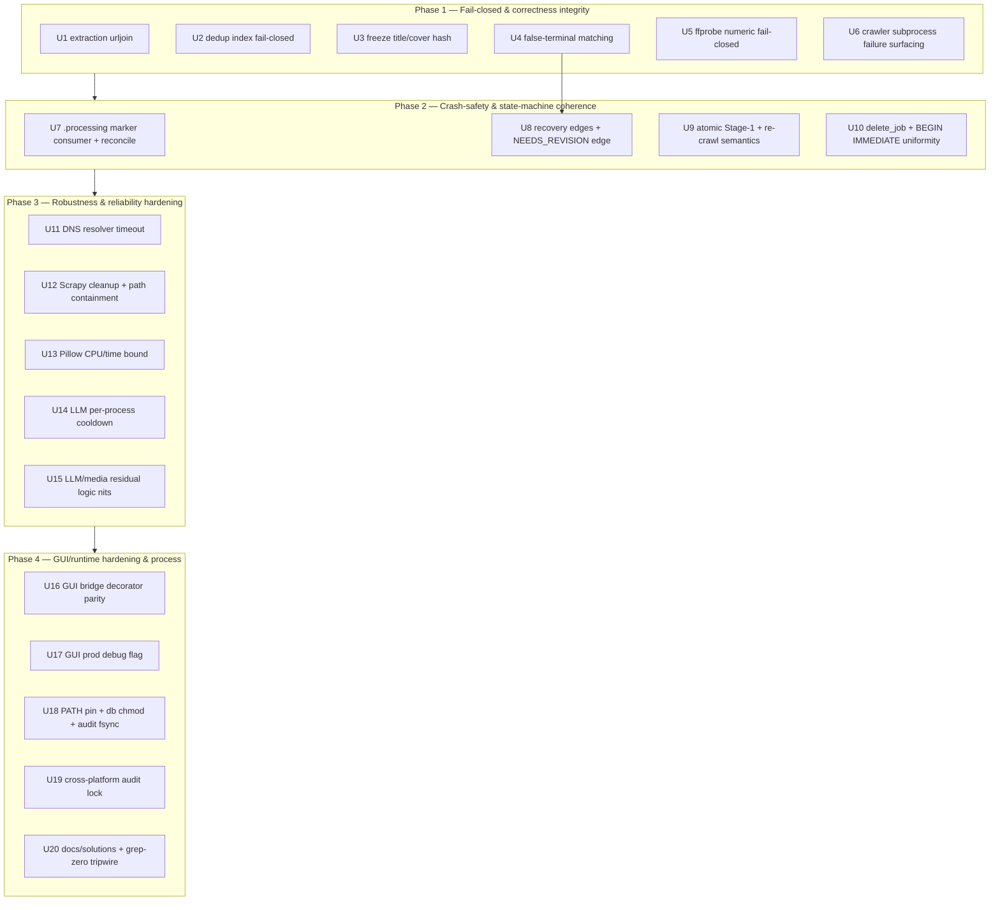

# fix: Stabilize and harden the lcp pipeline

## Overview

A 7-agent code review of `local-content-processor` (`lcp`) on a **fully green baseline**
(mypy clean over 60 files, 614 tests passing in ~14s) surfaced ~25 latent defects that the
test suite does not exercise. None break an existing test — they are the bugs that live in the
gaps: untrusted-input crashes, fail-closed gates that silently fail *open*, a freeze whose hash
binding is only half-enforced, false-terminal classifications that permanently dead-end
legitimate jobs, a `.processing` crash-marker with **no consumer**, and a layer of
subprocess / external-service / data-integrity fragility.

This plan fixes them in **four dependency-ordered phases**, from "breaks the documented
contract" down to "defense-in-depth + compounding the learnings." The operator chose
**comprehensive hardening** (all P0/P1 + all P2 + process), and chose to **add an operator
recovery edge** out of the terminal `BLOCKED`/`DUPLICATE` states (a deliberate change to a
load-bearing invariant — see Key Technical Decisions).

The goal is durable stability: every fix lands with an integration-level regression test
(per the PR #5 lesson that unit tests masked a real pipeline bug), and nothing weakens the
verified-clean security invariants.

## Problem Frame

The user asked: *"審查代碼並且修復 bug，讓這個項目穩定運作"* — review the code, fix bugs, make
the project run stably. The codebase is **not broken** in the CI sense; it is a compliance-first
local pipeline whose correctness depends on invariants (fail-closed gates, freeze immutability,
crash recovery, SSRF/PII guards) that are **asserted in docs and docstrings but only partially
enforced in code**. "Stable operation" here means closing the gap between the claimed contract
and the implemented behavior, and hardening the untrusted-input and external-process seams that
production will actually hit. The review found the bugs; this plan is the fix backlog, ordered
so the highest-integrity-risk items land first.

## Requirements Trace

Each requirement maps to one or more verified findings (severity in brackets). Findings marked
**[VERIFIED]** were re-read against the code by the planner; others are agent-reported with a
concrete reproduction and are to be confirmed test-first during implementation.

- **R1 [P0]** A single malformed media/link URL on an allowlisted page must not abort extraction
  of the whole page. *(extraction.py urljoin ValueError — VERIFIED)*
- **R2 [P1]** Every Stage-2 gate must fail **closed**: no untrusted/operator input may raise an
  exception that escapes the gate boundary and leaves the job silently at `CRAWLED`. *(dedup
  `load_site_index` JSONDecodeError/KeyError — VERIFIED)*
- **R3 [P1]** Approval must re-verify the frozen **title** (and decide cover) hash, not only the
  body — the audit must never attest a hash the reviewer did not see. *(signoff approve —
  VERIFIED)*
- **R4a [P1]** (prevention — U4) Innocuous content must not be driven into a terminal state by
  substring/empty-title false positives. *(risk redline substring; dedup empty-title collision)*
- **R4b [P1]** (recovery — U8) An operator must be able to recover a false-terminal job. *(operator
  recovery edge; see Key Technical Decisions for the compliance tradeoff)*
- **R5 [P1]** Untrusted ffprobe numeric fields (NaN/inf/negative/float-encoded) must route
  fail-closed, never silently pass a spec gate. *(ffprobe `_to_float`/`_to_int`; detect_* float())*
- **R6 [P1]** A crawler subprocess that crashes or exits non-zero must surface as a retriable
  failure, not a false success read off a stale/partial manifest. *(crawl_runner returncode;
  read_manifest corrupt)*
- **R7 [P1]** The `.processing` crash marker must have a real consumer: an interrupted job must be
  **detectable and recoverable** at startup, and the seam contract must match the code. *(marker
  has zero consumers — VERIFIED)*
- **R8 [P2]** The state machine's advertised edges must be reachable, and Stage-1 must persist
  `(state, hashes)` atomically with defined re-crawl semantics. *(`NEEDS_REVISION → PROCESSING`
  exists and is legal in `core/state.py` but is unreachable because `pipeline.process`'s entry guard
  rejects `NEEDS_REVISION` — the fix widens the guard; the edge is wired in `web/lex.js` and must be
  KEPT, not deleted. Plus: set_hashes/set_state torn write; re-crawl path)*
- **R9 [P2]** Persistent-data mutations (delete/erasure, hash writes) must be atomic and report
  truthfully. *(delete_job ordering; BEGIN IMMEDIATE uniformity)*
- **R10 [P2]** External/subprocess seams must not hang, leak, or accumulate orphans. *(DNS
  timeout; Scrapy cleanup + path containment; Pillow CPU bound; LLM cooldown)*
- **R11 [P2]** Residual correctness nits in the LLM/media adapters must be closed. *(NLI
  startswith; copywriter FAQ orphan; empty-quotes; partial cover; truncation parity; silence
  pairing)*
- **R12 [P2]** GUI/runtime hardening must be uniform. *(bridge decorator parity; prod debug flag;
  PATH pinning; db chmod; audit fsync; cross-platform lock)*
- **R13 [process]** Capture the recurring learnings (`docs/solutions/`) and add a grep-zero
  tripwire so the de-watermark cut and PII-free invariant cannot silently regress.

## Scope Boundaries

- **Non-goal: re-introducing any de-watermark / inpaint path.** It was deliberately CUT
  (2026-06-17, plan-003). `grep -rniE "dewatermark|inpaint|onnxruntime"` over `src/ pyproject.toml
  spikes/` must stay empty (tripwire excludes `tests/` and `docs/` to avoid self-tripping); the
  engine and its two-person attestation may only ever return *together*.
- **Non-goal: deleting the DNS-rebinding residual building blocks.** `net_guard.pinned_ip` /
  `revalidate_redirect()` are intentionally-kept, tested drop-in pieces for a future
  pinned-connection transport — they are **not** dead code (pii-inventory R40).
- **Non-goal: changing the SQLite connection model.** WAL is a one-time file-header property;
  `busy_timeout` is per-connection. Keep one-connection-per-call; do **not** add a connection pool
  or move WAL into `_connect`.
- **Non-goal: re-architecting the functional-core / imperative-shell split** or the two-tier mypy
  gate. All fixes respect the existing seams (decisions in `core/`, I/O in `adapters/`, wiring in
  `pipeline.py`, parity in both shells).
- **Non-goal: "cleaning up" honest limitations.** `BestEffortDeletionResult` /
  `cryptographic_erasure=False`, the swap-PII residual, and the accepted DNS-rebinding residual are
  documented truths, not bugs — do not paper over them.
- **Non-goal: tuning calibration thresholds** in `core/rules/*` (those are documented
  pending-corpus kwargs, not defects).

## Context & Research

### Relevant Code and Patterns

- **Functional core / imperative shell** (`src/lcp/core/` pure, `src/lcp/adapters/` I/O,
  `pipeline.py` wiring, `cli.py`/`gui.py` thin shells that mirror 1:1). Every fix follows this:
  pure judgement in `core/`, I/O in an adapter, operator actions exposed in **both** shells.
- **Gate signal convention:** a gate returns an outcome dataclass; `job_state is not None` means
  "parked, stop the chain." Hold states: risk→`BLOCKED`(terminal)/`NEEDS_HUMAN_REVIEW`;
  media→`NEEDS_REVISION`; dedup→`DUPLICATE`(terminal)/`NEEDS_HUMAN_REVIEW`; assemble→`NEEDS_REVISION`;
  lint+grounding→`NEEDS_HUMAN_REVIEW`/`NEEDS_REVISION`.
- **The persist seam:** gates land resting state only via
  `adapters/processor/_persist.py::persist_gate_state` → `JobStore.persist_from_processing`
  (`BEGIN IMMEDIATE` + `isolation_level=None`, validates `current→PROCESSING→target`, clears marker
  after commit). Never write `PROCESSING→target` directly.
- **Atomic-write pattern** (the model for any new writer): temp-in-same-dir + `fsync` + `chmod
  0600` on temp + `os.replace`, as in `draft_store.save_draft`, `review_packet._write_0600`,
  `config_io.update_llm_config_file`, `manifest._atomic_write`.
- **Error→exit-code contract** (`core/errors.py`): `UsageError`→1, `InputValidationError`→2,
  `DependencyError`→3, `ExternalServiceError`→4, anything else→5. A gate failing on bad input
  should surface as exit 2 (actionable), an external/transient failure as exit 4 (retriable), never
  exit 5 ("internal error") for a foreseeable condition.
- **Determinism at the boundary:** lower layers never call `datetime.now()`; shells mint `ts` via
  `adapters/clock.now()` and pass it down. Any new persisted-state call takes a caller-supplied `ts`.
- **Identity comparison** (`signoff._norm_actor`): NFKC + strip + casefold, never `==`.

### Institutional Learnings (from prior plans, PR review guides, pii-inventory)

- **PR #5's central lesson:** unit tests calling a leaf function masked a real pipeline bug (the
  cover was never watermarked in the *assembled* pipeline). **Therefore every fix here gets an
  integration-level test that drives `Pipeline.process` / `run_media_gate` end-to-end**, not just
  the leaf.
- **PR #8 / plan-004:** single-connection alone does *not* close the read→update race — explicit
  `BEGIN IMMEDIATE` + `isolation_level=None` does. Concurrency tests must be **barrier-driven,
  N-writer**; sequential tests cannot see contention.
- **mypy from `.venv`, never pyenv** (stale Pillow stubs → false positives). CI installs
  everything **except `gui`**, so `cli.py`/`gui.py` are a **mypy blind spot** — shell logic/config
  bugs (e.g. the historical `webview.start(host=...)` `TypeError`) must be caught by tests or grep,
  not the type gate.
- **`docs/solutions/` does not exist**; multiple plans re-derive the same gotchas. Plan-004
  deferred creating it. R13 closes this root cause.
- Verified-clean invariants the review confirmed (do **not** disturb): SSRF 4 live defenses
  including the per-media-URL `is_global` check; uniform output escaping + strict CSP + inert
  links; keyring-only triple-redacted secrets; tool-less LLM with dry-run short-circuit; hardened
  media subprocess (`start_new_session` + `killpg` + `-t` cap + missing-binary→`DependencyError`);
  no pipe-deadlock (`subprocess.run` capture / `communicate(timeout=)`); correct atomic-rename
  writers.

### External References

- None required. The defects are repo-internal logic/contract gaps; the fixes follow existing
  in-repo patterns. (Python stdlib `ipaddress`/`urllib.parse` bracketed-host validation behavior
  and `Path.relative_to` non-resolution of `..` are the only external facts, both confirmed by the
  reviewing agents against the actual stdlib.)

## Key Technical Decisions

- **Fail-closed means "catch and park," not "let it crash."** Where an untrusted/operator input can
  raise (extraction urljoin, dedup index parse, ffprobe numerics, manifest read), the fix catches at
  the gate boundary and routes to the *correct* resting state or exit code — never lets a raw
  `ValueError`/`JSONDecodeError`/`ValidationError` escape to exit 5. Rationale: the architecture's
  entire value proposition is that a gate parks a job for a human; an uncaught exception bypasses
  that.
- **Add an operator recovery edge `BLOCKED`/`DUPLICATE` → `SUPERSEDED`** (operator's explicit
  choice). This changes the CLAUDE.md "BLOCKED/DUPLICATE are terminal" invariant. Rationale: with
  false-terminal classifications now provably possible, an unrecoverable dead-end is the larger
  harm; `SUPERSEDED` already exists as the "abandon + re-review" sink. The edge is **operator-only**
  (a deliberate human action through `signoff`, mirrored in CLI+GUI), never automatic, so the
  fail-closed posture is preserved. The matching-logic fixes (R4a) still land first so the recovery
  edge is a safety net, not the primary remedy. **Load-bearing guardrails on this edge (all in U8):**
  (1) `SUPERSEDED` **stays terminal** — recovery never reopens the blocked job in place; the only way
  back into review is a brand-new job that re-enters at `NEW` and re-runs the full risk→…→grounding
  chain. A characterization test must assert `BLOCKED`/`DUPLICATE`/`SUPERSEDED` have **no** edge to
  `PROCESSING`/`CRAWLED`, so a future "reopen" edge fails the test (this is what prevents the edge from
  becoming a content-laundering path). (2) The recovery action must capture the **real** actor via
  `observed_os_user()` (as `approve`/`reject` do) — not the `actor="human"` literal default that
  `supersede` currently falls back to — and record the original `blocking_reasons` in the audit
  `extra`, so a redline-override is auditably distinguishable from a routine abandon. (3) **A
  redline-override requires a distinct second confirmation** (operator decision, 2026-06-18) — a
  separate CLI flag / GUI dialog and a distinct audit event, never the silent reuse of the ordinary
  abandon path. **Residual accepted by the operator (2026-06-18):** an operator can now supersede a
  *correctly* blocked redline job — the inverse of the false-positive case this edge exists to fix —
  accepted on the single-trusted-operator threat model, gated behind guardrail (3).
- **The `.processing` marker gets a real consumer.** A worklist reconciliation pass reads
  `is_processing()` and surfaces interrupted jobs (marker present at a non-PROCESSING resting state)
  as recoverable, rather than the marker being decorative. **The contract is already settled in
  code:** `job_store.persist_from_processing` (job_store.py:336-338) already implements *caller-owned*
  ("the marker is the CALLER's to set"); only `_persist.py`'s docstring and CLAUDE.md are stale in
  still claiming the method "requires the marker." So U7's contract work is to **fix those two
  docstrings to match the caller-owned reality — do NOT add a `is_processing` assertion inside
  `persist_from_processing`** (that would pull marker filesystem I/O back under the WAL write lock,
  violating the PR #8 constraint, and would break the legitimate `PROCESS_FAILED` retry path which
  re-enters without the original marker). The real new work is the *consumer*: something must read
  `is_processing()` at a lifecycle boundary (today nothing does).
- **Recovery from a crash must not loop.** A hard-crash interruption (the only thing that leaves a
  stale marker, since `process()` clears it in `finally`) is **not** equivalent to a transient
  `ExternalServiceError`. U7's reconciliation must therefore prefer **flagging the job for explicit
  operator re-process** over silent auto-transition; if it auto-transitions to `PROCESS_FAILED`, it
  must carry a **crash-attempt counter / max-retry guard** so a *deterministic* crash (e.g. the same
  Pillow OOM on a specific cover) surfaces to a human after N interruptions instead of looping
  retry→crash→retry forever.
- **Treat the 25 findings as a hypothesis, not a committed backlog.** Only **[VERIFIED]** findings
  were re-read against code. Every non-[VERIFIED] unit must **reproduce the bug against real code
  first** (test-first); if it does not reproduce, **drop the fix and record why** — unit scope and
  commit grouping may shrink as a result. This generalizes what U15 already states to all units.
- **Integration tests are scoped to the leaf-vs-pipeline gap, not blanket.** The PR #5 lesson is
  "a stub hid the bug," so the rule is: use the **real collaborator** where a stub previously masked
  the defect (real `urljoin` in U1, real malformed JSONL in U2, real probe parse in U5). A full
  `Pipeline.process` drive is required only where the gap is genuinely cross-layer. **Reserve the
  expensive categories — real Scrapy subprocess (U6/U12) and barrier-driven N-writer SQLite (U9/U10)
  — for those units, and budget their CI runtime/flakiness explicitly** (the suite is ~14s today
  precisely because most tests are leaf-level; do not let integration tests erode that).
- **Stage-1 persists `(state, hashes)` atomically.** Collapse the two-commit `set_hashes` +
  `set_state` into one `BEGIN IMMEDIATE` transition so a crawled job can never exist with mismatched
  state/hashes. Re-crawl of an existing non-terminal job refuses *before* any mutation.
- **Right-size each unit to an atomic commit.** Clustered nits that share a file/concern (the LLM/
  media residual bugs) land as one unit with per-fix test scenarios; cross-cutting changes (marker
  consumer, recovery edge) are their own units. Where a unit bundles genuinely independent concerns
  (U18's three runtime-hardening items), it may split into separate commits — note which item is the
  lowest-value if scope needs trimming.

## Open Questions

### Resolved During Planning

- *Does the GUI bypass `apply_hardening()`?* **No** (one data-integrity finding claimed a P0 here).
  VERIFIED: `lcp = lcp.cli:main` is the sole entry point; `cli.main()` calls `apply_hardening()`
  first (`cli.py:477`) and the GUI is reached only via the `gui` subcommand. Demoted to a P2
  defense-in-depth item (explicit `chmod 0600` on `lcp.db`, which already lands `0600` under the
  `0o077` umask).
- *Scope and depth?* Comprehensive (all P0/P1/P2 + process), per operator.
- *How to treat false-terminal jobs?* Fix matching **and** add an operator recovery edge, per
  operator.
- *The `.processing` marker contract (assert vs caller-owned)?* **Settled in code already**:
  `persist_from_processing` implements caller-owned; only `_persist.py`/CLAUDE.md docstrings are
  stale. U7 fixes the docstrings; it does **not** add a marker assertion (would re-pull marker I/O
  under the WAL lock and break the `PROCESS_FAILED` retry path). See Key Technical Decisions.
- *Cover hash on approve — re-verify or soften docstrings?* **Re-verify** (the safe, contract-honest
  choice): re-hash the review-dir `cover.jpg` against the frozen `cover_sha256` and refuse on
  mismatch, exactly like title/body. Only if cover re-hash proves infeasible, fall back to softening
  the docstrings **and** stop emitting `bound_cover_sha256` so the audit never attests an unverified
  hash. U3 owns this.

### Deferred to Implementation

- **Where the U7 reconciliation seam attaches.** `cli.main()` has no shared pre-dispatch hook (it
  dispatches independent Click subcommands), and `gui.launch()` builds `Api` then calls
  `webview.start()`. Candidate seams (decide before implementing, keep CLI/GUI 1:1): a
  `Pipeline.reconcile()` called from the **worklist entry points** (CLI `list_cmd`/batch summary, GUI
  `dashboard_stats`/worklist Api method), **or** a dedicated `lcp recover` command + GUI button. U7
  owns this.
- **U6 stale-manifest strategy.** Prefer **clear the job's manifest (and `raw/`) before spawn**
  (crawl_runner-local, no schema change) over invocation-id stamping (which needs a new `manifest.py`
  schema field + pydantic acceptance). Pick before implementing so U6 and U12 (which also clears
  `raw/`) don't diverge. Also confirm whether **concurrent crawls** are possible — if so, the
  clear-before-spawn must be per-job temp-dir + atomic-rename, not in-place (the in-place clear is a
  race under concurrency).
- **Whether `NEEDS_REVISION → PROCESSING` re-run-in-place is actually needed** vs. removing the edge.
  The smaller change is to widen the `process` entry guard (the edge is already wired in `web/lex.js`);
  removing the edge is wrong (it is live, not dead). Confirm an operator flow needs it; default to
  widening the guard. U8/U9.
- **Plan-004's required "marker-touch-failure rollback" test** — confirm whether it already exists
  in `tests/test_job_store.py`; if absent, add it in U7/U10.
- **The media-gate `DependencyError` (no ffmpeg) exit code** — confirm it maps to exit 3
  (`EXIT_DEPENDENCY`) and not exit 5, and that the job rests sensibly; trace during U5/U6.
- Exact helper/method names, final SQL, and whether re-crawl gets a new legal edge vs. an early
  refuse — settle against real code in U9.
- **U4 ambiguous-redline tier** — which exact redline categories get the `confident=False` downgrade
  treatment, and who authors the detector change that emits the unsure flag? The operator-approved
  keyword set defines this tier; it is not the implementing agent's call. U4.
- **U7 crash-attempt counter home** — per-job-dir counter file (recommended; no schema change) vs. a
  `jobs.interrupt_count` column (must be added to U20's PII-free allow-set + Operational Notes). U7/U20.
- **U8 recovery seam shape** — extend `supersede`'s signature (override flag + actor) vs. a dedicated
  `recover()` function; and where `blocking_reasons` are sourced at recovery (prior `RISK_GATE` audit
  event vs. category-codes-only, since they are not persisted in the jobs table). U8.
- **U8 DUPLICATE recovery scope** — accept that non-empty-title false DUPLICATEs require full re-crawl
  via terminal `SUPERSEDED`, or scope a lighter recovery (operator-forced → human review)? U8.

## High-Level Technical Design

> *This illustrates the intended approach and is directional guidance for review, not implementation
> specification. The implementing agent should treat it as context, not code to reproduce.*

**Phase dependency graph** (phases are sequential; units within a phase are largely parallel):



**The fail-closed boundary the plan repairs** (Stage 2): every gate must convert a raw exception
into either a parked resting state or a typed `LcpError` with the right exit code, before it can
escape `process()` (whose `except` only catches `ExternalServiceError` today):

```
crawl/ingest ─▶ risk ─▶ media ─▶ dedup ─▶ assemble(LLM) ─▶ lint+grounding ─▶ PROCESSED
                 │        │        │           │                  │
              BLOCKED   NEEDS_   DUPLICATE   NEEDS_           NEEDS_HUMAN_REVIEW
            (+recovery) REVISION (+recovery) REVISION         / NEEDS_REVISION
                 ▲        ▲        ▲           ▲                  ▲
        any raw exception here today can escape past `except ExternalServiceError`
        → job stuck at CRAWLED, exit 5.  R1/R2/R5/R6 close these leaks.
```

## Implementation Units

### Phase 1 — Fail-closed & correctness integrity (P0/P1)

- [ ] **Unit 1: Harden URL extraction against malformed URLs (P0)**

**Goal:** A malformed media/link URL on an allowlisted page is dropped, not allowed to abort the
whole page's extraction.

**Requirements:** R1

**Dependencies:** None

**Files:**
- Modify: `src/lcp/core/rules/extraction.py` (the three `response.urljoin(...)` call sites, ~lines 65–73)
- Test: `tests/rules/test_extraction.py`

**Approach:**
- Wrap each `response.urljoin(src)` (img, video, `a` href) so a `ValueError` from stdlib
  `urlsplit`/`ip_address` (malformed bracketed IPv6 host, e.g. `http://[::bad::]/x.jpg`) drops that
  one URL — routed like an SSRF-unsafe URL into `rejected_media_urls` (or skipped) — instead of
  propagating out of `extract_content` and collapsing the bundle to empty → `CRAWL_FAILED`.
- Keep the SSRF `is_media_url_safe` check exactly as-is; this only guards the URL-join step that
  runs *before* it.

**Patterns to follow:** the existing `_accept` → `rejected_media_urls` drop path in the same file.

**Test scenarios:**
- Happy path: a page with valid img/video/`a` URLs extracts all of them (unchanged behavior).
- Error path (the fix): a page whose HTML contains `` alongside a
  valid title/body and a valid image → extraction returns the real title/body and the valid image;
  the malformed URL is dropped/recorded, the page is **not** `CRAWL_FAILED`.
- Edge case: malformed `a` href and malformed `video` src each, independently, do not abort.
- **Critical:** the test must call the **real** `urllib`/`urljoin` (today's fixture stubs `urljoin`
  as a passthrough at `test_extraction.py:34`, which is exactly why the crash class is invisible).

**Verification:** A page with one garbage bracketed-host URL still produces a non-empty bundle with
its valid content; no `ValueError` escapes `extract_content`.

---

- [ ] **Unit 2: Make the dedup gate fail closed on a malformed site index (P1)**

**Goal:** A malformed or partial `site_index.jsonl` line parks the job for a human (or fails with an
actionable input error), never crashes the run to exit 5.

**Requirements:** R2

**Dependencies:** None

**Files:**
- Modify: `src/lcp/adapters/processor/dedup_checker.py` (`load_site_index`, ~lines 67–90)
- Test: `tests/processor/test_dedup_index.py`

**Approach:**
- `json.loads(raw)` and `obj["job_id"]` currently run with no guard; a stray non-JSON line, a
  half-written line, a BOM, or a record missing `job_id` raises `JSONDecodeError`/`KeyError` that
  escapes the fail-closed boundary (`pipeline.process` only catches `ExternalServiceError`).
- Decide the fail-closed shape: either (a) treat an unparseable index as untrustworthy
  (`site_index_available=False`, so the pure layer downgrades unique→uncertain → human review), or
  (b) raise `InputValidationError` (exit 2, actionable). Prefer (a) to match the existing
  missing-file semantics (R36 fail-loud), with the parse failure recorded.
- **Blast radius:** the site index is a *shared* artifact — option (a) means one bad/half-written
  line degrades **every** subsequent job's dedup to human-review until the index is repaired, not
  just one job. Decide whether to **quarantine only the offending line** (skip it, keep the rest of
  the index trustworthy) vs. mark the whole index untrustworthy. Per-line quarantine is the
  fleet-friendly default; record the skipped line so the operator can repair it.

**Patterns to follow:** the existing missing-file branch returning
`DedupIndex(site_index_available=False)`; the `InputValidationError`→exit 2 contract.

**Test scenarios:**
- Error path: a `site_index.jsonl` with one junk line (`{not json`) → gate does not raise; job
  routes to `NEEDS_HUMAN_REVIEW` (or a clean exit 2), never exit 5 / stuck `CRAWLED`.
- Error path: a well-formed JSON line missing `job_id` → handled the same way (no `KeyError`).
- Edge case: trailing blank line / BOM tolerated.
- Happy path + integration: a valid index still yields correct UNIQUE/DUPLICATE/UNCERTAIN, driven
  through `Pipeline.process` so the boundary behavior is proven, not just `load_site_index`.

**Verification:** `Pipeline.process` on a job with a corrupt index ends in a parked state or exit 2,
and the job is never left at `CRAWLED` with an "internal error."

---

- [ ] **Unit 3: Re-verify the frozen title (and cover) hash on approve (P1)**

**Goal:** Approval refuses if the draft's title (or cover) changed after freeze; the audit can never
attest a title/cover the reviewer did not sign off on.

**Requirements:** R3

**Dependencies:** None

**Files:**
- Modify: `src/lcp/adapters/publisher/signoff.py` (`approve`, ~lines 173–233)
- Test: `tests/publisher/test_signoff.py`

**Approach:**
- Today only `compute_body_sha256(draft)` is recomputed and compared; `title_sha`/`cover_sha` are
  read from the freeze, validated present, then re-stamped into the audit (`bound_title_sha256`/
  `bound_cover_sha256`) **without re-derivation**. Recompute the current draft's title hash and
  compare to the frozen value; refuse with `InputValidationError` on mismatch, exactly like the body
  path. **There is no `compute_title_sha256` helper** — the freeze derives the title hash as
  `_sha256_text(draft.title or "")` (`review_packet.py:232`), so `approve` must use that **exact**
  expression (including the `or ""`) or a `None` title produces a false mismatch. Add a
  `compute_title_sha256` helper or reuse `_sha256_text` directly.
- **Cover: re-verify (do not just soften docstrings).** Re-hash the review-dir `cover.jpg`
  (`_sha256_file(review_dir / "cover.jpg")`) against the frozen `cover_sha256` and refuse on
  mismatch — the cover file is copied into the review dir at freeze, so the input exists. Only if
  cover re-hash proves infeasible, fall back to softening the docstrings **and** stop emitting
  `bound_cover_sha256` so the audit never attests a hash the approval did not re-verify.

**Patterns to follow:** the existing body-hash binding (`approve` lines 194–202); `_sha256_text`
(`review_packet.py:232` for the exact title-hash input); `_sha256_file` for the cover.

**Test scenarios:**
- Error path: freeze a packet, edit the persisted draft's **title only**, call `approve` → refused
  (mismatch), state unchanged, no `APPROVED` audit event.
- Error path (cover, if re-verified): replace the review-dir `cover.jpg` post-freeze → `approve`
  refused.
- Happy path: unmodified draft approves; audit records the (now genuinely re-verified) hashes.
- Edge case: missing/None title hash in a malformed freeze still fails closed (existing behavior
  preserved).

**Verification:** A title-only edit between freeze and approve is detected and blocks approval; the
body-tamper test still passes.

---

- [ ] **Unit 4: Stop false-terminal classifications at the matching layer (P1)**

**Goal:** Innocuous content is no longer driven into `BLOCKED`/`DUPLICATE` by substring or
empty-title false positives.

**Requirements:** R4a

**Dependencies:** None

**Files:**
- Modify: `src/lcp/core/rules/risk_rules.py` (`KeywordRiskDetector.detect`, ~line 237)
- Modify: `src/lcp/core/rules/dedup_rules.py` (`assess_dedup` stage-1 title-hash, ~lines 265–275)
- Test: `tests/rules/test_risk_rules.py`, `tests/rules/test_dedup_rules.py`

**Approach:**
- Risk: the bare `if w.lower() in haystack` substring test flags '童' inside '童話/兒童/童年' and
  '政治' inside '政治大學'. Note these are *standalone* redline tokens, not substrings of a longer real
  keyword — so anchoring them inherently **trades redline recall for precision**
  (operator-confirmed 2026-06-18: proceed with anchoring under the two guardrails below). Two
  mandatory guardrails make this safe rather than a silent under-block:
  - **Downgrade, don't clear — and this needs a gate-layer change, not just narrower matching.**
    A case that previously hit a bare-substring redline and now no longer matches the anchored form
    must route to **`NEEDS_HUMAN_REVIEW`**, never silently PASS. **Critical mechanism:** `assess_risk`
    maps *any* redline-category flag unconditionally to `BLOCKED`, and **if the anchored keyword
    simply fails to match, `detect` appends no flag at all → `assess_risk` falls through to `PASS`**.
    So narrowing the match alone yields "still BLOCKED" or "silently PASS" — the downgrade is NOT
    reachable by anchoring alone. To make it real: when the *bare token is present but the anchored
    collocation is absent*, the detector must emit a **low-confidence `RiskFlag(category, …,
    confident=False)`** (or a new "ambiguous redline" tier) so `assess_risk`'s existing
    unsure→`NEEDS_HUMAN_REVIEW` branch fires. Add a test asserting the de-anchored case yields
    `NEEDS_HUMAN_REVIEW`, not `PASS`. The operator-approved list (below) must also state which
    categories get this `confident=False` treatment.
  - **Operator owns the keyword set.** The exact keyword→anchored-collocation mapping is an
    **operator-approved enumerated list** recorded here *before* implementation (mirroring how the
    recovery edge was an explicit operator choice) — it is **not** the implementing agent's "policy
    judgement" to pick, because narrowing redline coverage on an NCII/minor/political pipeline is a
    compliance-posture decision reserved for the human.
- Dedup: when `normalize_title(...)` is empty (emoji-only / punctuation-only / all-stopword), skip
  the stage-1 title-hash match entirely and fall through to the body MinHash/Jaccard stage. An empty
  normalized title is not duplication evidence. **Confirm the layer:** stage-1 calls `title_hash(title)`
  directly (`dedup_rules.py:265`) — verify whether normalization lives inside `title_hash` or a
  separate `normalize_title`, and insert the empty-check at the right layer.

**Patterns to follow:** existing `normalize_title`/`title_hash` and the stage-1/stage-2 structure in
`dedup_rules`; the keyword lists in `risk_rules` (described in code as "CALIBRATION PENDING").

**Test scenarios:**
- Risk error path: '童話故事改編的新電影', '兒童樂園週年慶', '我的童年回憶', '政治大學校友會' →
  **not** `BLOCKED` (and, where the anchored form no longer matches, → `NEEDS_HUMAN_REVIEW`, not PASS).
- Risk happy path: text genuinely containing the dangerous phrase still → `BLOCKED` (no regression).
- Risk false-negative guard: an adversarially-phrased dangerous case that the *anchored* form might
  miss (e.g. a charged '政治'/'兒少' collocation outside the enumerated list) is checked to route at
  least to `NEEDS_HUMAN_REVIEW` — the recall loss never reaches PASS.
- Dedup error path: two unrelated articles whose titles both normalize to '' (e.g. '🎉🎉' vs '!!!')
  with different bodies → **not** `DUPLICATE` (falls through to body comparison).
- Dedup happy path: real title-hash and body collisions still → `DUPLICATE`/`UNCERTAIN`.
- Edge: a near-empty title with one real token still hashes normally.

**Verification:** the four innocent-superstring titles classify as non-terminal; no anchored-keyword
change routes a previously-blocked case to PASS (worst case is `NEEDS_HUMAN_REVIEW`); empty-title
pairs with distinct bodies are not duplicates; existing true-positive tests stay green.

---

- [ ] **Unit 5: Fail closed on untrusted ffprobe numerics (P1)**

**Goal:** NaN/inf/negative/float-encoded probe fields route fail-closed (needs-revision / unknown),
never silently pass a spec gate.

**Requirements:** R5

**Dependencies:** None

**Files:**
- Modify: `src/lcp/adapters/media/ffprobe.py` (`_to_float` ~284, `_to_int` ~294; `detect_black_segments`
  ~231, `detect_silence` ~273)
- Modify: `src/lcp/core/rules/asset_rules.py` (`judge_video`/`is_blurry`/`judge_black_segments` guards)
- Test: `tests/media/` (ffprobe parse tests), `tests/rules/test_asset_rules.py`

**Approach:**
- `_to_float`: reject non-finite and non-positive (`if not math.isfinite(f) or f <= 0: return None`)
  so a NaN bitrate/duration can't pass `nan < min` as `False`.
- `_to_int`: tolerate float-encoded ints (`int(float(value))`) so a valid `width="1920.0"` is not
  mis-read as unknown.
- `detect_black_segments` / `detect_silence`: route their `float(m.group(...))` through the same
  defensive helper, skipping an interval whose start/end fails to parse (a malformed-but-regex-
  matching stderr line like `black_start:1.2.3` must not crash the gate).
- `asset_rules`: guard `is_blurry`/`judge_video` against non-finite inputs so an unmeasurable metric
  → needs-revision (fail-closed), not a silent pass.

**Patterns to follow:** `probe()` already routes numerics through `_to_float`/`_to_int` defensively —
extend the same discipline to the `detect_*` functions and the rules layer.

**Test scenarios:**
- Error path: probe JSON with `bit_rate="nan"` → video routes needs-revision, not pass.
- Error path: negative `duration` → unknown-duration branch, not a mis-route that hides black frames.
- Edge: `width="1920.0"` → parsed as 1920 (valid), not unknown.
- Error path: `black_start:1.2.3` stderr line → that interval skipped, gate does not raise.
- Happy path: clean integer/float probe values unchanged.

**Verification:** crafted non-finite/negative/float-encoded fields all route to a fail-closed
outcome; no `ValueError` escapes the media gate.

---

- [ ] **Unit 6: Surface crawler subprocess failures as retriable (P1)**

**Goal:** A Scrapy subprocess that exits non-zero, crashes outside `LcpError`, or leaves a
stale/partial/corrupt manifest is reported as a retriable `PROCESS_FAILED`/`ExternalServiceError`,
never a false success.

**Requirements:** R6

**Dependencies:** None

**Files:**
- Modify: `src/lcp/adapters/crawler/crawl_runner.py` (~lines 122–137: returncode handling)
- Modify: `src/lcp/adapters/crawler/scrapy_impl.py` (~line 378: broaden the child's top-level except)
- Modify: `src/lcp/adapters/storage/manifest.py` (`read_manifest`, ~lines 58–62: error handling)
- Test: `tests/test_crawl_runner.py`, `tests/test_manifest_idempotency.py` (or a new manifest read test)

**Approach:**
- Parent: check `proc.returncode` explicitly before trusting `read_manifest()`; a non-zero rc raises
  `ExternalServiceError` (→ retriable) regardless of manifest presence. Defend against a stale
  manifest from a prior run being mistaken for this run's output by **clearing the job's manifest
  (and `raw/`) before spawn** — chosen over invocation-id stamping, which would need a new
  `manifest.py` schema field and pydantic acceptance. (Coordinate with U12, which also clears `raw/`,
  so the two don't diverge. If concurrent crawls of the same job are possible, the clear must be a
  per-job temp-dir + atomic-rename, not in-place — see Open Questions.)
- Child (`scrapy_impl.main`): wrap the body in a broad `except` (with `# noqa: BLE001`, matching the
  repo's deliberate boundary excepts) that prints a JSON error and returns a non-zero exit, so an
  unexpected `ReactorNotRestartable`/`MemoryError`/segfault becomes a clean retriable failure rather
  than a silent traceback.
- `read_manifest`: wrap read+validate; map `OSError`/`JSONDecodeError`/pydantic `ValidationError` to a
  typed failure so a SIGKILL-truncated/corrupt manifest → retriable, not an uncaught crash.

**Patterns to follow:** the existing `ExternalServiceError`→`PROCESS_FAILED` mapping in
`pipeline.process`; the repo's `# noqa: BLE001` boundary-except convention.

**Test scenarios:**
- Error path: subprocess returns non-zero **with** a leftover/stale manifest present → run raises
  `ExternalServiceError` (job → `PROCESS_FAILED`), not success.
- Error path: `read_manifest` on a truncated/garbage `manifest.json` → typed retriable failure, not
  a raw `ValidationError`.
- Error path: child raises a non-`LcpError` → parent sees non-zero exit and maps to retriable.
- Happy path: clean crawl with fresh manifest succeeds (unchanged).
- Edge: re-run after a failed crawl does not mistake the prior partial manifest for success.

**Verification:** a simulated non-zero exit / corrupt manifest parks the job retriable; CI suite
green.

### Phase 2 — Crash-safety & state-machine coherence (P1/P2)

- [ ] **Unit 7: Give the `.processing` marker a real consumer + align the contract (P1)**

**Goal:** An interrupted job (marker present at a non-PROCESSING resting state) is detectable and
recoverable at startup; the seam contract matches the code.

**Requirements:** R7

**Dependencies:** None (but coordinates with U9/U10 on `job_store`)

**Files:**
- Modify: `src/lcp/pipeline.py` (add a `reconcile()` entry point that reads `is_processing()`)
- Modify: `src/lcp/adapters/storage/job_store.py` (the `is_processing` consumer wiring; **no** change
  to `persist_from_processing` behavior)
- Modify: `src/lcp/cli.py` and `src/lcp/gui.py` (surface "interrupted" — 1:1 parity)
- Modify: `src/lcp/adapters/processor/_persist.py` (docstring only) and `CLAUDE.md` (contract wording)
- Test: `tests/test_pipeline_batch.py`, `tests/test_job_store.py`

**Approach:**
- **Attach the consumer at a concrete seam.** There is no shared pre-dispatch hook (`cli.main()`
  dispatches independent Click subcommands; `gui.launch()` builds `Api` then calls `webview.start()`).
  Add a `Pipeline.reconcile()` and call it from the **worklist entry points** — CLI `list_cmd`/batch
  summary and GUI `dashboard_stats`/the worklist Api method — **or** add a dedicated `lcp recover`
  command + GUI button. Pick before implementing; keep CLI/GUI 1:1. The key invariant: **something
  reads `is_processing()` at a lifecycle boundary** (today nothing does — confirmed zero consumers in
  `src/`).
- It scans persisted `CRAWLED`/`CRAWLED_WARN`/`PROCESS_FAILED` jobs for a `.processing` marker and
  surfaces them as "interrupted." **Prefer flagging for explicit operator re-process** over silent
  auto-transition. If it auto-transitions to `PROCESS_FAILED`, it must carry a **crash-attempt
  counter / max-retry guard** — a hard-crash interruption is NOT a transient `ExternalServiceError`,
  and a *deterministic* crash (same input always crashes) must surface to a human after N attempts
  rather than looping retry→crash→retry forever.
- **Where the counter lives (decide before implementing):** the jobs table has only its 8 PII-free
  columns and the `.processing` marker is presence-only — neither holds a count. **Recommended: a
  per-job-dir counter file** (e.g. `.interrupt_count`, written with the atomic-write discipline, no
  PII) — this needs **no** jobs-schema change and so does not collide with U20's PII-free-schema
  tripwire. If instead a `jobs.interrupt_count INTEGER` column is preferred, it **must** be added to
  U20's PII-free allow-set and recorded in Documentation/Operational Notes + pii-inventory (a schema
  change the plan otherwise says is "none planned"). **Cross-reference: U7 and U20 must land the
  chosen home and the tripwire allow-set together.**
- **Contract is already caller-owned in code** (`persist_from_processing` job_store.py:336-338);
  only `_persist.py`'s docstring and CLAUDE.md are stale. Fix **those docstrings** to match — do
  **not** add an `is_processing` assertion inside `persist_from_processing` (it would pull marker I/O
  back under the WAL write lock, violating the PR #8 constraint, and break the legitimate
  `PROCESS_FAILED` retry path that re-enters without the original marker).
- A stale marker found at a **terminal** resting state (e.g. `BLOCKED` + marker, from a crash between
  `COMMIT` and `clear_processing`) must only have its marker cleared — reconciliation never reopens a
  terminal job.
- Confirm/add the plan-004 "marker-touch-failure rollback" test if missing.

**Execution note:** Characterization-first — add a crash-recovery harness test (marker left set, job
at `CRAWLED`) before changing behavior, since this path has no existing coverage.

**Patterns to follow:** `mark_processing`/`clear_processing`/`is_processing` in `job_store.py`; the
`persist_from_processing` transaction discipline.

**Test scenarios:**
- Integration: simulate a crash mid-Stage-2 (marker set, job at `CRAWLED`) → reconciliation detects
  it and surfaces/recovers it (asserts the chosen behavior).
- Edge: a healthy `CRAWLED` job with no marker is untouched by reconciliation.
- Edge: crash between `COMMIT` and `clear_processing` (resting state e.g. `BLOCKED` + stale marker) →
  reconciliation clears/flags without corrupting the resting state.
- Contract: `_persist.py`/CLAUDE.md docstrings no longer claim `persist_from_processing` "requires
  the marker" (they now match the caller-owned code); `persist_from_processing` behavior is unchanged.
- Loop guard: a job that is interrupted repeatedly (deterministic crash) surfaces to the operator
  after N attempts instead of auto-retrying forever.

**Verification:** `is_processing()` has a real caller at the worklist seam; an interrupted job is
visible to the operator and recoverable; a terminal-state stale marker is only cleared (never
reopened); docs and code agree.

---

- [ ] **Unit 8: Operator recovery edges + reachable NEEDS_REVISION edge (P1/P2)**

**Goal:** A false-terminal `BLOCKED`/`DUPLICATE` job can be recovered by an operator; the
`NEEDS_REVISION → PROCESSING` edge (which exists but is unreachable through the entry guard) becomes
reachable.

**Requirements:** R4b, R8

**Dependencies:** U4 (matching fix lands first; this edge is the safety net)

**Files:**
- Modify: `src/lcp/core/state.py` (add operator-only `BLOCKED`/`DUPLICATE` → `SUPERSEDED` edges; move
  `BLOCKED`/`DUPLICATE` out of `TERMINAL_STATES`; **keep** the existing `NEEDS_REVISION → PROCESSING`
  edge — do not delete it)
- Modify: `src/lcp/pipeline.py` (`process` entry guard, ~line 232 — widen to accept `NEEDS_REVISION`)
- Modify: `src/lcp/adapters/publisher/signoff.py` (the operator recovery action; **add
  `JobState.BLOCKED` and `JobState.DUPLICATE` to the `_SUPERSEDABLE` frozenset at lines 68–75** — the
  state-table edge alone is not enough; `supersede` independently refuses any source state not in
  `_SUPERSEDABLE`; capture the real actor)
- Modify: `src/lcp/adapters/storage/audit_log.py` (declare a new `EVENT_REDLINE_OVERRIDE` constant
  alongside `EVENT_SUPERSEDED`, so the redline-override is distinguishable **by event type**, not just
  an `extra` tag)
- Modify: `src/lcp/cli.py` and `src/lcp/gui.py` (expose the recovery action in **both** shells, 1:1)
- Modify: `src/lcp/web/lex.js` (give `'blocked'`/`'duplicate'` a recovery action in `STATE_ACTIONS`
  — today both are `[]` → zero buttons) and `src/lcp/web/app.js` (the redline recovery needs a
  **dedicated dialog**, not the plain single-step `supersedeRow()` / `confirm:true`)
- Test: `tests/test_state_machine.py`, `tests/publisher/test_signoff.py`, `tests/test_gui_api.py`

**Approach:**
- Add `BLOCKED → SUPERSEDED` and `DUPLICATE → SUPERSEDED` as **operator-only** transitions (never
  automatic), and add both source states to `signoff._SUPERSEDABLE`. Route through `signoff`/the
  persist seam with an audit event.
- **Actor attribution + signoff seam.** The recovery action must capture the real actor via
  `observed_os_user()` (as `approve`/`reject` do) — `supersede` currently defaults to the literal
  `actor="human"`. `supersede`'s current signature `(job_id, *, store, audit, ts, new_job_id=None,
  actor="human")` has no actor/confirm/reason params, so **decide (deferred): extend `supersede` with
  the override flag + actor, or add a dedicated `recover()` function.** Also: `supersede`
  unconditionally emits `EVENT_SIGNOFF_INVALIDATED` ("void the old sign-off") — a `BLOCKED`/`DUPLICATE`
  job was **never** signed off, so that event must be **skipped** for recovery (it would be a false
  audit statement).
- **`blocking_reasons` provenance + form.** They live transiently on `RiskResult.flags`
  (`risk_rules.py`) and are **not persisted** in the jobs table, so recovery must source them from the
  prior `RISK_GATE` audit event (or accept that only the category codes are recoverable). Record them
  as **`RiskCategory` enum codes only** (like `ReviewReason`), never the free-text `RiskFlag.reason`
  (which could carry a matched snippet) — this keeps the audit PII-free and lets U20's tripwire assert
  "known enum codes only." (Cross-reference U20: adding the `blocking_reasons` key couples to the
  PII-free allow-set.)
- **Redline-override requires a distinct second confirmation** (operator decision, 2026-06-18).
  Recovering a `BLOCKED` (redline) job is a separate, heavier action than a routine abandon: it
  requires an **explicit second confirmation** — a **flag-only CLI design** (`--redline-override`,
  mirroring the `--attest` pattern; **no interactive prompt**, which would hang on piped/scripted
  stdin) and a distinct **GUI dialog** — and emits a **distinct audit event type**
  (`EVENT_REDLINE_OVERRIDE`, carrying the `blocking_reasons` codes), never silently reusing
  `EVENT_SUPERSEDED`/the ordinary abandon path. `DUPLICATE → SUPERSEDED` (not a redline state) keeps
  the ordinary single-step confirmation.
- **SUPERSEDED stays terminal.** Recovery never reopens the blocked job in place; the only way back
  into review is a brand-new job that re-enters at `NEW` and re-runs the full risk→…→grounding chain.
  This is what stops the edge from becoming a content-laundering path.
- **DUPLICATE recovery is asymmetric to BLOCKED — acknowledge it.** U4's primary remedy only covers
  the *empty-normalized-title* false DUPLICATE; other false-DUPLICATE classes (a real title-hash
  collision, or a MinHash/Jaccard near-duplicate that is actually distinct content) have **no**
  primary remedy, so the operator's only recourse is the terminal `SUPERSEDED` → discard + re-crawl
  (losing the already-assembled work). Accept this (re-crawl is the workflow) **or** scope a lighter
  DUPLICATE recovery (operator-forced → human review) — deferred decision, see Open Questions.
- `NEEDS_REVISION → PROCESSING`: **widen the `process` entry guard** to accept `NEEDS_REVISION` (the
  persist seam already validates `NEEDS_REVISION → PROCESSING → target`; the edge is wired in
  `web/lex.js`). Do **not** remove the edge — it is live, not dead.
- Update CLAUDE.md's "BLOCKED/DUPLICATE are terminal" wording to record the deliberate operator-only
  exception.

**Patterns to follow:** the existing `SUPERSEDED` sink, `supersede` flow, and `_SUPERSEDABLE` gate;
`approve`/`reject`'s `observed_os_user()` capture; the entry-guard list in `process`; the
`_TRANSITIONS` table structure.

**Test scenarios:**
- State machine: `is_legal_transition(BLOCKED, SUPERSEDED)` and `(DUPLICATE, SUPERSEDED)` are now True
  (operator-only); no *automatic* path in `_process_inner`/`pipeline` reaches them.
- State machine (anti-laundering): assert `BLOCKED`/`DUPLICATE` have an **exact** successor set of
  `{SUPERSEDED}` (not merely "no edge to PROCESSING/CRAWLED"), and `SUPERSEDED` stays `{}` — so a
  future stray edge to *any* other state is caught.
- State machine (coverage reconciliation): moving `BLOCKED`/`DUPLICATE` out of `TERMINAL_STATES`
  means the existing `test_terminal_states_have_no_exits` and `test_every_non_terminal_state_has_exit_edge`
  (`tests/test_state_machine.py:65,72`) **stop covering** the "no other exits" property for them —
  explicitly update those two tests so the anti-laundering exact-successor assertion above replaces
  the coverage their `TERMINAL_STATES` membership used to provide.
- State machine: full transition-table characterization test updated (state → exact successor set),
  including freeze edge `REVIEW_PENDING → PROCESSING` still **absent**, and `TERMINAL_STATES` updated.
- Integration: an operator recovers a (false) `BLOCKED` job → `SUPERSEDED`; the audit records the
  **observed OS user** (not `"human"`) and the original `blocking_reasons`.
- Error path (redline-override second confirm): a `BLOCKED → SUPERSEDED` attempt **without** the
  `--redline-override` flag (CLI) / dialog (GUI) is refused; with it, the audit records a distinct
  `EVENT_REDLINE_OVERRIDE` (a separate event **type**, not `EVENT_SUPERSEDED`), and **no**
  `EVENT_SIGNOFF_INVALIDATED` is emitted (the job was never signed off). `DUPLICATE → SUPERSEDED`
  needs only the ordinary single confirmation.
- GUI parity: `STATE_ACTIONS` exposes a recovery button for `blocked`/`duplicate`, and a blocked
  recovery via the bridge is **refused without the override gesture** (distinct from the plain
  `supersedeRow` path).
- Integration: `supersede` on a `BLOCKED`/`DUPLICATE` job is accepted only after `_SUPERSEDABLE` is
  extended (regression guard: without the frozenset change it must still refuse).
- Integration: re-process a `NEEDS_REVISION` job succeeds via the widened entry guard.
- Parity: the recovery action exists in both CLI and GUI.

**Verification:** false-terminal jobs are recoverable by a human with truthful attribution; no
reopen edge exists; `NEEDS_REVISION` re-run works; CLI/GUI parity holds.

---

- [ ] **Unit 9: Atomic Stage-1 persistence + defined re-crawl semantics (P2)**

**Goal:** A crawled job's `(state, hashes)` lands in one transaction; re-crawling an existing
non-terminal job refuses before mutating anything.

**Requirements:** R8

**Dependencies:** U7 (coordinates on `job_store` write paths)

**Files:**
- Modify: `src/lcp/pipeline.py` (`stage1`, ~lines 184–190)
- Modify: `src/lcp/adapters/storage/job_store.py` (fold hashes into the state transition, e.g. a
  `persist_crawl_result` under `BEGIN IMMEDIATE`)
- Modify: `src/lcp/adapters/crawler/ingest.py` (align the clobber-guard message with reality)
- Test: `tests/test_job_store.py`, `tests/test_pipeline_batch.py`

**Approach:**
- Collapse the two committed transactions (`set_hashes` then `set_state`) into one
  `BEGIN IMMEDIATE` write so a crash can never leave a job at `NEW` with hashes, or `CRAWLED` without
  hashes.
- Re-crawl: detect an existing non-terminal job and refuse early with an actionable
  `InputValidationError` (re-crawl requires delete/supersede first) **before** any `set_hashes`
  mutation — and align the CLI `--job-id` "create/use" help with the real semantics. (No new re-crawl
  edge unless explicitly desired; the table has none today.)

**Patterns to follow:** `set_state`/`persist_from_processing` `BEGIN IMMEDIATE` discipline; the
`InputValidationError`→exit 2 contract; the existing clobber guard in `ingest.py`.

**Test scenarios:**
- Integration: a successful Stage-1 persists state and hashes atomically (assert both present
  together).
- Error path: re-crawl/re-ingest an existing `CRAWLED`/`CRAWLED_WARN` job → clear `InputValidationError`
  (exit 2) **before** any hash mutation; no partial state.
- Edge: a brand-new job id still creates and persists normally.
- Crash characterization: no interleaving leaves `(state, hashes)` inconsistent (barrier-style or
  simulated-failure test).

**Verification:** `(state, hashes)` is always consistent; re-crawl gives an actionable error with no
partial mutation; CLI help matches behavior.

---

- [ ] **Unit 10: Atomic delete/erasure + uniform write-lock discipline (P2)**

**Goal:** `delete_job` reports truthfully and orders its writes to fail safe; all `jobs` writers use
the same `BEGIN IMMEDIATE` discipline.

**Requirements:** R9

**Dependencies:** U9 (shared `job_store` write paths)

**Files:**
- Modify: `src/lcp/adapters/storage/job_store.py` (`delete_job` ~403–440; `set_hashes`/delete-row
  `BEGIN IMMEDIATE`)
- Test: `tests/test_job_store.py`, `tests/test_best_effort_deletion.py`

**Approach:**
- Keep the ERASURE-audit-before-`rmtree` ordering (intentional: the tamper-evident log must survive
  even if the blob removal fails) — but reconcile the *reported* outcome with reality: do not return
  `removed=False` from a call that already wrote an unconditional "erased" audit line. Record the
  true outcome (method, `removed`, rows deleted) in the audit `extra`, or emit a second confirming
  event. Consider downgrading `rmtree(ignore_errors=True)` to detect-and-report so a stuck file is
  not silently reported as erased.
- Apply `isolation_level=None` + `BEGIN IMMEDIATE` to `set_hashes` (now folded by U9) and the
  delete-row write for uniformity, so a future read-then-write edit cannot silently reintroduce the
  race PR #8 closed.

**Patterns to follow:** `set_state`/`persist_from_processing` transaction discipline; the audit
`append` contract (PII-free keys only).

**Test scenarios:**
- Error path: a partial `rmtree` (simulated stuck file) → the reported outcome and audit reflect
  "not fully removed," not an unconditional erased+`removed=False` mismatch.
- Integration: a normal delete removes blobs + row and records a truthful erasure event.
- Concurrency: the delete-row and `set_hashes` writes hold the write lock (barrier-driven N-writer
  test), no lost update.
- Edge: deleting an unknown job id behaves predictably (no spurious audit).

**Verification:** the audit never asserts an erasure that did not fully happen; all `jobs` writers
are uniformly `BEGIN IMMEDIATE`.

### Phase 3 — Robustness & reliability hardening (P2)

- [ ] **Unit 11: DNS resolver timeout in the SSRF preflight (P2)**

**Goal:** A slow/dead DNS server cannot hang the crawler preflight (parent process) indefinitely.

**Requirements:** R10

**Dependencies:** None

**Files:**
- Modify: `src/lcp/adapters/crawler/net_guard.py` (`default_resolver` / `socket.getaddrinfo`)
- Test: `tests/test_net_guard.py`

**Approach:** Bound the resolution with a timeout (socket default timeout around the `getaddrinfo`
call, or a guarded resolver) so a hostile/broken DNS for an allowlisted domain raises a typed
`ExternalServiceError`/timeout rather than blocking `crawl_runner.preflight`. Preserve the existing
`is_global` rejection and encoded-IP normalization exactly.

**Patterns to follow:** the existing resolver structure and `ValidatedTarget`; `ExternalServiceError`
mapping.

**Test scenarios:**
- Error path: a resolver that blocks beyond the timeout → preflight raises a typed timeout, does not
  hang.
- Happy path: normal resolution and the full `is_global`/scheme/allowlist checks unchanged.
- Edge: encoded-IP-literal normalization still rejects octal/hex/IPv6-mapped forms.

**Verification:** preflight returns within the timeout on a dead DNS; all existing net_guard tests
green.

---

- [ ] **Unit 12: Scrapy subprocess cleanup + pipeline-output path containment (P2)**

**Goal:** A timed-out/killed crawl leaves a clean `raw/` dir for retry, and a downloaded file's
mapped path can never escape the job dir.

**Requirements:** R10

**Dependencies:** U6 (shares the crawler failure path)

**Files:**
- Modify: `src/lcp/adapters/crawler/crawl_runner.py` (clear `raw/` on timeout/failure-with-no-manifest)
- Modify: `src/lcp/adapters/crawler/scrapy_impl.py` (`_assets_from_pipeline_output._add`, ~lines 288–298)
- Reuse: `src/lcp/adapters/crawler/net_guard.py` (`safe_join`)
- Test: `tests/test_crawl_runner.py`, `tests/crawler/` pipeline-output tests

**Approach:**
- On `TimeoutExpired` / failure with no valid manifest, clear the job's `raw/` dir so a retry starts
  clean and `create_only` does not trip on orphaned partial downloads (or write the bundle to a temp
  dir and atomically rename the whole directory into place only on child success).
- Route `result['path']` through `net_guard.safe_join(store, result['path'])` **before**
  `read_bytes()`/`chmod`, skipping/marking FAILED on rejection. Do **not** rely on `Path.relative_to`
  for containment — it does not resolve `..` (a traversal path passes the current line-298 check);
  use the `resolve()` + `is_relative_to` logic `safe_join` already implements.

**Patterns to follow:** the ingest path's `safe_join` usage (the contrast that this path is missing);
the manifest's atomic-write discipline applied at the directory level.

**Test scenarios:**
- Error path: inject `result['path'] = "../../../../etc/passwd"` → rejected via `safe_join` before any
  read/chmod; asset marked FAILED, no out-of-tree file touched.
- Error path: a timed-out crawl leaves `raw/` clean (no orphaned partial `source.txt`); a retry
  succeeds.
- Happy path: normal sha1-style relative paths resolve and are read as before.
- Edge: `Path.relative_to` non-resolution is explicitly asserted (regression guard).

**Verification:** a traversal path cannot read/chmod outside the job dir; retry after a killed crawl
starts clean.

---

- [ ] **Unit 13: Bound in-process media CPU/time on the Pillow path (P2)**

**Goal:** A legal-size-but-expensive cover image (just under the 50MP bomb cap) cannot stall the
media gate unboundedly.

**Requirements:** R10

**Dependencies:** None

**Files:**
- Modify: `src/lcp/adapters/media/cover_checks.py` (~lines 42–59), `src/lcp/adapters/media/normalizer.py`
- Test: `tests/media/` (cover/normalizer tests)

**Approach:** The 50MP `_open_guarded` cap bounds memory, not CPU time — `FIND_EDGES`, per-strip
`ImageStat`, and `entropy()` run synchronously with no budget (unlike the ffmpeg path's wall-clock
timeout). Downscale to a tighter working size before the expensive analysis (covers compose to
1300×640 anyway), or apply a stricter working-pixel cap for the analysis path, so worst-case CPU is
bounded. Confirm the media gate enforces a per-asset budget upstream.

**Patterns to follow:** the existing decompression-bomb guard (`_open_guarded`); the ffmpeg path's
time-bounding as the analogue to mirror.

**Test scenarios:**
- Performance/edge: a legal-size ~50MP cover is analyzed within a bounded working size (assert the
  analysis runs on the downscaled image), not the full frame.
- Happy path: normal small covers analyze identically (no behavior change in the verdict).
- Edge: >50MP still refused by the bomb guard (unchanged).

**Verification:** the cover-analysis path operates on a bounded working size; verdicts unchanged for
normal inputs.

---

- [ ] **Unit 14: LLM per-process cooldown after repeated failures (P2)**

**Goal:** A sustained-5xx provider is not re-hammered on every job re-run.

**Requirements:** R10

**Dependencies:** None

**Files:**
- Modify: `src/lcp/adapters/llm/client.py`
- Test: `tests/llm/test_client.py`

**Approach:**
- The SDK already does backoff+jitter; the residual gap is no upper bound on total call wall-time and
  no cross-job cooldown. Add a **simple timestamp-gated per-process cooldown** (record last-failure
  time; skip new client calls within a cooldown window after N consecutive `ExternalServiceError`) —
  **not** a full closed/open/half-open circuit-breaker state machine, which is more machinery than a
  single in-process consumer needs. Document the worst-case `(max_retries+1) × timeout_seconds` stall
  so operators don't set both high.

**Patterns to follow:** the existing `ExternalServiceError` mapping and `_interpret`
needs-revision routing (keep fail-closed).

**Test scenarios:**
- Error path: N consecutive `ExternalServiceError` → subsequent calls short-circuit via the cooldown
  rather than re-hitting the endpoint (assert no new client call within the cooldown).
- Happy path: a single transient error still retries and succeeds (no false cooldown trip).
- Edge: the cooldown expires and a later call is attempted again.

**Verification:** repeated provider failures stop hammering within the cooldown; existing client
tests green.

---

- [ ] **Unit 15: Close residual LLM/media correctness nits (P2)**

**Goal:** Tighten a cluster of small, independent logic bugs surfaced by the review.

**Requirements:** R11

**Dependencies:** None

**Files:**
- Modify: `src/lcp/adapters/llm/nli_grounding.py` (~line 94: verdict match)
- Modify: `src/lcp/adapters/llm/client.py` (`_interpret`: finish_reason `content_filter` vs `length`)
- Modify: `src/lcp/adapters/llm/copywriter.py` (`_parse`: trailing orphan `FAQ_Q`)
- Modify: `src/lcp/adapters/llm/assembler.py` (`_find_verbatim_quotes`: all-short-lines empty case)
- Modify: `src/lcp/adapters/media/normalizer.py` (`make_cover`: partial-canvas-on-load-failure)
- Modify: `src/lcp/adapters/media/ffprobe.py` (silence-pairing drops earlier segments on repeated
  `silence_start`)
- Modify: `src/lcp/adapters/crawler/scrapy_impl.py` (asset-cap truncation reporting parity with ingest)
- Test: `tests/llm/`, `tests/media/`, `tests/crawler/` (one targeted test per fix)

**Approach:** Each is a self-contained fix; confirm test-first since they are agent-reported:
- NLI: `verdict == "YES"` (exact, fail-closed) instead of `startswith("YES")` so `"YESNO"`/`"YESSS"`
  do not read as grounded. **[VERIFIED]**
- finish_reason: distinguish `content_filter` from `length` in `_interpret` (both currently collapse
  to `truncated:<reason>`), so a reviewer can tell a filtered response from a truncated one. (Moved
  here from the cooldown unit — it is a reviewer-signal correctness nit, not reliability.)
- Copywriter: emit/handle a trailing `FAQ_Q` with no `FAQ_A` instead of silently dropping it.
- Assembler: when all source lines are <8 chars and the quotes list would be empty, ensure grounding
  has a defined (fail-closed) behavior rather than nothing to verify.
- Normalizer: if a source image fails mid-loop in `make_cover`, fail the composition explicitly
  rather than returning a partially filled canvas.
- ffprobe silence pairing: don't drop earlier segments when multiple `silence_start` arrive without an
  intervening `silence_end`.
- Scrapy truncation: report `max_assets` truncation the way the ingest path does (parity).

**Test scenarios:**
- NLI: judge returns `"YESNO"` → **not** grounded (fail-closed); `"YES"` → grounded; `"NO"` → not.
- finish_reason: `content_filter` and `length` produce distinct, reviewer-visible signals.
- Copywriter: input with a trailing question and no answer → not silently dropped.
- Assembler: all-short-source-lines draft → grounding behaves fail-closed, not vacuously pass.
- Normalizer: a mid-loop image load failure → explicit error, no partial cover returned.
- ffprobe: two `silence_start` then one `silence_end` → earlier segment retained.
- Scrapy: a page exceeding `max_assets` → truncation is reported (matches ingest behavior).

**Verification:** each nit has a regression test proving the corrected behavior; suite green.

### Phase 4 — GUI / runtime hardening & process (P2 + compounding)

- [ ] **Unit 16: Uniform GUI bridge safety (P2)**

**Goal:** Every `Api` bridge method returns a bridge-safe dict; no raw exception (with a path/stack)
can cross to the webview.

**Requirements:** R12

**Dependencies:** None

**Files:**
- Modify: `src/lcp/gui.py` (`cover_report` ~343, `disclaimer` ~593 — decorate / broaden)
- Test: `tests/test_gui_api.py`

**Approach:** Decorate `cover_report` and `disclaimer` with `@bridge_safe` (broaden `cover_report`'s
internal catch to the `dashboard_stats`/`_run_bg` "internal error" shape for non-`LcpError`), and add
an introspection test asserting **every** public `Api` method returns a dict (not raises) under an
injected fault.

**Patterns to follow:** the existing `@bridge_safe` decorator and the `dashboard_stats`/`_run_bg`
catch-broad-return-error shape.

**Test scenarios:**
- Error path: a malformed `validation_report.json` makes `cover_report` raise an out-of-band
  exception type → returns `{"error": ...}` dict, not a raw exception.
- Introspection: every public `Api` method returns a dict for an injected fault (guards future
  additions).
- Happy path: normal `cover_report`/`disclaimer` outputs unchanged.

**Verification:** no `Api` method can propagate a raw exception across the bridge.

---

- [ ] **Unit 17: Gate the GUI Web Inspector behind an explicit opt-in (P2)**

**Goal:** Production GUI ships with DevTools **off**; a developer enables it deliberately.

**Requirements:** R12

**Dependencies:** None

**Files:**
- Modify: `src/lcp/gui.py` (~line 703: `webview.start(debug=...)`)
- Test: `tests/test_gui_settings.py` (or a small helper test)

**Approach:** Replace the hard-coded `debug=True` with an opt-in (`LCP_GUI_DEBUG` env var or a
`launch(debug=...)` param defaulting to `False`). Because `launch()` itself is `pragma: no cover`
(and `gui.py` is a mypy/CI blind spot), put the env-read in a **small testable helper** so the flag
logic is covered by a test, not just the untested `launch`.

**Patterns to follow:** the `LCP_ALLOW_LOOPBACK_FOR_TESTS` env-flag style; testable-helper extraction.

**Test scenarios:**
- Default: no env var → debug disabled (helper returns False).
- Opt-in: `LCP_GUI_DEBUG=1` → debug enabled (helper returns True).
- Test expectation note: the actual `webview.start` call stays `pragma: no cover`; the **flag helper**
  is what is tested.

**Verification:** DevTools is off by default; the flag helper is covered by a test.

---

- [ ] **Unit 18: Runtime defense-in-depth — PATH pin, db chmod, audit fsync (P2)**

**Goal:** Close three independent hardening gaps so guarantees hold even if a future entry point
forgets a step.

**Requirements:** R12

**Dependencies:** None

**Files:**
- Modify: `src/lcp/runtime_hardening.py` (`minimal_env` PATH)
- Modify: `src/lcp/adapters/storage/job_store.py` and `source_store.py` (explicit `chmod 0600` on the
  db file after init)
- Modify: `src/lcp/adapters/storage/audit_log.py` (parent-dir fsync after append/create)
- Test: `tests/test_hardening.py`, `tests/test_job_store.py`, `tests/test_audit_log.py`

**Note:** these three items are **independent** (different files, no shared dependency) and may ship
as three separate commits. If scope needs trimming, **db chmod is the lowest-value item** — the umask
already yields `0600`, so it is pure belt-and-suspenders; drop it first.

**Approach:**
- `minimal_env`: pin `PATH` to a vetted minimal set (system bins + venv `bin`) instead of forwarding
  the operator's `PATH` wholesale, or strip non-absolute/world-writable entries; document it as the
  deliberate exception.
- `lcp.db` (+ `-wal`/`-shm`): add an explicit `os.chmod(db_path, 0o600)` after init so the file is
  `0600` even if `apply_hardening()` (umask) were ever skipped — defense-in-depth on the one store
  that holds plaintext PII by design (`saved_sources`). (Lowest-value of the three; see Note.)
- `audit_log.append`: **commit to** `fsync`-ing the parent directory fd after creating/appending so a
  crash cannot lose a freshly-appended (and otherwise fsynced) tail line — which would make
  `verify_chain` report tampering on a merely truncated log. This is the tamper-evidence backbone of
  the no-publish-without-a-human guarantee, so prefer the real fix over the document-only fallback. If
  full power-loss durability is genuinely out of scope, record the residual (crash-truncation
  indistinguishable from tampering) explicitly in `docs/security/pii-inventory.md` as an accepted
  limitation — do not leave it as an implementation "at minimum."

**Patterns to follow:** the existing atomic-write fsync discipline; `apply_hardening` umask.

**Test scenarios:**
- `minimal_env`: forwarded env has a pinned/sanitized `PATH` (no relative/world-writable entries);
  secrets still absent (existing assertions preserved).
- db chmod: after `JobStore`/`SourceStore` init, `lcp.db` is mode `0600` (assert explicitly,
  independent of process umask).
- audit fsync: an appended line is durable across a simulated process kill (or, if out of scope, the
  residual is recorded in pii-inventory and a test asserts the documented behavior).

**Verification:** PATH is constrained, the db is provably `0600`, audit append fsyncs its directory
(or the residual is explicitly accepted in pii-inventory); no secret leaks into `minimal_env`.

---

- [ ] **Unit 19: Cross-platform audit-log locking guard (P2)**

**Goal:** The hash-chained audit log does not silently lose its concurrency guarantee on a non-POSIX
host.

**Requirements:** R12

**Dependencies:** None

**Files:**
- Modify: `src/lcp/adapters/storage/audit_log.py` (~line 29: `fcntl` POSIX-only fallback)
- Test: `tests/test_audit_log.py`

**Approach:** `fcntl.flock` is POSIX-only; on a non-POSIX host the lock silently becomes a no-op
(`# type: ignore` fallback to `None`), so concurrent GUI background-thread appends could corrupt the
chain. At minimum, detect the no-lock fallback and fail loud / warn (or serialize appends another
way) rather than silently proceeding lock-free. Document the platform support explicitly.

**Patterns to follow:** the existing `flock`(LOCK_EX) read-tail+write serialization; the deliberate
`# type: ignore` annotation.

**Test scenarios:**
- Edge: simulate the no-`fcntl` path → the code fails loud / warns rather than appending lock-free.
- Happy path: POSIX `flock` serialization unchanged; concurrent appends keep a valid chain
  (barrier-driven test).

**Verification:** the audit log never silently runs lock-free; concurrent appends preserve the chain.

---

- [ ] **Unit 20: Establish `docs/solutions/` + regression tripwires (process)**

**Goal:** Stop re-deriving the same gotchas, and make the de-watermark cut + PII-free invariant
impossible to silently regress.

**Requirements:** R13

**Dependencies:** None (best landed last, capturing this effort's learnings)

**Files:**
- Create: `docs/solutions/` entries for the gotchas **this effort actually re-derived** (candidates:
  `begin-immediate-isolation-level`, `mypy-from-venv-not-pyenv`, `unit-tests-mask-integration-bugs`,
  `atomic-write-temp-replace`, `fail-closed-catch-at-gate-boundary`) — write an entry only where the
  learning is real, not to hit a fixed count
- Create/Modify: a **de-watermark grep-zero** tripwire test and a **PII-free-schema** tripwire test
- Modify: `CLAUDE.md` only where contracts changed (recovery edge, marker semantics)

**Approach:** Capture the institutional learnings as `docs/solutions/` entries (the
`ce:compound`-style pattern) so future work doesn't re-step on them — the **required deliverable is
the two tripwire tests**; the markdown is secondary and should reflect what this plan genuinely
re-derived. Two tripwires (R13 promises both invariants):
- **De-watermark grep-zero**: assert `dewatermark|inpaint|onnxruntime` is absent. **Pin the scan to
  `src/ + pyproject.toml + spikes/` (exclude `tests/` and `docs/`, and the tripwire test's own
  literal)** so the test file and any `docs/solutions/` write-up describing the cut do not self-trip.
  Note that the engine + its two-person attestation may only ever return *together*.
- **PII-free schema**: assert no NEW free-text field creeps into the persisted surfaces — but use
  **per-surface allow-sets**, because the three surfaces are not the same shape:
  - **jobs table** — strict hash/enum/code only (introspect via `PRAGMA table_info` against
    `_SCHEMA`'s 8 columns). If U7's crash-counter lands as a `jobs` column, add it here (and see the
    U7↔U20 cross-reference); the per-job-dir-file option avoids touching this set.
  - **audit payload keys** — `audit_log.append`'s `_PROHIBITED_KEYS` denylist still rejects PII keys;
    additionally assert `blocking_reasons` (added by U8) contains only `RiskCategory` **enum codes**,
    never free text (`audit_log` is value-blind, so the test must check the value shape).
  - **manifest** — an **explicit allow-list of the intentionally-present fields**, which **includes
    `Manifest.source_domain` and `AssetRef.source_url`** (deliberately persisted URL/domain text —
    "PII-free" here means no scraped title/body, not "no URLs"). Do **not** apply the jobs/audit
    hash-only rule to the manifest; the tripwire asserts no *new* free-text field appears.

**Test scenarios:**
- Tripwire 1 (de-watermark): grep-zero over `src/ + pyproject.toml + spikes/` (excludes self/tests/
  docs); fails if any `dewatermark|inpaint|onnxruntime` token reappears in those trees.
- Tripwire 2 (PII-free): a NEW free-text column on the jobs table, an audit key outside the allow-set,
  a non-enum-code value in `blocking_reasons`, or a new free-text manifest field each fail the test;
  the intentional `source_domain`/`source_url` manifest fields do **not** trip it.
- Test expectation: none for the `docs/solutions/` markdown (documentation only) — the value is the
  two tripwire tests + the captured learnings.

**Verification:** both tripwires are green and would fail on a reintroduction / PII-schema drift;
`docs/solutions/` holds entries for the learnings this effort produced.

## System-Wide Impact

- **Interaction graph:** The fixes concentrate at four seams — the **Stage-2 gate boundary**
  (`pipeline._process_inner` + each gate's exception discipline), the **state machine + persist seam**
  (`core/state.py`, `job_store.py`, `_persist.py`), the **crawler subprocess boundary**
  (`crawl_runner` ↔ `scrapy_impl` ↔ `manifest`), and the **GUI/runtime shell**. Changes to
  `core/state.py` ripple to `pipeline.process` (entry guard), `signoff` (operator actions), and both
  shells.
- **Error propagation:** The unifying principle — a foreseeable bad input becomes a parked state or a
  typed `LcpError` (exit 2/3/4), never an uncaught exception that maps to exit 5. `process()`'s
  `except` stays `ExternalServiceError`-only; gates must catch *before* the boundary.
- **State lifecycle risks:** New operator-only `BLOCKED/DUPLICATE → SUPERSEDED` edges and a widened
  `process` entry guard that makes the existing `NEEDS_REVISION → PROCESSING` edge reachable; the
  `.processing` marker gains a consumer. All must keep `PROCESSING` transient, the freeze edge
  (`REVIEW_PENDING → PROCESSING`) **absent**, and `SUPERSEDED` terminal with **no** edge back to
  `PROCESSING`/`CRAWLED` (the anti-laundering guarantee).
- **API surface parity:** Any operator action added (recovery edge, interrupted-job recovery) must
  exist in **both** `cli.py` and `gui.py` (1:1 mirror), and the GUI must keep returning bridge-safe
  dicts.
- **Integration coverage:** Per the PR #5 lesson, each feature-bearing unit gets a test driving the
  real pipeline path, and fixture stubs that previously hid bugs (passthrough `urljoin`, clean-only
  manifests/probe values) are replaced with the real collaborator or a realistic malformed input.
- **Unchanged invariants (blast-radius assurance):** SSRF 4 live defenses incl. per-media-URL
  `is_global`; the kept DNS-rebinding residual blocks; uniform output escaping + CSP + inert links;
  keyring-only redacted secrets; tool-less LLM + dry-run short-circuit; one-connection-per-call WAL
  model; the functional-core/imperative-shell split; the two-tier enumerated mypy gate; the PII-free
  SQLite/manifest/audit schema. The recovery edge is the **one** deliberate invariant change
  (documented in CLAUDE.md).

## Risks & Dependencies

| Risk | Likelihood | Impact | Mitigation |
|------|-----------|--------|------------|
| Anchoring redline keywords (U4) lets a genuinely dangerous phrase slip past (recall loss → false-negative) | Med | High | **Operator-confirmed 2026-06-18** to proceed with anchoring under guardrails: anchoring **downgrades to `NEEDS_HUMAN_REVIEW`, never to PASS**; operator approves the enumerated keyword set before implementation; true-positive + adversarial-phrasing regression tests. |
| Operator supersedes a *correctly*-blocked redline job via the recovery edge (content-laundering, inverse of the false-positive case) | Low | High | **Operator-accepted (2026-06-18) with a required distinct second confirmation** for redline-override (separate CLI flag / GUI dialog + distinct audit event), original `blocking_reasons` recorded; `SUPERSEDED` stays terminal (no reopen edge → cannot re-enter the pipeline without re-running the risk gate). |
| New `BLOCKED/DUPLICATE → SUPERSEDED` edge (U8) weakens the terminal guarantee | Low | Med | Operator-only (never automatic), audited, mirrored in both shells; CLAUDE.md updated; matching fix (U4) lands first as primary remedy; characterization test forbids any reopen edge |
| U7 reconciliation masks a deterministic crash as transient → infinite retry loop | Med | Med | Prefer flag-for-operator over auto-transition; if auto, a crash-attempt counter surfaces deterministic crashes to a human after N attempts |
| Marker reconciliation (U7) mis-recovers a healthy job | Low | Med | Characterization test first; only act on marker-present-at-non-PROCESSING; terminal-state stale marker is only cleared, never reopened; keep marker I/O outside the WAL lock (PR #8 constraint) |
| `gui.py`/`cli.py` are a mypy/CI blind spot | Med | Med | Extract testable helpers (U17), add GUI bridge introspection test (U16); rely on tests + grep, not the type gate |
| Atomic Stage-1 (U9) / delete (U10) refactors regress concurrency | Low | High | Barrier-driven N-writer tests (PR #8 template); `BEGIN IMMEDIATE` discipline uniform |
| Non-[VERIFIED] findings (most of the 25, incl. the U15 cluster) may not reproduce | Med | Low | **Every non-[VERIFIED] unit reproduces test-first; drop the fix and record why if it doesn't** — unit scope/commit grouping may shrink |
| Blanket integration-first testing inflates CI runtime / introduces flakiness | Med | Med | Scope integration tests to the leaf-vs-pipeline gap (real collaborator where a stub hid the bug); reserve subprocess (U6/U12) + barrier-driven (U9/U10) tests for those units; budget their cost |
| Corrupt site index degrades the whole fleet's dedup, not one job (U2) | Med | Med | Prefer per-line quarantine over whole-index distrust; record the skipped line for operator repair |
| Verifying the type gate against stale pyenv Pillow gives false positives | Med | Low | Always run `./.venv/bin/mypy`, never pyenv (documented gotcha) |

**Dependencies / prerequisites:** Python 3.11 venv with `.[crawl,media,llm,dedup,gui,dev]`;
`ffmpeg`/`ffprobe` on PATH; run mypy from `.venv`. CI must stay green (`mypy` then `pytest -q`).

## Phased Delivery

- **Phase 1 (P0/P1, highest integrity risk):** U1–U6 — close the fail-closed leaks, the freeze gap,
  and the false-terminal matching. Each lands independently; ship as it goes green.
- **Phase 2 (crash-safety + state coherence):** U7–U10 — the marker consumer, recovery edges, atomic
  Stage-1, atomic delete. U8 depends on U4 (matching fix lands first); U9/U10 coordinate on `job_store`.
- **Phase 3 (robustness):** U11–U15 — subprocess/DNS/media/LLM hardening + residual nits. Fully
  parallel. (U12's `raw/`-cleanup half shares U6's seam — sequence U12 right after U6 or fold the
  cleanup into U6 to avoid re-opening `crawl_runner` twice across phases.)
- **Phase 4 (GUI/runtime + process):** U16–U20 — bridge parity, debug flag, runtime defense-in-depth,
  cross-platform lock, and the `docs/solutions/` + **two** regression tripwires (de-watermark grep-zero
  + PII-free schema; land last to capture learnings).

## Documentation / Operational Notes

- Update `CLAUDE.md` only where contracts genuinely change: the new operator recovery edge (terminal
  exception) and the resolved `.processing` marker semantics.
- Update `docs/security/pii-inventory.md` and U20's PII-free allow-set for any new persisted field.
  Two are *conditionally* possible and must be recorded if chosen: U7's crash-attempt counter **iff**
  it lands as a `jobs.interrupt_count` column (the per-job-dir-file option avoids this), and U8's
  `blocking_reasons` audit key (enum codes only). Also reflect the resolved DNS-timeout posture and,
  if U18's audit power-loss fsync is deferred, the accepted crash-truncation residual.
- The `.venv`/mypy and barrier-driven-concurrency-test gotchas, plus the fail-closed-at-gate-boundary
  principle, become `docs/solutions/` entries (U20).
- No data migration: all changes are behavior/validation; existing job bundles and manifests remain
  readable (pydantic `extra="ignore"` already tolerates legacy keys).

## Sources & References

- **Review findings (this effort):** working ledger at the job scratch dir; 7 parallel review agents
  (correctness, data-integrity, security, reliability, adversarial) + repo/architecture map +
  institutional-learnings researcher. Planner re-verified all P0/P1 by reading the cited code.
- Related plans: `docs/plans/2026-06-17-004-refactor-architecture-perf-typegate-plan.md` (BEGIN
  IMMEDIATE history), `docs/plans/2026-06-17-003-refactor-cut-dewatermark-pipeline-plan.md` (the cut +
  grep-zero), `docs/plans/2026-06-16-002-refactor-mypy-core-typing-plan.md` (mypy gate gotchas).
- Review guide: `docs/2026-06-17-content-pipeline-upgrade-PR5-review-guide.md` (the unit-tests-mask-
  integration lesson).
- Security reference: `docs/security/pii-inventory.md` (SSRF residual R40, accepted residuals).
- Key code: `src/lcp/core/state.py`, `src/lcp/pipeline.py`, `src/lcp/adapters/storage/job_store.py`,
  `src/lcp/adapters/processor/`, `src/lcp/adapters/crawler/`, `src/lcp/adapters/publisher/signoff.py`,
  `src/lcp/adapters/llm/`, `src/lcp/adapters/media/`, `src/lcp/runtime_hardening.py`, `src/lcp/gui.py`.
