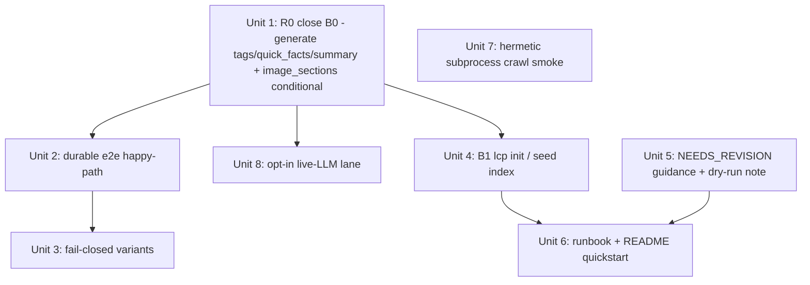

# feat: Make the pipeline actually produce a review packet end-to-end, and guard it with a durable e2e test

## Overview

`local-content-processor` has ~751 green unit tests and a clean mypy gate — yet **no real run of the pipeline can produce a review packet.** A deepening pass uncovered the mechanism: the lint-required draft fields that only the copywriter can fill have no working producer — `tags`, `quick_facts`, and `summary` are populated by *nothing* in the `process()` path, and `image_sections` is hard-required yet filled only by LLM captions — so every real run (with or without `--ai-copy`) dead-ends at `NEEDS_REVISION` and can never reach `PROCESSED`. The green suite masks this because every test that reaches `PROCESSED` does so *out-of-band* via `persist_gate_state`, bypassing the very gate chain the product depends on.

This plan makes the pipeline genuinely operable end-to-end and pins it with a durable e2e test. Four threads, in order: **(1) make it produce a packet at all** — complete the structural-copy generation so a real draft passes lint+grounding; **(2) prove + guard it** — a durable e2e test through the *real* gates plus fail-closed variants and a hermetic real-subprocess crawl; **(3) make it runnable** — fix the two operator-setup blockers; **(4) validate against reality** — an opt-in live-LLM lane that also exercises the new generation.

## Problem Frame

The pipeline's promise is `crawl/ingest → process → frozen review packet`, stopping before publish for a human. Empirically (hands-on runs via the installed `lcp` console script + two independent research passes), it cannot deliver that promise today:

- **B0 — the pipeline cannot produce a lint-passable draft (most severe; the headline).** `lint_draft` (`core/rules/lint_rules.py:47`) makes `tags` (3–5), `quick_facts` (一分鐘快速看懂), `summary` (結尾), **and** `image_sections` (圖片展示) **required**, but the `process()` path cannot fill them:
  - `tags`/`quick_facts`/`summary` have **no producer at all** — `assemble()` inits `quick_facts=[]`/`summary=""` (`assembler.py:251,254`) and is **never passed `tags`** (the call at `pipeline.py:496-503` omits the arg → `tags or [] == []`); the copywriter (`apply_copy_to_draft`, `copywriter.py:160-179`) fills only `image_sections`/`faq`/`subheads`/`title_candidates`.
  - `image_sections` is **unconditionally required** but built solely from copywriter **captions** (`copywriter.py:172-175`, driven by `copy.captions`, not bundle media) — so a legitimate text-only/image-less article can never pass lint, and even an image-bearing one fails without `--ai-copy`.
  The requirements doc *already mandates* generating the full SOP chapter-7 structure including these (`docs/brainstorms/2026-06-17-content-pipeline-upgrade-requirements.md:22`) — so this is a **half-finished feature**, not an unspecified one. **Consequence: every real run (with or without `--ai-copy`) lands `NEEDS_REVISION`; no review packet is ever produced through the real gates.** Confirmed by code (the only `quick_facts`/`summary`/`tags` *assignments* in `src/` are the empty inits) and by the test suite (zero tests assert `PROCESSED` from the real chain; the closest asserts a disjunction `final_state in (PROCESSED, NEEDS_HUMAN_REVIEW, NEEDS_REVISION)` *because* the bare draft lands `NEEDS_REVISION` — `test_pipeline_batch.py:651-664`).
- **B1 — every clean job parks at the dedup gate.** With no `site_index.jsonl` present, `dedup_checker.load_site_index` returns `site_index_available=False`; the pure cascade (`core/rules/dedup_rules.py:334`) honestly refuses to assert `unique` at LOW reliability → `uncertain → NEEDS_HUMAN_REVIEW`. The CLI never wires `--site-index`. A README-quickstart operator never even reaches the assemble gate.
- **B2 — `--dry-run` can never reach a packet (a subset of B0).** Dry-run returns a `NOT_EXECUTED` LLM stub → body-less draft → `NEEDS_REVISION`. Even once B0 is fixed, dry-run still cannot produce a packet (no LLM call), so the limitation must be made explicit rather than read as a failure.
- **Coverage gap — the real happy path is never exercised.** This is the same failure mode that already bit the project: in PR #5 the cover was never watermarked in the real pipeline (`make_cover` dropped a kwarg), **all unit tests stayed green**, and only an end-to-end regression test caught it (`docs/solutions/unit-tests-mask-integration-bugs.md`). B0 is that pattern at maximum severity — the headline feature is unreachable and the suite is green.

The goal: a real operator (and CI) can take one job all the way to a frozen packet, and a standing e2e test guards the wiring against the masking-bug class.

## Requirements Trace

- **R0.** The `process()` path produces a draft that satisfies every lint-required field, so a clean job reaches `PROCESSED` through the **real** gate chain. Specifically: (a) `tags` (3–5), `quick_facts`, and `summary` are generated by the copywriter (under the grounding contract where applicable), completing the SOP chapter-7 structure the requirements already mandate; (b) `image_sections` becomes **conditionally** required — required iff the bundle has images (mirroring the existing `video_sections` rule) — so legitimate text-only articles are publishable, while image-bearing articles still require captions; (c) `--ai-copy` defaults **on** for the happy-path `run` command (with a `--no-ai-copy` opt-out), so the documented quickstart's first run does not dead-end.
- **R1.** A durable automated test drives one job through the **real** Stage-2 chain (`risk → media → dedup → assemble → lint → ground`) to `PROCESSED` with a *substantive* assembled+enriched draft, then `review-packet → approve → backfill → PUBLISHED_RECORDED` — never via `persist_gate_state`.
- **R2.** That test asserts the frozen packet and manifest exist and parse as well-formed JSON (atomic-write proof, `docs/solutions/atomic-write-temp-replace.md`).
- **R3.** Fail-closed contract: each foreseeable malformed input **parks** at the correct hold state with a **typed exit code (2/3/4)**, never the unexpected-error exit 5 (`docs/solutions/fail-closed-catch-at-gate-boundary.md`).
- **R4.** A fresh operator can complete one job end-to-end following the documented quickstart, without the undocumented dedup-park blocker (B1).
- **R5.** When a draft lands `NEEDS_REVISION`, the operator is told **which** required sections are missing and what a complete draft needs (`--ai-copy` for the copywriter sections, a `--template` category, and — for image-bearing articles — captions); the dry-run "no packet" limitation (B2) is explicit.
- **R6.** The production Scrapy-subprocess crawl seam is proven hermetically against a loopback fixture, driven through `Pipeline.stage1`.
- **R7.** An opt-in, env-gated live-LLM lane validates real-endpoint `assemble + structural-copy + grounding` (closes deferred PR #5 line 81), default-skipped in CI.
- **R8.** mypy and pytest stay green; CLI/GUI 1:1 parity preserved; no new `conftest.py` and no *custom* markers; the dry-run zero-capability guarantee, the dedup honesty-gate semantics, the PII-free-at-rest invariants, and the freeze-immutability/`PROCESSING`-never-persisted invariants are untouched.

## Scope Boundaries

- **No publishing / CMS writes.** `backfill --attest` only records a human's pasted URL. No publish path is added.
- **No change to the dedup honesty gate or the dry-run zero-capability guarantee.** B1/B2 are addressed by operator scaffolding + documentation, never by weakening a gate.
- **R0 generates only the missing sections.** It does not redesign the draft model, the assemble prompt architecture, or the existing image/FAQ/subhead generation — it extends them.
- **No de-watermark path** (CUT 2026-06-17).
- **Not blanket integration testing.** One happy path + a targeted set of malformed-input runs + the two hard seams (subprocess crawl, live LLM). Do not integration-test every unit (`docs/solutions/unit-tests-mask-integration-bugs.md`).
- **Live-LLM lane stays out of CI's default lane** — network/secret are opt-in only.

## Context & Research

### Relevant Code and Patterns

| Purpose | Symbol / path |
|---|---|
| Orphaned required-field inits (the B0 site) | `assemble()` builds `quick_facts=[]`, `summary=""`, `tags=tags or []` — `src/lcp/adapters/llm/assembler.py:192-258`; assemble call omits `tags` — `src/lcp/pipeline.py:496-503` |
| Structural-copy generator to extend | `generate_structural_copy` / `_parse` / `apply_copy_to_draft` / `CopyResult` — `src/lcp/adapters/llm/copywriter.py:124-179`; copy prompt — `copywriter.py:61-93`; marker map `_MARKERS` — `copywriter.py:36` |
| Lint required-section list + thresholds | `REQUIRED_SECTIONS` (`lint_rules.py:47`: intro, quick_facts, event_body, image_sections, faq, summary), `DEFAULT_HYPE_WORDS` (`:58`), copied-too-much (`:245`, block ratio 0.5, min-copy 40 chars) |
| Lint config source | `build_lint_config` — `draft_linter.py:55`; defaults `title 25/35`, `tags 3/5` — `core/config.py:58-61` |
| Grounding (deterministic, no model in default path) | `verify_grounding` — `core/rules/grounding.py:209`; claim set `_split_claims` — `grounding.py:176-194` (**currently event_body + faq + captions + subheads; does NOT include quick_facts/summary**); `SubstringOverlapStrategy.is_grounded` — `grounding.py:147` (verbatim substring OR ≥0.6 char-bigram overlap) |
| Where ai_copy is invoked (opt-in) | `pipeline.py:508-517` (only when `ai_copy and status is DRAFTED`) |
| Build a Pipeline with injected fakes | `_pipeline()` — `tests/test_pipeline_batch.py:81` |
| No-network fake Stage-1 crawler / real ingest | `FakeCrawler` — `test_pipeline_batch.py:46`; `LocalIngestCrawler` — `src/lcp/adapters/crawler/ingest.py:53` (folder needs `title.*` + one of `source/body/content/text.*` + optional media) |
| Fake-live LLM (substantive draft) | `_FakeChatClient` — `test_pipeline_batch.py:536` |
| Empty site-index seed | `_clean_index()` — `test_pipeline_batch.py:553` |
| Lint-passing draft template (all 8 sections hand-set) | `_good_draft` — `tests/rules/test_lint_rules.py:32` |
| Real hermetic Scrapy subprocess | `local_server` + `_spawn_crawl` (`LCP_ALLOW_LOOPBACK_FOR_TESTS=1`) — `tests/test_crawl_runner.py:60,84` |
| Freeze packet / sign-off | `build_review_packet` — `adapters/publisher/review_packet.py`; sign-off chain — `tests/publisher/test_signoff.py:82` |
| Out-of-band PROCESSED (the route the e2e must NOT use) | `persist_gate_state` — `adapters/processor/_persist.py`; used at `test_pipeline_batch.py:252` |

### The exact conditions for a draft to pass lint + grounding (implementer checklist)

A draft reaches `PROCESSED` through the real chain **only if all** of these hold (the linchpin for R0 + R1):

- **Title** 25–35 chars (default config) — supplied via `--title`.
- **All required sections non-empty:** `intro`, `quick_facts` (list), `event_body`, `image_sections` (list), `faq` (list), `summary` (str). `video_sections` required **iff** `has_videos`.
- **`tags`** 3–5, no hype words (`爆款/必看/震驚/狂/clickbait/shocking/...`).
- **`category`** non-empty ∈ configured `Config().categories` — supplied via `--template <category>`.
- **`image_sections`** is built by `apply_copy_to_draft` from the copywriter's **captions** (one `MediaSection` per `copy.captions` entry; `pipeline.py:516` passes no `asset_refs`, so `asset_ref=None`) — **not** from bundle images. After R0 it is **conditional** (required iff the bundle has images): a text-only fixture needs no caption; an image-bearing run needs **`--ai-copy`** and ≥1 generated caption.
- **No copied-too-much:** an `event_body` paragraph (≥12 chars) must not exactly equal a source paragraph ≥40 chars (≥50% copied → `BLOCKED`). Keep source paragraphs short or the body reworded.
- **`finish_reason="stop"`, non-empty text** (else assemble routes to `NEEDS_REVISION` before lint); source has ≥1 line ≥8 chars (else `no_verbatim_quotes`).
- **Grounding (deterministic):** every quote and every claim (event_body sentences, faq answers, captions, subheads — **and, after R0, quick_facts items + summary sentences**) of ≥8 chars must be a verbatim substring of `sanitize_source(source)` OR ≥0.6 char-bigram overlap.
- **Grounding ⨯ copied-too-much tension (do not author a degenerate fixture):** authoring *every* claim as a verbatim substring is the simplest way to pass grounding, but it collides head-on with the copied-too-much rule (a ≥40-char source paragraph reproduced verbatim in `event_body` → error/`BLOCKED`) and produces an over-clean, source-written-backwards fixture — the exact masking failure mode this plan exists to kill. Instead: keep source paragraphs **<40 chars**, and lean on the **0.6 bigram-overlap** path for the `event_body` so the body is grounded but *reworded*, reserving verbatim only for short quick_facts/captions. A realistic source is the point.

### Institutional Learnings

- **`docs/solutions/unit-tests-mask-integration-bugs.md`** — over-clean fixtures let green unit tests mask integration bugs; add **one** test that drives the real pipeline path. B0 is the in-repo proof at max severity. Scope tightly; reserve heavy templates (subprocess, N-writer) for the seams that have them.
- **`docs/solutions/fail-closed-catch-at-gate-boundary.md`** — `Pipeline.process`'s outer `except` is `ExternalServiceError`-only; a foreseeable bad input escaping as a raw exception becomes exit 5 (fail-open). R3 contract: parked state **and** typed exit 2/3/4, never 5.
- **`docs/solutions/atomic-write-temp-replace.md`** — artifacts written temp-in-same-dir + fsync + `os.replace`. R2 asserts packet/manifest parse as well-formed JSON. Test temp dir must be single-filesystem.
- **`docs/solutions/mypy-from-venv-not-pyenv.md`** — verify with `./.venv/bin/mypy`, never pyenv; GUI-only helpers must not break the no-`gui` CI install.
- **`docs/2026-06-17-content-pipeline-upgrade-PR5-review-guide.md` (line 81)** — a deferred "validate template rendering + AI-copy grounding against a real LLM endpoint" was never closed. Unit 8 closes it.
- **Requirements `…upgrade-requirements.md:22,75`** — the AI-copy feature was specified to generate the full SOP chapter-7 structure (incl. 一分鐘快速看懂 + 結尾). R0 completes that spec.

### External References

None required. The work completes and tests an existing pipeline with strong local fixtures, an existing hermetic-crawl pattern, and an already-configured OpenAI-compatible endpoint. No new technology layer. (External research deliberately skipped per the strong-local-patterns signal.)

## Key Technical Decisions

- **D0 — Close B0 by generating `tags` + `quick_facts` + `summary` in the copywriter (LLM), per the chosen approach.** Extend `generate_structural_copy`/`_parse`/`apply_copy_to_draft` (and the copy prompt) so the structural-copy call also emits a 一分鐘快速看懂 bullet list, a 結尾 paragraph, and 3–5 tags — joining the existing captions/FAQ/subheads/title-candidates. Rationale: the copywriter already owns "structural copy" and the grounding contract for generated pieces; this completes the SOP structure the requirements mandate without redesigning assemble.
- **D1 — `quick_facts` and `summary` are added to the grounding claim set; `tags` are not.** quick_facts items and summary sentences are generated narrative content → must be grounded (extend `_split_claims`, `grounding.py:176`). tags are labels, not claims → not grounded, but lint still checks count (3–5) and hype words.
- **D2 — `--ai-copy` defaults ON for the happy-path `run` command (operator decision 2026-06-18).** Because `faq`/`quick_facts`/`summary` (and, for image-bearing articles, `image_sections`) are all filled by the copywriter, a complete draft requires `--ai-copy`. Leaving it opt-in/off-by-default reproduces the B0 dead-end on the operator's first run, so `run` defaults it **on** with a `--no-ai-copy` opt-out; `process` may follow config. **Accepted cost: two LLM round-trips per job** (`assemble` + `generate_structural_copy`) and a second non-deterministic gate on the critical path — an explicit, documented tradeoff for a complete draft. The lint failure message still names the missing sections and points to `--ai-copy` (Unit 5).
- **D9 — `image_sections` becomes conditionally required (operator decision 2026-06-18).** It mirrors the existing `video_sections` rule: required **iff** the bundle has images. Rationale: its only producer is copywriter captions, so a hard requirement makes legitimate text-only news articles structurally unpublishable (and forces the LLM to invent a caption with nothing to caption). Conditional-on-`has_images` is the more correct design and is consistent with the precedent already in `lint_rules.py`. Image-bearing articles still require ≥1 caption.
- **D3 — The happy-path e2e uses a fake-*live* LLM (`executed=True`), not `--dry-run` (D… B2).** Dry-run structurally cannot reach `PROCESSED`. The fake `_FakeChatClient` must answer **two** calls now: the assemble body and the structural-copy payload (incl. the new tags/quick_facts/summary), both mutually consistent with the source so grounding passes.
- **D4 — Stage 1 of the linear happy-path uses `LocalIngestCrawler` against a real fixture `material/` folder (text-only by default; an image variant exercises the caption path).** Real transform, no network/subprocess. The Scrapy subprocess seam gets its own hermetic smoke (Unit 7).
- **D5 — Tests seed an empty `site_index.jsonl` via `_clean_index`; operators get one via `lcp init`.** An empty *existing* index = HIGH reliability → non-matching job is `UNIQUE` (matches `dedup_checker.py:75-76`). The honesty gate stays intact (B1 fixed by scaffolding, not by relaxing dedup).
- **D6 — Shared e2e fixtures live in a plain `tests/support/pipeline_fakes.py` module, not a `conftest.py`** (CLAUDE.md forbids `conftest.py`). `pytest.mark.skipif` for the live lane is a built-in marker, within the "no custom markers" convention.
- **D7 — `lcp init` (+ GUI mirror) scaffolds `config.yaml` (only if absent) and seeds an empty `site_index.jsonl` (only if absent).** Never clobbers an existing config.
- **D8 — The live-LLM lane is env-gated and default-skipped**, mirroring the existing `importorskip("webview")` posture.

## Open Questions

### Resolved During Planning

- *Can any real run produce a packet today?* **No** (B0) — copywriter-territory required fields have no working producer. Resolved by R0/D0.
- *Should the gap be closed by generating the sections or relaxing lint?* Generate `tags`/`quick_facts`/`summary` (operator decision 2026-06-18) — relaxing lint for these would contradict the requirements' SOP structure and leave no operator seam to fill them (freeze is immutable).
- *Should `image_sections` stay hard-required for every article?* **No** — make it conditional on `has_images` (operator decision 2026-06-18, D9), mirroring `video_sections`, so text-only articles are publishable. (This is *not* the same as relaxing the SOP sections above — image_sections is media-dependent and already has a conditional sibling.)
- *Should `--ai-copy` default on?* **Yes**, for the happy-path `run` command (operator decision 2026-06-18, D2), with a `--no-ai-copy` opt-out — otherwise the quickstart's first run dead-ends.
- *Where do `tags` come from?* The **copywriter** generates them (D0), trimmed-to-5 + hype-stripped during `_parse` so lint stays clean deterministically (resolves the "trim vs route-to-review" edge → trim during parse, since all copywriter output is already `needs_human_review`).
- *Does grounding currently cover quick_facts/summary?* No (`_split_claims` omits them) — D1 adds them.
- *Why does every fresh job park at dedup?* The honesty gate at LOW reliability (B1) — D5. Note: `process()` already accepts a `site_index_path` kwarg, so Unit 4 only needs the seed file + CLI/GUI wiring, not a new pipeline seam.
- *Where do shared fixtures live without `conftest.py`?* `tests/support/pipeline_fakes.py` (D6).

### Deferred to Implementation

- **Crafting the two mutually-consistent fake `ChatResult`s + source fixture** so the real lint+grounding gates pass *without* a degenerate verbatim-everywhere source (see the grounding⨯copied-too-much note in Context & Research). Expect to iterate against the gates; keep source paragraphs <40 chars and lean on the 0.6 overlap path for the body.
- **Expanding the copywriter's declared output contract.** The copywriter's system prompt + `_PREFIXES` marker map currently scope it to captions/FAQ/subheads/title-candidates; Unit 1 must add quick_facts/summary/tags markers to that contract. Confirm the zero-capability framing (no tools, no link-following) is preserved as the contract grows.
- **Exact `lcp init` idempotency** (refuse to clobber config; seed index only if absent) — settle against `config_io`/`JobStore` APIs.

## High-Level Technical Design

> *This illustrates the intended approach and is directional guidance for review, not implementation specification. The implementing agent should treat it as context, not code to reproduce.*

R0 closes the gap so the **real** chain can reach `PROCESSED`; the e2e then exercises it end-to-end (no `persist_gate_state` shortcut), faking only the two true externals (network via ingest, LLM via a fake-live client answering both calls):

```
fixture material/ (title.* + body.*; image optional)   seeded empty site_index.jsonl
        |                                                   |
        v                                                   v
   [ingest] --> CRAWLED --> [process --ai-copy --template <cat> --title <25-35>]
                            (--ai-copy defaults ON for `run`; --no-ai-copy opts out)
   (LocalIngest)                 |
                                 v
   risk -> media -> dedup(UNIQUE) -> assemble(body+quotes) -> copywriter
                                                               (image_sections, faq, subheads,
                                                          *** + tags + quick_facts + summary ***)  <-- R0
                                 |
                                 v
                       lint(all sections present, tags 3-5, category ok)
                                 + ground(every claim incl. quick_facts/summary is a source substring)
                                 |
                                 v
                            PROCESSED --> [review-packet] FREEZE -> REVIEW_PENDING
                                                 --> [approve] -> APPROVED
                                                 --> [backfill --attest <url>] -> PUBLISHED_RECORDED
   assertions: real assemble+copywriter ran (executed=True); final state per step;
               packet.body_sha256 present; packet.json + manifest.json parse as well-formed JSON
```

Fail-closed variants (Unit 3) reuse the harness, swap one realistically-malformed input per run, and assert the job **parks** with a typed exit:

| Malformed input | Expected park state | Expected exit |
|---|---|---|
| Redline (banned) source text | `BLOCKED` | 2/3/4 (never 5) |
| Body verbatim-copies ≥50% of long source paragraphs | `BLOCKED` (copied-too-much) | 2/3/4 |
| Malformed/relative media URL | hold (not a raw exception) | 2/3/4 |
| Torn / truncated manifest JSON | hold | 2/3/4 |
| Non-numeric ffprobe field | hold | 2/3/4 |
| Truncated draft (`finish_reason="length"`) | `NEEDS_REVISION` | 2/3/4 |
| Ungrounded generated claim (caption/quick_fact/summary) | `NEEDS_HUMAN_REVIEW` (grounding) | 2/3/4 |
| LLM 5xx / timeout (`ExternalServiceError`) | `PROCESS_FAILED` (retriable) | 2/3/4 |

## Implementation Units

Dependency map (R0 is the foundation; the e2e and live lane depend on it; operability and crawl-smoke are independent):



### Phase 1 — Make the pipeline able to produce a packet (the core fix)

- [x] **Unit 1: Complete structural-copy generation — produce `tags`, `quick_facts`, `summary` (R0)** ✅ shipped (commit `3a6384f`)

**Goal:** After this unit, a clean job with `--ai-copy`, a valid `--template` category, and a 25–35-char title reaches `PROCESSED` through the real gate chain — because the copywriter now fills `tags`/`quick_facts`/`summary`, grounding verifies the new narrative ones, and `image_sections` is required only when the bundle actually has images (so text-only articles pass without an invented caption).

**Requirements:** R0, R8

**Dependencies:** None (foundational — everything else that touches PROCESSED depends on this).

**Files:**
- Modify: `src/lcp/adapters/llm/copywriter.py` — extend the copy prompt/system contract at `:61-93`, the `_PREFIXES`/`_MARKERS` map `:36`, `_parse` `:79+`, **add `quick_facts`/`summary`/`tags` fields to `CopyResult`** (it currently holds only `captions`/`faq`/`subheads`/`title_candidates`), and `apply_copy_to_draft` `:160-179` to populate `draft.quick_facts`/`draft.summary`/`draft.tags`. Trim tags to ≤5 + strip hype words during `_parse` so lint stays clean deterministically.
- Modify: `src/lcp/core/rules/grounding.py` — `_split_claims` `:176` add `quick_facts` items + `summary` sentences to the grounded claim set (they are currently omitted).
- Modify: `src/lcp/core/rules/lint_rules.py` — make `image_sections` **conditionally** required (required iff `has_images`), mirroring the existing `video_sections`/`has_videos` rule at `:201` (D9).
- Test: `tests/llm/test_copywriter.py`, `tests/rules/test_grounding.py`, `tests/rules/test_lint_rules.py`

**Approach:** The copywriter already returns a structured `CopyResult` parsed from marker-tagged LLM output; **add `tags`/`quick_facts`/`summary` fields to that dataclass** plus markers for quick-facts bullets, the closing paragraph, and tags, parse them, and apply via `model_copy` onto the existing `draft.quick_facts`/`summary`/`tags` attributes (no new draft fields — see the sanitizer enumeration constraint in System-Wide Impact). Keep the dry-run/needs-revision guard (skip on `not executed`/truncated — no silent partial). Add quick_facts/summary to grounding so an ungrounded generated fact routes to human review (consistent with the existing caption/subhead treatment). Separately, relax `image_sections` from unconditional to `has_images`-conditional in lint (D9).

**Execution note:** Implement test-first — start with a failing `test_copywriter` asserting the three fields are populated and lint-shaped, and a failing grounding test asserting an ungrounded quick_fact/summary is caught. This is the load-bearing fix; the gates are pure and deterministic, so convergence is tractable.

**Patterns to follow:** existing caption/FAQ/subhead generation + application in `copywriter.py`; the existing caption/subhead grounding inclusion in `_split_claims`; `_good_draft` (`tests/rules/test_lint_rules.py:32`) as the shape of a lint-passing draft.

**Test scenarios:**
- Happy path: `generate_structural_copy` on a clean source yields a `CopyResult` with ≥1 quick-fact, a non-empty summary, and 3–5 tags; `apply_copy_to_draft` populates `draft.quick_facts`, `draft.summary`, `draft.tags`.
- Happy path: a draft enriched by the extended copywriter passes `lint_draft` (no missing-section or tag-count errors) given a 25–35-char title and a valid category.
- Edge case (image_sections conditional, D9): a **text-only** draft (no images in the bundle, empty `image_sections`) passes lint; an **image-bearing** draft with empty `image_sections` still fails lint (caption required).
- Edge case (tags): an LLM tag set with >5 entries or a hype word (`爆款`/`震驚`/…) is trimmed-to-5 + hype-stripped during `_parse`, so the draft arrives at lint with valid tags; if trimming drops below 3, the draft parks (don't silently ship <3).
- Error path: a quick_fact or summary sentence **not** grounded in source → `verify_grounding` returns a hold (the added claim is actually checked).
- Edge case: dry-run / truncated copy result → the three fields are left as-is (no silent partial), preserving the existing `ai_copy` guard.
- Integration: running the real `process(..., ai_copy=True, template=<cat>, title=<25-35>)` on a clean fixture reaches `PROCESSED` (the first time any test does so via the real chain).

**Verification:** A clean fixture run through the real `process()` reaches `PROCESSED` with a draft whose `tags`/`quick_facts`/`summary` are populated and grounded; lint and grounding both pass.

### Phase 2 — Prove + guard

- [x] **Unit 2: Durable end-to-end happy-path test through the real gates** ✅ shipped (commit `95c7d76`)

**Goal:** One test drives `ingest → process → review-packet → approve → backfill` to `PUBLISHED_RECORDED`, with `process` running the real `risk → media → dedup → assemble → copywriter → lint → ground` chain to a substantive `PROCESSED` draft — never `persist_gate_state`. The standing regression guard for the masking-bug class.

**Requirements:** R1, R2, R8

**Dependencies:** Unit 1 (a packet is unreachable until R0 lands).

**Files:**
- Create: `tests/support/__init__.py`, `tests/support/pipeline_fakes.py` (relocate `_FakeChatClient`, `_clean_index`, `CLEAN_SOURCE`, a `build_pipeline(...)` helper from `test_pipeline_batch.py`; keep that file importing them so existing tests stay green)
- Create: `tests/test_e2e_pipeline.py`
- Create: fixture `material/` (text-only by default; the fake copywriter still emits captions if an image variant is exercised) under `tests/fixtures/e2e_material/` or built in-test
- Reference (do not change behavior): `pipeline.py`, `review_packet.py`, `signoff.py`

**Approach:** Build a `Pipeline` with `LocalIngestCrawler` (D4) and a fake-live `_FakeChatClient` that answers **both** the assemble and the copywriter calls with mutually-consistent payloads (D3); seed an empty `site_index.jsonl` (D5). Run `run(target="review")` (or discrete CLI steps via `CliRunner`) — `--ai-copy` is on by default now (D2) — with a valid `--template` category and a 25–35-char `--title`; then `approve` + `backfill --attest`. **Fixture discipline (avoid an over-clean source):** keep source paragraphs <40 chars and word the fake `event_body` to ground via 0.6 bigram overlap rather than verbatim copying, so grounding passes without tripping copied-too-much (see Context & Research).

**Execution note:** Start failing on `final_state == REVIEW_PENDING`; iterate the fixture/fake until the real lint+grounding gates pass (use the checklist in Context & Research). Do **not** reach `PROCESSED` via `persist_gate_state` — that re-masks the exact bug this test exists to catch.

**Patterns to follow:** `_pipeline()`/`FakeCrawler`/`_FakeChatClient`/`_clean_index` (`test_pipeline_batch.py`); sign-off chain (`test_signoff.py:82`).

**Test scenarios:**
- Happy path: real `process` runs all gates → `PROCESSED` with `draft.executed == True`, non-empty `tags`/`quick_facts`/`summary`/`image_sections`/`faq`/body.
- Happy path: `review-packet` freezes → `REVIEW_PENDING`; `packet.body_sha256` present and non-empty.
- Happy path: `approve` → `APPROVED`; `backfill --attest <url>` → `PUBLISHED_RECORDED`.
- Integration: `packet.json` **and** `manifest.json` exist and parse as well-formed JSON (atomic-write proof, R2).
- Integration: the draft was produced by `assemble`+`copywriter` (`executed=True`), proving the real path ran (no `persist_gate_state`).
- Edge case: a second identical job (against the now-non-empty index) is `DUPLICATE` → the index is actually consulted.

**Verification:** A job from a fixture folder ends at `PUBLISHED_RECORDED` having passed every real gate; the frozen packet+manifest are complete, parseable JSON; the test fails if any gate is silently skipped.

- [x] **Unit 3: Fail-closed malformed-input e2e variants**

**Goal:** Prove each foreseeable bad input **parks** at the correct hold state with a typed exit (2/3/4), never exit 5. Guards the narrow `except ExternalServiceError` boundary against being widened to "fix" a crash.

**Requirements:** R3, R8

**Dependencies:** Unit 2 (shared harness).

**Files:**
- Create: `tests/test_e2e_fail_closed.py`
- Reference: `pipeline.py` (outer `except`), `core/errors.py` (exit mapping), `adapters/processor/*`, `core/rules/grounding.py`

**Approach:** Reuse the Unit 2 harness; swap one realistically-malformed input per run (see Technical Design table, incl. the new ungrounded-generated-claim case enabled by Unit 1). Drive via `CliRunner` so the exit code is real; assert both resting state and exit code.

**Patterns to follow:** existing gate-park tests (`test_process_stops_at_risk_block`, `…_dedup_without_index`, `…_truncated_draft…`, `…_external_error…`) — but triggered by the real malformed input end-to-end.

**Test scenarios:**
- Error path: redline source → `BLOCKED`, exit ≠ 5.
- Error path: body verbatim-copying ≥50% of long source paragraphs → `BLOCKED` (copied-too-much), exit ≠ 5.
- Error path: relative/malformed media URL → media gate parks, no raw exception, exit ≠ 5.
- Error path: torn/truncated `manifest.json` → gate parks, exit ≠ 5.
- Error path: non-numeric ffprobe field → media gate parks, exit ≠ 5.
- Error path: `finish_reason="length"` draft → `NEEDS_REVISION`, exit ≠ 5.
- Error path: an ungrounded generated quick_fact/summary/caption → `NEEDS_HUMAN_REVIEW` (grounding), exit ≠ 5.
- Error path: fake LLM raising `ExternalServiceError` → `PROCESS_FAILED`, exit ≠ 5.

**Verification:** Every malformed input lands at a parked hold state with a typed exit; none produces exit 5 or leaves the job fail-open at `CRAWLED`.

### Phase 3 — Make it runnable (operator blockers)

- [x] **Unit 4: `lcp init` — seed config + empty site index so a clean job isn't parked (B1)**

**Goal:** A fresh operator runs one setup command and their first clean job reaches the assemble gate (and, post-R0, `PROCESSED`) without a manual `resolve`.

**Requirements:** R4, R8

**Dependencies:** Unit 1 (the "B1 regression" integration scenario below asserts `PROCESSED`, which only R0 makes reachable; the `init`/seed code itself is independent and can be built in parallel, but its end-to-end assertion needs R0). `process()` already accepts a `site_index_path` kwarg, so this unit is seed-file + CLI/GUI wiring, **not** a new pipeline seam.

**Files:**
- Modify: `src/lcp/cli.py` (add `init`), `src/lcp/gui.py` (mirror — parity is mandatory)
- Modify (if needed): `src/lcp/adapters/storage/config_io.py` and/or a `JobStore`/storage helper for the seed-index write
- Create: `tests/test_cli_init.py`

**Approach:** `init` writes `config.yaml` from `config.example.yaml` only if absent (never clobber) and seeds an empty `site_index.jsonl` in `storage.base_dir` if absent (D5/D7). **Write `config.yaml` at mode `0600`** — `config.example.yaml` ships `0644`, so a plain `shutil.copy2` would leave a world-readable config; mirror the explicit `chmod 0o600 + os.replace` already used by `config_io.py::update_llm_config_file` (`:164-171`) rather than copying the source mode. Mirror as a GUI bridge method; scaffold/seed logic lives in an adapter the shells call — keep both shells logic-free.

**Execution note:** Add the GUI mirror in the same unit; a CLI action without its GUI twin violates the parity invariant.

**Patterns to follow:** existing CLI command shape (`cli.py`); GUI bridge methods (`create_and_crawl`, `ingest_dir`, …) in `gui.py`; atomic write `manifest.py::_atomic_write`.

**Test scenarios:**
- Happy path: `init` on an empty dir creates `config.yaml` + empty `site_index.jsonl`; exit 0.
- Security: the created `config.yaml` is mode **`0600`** (not the `0644` of the example source).
- Edge case: `init` with an existing `config.yaml` does **not** overwrite it.
- Edge case: `init` with an existing index leaves it untouched.
- Integration: after `init` + R0, a clean `ingest → process --ai-copy --template <cat> --title <…>` reaches `PROCESSED` with no `resolve` (dedup sees a HIGH-reliability empty index → `UNIQUE`). *B1 regression assertion.*
- Integration: the GUI `init` method produces the same files as the CLI (parity).

**Verification:** From a clean checkout, following the documented quickstart reaches `PROCESSED` on the first clean job with no manual hold resolution.

- [x] **Unit 5: Actionable `NEEDS_REVISION` guidance + explicit dry-run note (B2 / B0 ergonomics)**

**Goal:** When a draft lands `NEEDS_REVISION`, the operator learns *which* required sections are missing and what a complete draft needs (`--ai-copy`, a `--template` category, and — for image-bearing articles — captions); a dry-run that cannot produce a packet says so explicitly.

**Requirements:** R5, R8

**Dependencies:** None (improves the surface R0 exposes).

**Files:**
- Modify: `src/lcp/cli.py` (surface the lint `errors` list — already PII-free enum/section labels — and the dry-run advisory on `process`/`run`)
- Modify: `src/lcp/gui.py` (mirror any new status surfacing)
- Test: extend `tests/test_cli_skeleton.py` or add to `tests/test_e2e_pipeline.py`
- *(README quickstart prose is owned by Unit 6 — this unit only emits the in-CLI advisory.)*

**Approach:** The lint gate already returns structured `errors` (missing-section labels); surface them at the CLI boundary instead of a bare "needs_revision." Add a one-line advisory when `dry_run AND NOT_EXECUTED`, e.g. *"dry-run did not call the LLM, so the copywriter sections (image_sections/quick_facts/summary) are empty and the draft cannot reach PROCESSED; run without --dry-run (and with --ai-copy) for a complete packet."* (exact wording finalized in review). No pipeline behavior change; no PII (section labels are canonical enums).

**Test scenarios:**
- Happy path: a draft missing `quick_facts`/`summary` reports those section labels in the CLI output.
- Happy path: dry-run `run --until review` emits the "LLM not executed; a packet needs a real run" advisory, exits with the normal parked-job code.
- Edge case: a non-dry, complete run emits neither the advisory nor a missing-section list.
- Test expectation: README change is doc-only.

**Verification:** A parked draft explains *why* in operator-readable terms; a dry-run that cannot produce a packet says so; no pipeline semantics changed.

### Phase 4 — Document + validate against reality

- [x] **Unit 6: Operator runbook + a quickstart that actually works**

**Goal:** A verified, copy-pasteable quickstart and a go/no-go runbook for one real job, reflecting R0 + the B1/B2 fixes.

**Requirements:** R4, R5

**Dependencies:** Units 4, 5 (documents the fixed flow).

**Files:**
- Modify: `README.md` (sole owner of the quickstart prose: venv + ffmpeg → `lcp init` → ingest fixture → `run --until review --template <cat> --title <25-35>` (ai-copy on by default) → review-packet → approve → backfill)
- Create: `docs/2026-06-18-e2e-operator-runbook.md`
- Optionally: a committed sample `material/` under `tests/fixtures/e2e_material/` referenced by the runbook

**Approach:** Walk the exact command sequence Unit 2 automates, calling out the reviewer whitelist (`publisher.reviewers`), that `--ai-copy` is on by default (D2; `--no-ai-copy` to skip), that captions are only needed for image-bearing articles (D9), and the dry-run limitation.

**Test scenarios:** `Test expectation: none — documentation. Fidelity is guaranteed structurally by Units 1, 2 and 4 (the automated e2e walks the same path the runbook documents).`

**Verification:** A new operator following the README quickstart reaches a frozen packet; the runbook steps match the automated e2e path.

- [x] **Unit 7: Hermetic real-subprocess crawl smoke through the production seam**

**Goal:** Prove the production crawl seam (`Pipeline.stage1` → `build_crawler` → Scrapy subprocess with scrubbed env) works hermetically against a loopback fixture — the existing subprocess test calls `scrapy_impl.main` directly and bypasses this seam.

**Requirements:** R6, R8

**Dependencies:** None (reuses the existing loopback fixture).

**Files:**
- Create: `tests/test_e2e_crawl_subprocess.py`
- Reference: `tests/test_crawl_runner.py:60,84` (`local_server`, `_spawn_crawl`, `LCP_ALLOW_LOOPBACK_FOR_TESTS`); `adapters/crawler/crawl_runner.py`; `pipeline.py::stage1`/`build_crawler`

**Approach:** Stand up the `127.0.0.1` `http.server` fixture, configure a `Pipeline` with the loopback domain allowlisted + the test-only SSRF escape env, run `stage1` through the production seam, and assert a `0600` bundle with a `source_html_sha256`. Keep the loopback escape strictly test-scoped. **Note the residual:** `LCP_ALLOW_LOOPBACK_FOR_TESTS` is a bare `os.environ.get()` truthiness check read by *production* crawler code (`scrapy_impl.py:60` skips the second-order media-URL SSRF guard; `:420` skips the top-URL DNS `is_global` preflight) with no test-context guard — so any inherited env carrying it disables those guards. This unit must not normalize reading it outside the crawl subprocess; the only remaining defense-in-depth is the `crawl_runner` preflight.

**Patterns to follow:** `test_real_subprocess_crawl_produces_bundle_0600_sha256` — invoked via `Pipeline.stage1`, not `scrapy_impl.main`.

**Test scenarios:**
- Happy path: crawl the loopback page via `Pipeline.stage1` → `CRAWLED`/`CRAWLED_WARN`, bundle `0600`, manifest carries a non-null `source_html_sha256`.
- Security (negative, **var UNSET**): with `LCP_ALLOW_LOOPBACK_FOR_TESTS` unset, `Pipeline.stage1` against a `127.0.0.1` top URL **and** against a loopback media URL is **rejected** — proving the escape is the *sole* enabler and the production SSRF guard is intact without it.
- Edge case: a non-allowlisted host is rejected before any fetch (run this with the escape var **unset**, else it proves nothing about the production guard).
- Integration: the subprocess env is scrubbed (no host secrets leak) — assert via the `minimal_env` contract.

**Verification:** The real Scrapy subprocess, driven through the production seam, produces a hardened bundle against a loopback fixture with no live network.

- [x] **Unit 8: Opt-in, env-gated live-LLM validation lane (closes PR #5 line 81)**

**Goal:** With a real OpenAI-compatible endpoint + secret, a deliberately-run test validates real-endpoint `assemble + structural-copy (incl. the new tags/quick_facts/summary) + grounding`. Default-skipped in CI.

**Requirements:** R7, R8

**Dependencies:** Unit 1 (validates the new generation) and the Unit 2 harness (real `LlmClient` swapped in for the fake).

**Files:**
- Create: `tests/test_live_llm_lane.py`
- Modify: `docs/2026-06-18-e2e-operator-runbook.md` (how to run the live lane)
- Reference: `adapters/llm/client.py`, `assembler.py`, `copywriter.py`, `nli_grounding.py`; config keys `llm.base_url`/`llm.allowed_hosts` + keyring secret

**Approach:** `pytest.mark.skipif` gated on the endpoint/secret env (D8). When enabled, run a real `process` (ai-copy on by default) on a **small synthetic clean fixture** (never real scraped subject PII — an opt-in live run must not egress real subjects to a third party) and assert the round-trip **executed** and the draft is fully populated (incl. the new fields). **Do not assert a strict `PROCESSED`** — a real model may paraphrase a fact below the 0.6 grounding-overlap threshold, which correctly parks at `NEEDS_HUMAN_REVIEW`; asserting strict `PROCESSED` would flake on correct fail-closed behavior. A validation lane (non-deterministic by nature), kept out of the deterministic suite.

**Execution note:** Real network call — gate so CI/offline always skip. Never hardcode a secret; read from env/keyring exactly as production does.

**Test scenarios:**
- Happy path (gated): with a real endpoint, `process` yields an `executed=True` draft with all required sections populated, landing at **`PROCESSED` OR a typed `NEEDS_HUMAN_REVIEW`/`NEEDS_REVISION` hold — never exit 5**. (Strict `PROCESSED` is asserted only by the deterministic fake-client Unit 2.)
- Edge case: no endpoint env → the test is **skipped** (assert the skip path so CI stays green).
- Error path (gated): a deliberately ungrounded request surfaces a grounding hold, not a silent pass.

**Verification:** With credentials the lane exercises the real LLM round-trip end-to-end (incl. the new generation) and closes the deferred PR #5 validation, accepting a typed grounding park as a valid outcome; with none it skips cleanly and never blocks CI.

## System-Wide Impact

- **Interaction graph:** R0 changes the copywriter/grounding pure+adapter path (no shell change). Units 4/5 touch both shells — every change lands in `cli.py` **and** `gui.py` (1:1 parity); the logic lives in adapters/storage, keeping shells logic-free.
- **Error propagation:** Unit 3 pins the contract that foreseeable bad input → typed exit 2/3/4, never exit 5, and now includes the new ungrounded-generated-claim case. Standing guard against a future fix widening the narrow `except`.
- **State lifecycle risks:** The e2e exercises real freeze (`REVIEW_PENDING` immutability via edge absence) and `backfill` attestation. Fixture temp dirs must be single-filesystem so `os.replace` atomicity (and the R2 assertion) holds.
- **API surface parity:** New CLI `init` + new status surfacing ⇒ matching GUI bridge methods ⇒ README/runbook references. All move together.
- **Security/compliance unchanged:** The new quick_facts/summary/tags ride **already-enumerated** draft attributes that the sanitizer escapes by explicit field enumeration — `sanitize_draft` at `src/lcp/adapters/processor/sanitizer.py:98` (quick_facts), `:112` (summary), `:113` (tags) already `html.escape(quote=True)` them — and quick_facts/summary are now **grounded** (D1). **Constraint for Unit 1:** populate only these existing attributes; introduce **no new un-enumerated attacker-shapeable draft field** (it would render unescaped). Source URLs stay inert; LLM stays zero-capability; the new copywriter output is subject to the same grounding+escape contract as captions. PII-free manifest/index/audit unchanged (section labels are canonical enums, not free text).
- **Integration coverage:** This plan *is* the integration-coverage layer — Units 1/2/3/7/8 cover exactly the cross-layer wiring (and the B0 generation gap) that clean-stub unit tests could not prove.
- **Unchanged invariants:** dedup honesty gate, dry-run zero-capability, PII-free at rest, fail-closed parking, `PROCESSING`-never-persisted, `BLOCKED/DUPLICATE` no-auto-exit, freeze immutability — all preserved. B0/B1/B2 are fixed by *adding the missing producer* and *operator scaffolding/docs*, never by relaxing a gate.

## Risks & Dependencies

| Risk | Likelihood | Impact | Mitigation |
|------|-----------|--------|------------|
| The fake `ChatResult`s + fixture can't be made to pass both lint and grounding, stalling Unit 2 | Med | Med | The gates are pure/deterministic; ground the body via 0.6 bigram overlap with **<40-char source paragraphs** (NOT verbatim copying, which trips copied-too-much and yields an over-clean fixture); iterate against real gates. R0's own tests de-risk the lint shape first |
| `--ai-copy` default-on doubles LLM cost/latency and adds a second non-deterministic gate to every job's critical path | Med | Low | Accepted tradeoff (D2) — the alternative (opt-in) dead-ends the operator's first run; `--no-ai-copy` remains for cost-sensitive/partial runs; the live lane (Unit 8) surfaces any flakiness |
| Making `image_sections` conditional (D9) regresses an existing test that assumed it unconditional | Low | Low | Mirror the proven `video_sections`/`has_videos` pattern exactly; run the full suite + add the text-only-passes / image-bearing-still-requires-caption scenarios (Unit 1) |
| `tags` sourcing assumption (copywriter-generated) is wrong | Low | Low | Flagged as a deferred question; alternatives (category-keyword derivation, operator-provided) touch only the copywriter prompt/parse |
| Extracting shared fixtures from `test_pipeline_batch.py` breaks existing tests | Med | Low | Keep that file importing the relocated helpers from `tests/support/pipeline_fakes.py`; run the full suite after the move |
| R0's grounding extension makes existing (previously-empty) drafts newly fail grounding in some test | Low | Med | quick_facts/summary were always empty before, so no existing real-chain draft had them; verify the suite after extending `_split_claims` |
| `lcp init` clobbers a real `config.yaml` | Low | High | D7 + scenarios: never overwrite an existing config; seed index only if absent |
| Live-LLM lane flakes or leaks a secret into CI | Low | Med | Default-skip via env gate (D8); read secret from env/keyring only; never commit it |
| Loopback SSRF escape leaks into a non-test path | Low | High | Keep `LCP_ALLOW_LOOPBACK_FOR_TESTS` strictly test-scoped, exactly as the existing crawl test does; assert it is not honored without the env flag |
| GUI helper breaks the no-`gui` CI install | Low | Med | GUI-only code stays behind the lazy `import webview`; verify with bare `./.venv/bin/mypy` |

## Phased Delivery

- **Phase 1 (make it work):** Unit 1 — close B0. Highest priority; nothing downstream can produce a packet until this lands.
- **Phase 2 (prove + guard):** Units 2, 3 — the durable e2e through the real gates + fail-closed variants. Closes the masking-bug gap.
- **Phase 3 (make it runnable):** Units 4, 5 — operator setup + actionable guidance.
- **Phase 4 (document + validate):** Units 6, 7, 8 — runbook, the crawl seam, and the live-LLM lane.

## Documentation Plan

- `README.md` — working quickstart (`lcp init` → ingest → `process --ai-copy --template <cat> --title <…>` → review-packet → approve → backfill) + the `--ai-copy`/image requirement + the dry-run limitation.
- `docs/2026-06-18-e2e-operator-runbook.md` — go/no-go for one real job, incl. reviewer whitelist and live-LLM lane instructions.
- `docs/solutions/` — after landing, add a note: "the real happy path was unreachable (three required fields had no producer) and green tests masked it; the e2e through the real gates is the guard" — compounds `unit-tests-mask-integration-bugs.md`.
- `CLAUDE.md` — add `lcp init` as the canonical setup step; note that a complete draft uses `--ai-copy` (on by default for `run`) + a `--template` category, and that `image_sections` is required only for image-bearing articles (D9).

## Sources & References

- Hands-on runs (this session): reproduced B1 (dedup park) and the dry-run dead-end; `resolve` → "no processed draft."
- Repo research: CLI surface; the two operator blockers; the `persist_gate_state` shortcut in the only packet-producing test; reusable fixtures; hermetic crawl pattern.
- Deepening research (the decisive pass): exact lint/grounding pass criteria; **B0 — `tags`/`quick_facts`/`summary` have no producer in `process()`; no test reaches PROCESSED via the real chain.** Verified directly in code (`assembler.py:251-258`, `copywriter.py:160-179`, `lint_rules.py:47`, `grounding.py:176`, `pipeline.py:496-503`).
- Document-review pass (5 personas: coherence, feasibility, security-lens, scope-guardian, adversarial): corroborated B0/B1; corrected the `image_sections` source (built from copywriter **captions** at `copywriter.py:172-175`, not bundle media) → operator decisions D9 (conditional on `has_images`) + D2 (`--ai-copy` default-on); hardened `lcp init` to `0600`, the Unit 7 SSRF negative assertion, and the Unit 8 non-strict assertion.
- Learnings: `docs/solutions/{unit-tests-mask-integration-bugs,fail-closed-catch-at-gate-boundary,atomic-write-temp-replace,begin-immediate-isolation-level,mypy-from-venv-not-pyenv}.md`.
- Prior art / spec: `docs/2026-06-17-content-pipeline-upgrade-PR5-review-guide.md` (line 81 deferred live validation); `docs/brainstorms/2026-06-17-content-pipeline-upgrade-requirements.md:22,75` (SOP chapter-7 generation mandate); `docs/spec/远程内容编辑发布流程SOP_新媒体版.md:165` (一分钟快速看懂).
- Architecture: `CLAUDE.md`; `src/lcp/pipeline.py` module docstring; `src/lcp/core/state.py`.
