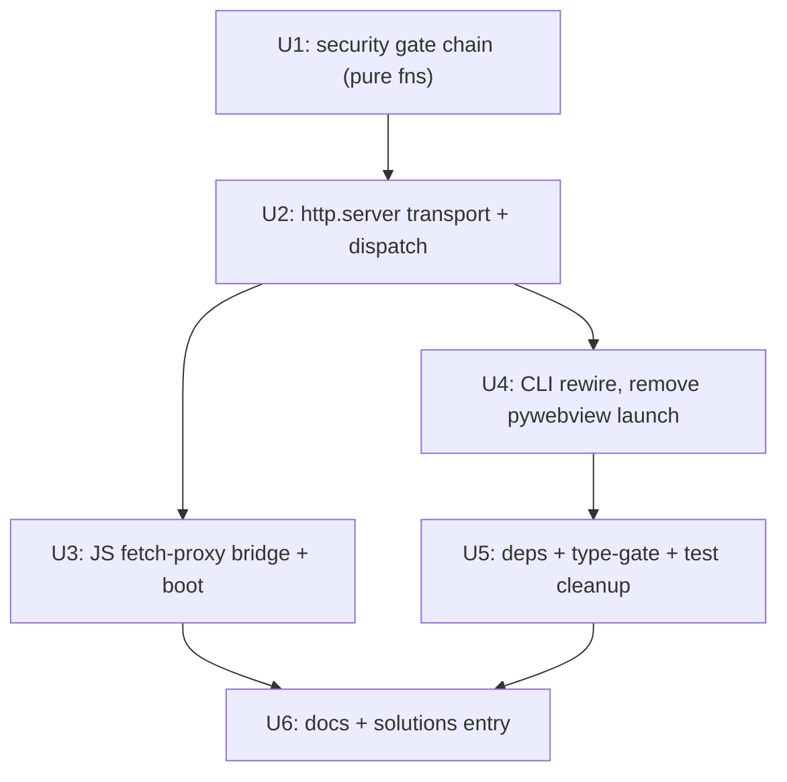

# refactor: Replace pywebview desktop GUI with a 127.0.0.1 webui service

## Overview

Today the operator GUI is a **pywebview desktop window**: `gui.py::launch` opens a
native window, points it at `web/index.html`, and passes the pure-Python `Api`
object as `js_api`. The frontend calls operator actions through pywebview's
in-process bridge (`window.pywebview.api.<method>()`); pywebview's *built-in*
HTTP server serves `web/` and binds 127.0.0.1 by default.

We are **fully replacing** that desktop app (operator decision, 2026-06-18) with a
real **localhost HTTP webui service**: a stdlib `http.server` bound to
`127.0.0.1` that (a) serves the `web/` assets and (b) exposes each `Api` method as
a JSON endpoint, so the operator opens the UI in **Chrome** and debugs it with
"Claude in Chrome". The frontend's pywebview bridge is replaced by a `fetch`-based
proxy.

The single most important fact for sizing this work: **the `Api` class is pure,
has zero pywebview dependency, and already returns bridge-safe, sanitized JSON-able
dicts.** It is the perfect HTTP API surface and stays **untouched** — every
existing `tests/test_gui_api.py` test keeps passing. What changes is only the
**transport** (pywebview → `http.server`), the **JS bridge shim**
(`window.pywebview.api` → `fetch`), and a **new server-side security gate chain**
that re-creates, by hand, the protections pywebview's in-process bridge gave us
for free.

That last point is the crux and the risk. Moving from an in-process bridge (no
network socket for the API) to a browser-reachable HTTP socket **re-opens an
attack surface pywebview never had**: CSRF from other browser tabs/sites, DNS
rebinding, and requests from other local processes — all able to trigger
`approve`/`reject`/`save_settings`/`create_and_crawl`. This is the same vulnerability
class that hit the official MCP SDKs in 2025 (CVE-2025-66414/66416, DNS rebinding
because `http.server` does not validate `Host`). We rebuild the lost protection as
an explicit, fail-closed, tested validation chain.

## Problem Frame

- **User goal:** the operator (a non-technical user, and the developer) wants to
  open the operator UI in Chrome at a `http://127.0.0.1:PORT` URL so it can be
  driven and debugged by Claude in Chrome — which a native pywebview window cannot
  be.
- **Why now:** pywebview windows are opaque to browser tooling. A real localhost
  webui is inspectable, scriptable, and screenshot-able by browser automation.
- **Constraint that dominates the design:** this is a *compliance-first* pipeline
  that "deliberately stops before publishing." The GUI bridge is explicitly
  documented (`gui.py` L14-37) as the lethal-trifecta surface. We may change the
  transport, but we must not weaken: the R41 output-escaping model (textContent +
  strict CSP + inert source links), the 127.0.0.1-only binding, the PII-free
  index/manifest/audit, the secrets-to-keyring-never-file rule, or the
  "machine never publishes" invariant. The new HTTP socket must reconstruct the
  *network* trust boundary the in-process bridge had — off-host unreachable, no
  cross-site/rebinding reach, *only the page I serve, on my own machine, from this
  launch, may call the API*. **It is not strictly equivalent** (adversarial Finding):
  an in-process bridge has no socket at all, so the HTTP design adds (a) a real socket
  reachable by local processes — mitigated by the per-launch token, whose
  confidentiality is itself a new dependency on CSP + R41 — and (b) an always-on,
  scriptable DevTools surface (the whole point, for Chrome debugging). The
  R41 output-escaping model, not the transport, remains the real defense; "equivalent"
  applies to the off-host/network property only.

## Requirements Trace

- **R1.** Operator can launch the GUI as a localhost web service and open it in
  Chrome at a stable `http://127.0.0.1:PORT/` URL (Claude-in-Chrome debuggable).
- **R2.** Every operator action available today over the pywebview bridge works
  identically over HTTP — same `Api` methods, same arguments, same returned dicts.
  CLI/GUI 1:1 action parity (CLAUDE.md invariant) is preserved; no new capability
  is added at the server layer.
- **R3.** The API socket is reachable **only** from the page we serve, on this
  host, from this launch. Specifically: not from off-host (loopback bind), not via
  DNS rebinding (Host allowlist), not via cross-site CSRF (Origin/Sec-Fetch-Site),
  not from other local processes (per-launch token).
- **R4.** All existing security invariants hold unchanged: CSP, textContent
  discipline, inert source links, no serving of `data/jobs/`, secrets never in a
  file/log/response, errors never cross as a stack/traceback.
- **R5.** No new third-party dependency. Stdlib `http.server` only. The `pywebview`
  dependency is removed. The type gate (`mypy`) and full suite stay green.

## Scope Boundaries

- **Non-goal:** keeping the pywebview desktop window. It is removed entirely
  (operator chose full replacement; the parallel-dev-mode option was rejected).
  *Rationale, made evidence-based (adversarial Finding):* the served assets already
  boot in a plain browser today (the existing 3000ms fallback path was built "for the
  CLI/GUI-parity browser case"), so full replacement's marginal gain is the **security
  shell + dependency removal**, not browser-access per se. The reversal cost — re-adding
  pywebview if native OS integration is later needed — was weighed and accepted because
  the GUI uses **no native pywebview API beyond `js_api`**: directory ingest is a typed
  text field (no native folder picker), covers are inert text (no file dialog), no tray
  / single-window focus. If a future need for native OS integration arises, re-adding a
  desktop shell is a fresh, separable decision.
- **Non-goal:** changing any business logic, gate, state machine, or `Api` method
  behavior. This is a transport + security-shell refactor.
- **Non-goal:** authentication of *who* the operator is, multi-user, or remote
  access. The trust model stays single-operator, single-host, same-UID. Binding to
  anything other than loopback is out of scope and explicitly disallowed.
- **Non-goal:** a JS build step, framework, router, or bundler. `web/` stays
  buildless (external `app.js`/`lex.js`, no inline script — preserved).
- **Non-goal:** serving job artifacts (covers, drafts) over HTTP. Cover paths stay
  **inert text** exactly as today; the server's document root is locked to `web/`.
- **Non-goal:** fixing the known, accepted Scrapy DNS-rebinding/TOCTOU SSRF
  residual (pii-inventory) — untouched, though the new CSRF defense reduces one way
  to *reach* `create_and_crawl`.

## Context & Research

### Relevant Code and Patterns

- `src/lcp/gui.py` — `Api` (the bridge class, **stays**), `launch()` (pywebview,
  **removed**), `SERVER_HOST = "127.0.0.1"` (L80, **moves to the new module**),
  `bridge_safe` decorator + `_error_dict` (the fail-closed dict contract the HTTP
  layer must pass through verbatim), `_run_bg`/`dashboard_stats` (the
  `{"error":"internal error","exit_code":EXIT_INTERNAL}` last-resort shape to
  mirror), and the per-call `_Ctx` (fresh `JobStore` connection per call — keep).
- `src/lcp/web/app.js` — `api()` (L24-26, returns `window.pywebview.api`; the one
  function to replace), all call sites already use `await a.method(...)` (promise
  interface — fetch maps 1:1), the textContent single choke point (L22-40), the
  pywebviewready bootstrap (L1338-1377, simplified to a plain DOM boot), and
  `pollTick` (L259, already try/catches the awaited bridge call).
- `src/lcp/web/index.html` — strict CSP `<meta>` (L11-12); needs a
  `<meta name="lcp-csrf">` token placeholder. CSP `connect-src 'self'` already
  permits same-origin `fetch` — **no relaxation needed**.
- `src/lcp/cli.py` — `gui` command (L584-599), rewired to start the server.
- `tests/test_gui_api.py` — `Api` test suite (**all preserved**); the public-method
  enumeration in `test_every_public_api_method_returns_dict_under_injected_fault`
  (L770) shows the `inspect.getmembers`/`startswith("_")` filter the *server* uses to
  build its route table — but the **parity guard test must use an independent
  hand-maintained literal route list**, not this same enumeration, or it is a
  tautology (Finding 6). The webview-specific tests
  (`test_launch_passes_only_valid_webview_start_kwargs` L533) are removed.
- `pyproject.toml` — `gui = ["pywebview>=6,<7"]` (L19, dep removed); the `webview`
  mypy override (L75-77, removed — `warn_unused_configs` would flag it as unused).

### Institutional Learnings

From `docs/solutions/` (all six reviewed; none is webui-specific — this is the
project's first real HTTP endpoint, so several invariants move from
"pywebview handled it" to "we must implement and test it"):

- **`fail-closed-catch-at-gate-boundary.md`** — *"a foreseeable bad input must
  become a parked state or a typed `LcpError`, never exit 5"; don't widen the
  boundary `except` to "fix" a crash.* → The HTTP handler is a **new boundary**. Do
  NOT wrap dispatch in a broad `except Exception` that emits HTTP 500 with detail.
  Pass through `Api`'s already-built `{"error","exit_code"}` dict; keep only a
  last-resort net that returns `{"error":"internal error",...}` and never a stack.
- **`real-happy-path-unreachable-masked-by-green-tests.md` +
  `unit-tests-mask-integration-bugs.md`** — *"a shortcut that sets resting state
  directly lets unit tests skip the producer→consumer seam"; "add ONE test that
  drives the real path."* → The JSON↔Python wire (`dict → JSON → fetch → JS` and
  back, with `bool|None`/optional arg binding) is a brand-new, currently
  zero-coverage producer↔consumer seam. **Mandatory:** a real-socket integration
  test, not just `Api`-method unit tests.
- **`begin-immediate-isolation-level.md`** — read-decide-write under concurrency
  needs the up-front write lock, already implemented in `job_store.py`. → Keep
  "fresh `_Ctx`/`JobStore` connection per request"; the `Api` object may be shared
  across requests (it only holds config paths + a `_status` dict + a `Lock`) but
  the DB connection must NOT be. Add **no** new locks/transactions at the server
  layer.
- **`atomic-write-temp-replace.md`** — server writes no files; `save_settings`/
  `init_workspace` go through `config_io`'s atomic write. → The server must not
  write any file itself (no pid/port file under `data/`).
- **`mypy-from-venv-not-pyenv.md`** — two-tier gate; flags enumerated, shells stay
  non-strict by *not matching* the strict globs (`lcp.core.*`/`lcp.pipeline`/
  `lcp.adapters.*`). → Put the server at **top-level `src/lcp/webserver.py`** so it
  inherits the non-strict shell tier like `gui.py`/`cli.py`. Placing it under
  `adapters/` would force it strict. Verify with `./.venv/bin/mypy`, never pyenv.

### External References

Localhost-bound-HTTP-API-in-a-browser threat model (2026 best practice, with 2025
CVE precedent — see Sources):

- **Host header allowlist** is the only defense against DNS rebinding, and
  `http.server` does **not** do it by default — exactly the MCP SDK
  CVE-2025-66414/66416 and MLflow CVE-2025-14279 root cause. Compare with **exact
  equality including the port** (the MLflow #22095 pitfall was comparing host
  without port). Allowed set: `{127.0.0.1:PORT, localhost:PORT, [::1]:PORT}`.
- **`Sec-Fetch-Site`** is a browser-set, JS-unforgeable header; OWASP's CSRF Cheat
  Sheet (updated 2025-12) endorses Fetch Metadata as a complete CSRF defense.
  Combine with an **`Origin`** allowlist as belt-and-suspenders; **fail closed**
  when either is missing on a state-changing request. Do **not** trust `Referer`.
- **A custom request header** (e.g. `Authorization: Bearer …`) forces a CORS
  preflight on cross-site `fetch`; since the server returns no
  `Access-Control-Allow-*`, the browser blocks the real request. This also defeats
  `<form>`-POST CSRF (forms cannot set custom headers).
- **A per-launch random token** (`secrets.token_urlsafe(32)`, compared with
  `hmac.compare_digest`) is the **only** thing that stops *other local processes*
  (which can forge Host/Origin/Sec-Fetch via curl). Inject it into the served
  `index.html` via `<meta>` (read by external JS) — **never** in a URL, log, or
  file. Under the strict CSP, a `<meta>` token works; an inline
  `<script>var TOKEN=…</script>` would require relaxing CSP — do not.
- **Chrome 142 Local Network Access** (shipped 2025-10) blocks public pages from
  reaching loopback — a free bonus that reduces remote rebinding/CSRF feasibility,
  but it is browser-side and unverifiable server-side, so it does not replace any
  server check.

## Key Technical Decisions

| Decision | Rationale | Rejected alternative |
|---|---|---|
| Keep `Api` in `gui.py` (one small concurrency guard aside, Unit 2); add a separate transport module | `Api` is pure, fully tested, and already returns bridge-safe sanitized dicts — the ideal HTTP surface. Renaming/moving it would churn ~all GUI tests for no gain. The only `Api` change is a duplicate-worker guard in `_run_bg` (see Unit 2 / Finding 3). | Move/rename `Api` → breaks `from lcp.gui import Api` across the suite. |
| Stdlib `http.server.ThreadingHTTPServer` | Zero new deps (fits the minimal, auditable, compliance-first ethos); `ThreadingHTTPServer` keeps `job_status` polling responsive while a request is in flight. | Flask/FastAPI (new dep, larger surface); relying on bottle transitively via pywebview (we're removing pywebview). |
| JS `api()` returns a `Proxy`-based `fetch` caller; body is `{"args":[...]}`; server calls `method(*args)` **behind an `inspect.signature().bind` arity guard** | The frontend already calls every method positionally and `await`s a promise — a `Proxy` makes `a.foo(x,y)` → `POST /api/foo {"args":[x,y]}` with **zero call-site changes**. `method(*args)` reproduces pywebview's positional dispatch exactly (incl. `null`→`None`, `true`→`True`, defaults). Positional binding is fragile against arg *order/arity* (the watermark tri-state `None` vs `False` has compliance meaning), so the server **binds via `inspect.signature` first** and maps a bind failure to a typed `InputValidationError` (exit 2) — fail-loud, never silent default-fill. | A hand-maintained method list in JS (drifts); positional with no arity guard (fails open into silent default substitution); a named `{"kwargs":{}}` envelope (cleaner binding but more JS churn — deferred unless the bind-guard proves insufficient). |
| Dispatch wraps **every** routed call in `LcpError → _error_dict`, independent of per-method `@bridge_safe` | The public-method enumeration includes two un-decorated async kickoff methods (`create_and_crawl_async`/`process_async`); relying on each author to remember `@bridge_safe` to preserve the typed `exit_code` is fragile. Wrapping at the dispatch seam guarantees the R2 typed-error contract (`app.js`'s `lexExit`/backfill guidance keys on it) for any routable method. | Trusting per-method decoration (a future un-decorated method silently loses its typed code over HTTP). |
| Server-side security **gate chain**, fail-closed, in fixed order: Host → token → Origin/Sec-Fetch-Site | Mirrors the project's Stage-2 fail-closed gate ordering (cheapest, most-decisive first). Each layer covers a distinct attacker (remote-rebind / local-process / cross-site). | Relying on loopback bind alone (re-opened by browser CSRF + rebinding); a single check (each has a documented bypass). |
| Full chain applies to **all** `/api/*` (reads included); static GET gets Host + CSP only | The JS proxy POSTs everything, and reads like `get_packet` return draft content — uniform protection is simpler and safer than a per-method read/write map. Static navigations legitimately have `Sec-Fetch-Site: none`, so CSRF check is scoped to `/api/*`. | Distinguishing read vs write methods (needs a verb map; error-prone). |
| CSP emitted as a real HTTP **response header** (keep the `<meta>` too) | We now own the response; a real header is stronger than `<meta>` and is defense-in-depth with it. `connect-src 'self'` already allows the same-origin `fetch` — **not** relaxed. | Relaxing `connect-src` to make fetch "work" (it already works same-origin) — would re-open the network leg. |
| Fixed default port (e.g. `8765`), `--port` override; Host allowlist derived from the **actually bound** port | A stable URL is friendlier for the Claude-in-Chrome debug loop; deriving the allowlist from the bound port keeps `--port` safe. | Ephemeral `:0` by default (unstable URL); hardcoding the port in the allowlist (breaks `--port`). |
| No `--host` flag; bind is hardcoded `127.0.0.1` | A `--host` flag invites `0.0.0.0`, the single most catastrophic misconfiguration (turns the tool into a LAN service). | Exposing `--host` for "flexibility". |

## Open Questions

### Resolved During Planning

- **Replace vs. parallel dev mode?** → Full replacement (operator decision,
  2026-06-18). pywebview and its dep are removed.
- **Which server tech?** → stdlib `http.server` (`ThreadingHTTPServer`); no new dep.
- **Where does the module live (mypy tier)?** → `src/lcp/webserver.py` at top level
  → non-strict shell tier, like `gui.py`/`cli.py`.
- **Do call sites change?** → No. The `Proxy`+`fetch` shim preserves the
  positional-args, promise-returning contract; `app.js` action handlers are
  unchanged except the `api()` definition and the bootstrap block.
- **Does CSP need relaxing for fetch?** → No. `connect-src 'self'` already permits
  same-origin `fetch`. CSP is *strengthened* (also sent as a header).
- **Read endpoints relaxed?** → No. Full chain on all `/api/*`; static GET gets
  Host + CSP. Uniform and simpler.
- **Concurrent same-job requests?** → A webui can fire two same-`job_id` POSTs
  concurrently (a single pywebview window could not), and `ThreadingHTTPServer`
  serializes nothing. The guard must therefore cover **every state-mutating routable
  method**, not just `_run_bg`: the *synchronous* `process` / `create_and_crawl` /
  `ingest_dir` routes run on the handler thread and bypass `_run_bg` entirely (review
  Finding A). Decision: an **in-flight registry keyed by `job_id`**, checked under a
  lock at the dispatch seam before any Stage-1/Stage-2 entry (sync **and** async),
  marks a job "running" before the long call and clears it after; a second
  same-`job_id` mutating request returns the in-flight status instead of starting a
  second run. This keeps the `.processing`-marker/`.interrupt_count` caller-owned
  semantics single-writer for both code paths. (DB rows are already protected by
  `BEGIN IMMEDIATE`, but the marker-file/job-dir writes sit outside that lock — which
  is why the seam-level guard, not the DB, is the fix.)
- **Stop = crash, for crash detection?** → Ctrl-C becomes the *normal* way to stop
  a webui (vs. closing a pywebview window). `server.shutdown()` does NOT join the
  daemon `_run_bg` workers, so a stop mid-Stage-2 leaves a `.processing` marker that
  `reconcile()` will (correctly, by design) flag as `interrupted`. Decision: on
  `KeyboardInterrupt`, if any worker is `"running"`, print "N job(s) in flight —
  Ctrl-C again to abandon (they will need re-processing)" and wait once; a second
  Ctrl-C abandons. Documented in the runbook (Unit 6) so a normal restart does not
  silently inflate `.interrupt_count`.

### Deferred to Implementation

- **Exact default port number** — `8765` is a placeholder; pick a free, memorable
  default at implementation time and confirm it is not commonly used locally.
- **Exact in-flight-shutdown console wording** — the *behavior* is decided above;
  only the precise operator-facing strings are settled when wiring `serve()`.
- **Whether to auto-open the browser** — plan assumes `webbrowser.open` on launch
  with a `--no-browser` opt-out; final default confirmed at implementation.
- **Static asset content-type map** — the small set (`.html/.js/.css/.jpg`) is
  trivial; exact mimetypes resolved against `web/`'s real files in code.
- **IPv4-only vs dual-stack** — plan binds `127.0.0.1` (IPv4) and uses
  `http://127.0.0.1:PORT` as the base URL to avoid `localhost` dual-stack
  ambiguity. Revisit only if a real connectivity issue surfaces (then bind `::1`
  too AND add `[::1]:PORT` to the Host allowlist).

## High-Level Technical Design

> *This illustrates the intended approach and is directional guidance for review,
> not implementation specification. The implementing agent should treat it as
> context, not code to reproduce.*

**Request lifecycle (every request hits the gate chain first):**

```
                         ┌─────────────────────────────────────────┐
  Chrome ──HTTP──▶  ThreadingHTTPServer(127.0.0.1, PORT)            │
                         │                                           │
                         ▼                                           │
              ┌─────────────────────┐  fail → 403/401, no detail     │
              │  authorize(req)     │  (fail-CLOSED, like Stage-2)    │
              │  1. Host allowlist  │◀── anti DNS-rebind  (all reqs)  │
              │  2. /api/*: token   │◀── anti local-proc  (api only)  │
              │  3. /api/*: Origin/ │◀── anti CSRF        (api only)  │
              │     Sec-Fetch-Site  │                                 │
              └──────────┬──────────┘                                 │
            pass         │                                            │
        ┌────────────────┴───────────────┐                           │
        ▼                                 ▼                           │
   GET (static)                     POST /api/<method>                │
   serve WEB_DIR only               method ∈ public Api allowlist?    │
   + CSP header                     │  no → 404                       │
   + inject token into              │  yes                            │
     index.html <meta>              ▼                                 │
   (NEVER data/jobs;                Api.<method>(*json["args"])       │
    path-traversal guard)           → already-sanitized dict          │
                                    → JSON 200 (incl {error,exit_code})│
                                    last-resort net: {"error":         │
                                    "internal error"} — never a stack  │
                         └──────────── shared single Api instance ─────┘
                              (per-request fresh _Ctx/JobStore conn)
```

**Bridge transport, before vs. after (operator actions unchanged):**

| Aspect | Before (pywebview) | After (webui) |
|---|---|---|
| Transport | in-process JS↔Python bridge | same-origin HTTP `fetch` |
| Frontend call | `await window.pywebview.api.foo(x)` | `await api().foo(x)` (Proxy → `POST /api/foo {"args":[x]}`) |
| Asset serving | pywebview built-in server (127.0.0.1 default) | our `http.server`, doc-root = `web/` only |
| API attack surface | none (no socket) | HTTP socket → **new gate chain** rebuilds the trust boundary |
| DevTools | gated off via `LCP_GUI_DEBUG` | always available (it's Chrome) — **the point**; R41 escaping + CSP remain the real defense |

## Implementation Units



U3 and U4 both depend only on U2's endpoint contract and can proceed in parallel.

---

- [ ] **Unit 1: Security gate chain (pure validation functions)**

**Goal:** Implement the fail-closed request-authorization chain as pure functions
that take synthetic header inputs — testable without a socket — so the highest-risk
surface gets exhaustive negative coverage before any transport exists.

**Requirements:** R3, R4

**Dependencies:** None

**Files:**
- Create: `src/lcp/webserver.py` (start with the pure helpers + the `SERVER_HOST`
  constant moved from `gui.py`; the server class lands in Unit 2)
- Test: `tests/test_webserver_auth.py`

**Approach:**
- A pure `authorize(*, method, path, headers, token, port) -> str | None` that runs
  the chain in fixed order and returns a short denial reason (or `None` = allowed):
  1. **Host allowlist** (all requests): exact, case-insensitive-host, **port-inclusive**
     equality against `{f"127.0.0.1:{port}", f"localhost:{port}", f"[::1]:{port}"}`.
     No `startswith`/regex/substring.
  2. For `/api/*` only — **token**: `Authorization: Bearer <t>` compared with
     `hmac.compare_digest`; missing/mismatch → deny.
  3. For `/api/*` only — **CSRF**: `Sec-Fetch-Site` must be `same-origin`; if absent
     (older client), fall back to `Origin` ∈ loopback allowlist; both absent on an
     `/api/*` request → deny (fail-closed).
- Static GET requests pass with Host-only (their `Sec-Fetch-Site` is legitimately
  `none`).
- Keep the helper signatures header-dict-based (no `BaseHTTPRequestHandler`
  coupling) so they unit-test cleanly and the transport just adapts.

**Execution note:** Test-first. Write each *denial* variant as a failing negative
test first, mirroring the `test(e2e): fail-closed variants` style (Unit 3 of the
e2e plan) — one assertion per bad header, each proving "rejected, never allowed."

**Patterns to follow:**
- The Stage-2 fail-closed gate ordering (cheapest/most-decisive first;
  `_process_inner`) and `docs/solutions/fail-closed-catch-at-gate-boundary.md`.

**Test scenarios:**
- *Happy path:* same-origin `/api/summary` POST with correct token, `Host:
  127.0.0.1:PORT`, `Sec-Fetch-Site: same-origin` → `authorize` returns `None`.
- *Happy path:* static `GET /app.js` with correct Host and **no** `Sec-Fetch-Site`/
  token → allowed (static path is not token/CSRF-gated).
- *Edge:* `Host: localhost:PORT` and `Host: [::1]:PORT` → allowed; `Host:
  127.0.0.1` (no port) and `Host: 127.0.0.1:OTHERPORT` → denied (port-inclusive).
- *Edge:* `Host: 127.0.0.1.evil.com:PORT` / `Host: evil.com:PORT` → denied (proves
  no `startswith`/substring match; the DNS-rebinding case where Host stays the
  attacker domain).
- *Error path:* `/api/approve` POST missing `Authorization` → denied; wrong token →
  denied; correct token but `Sec-Fetch-Site: cross-site` → denied; correct token,
  no `Sec-Fetch-Site`, `Origin: https://evil.com` → denied; correct token, no
  `Sec-Fetch-Site`, **no** `Origin` → denied (fail-closed).
- *Edge:* token compare uses constant-time path (assert `hmac.compare_digest` is
  used, e.g. via a wrong-but-same-length token still denied).

**Verification:**
- Every malicious/missing-header variant returns a denial reason; only the fully
  valid same-origin+token+Host request (and Host-valid static GET) is allowed.
- `./.venv/bin/mypy` clean; `webserver.py` is non-strict-tier (top-level module).

---

- [ ] **Unit 2: `http.server` transport — binding, static serving, dispatch, token injection**

**Goal:** Stand up the `ThreadingHTTPServer` on `127.0.0.1` that runs the Unit-1
gate, serves `web/` (doc-root locked), dispatches `/api/<method>` to a single
shared `Api` instance, injects the per-launch token into `index.html`, and emits
the CSP header — passing `Api`'s bridge-safe dicts straight through.

**Requirements:** R1, R2, R3, R4, R5

**Dependencies:** Unit 1

**Files:**
- Modify: `src/lcp/webserver.py` (add the handler, server, token, `serve()`)
- Modify: `src/lcp/gui.py` (the one `Api` change: a duplicate-worker guard in
  `_run_bg` — see below, Finding 3)
- Test: `tests/test_webserver_transport.py`

**Approach:**
- `ThreadingHTTPServer(("127.0.0.1", port), Handler)` — explicit IPv4 loopback,
  never `""`/`0.0.0.0`. Derive the Host allowlist from the **bound** port.
- Per-launch `token = secrets.token_urlsafe(32)` minted **fresh on every `serve()`
  call** (never persisted, never reused — so the "per-launch" confidentiality claim
  holds), held on the server; injected into `index.html` by replacing a
  `__LCP_CSRF_TOKEN__` placeholder at serve time (string replace on the one file, in
  memory — no file write). `/` is the **sole** HTML route, so this is the only token
  delivery path (review Finding); assert no other served HTML exists.
- **Response headers (every response):** the strict CSP as a real
  `Content-Security-Policy` header **with `frame-ancestors 'none'` added** (+
  `X-Frame-Options: DENY`) to block clickjacking of the now-framable mutating page
  (security Finding); and **`Cache-Control: no-store`** (+ `Pragma: no-cache`) so the
  token-bearing `index.html` never lands in Chrome's on-disk cache (security
  Finding) — the token must not outlive the launch on disk.
- **Static GET:** resolve the request path **within `WEB_DIR` only**, reject path
  traversal (`..`, absolute, symlink escape) → 404; serve only the known asset set;
  **never** serve `data/` or job dirs.
- **`POST /api/<method>` — dispatch allowlist:** the server builds its route table
  from filtered introspection (`dir(Api)` minus dunder/underscore). A guard test
  asserts that table equals a **hand-maintained literal set** of expected route names
  — an *independent* source so the test can actually fail (Finding 6); **not** a
  second `getmembers` call (that would be a tautology, feasibility Finding). Do not
  reuse the L770 `getmembers` enumeration as the test's independent side.
  Unknown/private (`_ctx`, `__init__`) → 404.
- **Arity guard before call** (Finding 2): parse JSON body `{"args":[...]}`, then
  `inspect.signature(method).bind(*args)` — a `TypeError` (too-many args / wrong
  shape) maps to a typed `InputValidationError` (exit 2), **not** a generic 500. Only
  on a successful bind, call `method(*args)` on the **shared** `Api` instance (so
  `_run_bg` background status is pollable across requests). **Limit (adversarial
  Finding):** `bind` does *not* reject a *too-short* array — it fills method defaults.
  So the guard is fail-loud on over-arity/wrong-shape, but under-arity falls back to
  defaults; this is acceptable only because the frontend always sends the full
  positional vector (e.g. `process_async` sends all 6 args incl. an explicit `null`
  watermark). The decision-table "never silent default-fill" claim is scoped to
  over-arity accordingly. For the compliance-bearing `process`/`process_async`, add a
  test that a short `args` array is either rejected or provably defaults to the safe
  follow-config `watermark=None` — never a wrong `False`.
- **Typed-error contract at the dispatch seam** (Finding 1): wrap the call so any
  `LcpError` becomes `_error_dict(e)` (re-exported from `gui.py`) **regardless of
  whether the method itself carries `@bridge_safe`** — the two un-decorated async
  kickoff methods (`create_and_crawl_async`/`process_async`) and any future method
  thus keep their typed `exit_code`. Return the dict as JSON 200 (including the
  `{"error","exit_code"}` dicts `Api` already produces).
- **Last-resort net:** a non-`LcpError` escaping a call returns
  `{"error":"internal error","exit_code":EXIT_INTERNAL}` (mirroring
  `_run_bg`/`dashboard_stats`) — **never** a traceback in the body; `http.server`'s
  default error/traceback paths are overridden.
- **In-flight guard for ALL state-mutating routes** (Finding 3 + review Finding A):
  the guard must cover the *synchronous* mutating routes (`process`,
  `create_and_crawl`, `ingest_dir`) that run on the handler thread, **not just**
  `_run_bg`'s async variants — `ThreadingHTTPServer` serializes nothing, so two
  concurrent `POST /api/process {"args":["job1",...]}` would otherwise both enter the
  gate chain and race the caller-owned `.processing` marker / `.interrupt_count`.
  Implement a per-`job_id` in-flight registry checked under a lock at the **dispatch
  seam** before invoking any state-mutating method (sync or async): mark "running"
  before the call, clear after; a second same-`job_id` mutating request returns the
  in-flight status. `_run_bg`'s existing `_status`/`_status_lock` can back this
  (extended to the sync paths), or the seam holds its own small registry. This is the
  one behavioral addition to the `Api`/shell surface; it is behavior-preserving for
  the single-window case and is **why the "no new capability" non-goal is scoped to
  business logic, not concurrency control** (review Finding: the guard is new
  concurrency the single-window pywebview never needed).
- **Logging:** override `log_message` to record method + path + status **only** —
  **never** the request body (a `save_settings` body carries `api_key`). Ensure any
  existing secret-redaction logging covers this module.
- `serve(config_path, *, port, open_browser)` builds the shared `Api`, starts the
  server, and **always prints `http://127.0.0.1:PORT/` to stdout** as the
  guaranteed, primary deliverable (R1) — `webbrowser.open` opens the OS *default*
  browser (which on this macOS host may be Safari, where Claude-in-Chrome cannot
  attach), so the printed URL, not the auto-open, is the contract (adversarial
  Finding). `webbrowser.open` is best-effort convenience, suppressible via
  `--no-browser`; targeting Chrome specifically is platform-fragile and intentionally
  not done. On `KeyboardInterrupt`, run the in-flight-aware shutdown (Open Questions:
  if any worker/route is in-flight, warn and **wait indefinitely** for it to finish
  or a *second* Ctrl-C to abandon) → `server.shutdown()`.

**Execution note:** Integration-test-first. Per
`docs/solutions/unit-tests-mask-integration-bugs.md`, the first test boots a **real**
server on `127.0.0.1:0` and drives it with a **real** HTTP client (stdlib
`urllib`/`http.client`), asserting the round-tripped dict equals a direct `Api`
call — this is the JSON↔Python arg-binding seam that unit tests cannot prove.

**Patterns to follow:**
- `Api`'s `_Ctx` per-call connection model (keep: share the `Api` object, never the
  DB connection) and `begin-immediate-isolation-level.md` (add no server-layer
  locks).
- `gui.py`'s `_run_bg`/`dashboard_stats` last-resort error shape.

**Test scenarios:**
- *Integration happy path:* boot on `127.0.0.1:0`; `POST /api/summary` with valid
  Host/token/Origin → 200 and a body equal to calling `Api(...).summary()` directly.
- *Integration arg-binding seam:* `POST /api/process_async` with
  `{"args":["job1","title",false,null,"news",true]}` binds to
  `process_async("job1","title",False,None,"news",True)` (proves `false→False`,
  `null→None`, optional/positional binding — the watermark tri-state path).
- *Integration (shared instance):* start an async method, then a **separate**
  request to `/api/job_status` observes the background thread's status (proves one
  shared `Api`, not per-request).
- *Edge:* `POST /api/summary` with `{"args":[]}` → calls `summary()` (no-arg).
- *Error path (arity guard, Finding 2):* `POST /api/process_async` with a too-short
  array (e.g. `{"args":["job1"]}` missing trailing optionals) is accepted via
  defaults, but a too-**long** array or wrong-shape (e.g. an object where a scalar
  is expected) → typed `InputValidationError` (exit 2), **not** `internal error`
  and **not** silent default-fill. An explicit assert that a malformed watermark
  position does not silently become `None`.
- *Error path (typed code at seam, Finding 1):* routing an **un-`@bridge_safe`**
  *synchronous* method that raises `LcpError` (e.g. force `process`'s inner call to
  raise an `InputValidationError`) → 200 with the typed `exit_code:2` preserved (the
  seam wrap, not the generic net). **Async caveat (review Finding):** for `*_async`,
  the seam only guarantees the typed contract on the synchronous kickoff return; an
  error raised *inside* the background worker surfaces later via `/api/job_status` as
  `_run_bg`'s `{"error":"internal error"}` — so either target the sync variant for
  this test, or have `_run_bg` propagate the worker's `_error_dict` (with its real
  exit_code) into the polled `result`. Pick one and test it.
- *Concurrency (in-flight guard, Finding 3 + Finding A):* two concurrent
  `POST /api/process {"args":["job1",...]}` (the **synchronous** route, the one a
  script is most likely to hammer) → **exactly one** gate-chain run; the second
  returns the in-flight status (assert via a barrier/sentinel; `.processing` touched
  once, `.interrupt_count` not double-incremented). Repeat for `process_async`.
- *Security (fail-closed, real socket):* missing token → 401; bad `Host:
  evil.com:PORT` → 403; `Sec-Fetch-Site: cross-site` → 403; `GET /api/summary`
  (wrong verb) → 405; `POST /api/_ctx` and `POST /api/__init__` → 404 (private not
  routable); unknown `POST /api/nope` → 404.
- *Security (doc-root):* `GET /../config.yaml`, `GET /../../data/jobs/x/draft.json`
  → 404/403 (traversal blocked; data never served).
- *Static:* `GET /` returns `index.html` with the `__LCP_CSRF_TOKEN__` placeholder
  **replaced** by the live token; response carries the `Content-Security-Policy`
  header.
- *Error path:* a method raising a non-`LcpError` → 200 with
  `{"error":"internal error"}`, **no** traceback in body.
- *Parity (Finding 6 — made concrete):* the server builds its route table from
  filtered introspection (`dir(Api)` minus dunder/underscore); the guard test asserts
  that table equals a **hand-maintained literal set** of expected public route names.
  **Do not** use a second `getmembers`/`dir(Api)` call as the test's "independent"
  side (that is the tautology Finding 6 warns against — both sides share one source).
  A new `Api` method then requires updating the literal list, which is exactly what
  makes the test falsifiable; a deliberately-omitted route fails it.
- *Logging:* `POST /api/save_settings` with an `api_key` in the body → the captured
  log line contains neither the key nor the body.

**Verification:**
- Real-socket round-trips match direct `Api` calls; arity/typed-error/duplicate-worker
  guards behave as specified; all security variants reject; `data/` is never served;
  no traceback ever reaches a response body or log.
- `getsockname()` is `127.0.0.1` (loopback), never `0.0.0.0`.

---

- [ ] **Unit 3: Frontend `fetch`-proxy bridge + simplified bootstrap**

**Goal:** Replace the pywebview bridge in `web/app.js` with a `fetch`-based proxy
and add the token plumbing in `index.html` — with **no change to any action call
site**.

**Requirements:** R1, R2, R4

**Dependencies:** Unit 2 (endpoint contract: `POST /api/<name>` `{"args":[...]}`,
`Authorization: Bearer <token>`)

**Files:**
- Modify: `src/lcp/web/app.js` (`api()` definition + the bootstrap block; rewrite the
  L7 comment that still says "Data from `window.pywebview.api.*`")
- Modify: `src/lcp/web/index.html` (add `<meta name="lcp-csrf"
  content="__LCP_CSRF_TOKEN__">`; CSP `<meta>` gains `frame-ancestors 'none'` to
  match the header, otherwise unchanged)
- Test: `tests/test_web_assets.py` (Python source-assertion tests; there is no JS
  unit harness in this repo — the existing GUI tests are Python-only)

**Approach:**
- `api()` returns a module-level `Proxy` whose `get(_, name)` yields
  `(...args) => fetch("/api/"+name, {method:"POST", headers:{"Content-Type":
  "application/json","Authorization":"Bearer "+TOKEN}, body: JSON.stringify({args:
  [...args]})}).then(r => r.json())`. This makes `await a.foo(x,y)` work unchanged
  (same positional args, same returned-dict promise) and the `Authorization` header
  doubles as the preflight-forcing custom header.
- **Proxy member-existence caveat (feasibility Finding):** today `app.js` has
  member-presence guards (`if (a && a.templates)` L691, `if (!a || !a.cover_report)`
  L1018) that skip optional methods. Under a `Proxy`, **every** member access returns
  a function, so these become unconditionally truthy and the calls now *always* fire
  over HTTP. Both `templates`/`cover_report` are real `Api` methods, so this is safe
  today — but add a note that any *future* optional method must be feature-detected by
  **calling it and checking the returned dict** (e.g. an `{error}`/`unsupported`
  shape), never by member presence.
- `TOKEN` read once at boot from `document.querySelector('meta[name="lcp-csrf"]')
  .content` (CSP-safe DOM read; **no** inline script). **Sentinel check (feasibility
  Finding):** if the meta is absent or still holds the literal `__LCP_CSRF_TOKEN__`
  (page not served by the lcp webui / un-substituted), surface an explicit
  operator-facing error ("page not served by the lcp webui — relaunch via `lcp gui`")
  rather than silently 401-ing every action with only a Network-tab clue.
- Bootstrap: **delete the entire L1346–1377 block** — all three branches: the
  `pywebviewready` listener, the `if (window.pywebview && window.pywebview.api)`
  immediate-boot, AND the `else if (typeof window.pywebview === "undefined")` 3000ms
  timer — and replace with a single `whenDom(boot)` call (it is always a plain browser
  now). `api()` always returns the proxy, so the existing `if (!a) return;` guards
  become harmless no-ops (leave them; out of scope to churn). No `window.pywebview`
  reference may survive (the Unit 5 "no pywebview token" grep would catch one).
- **Preserve** the R41 model entirely: data is still server-sanitized; the frontend
  still renders only via `textContent`; `source_ref_raw` still only assigned to
  `input.value`; no `innerHTML`, no `JSON.parse`→DOM-insert shortcut introduced.

**Execution note:** No JS test runner exists; verification is (a) Python
source-assertion tests below, (b) the Unit 2 real-socket integration test
exercising the exact endpoints the proxy calls, (c) manual Chrome verification
(the operator's actual goal).

**Patterns to follow:**
- The existing single-textContent-choke-point discipline (`app.js` L22-40) and the
  source-line-assertion test style of
  `test_gui_does_not_import_webview_at_module_level` (L512).

**Test scenarios:**
- *Source assertion:* `app.js` no longer references `window.pywebview` /
  `pywebviewready`; `api()` builds a `fetch`-based proxy; the `Authorization`
  header and `{args:...}` envelope are present.
- *Source assertion:* `index.html` contains exactly one `<meta name="lcp-csrf">`
  with the `__LCP_CSRF_TOKEN__` placeholder; CSP `<meta>` keeps `connect-src 'self'`
  (not widened) and now carries `frame-ancestors 'none'`.
- *Source assertion (sentinel, feasibility Finding):* `app.js` checks for the
  un-substituted `__LCP_CSRF_TOKEN__` / absent meta and surfaces an explicit error
  (not a silent fetch failure).
- *Source assertion (R41 guard):* `app.js` introduces no `innerHTML`/`outerHTML`/
  `insertAdjacentHTML`/`document.write` (the existing markup-sink prohibition still
  holds).
- *Source assertion (no leftover bridge):* no `window.pywebview` / `pywebviewready`
  token remains in `app.js` (incl. the L7 comment), matching the Unit 5 grep.
- *Integration (covered in Unit 2):* the endpoints these calls hit return the
  expected dicts over a real socket.

**Verification:**
- Manual: open `http://127.0.0.1:PORT/` in Chrome; the inbox loads, a dry-run
  process completes, a packet renders — all via Network-tab `POST /api/*` calls
  carrying the token; cross-origin `fetch` from another origin's console is blocked.
- Source-assertion tests green; no markup sink introduced.

---

- [ ] **Unit 4: CLI rewire — `gui` launches the server; remove pywebview `launch()`**

**Goal:** Point the operator entry point at the new server and delete the pywebview
launch path, keeping `Api` and the command name (`lcp gui`) intact.

**Requirements:** R1, R5

**Dependencies:** Unit 2

**Files:**
- Modify: `src/lcp/cli.py` (the `gui` command, L584-599)
- Modify: `src/lcp/gui.py` (remove `launch()`, `_gui_debug_enabled`, the lazy
  `import webview`, and move `SERVER_HOST` out; **rewrite the module docstring** —
  L1-43 currently describes a "pywebview js_api thin shell" + window LOAD MODEL that
  no longer exists; keep the lethal-trifecta / R41 output-boundary description but
  reframe it for the HTTP bridge; **keep `Api` and `bridge_safe`**)
- Test: `tests/test_cli_gui_launch.py` (or extend an existing CLI test file)

**Approach:**
- `lcp gui` calls `webserver.serve(config_path=..., port=..., open_browser=...)`.
  Add `--port` (default the chosen fixed port) and `--no-browser`. **No `--host`**
  (bind stays hardcoded loopback).
- Update the command help to describe the localhost webui + the Chrome URL.
- Remove the `ModuleNotFoundError`→`DependencyError("GUI needs pywebview…")` branch
  (no optional dep to miss now).
- `gui.py` keeps `Api` (all of `tests/test_gui_api.py` still imports it). `SERVER_HOST`
  moves to `webserver.py` (preferred); update importers.
- **Naming smell, deferred (Finding 5):** after `launch()` is removed, `gui.py`
  exists only to house `Api`/`bridge_safe`/`_Ctx` — a misleading name now that the
  GUI *window* is gone and the real shell is `webserver.py`. Rewriting the docstring
  (above) is the in-scope fix; a later rename `gui.py → bridge.py` (with a re-export
  shim to isolate test churn) is recorded as a **deferred follow-up**, not done here.

**Execution note:** `serve()` itself runs a blocking server (desktop-only path,
`pragma: no cover`-style); the test asserts the **wiring** — that `gui` invokes
`webserver.serve` with the resolved config path and flags — by monkeypatching
`serve`, exactly as the old test monkeypatched `webview.start`.

**Patterns to follow:**
- The existing `gui` command structure and the monkeypatch-`serve` test mirrors
  the removed `test_launch_passes_only_valid_webview_start_kwargs`.

**Test scenarios:**
- *Happy path:* `lcp gui` (monkeypatched `serve`) calls `webserver.serve` once with
  the context's `config_path`; default `--port` and browser-open applied.
- *Edge:* `lcp gui --port 9001 --no-browser` forwards `port=9001`,
  `open_browser=False`.
- *Error path / regression:* there is no `--host` option (asserting it is rejected),
  so the bind cannot be moved off loopback from the CLI.
- *Regression:* `from lcp.gui import Api` still works and `gui.py` no longer
  references `webview`/`launch`.

**Verification:**
- `lcp gui` starts the server (manual); the CLI wiring test passes; `gui.py` has no
  pywebview references; `Api` import path unchanged.

---

- [ ] **Unit 5: Dependency removal + type-gate + obsolete-test cleanup**

**Goal:** Remove the `pywebview` dependency and its mypy override, and retire the
webview-specific tests, keeping the gate and full suite green.

**Requirements:** R5

**Dependencies:** Unit 4 (no code references webview before deps are dropped)

**Files:**
- Modify: `pyproject.toml` (remove `pywebview>=6,<7` from the `gui` extra; remove
  the `webview`/`webview.*` mypy override block, L75-77)
- Modify/Delete in `tests/test_gui_api.py`: delete
  `test_launch_passes_only_valid_webview_start_kwargs` (no `webview.start`); update
  `test_server_host_is_loopback` to import `SERVER_HOST` from its new home;
  repurpose `test_gui_does_not_import_webview_at_module_level` →
  "no module imports webview / pywebview anywhere".

**Approach:**
- **Decision (resolving the CI-contradiction, coherence Finding):** keep the `gui`
  extra but **empty** it (back-compat for `pip install '…[gui]'`), with a comment that
  the GUI now needs no extra deps. Consequence to state in Unit 6 docs: `lcp gui`
  works in the **base/CI install** (`.[crawl,media,llm,dedup,dev]`, no `gui`) because
  the server is stdlib-only — so the CLAUDE.md/README "no gui in CI" line is no longer
  a GUI-availability caveat. Update README install (drop `gui` from the suggested
  extras) accordingly.
- Removing the `webview` mypy override is **required**, not cosmetic:
  `warn_unused_configs = true` will flag an override that now matches nothing.

**Execution note:** Test expectation: this unit is mostly deletion + config; the
behavioral coverage lives in Units 1–4. The "no webview anywhere" assertion is the
one new guard.

**Patterns to follow:**
- `mypy-from-venv-not-pyenv.md` — verify the gate with `./.venv/bin/mypy`, never
  pyenv.

**Test scenarios:**
- *Regression:* repurposed test asserts no `import webview`/`from webview`/
  `pywebview` token exists in `src/lcp/`.
- *Gate:* `./.venv/bin/mypy` is clean with the `webview` override removed (no
  unused-config error).
- *Suite:* full `pytest -q` green after the webview-specific tests are removed.

**Verification:**
- CI-equivalent install (`.[crawl,media,llm,dedup,dev]`, no `gui`) + `mypy` +
  `pytest -q` all green; `pip show pywebview` no longer required for `lcp gui`.

---

- [ ] **Unit 6: Documentation + institutional-learning entry**

**Goal:** Update operator/architecture docs to reflect the webui service and record
the new localhost-HTTP threat model as a reusable learning.

**Requirements:** R1, R3, R4

**Dependencies:** Units 3, 5

**Files:**
- Modify: `README.md` (install drops `gui`/pywebview from the suggested extras —
  `lcp gui` now works in the base install; how to launch the webui and open the
  **printed** `http://127.0.0.1:PORT/` URL in Chrome; the security note; the
  `web/`/`gui.py` lines L49/L60/L146/L240)
- Modify: `CLAUDE.md` (the `src/lcp/web/` paragraph: pywebview → `http.server`; the
  bridge model; the security gate chain; the "DevTools always on" note; and the CI
  line — `lcp gui` is no longer gated by the `gui` extra)
- Modify: `src/lcp/web/index.html` comment (L7 says "`img-src 'self'` lets cover.jpg
  load from the 127.0.0.1-only built-in server" — stale; the cover is inert **text**,
  never an ``, and there is no pywebview built-in server now) and `src/lcp/gui.py`
  docstring (the pywebview LOAD MODEL) — reconcile both stale comments (feasibility
  Finding; the gui.py docstring rewrite is in Unit 4, this is the index.html comment)
- Modify: `docs/security/pii-inventory.md` (new entry: the localhost HTTP socket
  attack surface + the Host/token/Origin/Sec-Fetch mitigations; doc-root is
  `web/`-only and `data/jobs/` is never served; **token confidentiality is now
  downstream of CSP + R41** (Finding 7) — it defends against *other processes /
  other origins*, not an on-page XSS, which is R41's job; the **`api_key` crosses the
  loopback socket as cleartext POST body** (security Finding) — acceptable because the
  channel is 127.0.0.1-only/not off-host-observable, it is never logged
  (method+path+status only), and it goes straight to the keyring; **no TLS by design**;
  the token-bearing `index.html` carries `Cache-Control: no-store` so the token never
  reaches the browser disk cache; clickjacking is blocked by `frame-ancestors 'none'`)
- Create: `docs/solutions/localhost-http-api-csrf-defense.md` (the four-layer
  fail-closed chain, with the CVE precedent — the best-practices research distilled
  into one pattern, per repo convention)

**Approach:**
- Keep docs honest about the posture *change*: the trust boundary is now rebuilt by
  the server chain rather than handed to us by pywebview; DevTools is intentionally
  available (that is the feature).
- **Runbook note (Finding 4):** stopping the service (Ctrl-C) while a job is
  processing leaves an `interrupted` job that must be explicitly re-processed —
  identical to crash recovery; this is expected, not a bug. Note the
  warn-and-wait-once shutdown behavior so operators do not silently inflate
  `.interrupt_count` by reflexively double-Ctrl-C'ing.
- **Runbook note (stale-tab 401, security Finding):** because each `serve()` mints a
  fresh token, a server restart (Ctrl-C then relaunch) invalidates any already-open
  Chrome tab — every action returns 401 until the tab is **reloaded**. Document this
  so the wall of 401s reads as expected, not a bug.

**Test scenarios:** Test expectation: none — documentation only.

**Verification:**
- README install/launch steps are runnable as written; `docs/solutions/` gains the
  one-pattern file; pii-inventory reflects the new surface and its mitigations.

## System-Wide Impact

- **Interaction graph:** CLI `gui` → `webserver.serve` → `ThreadingHTTPServer` →
  `Handler.authorize` → (static | dispatch) → shared `Api` → `_Ctx` → `JobStore`/
  adapters. Background `_run_bg` threads run inside the server process; their
  `_status` dict is the shared `Api`'s, polled by later `/api/job_status` requests.
- **Error propagation:** `LcpError` → mapped to `{"error","exit_code"}` at the
  **dispatch seam** (not relying on per-method `@bridge_safe`, Finding 1) → JSON 200
  (typed code preserved). The arity guard (Finding 2) maps a bad-shape `{"args"}` to
  a typed `InputValidationError` (exit 2). Non-`LcpError` → last-resort net →
  `{"error":"internal error"}`; **never** a traceback in a response body or log.
  Network/socket errors on the JS side reject the `fetch` promise → caught by
  existing `pollTick`/action try-catches (already handle the awaited-call rejection).
- **State lifecycle risks:** *DB* concurrency is covered — every request rebuilds
  `_Ctx` (own `JobStore` connection), so WAL + `BEGIN IMMEDIATE` (already in
  `job_store.py`) hold; do **not** add server-layer locks or cache a shared DB
  connection. **New above the DB layer (Finding 3 + Finding A):** a multi-tab/scripted
  webui can fire concurrent same-`job_id` POSTs (a single pywebview window could not),
  and `ThreadingHTTPServer` serializes nothing — so the *synchronous* mutating routes
  (`process`/`create_and_crawl`/`ingest_dir`, which run on the handler thread and
  never touch `_run_bg`) **and** the async variants could each race the caller-owned
  `.processing` marker / `.interrupt_count` (the marker/job-dir writes sit outside the
  DB lock). Mitigated by the per-`job_id` in-flight guard at the **dispatch seam**
  covering **all** state-mutating routes (Unit 2): one run per `job_id` at a time. The
  `PROCESSING`-transient/`.processing`-marker *semantics* are otherwise unchanged
  (the server calls the same `Pipeline`).
- **API surface parity:** the new dispatch test enforces **route ⟷ `Api`-method
  completeness** — every public `Api` method is routable and every route maps to one
  (derived from *independent* sources so it can actually fail, Finding 6). The
  CLAUDE.md **CLI ⟷ GUI 1:1 action parity** invariant is a *different* property
  (a CLI command for each GUI action and vice versa); this refactor preserves it by
  **non-modification** — no `Api` method or CLI command is added or removed — and it
  is out of scope to re-test here.
- **Integration coverage:** the new JSON↔Python wire is proved only by the Unit 2
  real-socket round-trip test (unit tests on `Api` alone cannot prove arg binding /
  serialization). This is the explicitly-flagged gap from the learnings docs.
- **Unchanged invariants:** R41 output escaping (textContent, inert links, CSP),
  127.0.0.1-only bind, PII-free index/manifest/audit, secrets-to-keyring-only,
  "machine never publishes," doc-root = `web/` only (never `data/jobs/`). The
  pure-core/imperative-shell split is respected: `webserver.py` is a new imperative
  **shell** (I/O), all judgement stays in `core/` and `Api`.

## Risks & Dependencies

| Risk | Likelihood | Impact | Mitigation |
|------|-----------|--------|------------|
| `http.server` default binds `0.0.0.0` / no Host check → LAN exposure + DNS rebinding (the 2025 MCP/MLflow CVE class) | Med (easy to get wrong) | **High** (turns a local tool into a network service / bypasses the human-review redline) | Explicit `("127.0.0.1", port)` bind; Host allowlist as gate #1; `getsockname()==127.0.0.1` test; exact port-inclusive match (no `startswith`). |
| CSRF from another browser tab/site triggers `approve`/`save_settings`/`create_and_crawl` | Med | **High** | Per-launch token (custom header → forces preflight) + `Origin`/`Sec-Fetch-Site` check, fail-closed; full chain on all `/api/*`. |
| Other local process curls the API (forges Host/Origin/Sec-Fetch) | Low–Med | High | Per-launch random token via `<meta>`, `hmac.compare_digest`; token never in URL/log/file. |
| Doc-root misconfig serves `data/jobs/` (PII drafts) or path traversal | Low | **High** | Doc-root locked to `WEB_DIR`; traversal guard; explicit "never serve data/" test. |
| Traceback/secret leaks into an HTTP response or log | Med (stdlib default emits tracebacks) | High | Override error paths → `{"error":"internal error"}`; `log_message` records method+path+status only, never the body. |
| JSON↔Python arg-binding mismatch (`bool`/`null`/arity) silently breaks an action (e.g. wrong watermark default) while unit tests stay green | Med | Med | `inspect.signature().bind` arity guard → typed `InputValidationError` (fail-loud, Finding 2); mandatory real-socket round-trip test incl. under/over-arity (learnings #3/#4). |
| Routed un-`@bridge_safe` method raises `LcpError` → typed `exit_code` lost, `app.js` guidance degrades | Low–Med | Med | Dispatch seam maps `LcpError`→`_error_dict` for every route regardless of decoration (Finding 1); guard test. |
| Concurrent same-`job_id` POSTs — incl. the **synchronous** `process`/`create_and_crawl`/`ingest_dir` routes (not just `_async`) — race the `.processing` marker / `.interrupt_count` | Med (multi-tab/scripted) | Med | Per-`job_id` in-flight guard at the **dispatch seam** covering all state-mutating routes (Finding 3 + Finding A); concurrent-POST test on the *sync* route. |
| Ctrl-C mid-process leaves an `interrupted` job; reflexive double-stop inflates `.interrupt_count` over normal restarts | Med | Med | In-flight-aware shutdown (warn + wait-indefinitely, second Ctrl-C abandons, Finding 4); runbook note that stop-mid-process == crash recovery, by design. |
| Token-bearing `index.html` cached to Chrome disk → token outlives the launch | Low–Med | Med | `Cache-Control: no-store` on responses; fresh token per `serve()`; test GET `/` is no-store. |
| Remote page frames `http://127.0.0.1:PORT/` and clickjacks a mutating click | Low | Med | CSP `frame-ancestors 'none'` + `X-Frame-Options: DENY`; test the directive is present. |
| `webbrowser.open` opens a non-Chrome default (e.g. Safari on macOS) → R1 "debuggable in Chrome" silently unmet | Med | Low–Med | Always print the `127.0.0.1:PORT` URL to stdout as the guaranteed contract; auto-open is best-effort only (Finding). |
| New module accidentally lands in the strict mypy tier (if placed under `adapters/`) → CI red | Low | Low | Place at top-level `src/lcp/webserver.py`; verify with `./.venv/bin/mypy`. |
| Removing the `webview` mypy override or the dep leaves a dangling reference → CI red | Low | Low | Unit 5 ordered after Unit 4 (all webview refs gone first); "no webview anywhere" test. |

## Documentation / Operational Notes

- Operator runbook: launch is now `lcp gui` → opens `http://127.0.0.1:PORT/` in the
  default browser; for Claude-in-Chrome, point it at that URL. A `--no-browser`
  flag suppresses auto-open.
- Security posture note for docs: DevTools is intentionally always available (it is
  Chrome); the real XSS defense remains the R41 escaping + strict CSP, unchanged.
  The `LCP_GUI_DEBUG` env flag is retired (it only gated the pywebview Inspector).
- No migration/data concern: no schema, file format, or stored-data change.

## Sources & References

- Related code: `src/lcp/gui.py` (`Api`, `launch`, `SERVER_HOST`, `bridge_safe`),
  `src/lcp/web/{app.js,index.html}`, `src/lcp/cli.py` (`gui`), `pyproject.toml`
  (`[tool.mypy]`, `gui` extra), `tests/test_gui_api.py`.
- Institutional learnings: `docs/solutions/fail-closed-catch-at-gate-boundary.md`,
  `…/unit-tests-mask-integration-bugs.md`,
  `…/real-happy-path-unreachable-masked-by-green-tests.md`,
  `…/begin-immediate-isolation-level.md`, `…/atomic-write-temp-replace.md`,
  `…/mypy-from-venv-not-pyenv.md`; `docs/security/pii-inventory.md`.
- External (localhost-HTTP-API browser threat model, 2026):
  - OWASP CSRF Prevention Cheat Sheet (Fetch Metadata endorsed, updated 2025-12).
  - web.dev — "Protect your resources from web attacks with Fetch Metadata."
  - MDN — Cross-Site Request Forgery (CSRF).
  - DNS Rebinding in Official MCP SDKs — CVE-2025-66414 / CVE-2025-66416.
  - MLflow DNS Rebinding CSRF — CVE-2025-14279; mlflow/mlflow#22095 (Host+port pitfall).
  - Chrome for Developers — Local Network Access permission (Chrome 142, 2025-10).
