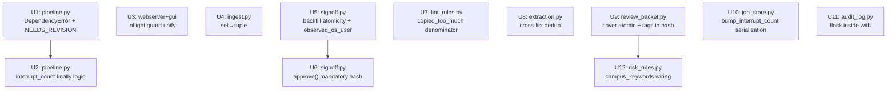

# fix: 4-agent bug sweep — 8 P1 + 6 P2 fixes

## Overview

4 個平行審查 agent（adversarial / security / correctness×2）對 main HEAD（833 tests，mypy 61 files 乾淨）做全面掃描，發現 8 個 P1 與 9 個 P2 bug。本計劃以測試先行方式依序修復所有 P1 及最高影響的 P2 bug，目標 CI 全綠，mypy 無新錯誤。

跳過 3 個「存在即已接受」的 P2（PID reuse reconcile、CSRF 架構說明、flock 已靠 close 釋放）；保留在 Residual Risks 節。

## Problem Frame

每個 bug 都是在 833 個綠色測試之外未被覆蓋的邊界行為：
- 兩個 pipeline.py P1：狀態機修復後衍生的 `DependencyError` 漏洞與 `NEEDS_REVISION` reconcile 盲點
- 一個 webserver.py P1：sync/async 各自獨立 inflight registry 未協調
- 兩個核心規則 P1：`set` 非確定性迭代 + `_accept` 跨類型 URL 去重缺失
- 兩個 signoff.py P1：`approve()` 可繞過哈希校驗 + `backfill` 非原子寫

## Requirements Trace

- R1. `DependencyError`（如 API key 缺失）必須使 job 落在 `PROCESS_FAILED`，不得流向中斷計數永不增加的無限重試循環
- R2. `NEEDS_REVISION` 崩潰後的殘留 `.processing` 必須由 `reconcile()` 正確偵測並呈現給 operator
- R3. 同一 job_id 的 sync `process()` 與 async `process_async()` 不得同時執行
- R4. 從 material 資料夾讀取正文/標題的結果必須跨 Python 進程確定性一致
- R5. `approve()` 必須在所有代碼路徑下驗證 body/title hash binding；`draft.json` 缺失時必須拒絕
- R6. `backfill_published_url` 必須以原子方式寫 `published_url.txt`（temp+replace），符合 codebase 一貫規範
- R7. `_copied_too_much` 計算的分子/分母必須使用相同基數（去重集合或原始列表）
- R8. 同一 URL 不得同時出現在 `image_urls` 和 `video_urls` 兩個列表中

## Scope Boundaries

- 不引入新 job 狀態；`NEEDS_REVISION` 進入 `RECONCILABLE_STATES` 是最小改動
- `DependencyError` → `PROCESS_FAILED`：不區分「不可重試配置錯誤」與 LLM 5xx；operator 可從 PROCESS_FAILED 判斷
- `ingest_dir` 路徑 jail（SEC-003）不在本計劃範圍，列入後續

## Context & Research

### Relevant Code and Patterns

- `pipeline.py:64-66` — `RECONCILABLE_STATES = frozenset({CRAWLED, CRAWLED_WARN, PROCESS_FAILED})`
- `pipeline.py:367` — `except ExternalServiceError:` 只捕 ExternalServiceError，DependencyError 穿透
- `pipeline.py:386-391` — `finally` 同時 clear_processing + clear_interrupt_count
- `pipeline.py:757-787` — reconcile() 對 NEEDS_REVISION 無對應分支，落入 "leave untouched"
- `webserver.py:85` — `_INFLIGHT_GUARDED = frozenset({"process", "create_and_crawl", "ingest_dir"})`，不含 async 變體
- `gui.py:270-296` — `_run_bg` 用 `_status_lock` + `_status[job_id]` 保護 async；與 `server.inflight` 完全獨立
- `ingest.py:26-27` — `_TEXT_NAMES = {"body.txt", ...}` / `_TITLE_NAMES = {"title.txt"}` 是 `set`
- `signoff.py:229-252` — `approve()` 的 `if draft is not None:` guard 可讓 draft 缺失時靜默跳過 hash 驗證
- `signoff.py:548-570` — `backfill_published_url` 用 `open('w')` 直寫，有 chmod 0600 在暴露後才執行
- `lint_rules.py:312-318` — `source_set = set(long_source)`，分子迭代 `source_set`，分母用 `len(long_source)`
- `extraction.py:73-75` — `if full in target or full in rejected_media_urls`，`target` 只是同類型的 list

### Institutional Learnings

- `docs/solutions/atomic-write-temp-replace.md` — 所有落盤寫入使用 temp+replace 模式
- `docs/solutions/fail-closed-catch-at-gate-boundary.md` — gate chain 必須 fail-closed；錯誤分類正確
- `docs/solutions/begin-immediate-isolation-level.md` — SQLite BEGIN IMMEDIATE 防止 TOCTOU
- `docs/solutions/unit-tests-mask-integration-bugs.md` — 測試使用 fake/stub 會遮蔽整合邊界

### External References

- Python `set` iteration order is hash-randomized (PYTHONHASHSEED); `tuple` gives stable order

## Key Technical Decisions

- **DependencyError 映射 PROCESS_FAILED**：`except (ExternalServiceError, DependencyError)` — 兩者都不可在中途讓 job 停在前狀態，統一落 PROCESS_FAILED 最安全；區分可留給 audit event 的 message 欄位
- **NEEDS_REVISION 加入 RECONCILABLE_STATES**：最小改動，保持「operator re-process 完整可見」語意；不加入 `_MARKER_ONLY_CLEAR_STATES`（那會清 marker 但不通知 operator）
- **inflight 統一**：選擇讓 `process_async` 也登記到 `server.inflight`（而非讓 sync path 改查 `_status`），因為 `server.inflight` 是整個 server 的 boundary guard；async bg thread 取得 inflight slot 後才啟動，完成後釋放
- **approve() fail-loud**：`load_draft` 返回 `None` 時主動 raise `InputValidationError`，不允許「無 draft 靜默過」；caller 可提前傳入 draft 來規避 disk I/O，但必須非 None
- **_copied_too_much 分母**：改用 `len(source_set)` — 與分子（迭代 source_set）一致；重複 source 段落不應稀釋 "已複製比例"
- **interrupt_count finally 邏輯**：只有「本次 invocation 是 crash-recovery 入口（_was_crash_entry=True）AND 以 ExternalServiceError 結束」時才保留 counter；其餘情況維持 "clean completion resets counter"

## Open Questions

### Resolved During Planning

- `DependencyError` 是否應有專屬 hold state？→ 否；PROCESS_FAILED 讓 operator 看見並手動修復配置，不需新狀態
- `_accept` 跨類型 check 需要同時 check malformed_media_urls？→ 是，一起加進條件
- `approve()` 失敗應 raise 什麼錯誤型別？→ `InputValidationError`（已有，符合錯誤層級）

### Deferred to Implementation

- `ingest_dir` path jail 邊界值怎麼定義（base_dir vs. 當前工作目錄）？→ 留後續計劃
- `DependencyError` audit message 要附帶哪些欄位？→ 與現有 PROCESS_FAILED audit 事件一致即可

## Implementation Units



---

- [ ] **Unit 1: pipeline.py — DependencyError 映射 PROCESS_FAILED + NEEDS_REVISION 進入 RECONCILABLE_STATES (P1: ADV-001, ADV-002)**

**Goal:** 消除兩個 pipeline 的可見性/安全性漏洞：DependencyError 穿透 except 導致 job stuck + interrupt counter 永不增加；NEEDS_REVISION 崩潰後對 reconcile() 不可見

**Requirements:** R1, R2

**Dependencies:** None

**Files:**
- Modify: `src/lcp/pipeline.py`
- Test: `tests/test_pipeline.py`（或 `tests/processor/test_pipeline_error_paths.py`）

**Approach:**
- `RECONCILABLE_STATES` 加入 `NEEDS_REVISION`（`frozenset({CRAWLED, CRAWLED_WARN, PROCESS_FAILED, NEEDS_REVISION})`）
- `process()` 的 `except ExternalServiceError` → 改為 `except (ExternalServiceError, DependencyError)`；兩者都 `persist_gate_state(PROCESS_FAILED)`
- 不改 finally 的 clear_processing（U2 專門處理 interrupt_count 邏輯）

**Patterns to follow:**
- 現有 `except ExternalServiceError:` block（`pipeline.py:367`）
- `RECONCILABLE_STATES` 宣告風格（`pipeline.py:64-66`）

**Test scenarios:**
- Happy path: `DependencyError` from `LlmClient.chat()` → job 落 `PROCESS_FAILED`（not stuck at CRAWLED）
- Happy path: reconcile() 對有 `.processing` marker + state=NEEDS_REVISION 的 job，正確放入 `interrupted[]`
- Edge case: `DependencyError` 的 interrupt counter 不被 finally 的 clear 無限重置（配合 U2 驗證）
- Integration: `DependencyError` 觸發後的 audit log 記錄正確事件型別

**Verification:**
- `pytest tests/test_pipeline.py -k "dependency_error or needs_revision_reconcile" -q` 全綠
- `RECONCILABLE_STATES` 包含 `NEEDS_REVISION`

---

- [ ] **Unit 2: pipeline.py — interrupt_count 不在 ExternalServiceError 路徑重置 (P2: ADV-003)**

**Goal:** 修正 finally 無條件 clear_interrupt_count 的邏輯，使 crash→ExternalServiceError→crash 序列能正確累積崩潰計數

**Requirements:** R1（間接）

**Dependencies:** Unit 1（先讓 DependencyError 也走 except 分支）

**Files:**
- Modify: `src/lcp/pipeline.py`
- Test: `tests/test_pipeline.py`

**Approach:**
- 在 `process()` 前段引入局部旗標 `_was_crash_entry = False`
- `bump_interrupt_count()` 被呼叫後設 `_was_crash_entry = True`
- finally 的 `clear_interrupt_count()` 條件改為：只在 `not _was_crash_entry` 時執行（clean start）；若 `_was_crash_entry=True` 且是 `except` 分支（ExternalServiceError / DependencyError），保留 counter，讓下次 reconcile 看到累積值
- 若 `_was_crash_entry=True` 但 `_process_inner` 成功完成（沒有觸發 except），才 clear（代表這次 crash-recovery 成功）
- 實作方式：`except` 分支加 `_raised_service_error = True`；finally 中 `if not (_was_crash_entry and _raised_service_error): clear_interrupt_count()`

**Patterns to follow:**
- `pipeline.py:386-391` 現有 finally 結構
- 既有的 `_pid_alive` 局部函數（`pipeline.py:762` 附近）作為 local helper 模式參考

**Test scenarios:**
- Sequence: crash → ExternalServiceError → crash（3 次循環）→ counter 最終達到 max_attempts，reconcile 呈現 exhausted=True
- Sequence: crash → clean success → counter 被清零
- Edge case: 首次 process()（無 crash entry）→ ExternalServiceError → counter 仍為 0

**Verification:**
- 測試涵蓋 crash/service-error 混合序列
- `clear_interrupt_count` 只在正確路徑被呼叫

---

- [ ] **Unit 3: webserver.py + gui.py — sync/async inflight guard 統一 (P1: SEC-002)**

**Goal:** 消除 `process_async` 與 `process` 可同時對同一 job 執行 Stage-2 的 race condition

**Requirements:** R3

**Dependencies:** None

**Files:**
- Modify: `src/lcp/webserver.py`
- Modify: `src/lcp/gui.py`
- Test: `tests/test_webserver_api.py`（或相應的 webserver 測試）

**Approach:**
- `_INFLIGHT_GUARDED` 加入 `"process_async"` 和 `"create_and_crawl_async"`（讓 webserver handler 在啟動 bg thread 前也登記 inflight slot）
- 關鍵：`_run_bg` 目前在 bg thread 內部執行 `_status` guard；改為在 `_run_bg` 入口（主 request thread）就取得 `server.inflight` slot，並確保 bg thread 完成後釋放
- 具體：`_run_bg` 先拿 `inflight_lock` + 加入 `server.inflight`，然後啟動 thread，thread 完成後 `inflight.discard`；`_status` 的 "already running" guard 可保留為第二道，但 inflight 登記必須在 thread 啟動前完成
- CLI path 無 `_run_bg`，不受影響

**Patterns to follow:**
- `webserver.py:365-377` 現有 sync path inflight guard 邏輯
- `gui.py:270-296` `_run_bg` 現有結構

**Test scenarios:**
- Happy path: `process_async(job_id)` 和 `process(job_id)` 同時抵達，第二個正確拿到 409/busy 回應
- Happy path: `process_async(job_id)` 完成後，`process(job_id)` 可正常執行
- Edge case: `create_and_crawl_async` + `create_and_crawl` 同 job_id 並發
- Integration: bg thread 崩潰後，inflight slot 仍被正確釋放

**Verification:**
- 無論 sync 先還是 async 先，第二個呼叫都得到 busy 回應
- bg thread 完成後 `server.inflight` 不殘留該 job_id

---

- [ ] **Unit 4: ingest.py — _TEXT_NAMES / _TITLE_NAMES 改為 tuple (P1: F1)**

**Goal:** 消除因 Python set hash 隨機化導致同一 material 資料夾在不同進程/執行間選出不同正文的非確定性

**Requirements:** R4

**Dependencies:** None

**Files:**
- Modify: `src/lcp/adapters/crawler/ingest.py`
- Test: `tests/test_ingest.py`（或 `tests/crawler/`）

**Approach:**
- `_TEXT_NAMES = ("body.txt", "content.txt", "text.txt", "source.txt")` — tuple，明確優先級
- `_TITLE_NAMES = ("title.txt",)` — tuple
- `_read_named` 簽名接受 `Iterable[str]` 或 `Sequence[str]`，行為不變（return first match）
- zip bundle 分支的 `not in _TEXT_NAMES` 檢查：tuple 的 `in` 運算子同樣有效，無需改動

**Patterns to follow:**
- `ingest.py:126` 的 `not in _TEXT_NAMES` 檢查（須確認 tuple 兼容）

**Test scenarios:**
- Happy path: material 資料夾同時有 `body.txt` 和 `source.txt`，永遠選 `body.txt`（tuple 首個匹配）
- Happy path: 只有 `source.txt`，正常選取
- Edge case: 無任何匹配 → 返回 None（行為不變）
- Integration: zip bundle 中 _TEXT_NAMES / _TITLE_NAMES 過濾仍正常工作

**Verification:**
- 同一多文件資料夾重複讀取結果一致
- mypy clean（Sequence[str] 型別注解）

---

- [ ] **Unit 5: signoff.py — backfill_published_url 原子寫 + observed_os_user 只取一次 (P1+P2: F2, F3)**

**Goal:** 消除 `backfill_published_url` 的非原子寫風險（SIGKILL 可留部分寫入文件）；同時修正同函數中 `observed_os_user()` 被呼叫兩次、可能產生不一致 audit record 的問題

**Requirements:** R6

**Dependencies:** None

**Files:**
- Modify: `src/lcp/adapters/publisher/signoff.py`
- Test: `tests/publisher/test_signoff.py`（或相應測試）

**Approach:**
- 仿照 `_write_0600`（`review_packet.py`）模式：`tmp = url_path.with_suffix(".tmp." + str(os.getpid()))`，寫到 tmp，`tmp.chmod(0o600)`，`os.replace(tmp, url_path)`
- `observed = observed_os_user()` 在函數開頭取一次；`actor=observed` 和 `extra["observed_os_user"]=observed` 共用同一值
- finally 清理：若 `os.replace` 前拋出，確保 tmp 被刪除（try/finally 包裹）

**Patterns to follow:**
- `src/lcp/adapters/publisher/review_packet.py` 的 `_write_0600` 原子寫模式
- 其他 signoff 函數（approve、reject）對 `observed_os_user()` 的單次取值慣例

**Test scenarios:**
- Happy path: `backfill_published_url` 正常完成後，`published_url.txt` 存在且 mode=0o600
- Edge case: write 失敗（mock IO error） → 不留殘留 tmp 文件
- Correctness: audit event 的 `actor` 和 `extra["observed_os_user"]` 值完全相同

**Verification:**
- `published_url.txt` 的寫入是原子的（無中間狀態可見）
- no tmp file left on failure

---

- [ ] **Unit 6: signoff.py — approve() 強制 hash binding（draft.json 缺失時 fail-loud） (P1: F6)**

**Goal:** 消除 `approve()` 在 `draft.json` 缺失時靜默跳過 body/title hash 校驗的安全漏洞，使「freeze binding ALWAYS enforced」的承諾成真

**Requirements:** R5

**Dependencies:** None

**Files:**
- Modify: `src/lcp/adapters/publisher/signoff.py`
- Test: `tests/publisher/test_signoff.py`

**Approach:**
- 在 `approve()` 的 `if draft is None: draft = load_draft(store, job_id)` 之後，立即 `if draft is None: raise InputValidationError("draft.json missing — rebuild review packet before approving")`
- 移除（或 invert）現有的 `if draft is not None:` guard，使 hash 校驗為無條件必執行
- 測試確保：caller 可以主動傳入 `draft=` 參數規避 disk I/O，但若不傳且 file 缺失 → 必定 raise

**Patterns to follow:**
- `approve()` 現有 `InputValidationError` 用法（其他欄位缺失時）

**Test scenarios:**
- Happy path: 正常 draft.json 存在 → approve 成功
- Error path: draft=None AND draft.json 不存在 → `InputValidationError("draft.json missing")`
- Error path: caller 傳入 `draft=None` 但 load_draft 返回 None（模擬文件刪除）→ 同上
- Edge case: caller 傳入有效 `draft` 物件（不讀 disk）→ hash check 正常執行，不 raise

**Verification:**
- `approve()` 在任何代碼路徑下都不可跳過 body/title hash 驗證
- 測試覆蓋 draft=None + draft.json 缺失的組合

---

- [ ] **Unit 7: lint_rules.py — _copied_too_much 分子/分母使用相同基數 (P1: CORE-1)**

**Goal:** 修正 source 段落有重複時比例被低估的邏輯錯誤，使「100% 複製唯一段落」正確返回 ratio=1.0

**Requirements:** R7

**Dependencies:** None

**Files:**
- Modify: `src/lcp/core/rules/lint_rules.py`
- Test: `tests/core/test_lint_rules.py`（或 `tests/test_lint_rules.py`）

**Approach:**
- 將 `return copied, copied / len(long_source)` 改為 `return copied, copied / len(source_set)`
- 分子（`sum(1 for p in source_set ...)`）與分母（`len(source_set)`）統一使用去重集合
- 語意：「body 複製了多少比例的唯一源段落」—— 重複 source 段落只算一次

**Patterns to follow:**
- 同函數現有 `source_set = set(long_source)` 建立邏輯

**Test scenarios:**
- Happy path: source 有 4 個完全相同的長段落，body 複製了 1 個 → ratio=1.0（100% 唯一段落被複製）
- Happy path: source 有 4 個不同段落，body 複製 2 個 → ratio=0.5
- Edge case: source 無重複段落，行為與修改前相同
- Edge case: body 未複製任何段落 → ratio=0.0

**Verification:**
- `pytest tests/ -k "copied_too_much" -q` 全綠，包含重複 source 場景

---

- [ ] **Unit 8: extraction.py — _accept 跨類型 URL 去重 (P1: CORE-2)**

**Goal:** 消除同一 URL 同時進入 image_urls 和 video_urls 的可能性，防止 double download + double SSRF preflight + 重複 manifest entry

**Requirements:** R8

**Dependencies:** None

**Files:**
- Modify: `src/lcp/core/rules/extraction.py`
- Test: `tests/core/test_extraction.py`（或 `tests/test_extraction.py`）

**Approach:**
- `_accept` 的 guard 從 `if full in target or full in rejected_media_urls or full in malformed_media_urls` 改為：
  ```
  if full in image_urls or full in video_urls or full in rejected_media_urls or full in malformed_media_urls:
      return
  ```
- 確保 `malformed_media_urls` 也在檢查範圍（已記錄的畸形 URL 不重複處理）

**Patterns to follow:**
- `extraction.py:73-78` 現有 `_accept` closure

**Test scenarios:**
- Happy path: `` + `<a href="clip.mp4">` → clip.mp4 只出現在其中一個 list（先到先得）
- Happy path: 兩個不同 video URL → 兩個都進入 video_urls
- Edge case: 已在 rejected_media_urls 的 URL 重新分類為 IMAGE → 不再入 image_urls
- Edge case: 已在 image_urls 的 URL 再次以 IMAGE 身份出現 → 正確去重（行為不變）

**Verification:**
- `image_urls ∩ video_urls = ∅`（任何時候）
- 測試覆蓋所有跨類型組合

---

- [ ] **Unit 9: review_packet.py — cover.jpg 原子複製 + tags 加入 body hash (P2: F4, F7)**

**Goal:** 兩個 review_packet.py P2 bug：(1) `shutil.copyfile` 非原子複製可讓崩潰凍結部分 cover；(2) `tags` 不在 body hash 範圍，reviewer 批准的 tags 可被靜默修改

**Requirements:** 無直接 R，但影響 data integrity

**Dependencies:** None

**Files:**
- Modify: `src/lcp/adapters/publisher/review_packet.py`
- Test: `tests/publisher/test_review_packet.py`

**Approach:**
- F4: 將 `shutil.copyfile(src, cover_path)` 改為 temp+replace：`tmp = cover_path.with_suffix(".tmp." + str(os.getpid()))` → `shutil.copyfile(src, tmp)` → `tmp.chmod(0o600)` → `os.replace(tmp, cover_path)` → 然後才 `_sha256_file(cover_path)`
- F7: `_draft_body_text` 中加入 `parts.extend(draft.tags)`（或在獨立 section 後 append）；freeze manifest 的 `body_sha256` 自然包含 tags；`approve()` 的 hash 校驗隨之覆蓋 tags

**Patterns to follow:**
- `_write_0600`（`review_packet.py`）— 同文件內的原子寫範本
- 現有 `_draft_body_text` 結構（append parts 模式）

**Test scenarios:**
- F4: cover 複製中途崩潰不留部分文件（mock `os.replace` 拋出 → 原始 cover_path 不存在）
- F7: 修改 draft.tags 後重算 body hash 不匹配 frozen hash → `approve()` 拒絕
- F7: tags 未修改 → `approve()` 通過（回歸）
- Integration: `_draft_body_text` 輸出包含 tags 字串

**Verification:**
- cover 複製是原子的
- tags 修改被 body hash 校驗捕捉

---

- [ ] **Unit 10: job_store.py — bump_interrupt_count read-modify-write 序列化 (P2: F5)**

**Goal:** 消除兩個並發呼叫 `bump_interrupt_count` 時因 TOCTOU 導致計數少增的問題

**Requirements:** 無直接 R，但影響 exhausted 旗標準確性

**Dependencies:** None

**Files:**
- Modify: `src/lcp/adapters/storage/job_store.py`
- Test: `tests/storage/test_job_store.py`（或 `tests/test_job_store.py`）

**Approach:**
- 方案 A（推薦）：在 `bump_interrupt_count` 中使用 per-job lock file（`job_dir / ".interrupt_lock"`），確保 read-modify-write 不可被並發中斷；或使用 `fcntl.flock(LOCK_EX)` 在計數文件本身
- 方案 B：將計數存入 SQLite（`BEGIN IMMEDIATE` + `UPDATE`），消除 filesystem TOCTOU；但需 schema 變更
- 選擇方案 A（最小改動，不改 schema）；lock file 在 finally 裡無條件釋放

**Patterns to follow:**
- `audit_log.py` 的 `fcntl.flock` 使用方式（注意 U11 修正 flock inside with）
- 現有 `bump_interrupt_count` 的 tmp+replace 原子寫模式（保留，加上 flock 包裹）

**Test scenarios:**
- Integration: 兩個 threads 並發呼叫 `bump_interrupt_count('job-x')`，最終 counter = 2（不是 1）
- Happy path: 單一呼叫計數 +1（行為不變）
- Edge case: 計數從 0 → 1 → 2 → 3 各步驟正確

**Verification:**
- 並發呼叫不丟失計數增量

---

- [ ] **Unit 11: audit_log.py — flock(LOCK_UN) 移到 with 塊內 (P2: F8)**

**Goal:** 修正 `fcntl.flock(LOCK_UN)` 在 `with f:` 關閉後執行（對已關閉 fd 操作）的邏輯反轉問題

**Requirements:** 無直接 R

**Dependencies:** None（但 U10 參考此 flock 模式，先修 U11）

**Files:**
- Modify: `src/lcp/adapters/storage/audit_log.py`
- Test: `tests/storage/test_audit_log.py`（或 `tests/test_audit_log.py`）

**Approach:**
- 將 `fcntl.flock(f.fileno(), fcntl.LOCK_UN)` 從外部 finally 移到 `with self.path.open('a') as f:` 的內部 finally（write → fsync → dir-fsync → LOCK_UN，全部在 with 塊內）
- 確保 LOCK_UN 在 file 關閉前執行，符合 "明確釋放鎖後再關閉" 的意圖

**Patterns to follow:**
- 現有 `audit_log.py` 的 try/finally 結構（調整層次）

**Test scenarios:**
- Happy path: 兩個並發寫入 audit log → 無交叉（行為不變）
- Correctness: `flock(LOCK_UN)` 在 fd 關閉前執行（不對已關閉 fd 操作）

**Verification:**
- `flock(LOCK_UN)` 呼叫時 fd 仍 open
- 測試在 macOS + Linux 均通過

---

- [ ] **Unit 12: risk_rules.py — KeywordRiskDetector.campus_keywords 接線 (P2: CORE-3)**

**Goal:** 修正 `campus_keywords` 欄位對 `_mentions_disabled_category()` 沒有任何作用的 dead field 問題，讓 operator 的自訂調整實際生效

**Requirements:** 無直接 R

**Dependencies:** None

**Files:**
- Modify: `src/lcp/core/rules/risk_rules.py`
- Test: `tests/core/test_risk_rules.py`（或 `tests/test_risk_rules.py`）

**Approach:**
- `_mentions_disabled_category(content: str)` 目前使用模組級常數 `_CAMPUS_KEYWORDS`；改為接受 `keywords: Sequence[str]` 參數
- `assess_risk` 呼叫時傳入 `detector.campus_keywords`（而非 `_CAMPUS_KEYWORDS`）
- `_CAMPUS_KEYWORDS` 常數保留作預設值，`KeywordRiskDetector` 初始化時 default = `_CAMPUS_KEYWORDS`
- 文件更新：`campus_keywords` 欄位說明補充「修改此欄位實際影響 disabled-category 偵測」

**Patterns to follow:**
- `KeywordRiskDetector` 其他欄位（`redline_keywords` 等）的傳遞模式

**Test scenarios:**
- Happy path: `KeywordRiskDetector(campus_keywords=())` → `assess_risk` 對含 `高中` 的內容返回 PASS（不再 NEEDS_HUMAN_REVIEW）
- Happy path: 預設 detector → 行為不變（`高中` → NEEDS_HUMAN_REVIEW）
- Edge case: 自訂 `campus_keywords=('某校', '私校')` → 偵測到自訂詞彙
- Regression: 其他 risk category 不受影響

**Verification:**
- `KeywordRiskDetector.campus_keywords` 修改後 `assess_risk` 行為同步改變

---

## System-Wide Impact

- **State machine:** `NEEDS_REVISION` 加入 `RECONCILABLE_STATES` — 不改任何轉移邊；只影響 `reconcile()` 的輸出（該 job 現在會出現在 interrupted list）
- **Error propagation:** `DependencyError` 不再穿透到 caller；所有 `LcpError` 子類在 `process()` 邊界有明確對應的 resting state
- **inflight guard:** 現有 CLI path 不受影響；webserver async path 取得 server.inflight slot 後才啟動 bg thread，與 sync path 統一
- **Hash integrity:** `_draft_body_text` 加入 tags → 所有現有測試如有依賴確切 SHA256 值的需更新（但測試通常 mock freeze，不應有 hard-coded hash）
- **API surface parity:** CLI/GUI parity 不受本計劃影響（所有修改在底層 adapters 或 pipeline）
- **Unchanged invariants:** 狀態機轉移邊不增加；`BLOCKED`/`DUPLICATE` terminal 語意不變；`SUPERSEDED` 不可逆性不變；SQLite schema 不變

## Risks & Dependencies

| Risk | Mitigation |
|------|------------|
| U9 (tags in hash) 破壞已存在的 frozen review packets | 已凍結的 freeze manifest 是歷史記錄；修改只影響新建的 packet；approve() 驗證的是同次 build 的 freeze |
| U3 (inflight unify) 讓 async start 因爭搶 inflight slot 而延遲 | bg thread 在 slot 釋放後即可運行；delay 只在真正並發時發生，是正確行為 |
| U1 (DependencyError catch) 可能掩蓋未預期的 DependencyError 子類 | 查看所有 DependencyError 使用點（API key, ffmpeg）；均應以 PROCESS_FAILED 落地 |
| U12 (campus_keywords 接線) 影響 `assess_risk` signature | `_mentions_disabled_category` 是模組內部函數，不屬於 public API |

## Documentation / Operational Notes

- `docs/solutions/atomic-write-temp-replace.md` — 可補充 cover.jpg case 作為第二個例子
- CLAUDE.md 的 Stage 2 失敗說明段：可補充「`DependencyError` 亦映射 PROCESS_FAILED」

## Sources & References

- Agent findings: adversarial (ADV-001~004), security (SEC-002), correctness×2 (F1~F8, CORE-1~3)
- Related code: `src/lcp/pipeline.py`, `src/lcp/webserver.py`, `src/lcp/gui.py`, `src/lcp/adapters/crawler/ingest.py`, `src/lcp/adapters/publisher/signoff.py`, `src/lcp/adapters/publisher/review_packet.py`, `src/lcp/core/rules/lint_rules.py`, `src/lcp/core/rules/extraction.py`, `src/lcp/core/rules/risk_rules.py`, `src/lcp/adapters/storage/job_store.py`, `src/lcp/adapters/storage/audit_log.py`
- Prior stabilization: `docs/plans/2026-06-18-001-fix-stabilize-and-harden-pipeline-plan.md` (completed)
- `docs/solutions/atomic-write-temp-replace.md`
- `docs/solutions/fail-closed-catch-at-gate-boundary.md`
