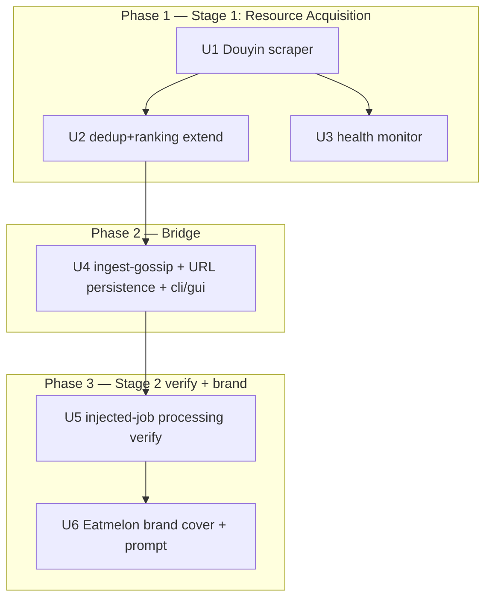

# feat: Gossip resource acquisition + lcp injection (Stages 1–3)

## Overview

Connect the standalone `gossip_scraper` hot-list aggregator to the `lcp`
processing pipeline, up to the point where injected jobs rest at
`REVIEW_PENDING` for the **existing manual** `approve → backfill --attest`
publish path. Three stages:

1. **Stage 1 (gossip_scraper)** — aggregate trending drama from more platforms,
   dedup + rank cross-platform, emit Top-N as a `GossipItem` list (URLs only).
2. **Bridge** — `lcp ingest-gossip` creates one lcp job per `GossipItem`
   (persisting each job's source URL), so lcp's **existing** Scrapy crawler can
   deep-crawl it (body + images).
3. **Stage 2 (lcp, existing)** — risk → media/cover → dedup → LLM copy → lint +
   grounding, unchanged. Verified to run on gossip-injected jobs and configured
   with the Eatmelon brand.

**Auto-publish (former Stage 3) is split into a separate follow-up plan**
(`2026-06-22-002-feat-auto-publish-pipeline-plan.md`). Review converged on three
reasons: it exceeds the operator's stated breadth-first priority (it was 7 of 13
units), its core safety control needs calibration work that is a gating
deliverable in its own right, and it carries an unresolved product blocker (does
the backend have its own review queue?). This plan therefore stops at
`REVIEW_PENDING`; the operator publishes via the existing one-click manual path,
which is fast, safe, and already built. That keeps this plan right-sized to the
stated priority (resource-acquisition breadth) and lets the compliance-sensitive
auto-publish path be planned on its own merits once its prerequisites exist.

## Problem Frame

Eatmelon is a 吃瓜 content account. `gossip_scraper` currently scrapes only
Weibo/Baidu/Bilibili/Tieba/Toutiao hot-list **metadata** (title, heat, URL) — no
article body, no cover. `lcp` has a full Scrapy crawler + processing pipeline but
has no batch-injection entry. The two are disconnected. Goal: a single run from
hot-list aggregation to processed, brand-styled review packets waiting for the
operator's one-click approval — widening the owner's resource-acquisition reach,
their stated #1 priority. (see origin:
docs/brainstorms/2026-06-22-gossip-pipeline-core-requirements.md)

## Requirements Trace

> R8 is intentionally absent: the origin doc resolved and removed it during review (the proposed `allow_domains` default change was unnecessary — open-crawl mode already covers the new domains). R12/R13/R14 (auto-publish, `--draft`) move to the follow-up plan `…-002-…`. The R-numbering is inherited from the origin doc; gaps are deliberate.

- R1. Add a **Douyin** hot-list scraper; Baidu/Bilibili/Toutiao/Tieba already exist (verify coverage). (Phase 1)
- R2. Extend dedup + ranking to cover all active platforms; reuse existing `GossipItem` cross-platform fields. (Phase 1)
- R3. Deep-crawl each Top-N URL for article body (≥300 chars = success) — via lcp's existing crawler. (Phase 2/3)
- R4. Capture page image URLs as cover candidates; they pass lcp's **existing** SSRF guard. (Phase 2/3)
- R5. Deep-crawl uses Scrapy — i.e. lcp's existing `crawl_runner`, no third framework. (Bridge)
- R6. Batch-injection entry: accept a `GossipItem` list, create one lcp job each, **persisting** each job's source URL for the deferred crawl. (Bridge)
- R7. Top-N filtering on the gossip_scraper side (already implemented via `--top`). (Phase 1, verify)
- R9. Confirm cover generation works on injected jobs; configure Eatmelon brand template; **text-only template cover is a required deliverable**. (Phase 3)
- R10. Confirm copywriter (`--ai-copy`) works on injected jobs; extend prompt for Eatmelon tone. (Phase 3)
- R11. Confirm watermark-ADD works on injected jobs, no change. (Phase 3)
- R15. Per-platform scraper health monitoring: 7-day success rate <60% → ERROR log. (Phase 1)

## Success Criteria

Carried from the origin requirements doc (preserved so implementation has a measurable target):

- **Single run to ready-for-review**: from `gossip_scraper` to injected jobs resting at `REVIEW_PENDING` with cover + AI copy + watermark, no manual step *before* the operator's one-click approve (R6, R9, R10, R11).
- **Breadth**: ≥50 cross-platform-deduped candidates per run (R1, R2, R7). A goal value dependent on cross-platform event overlap, not a pass/fail of the pipeline. Tie to a Phase-1 verification step.
- **Deep-crawl body success ≥80%** (body ≥300 chars = "success"; failures park at a hold state, never silently dropped) (R3, R5). Tie to a Phase-3 verification step.
- **≥1 usable cover** per job; failure degrades to the text-only template, never blocks the pipeline (R4, R9).

## Scope Boundaries

- **Auto-publish is out of scope here** — deferred to `…-002-…`. This plan stops at `REVIEW_PENDING`; publishing is the existing manual `approve → backfill --attest` path.
- No direct CMS integration (小红书/WeChat).
- No de-watermark (CUT 2026-06-17; not revived).
- lcp stays usable standalone; the gossip path is additive and changes no existing behavior.
- No image NCII risk scanning.
- **Zhihu (知乎) is not added** — it was intentionally dropped from the scraper roster earlier in the brainstorm (replaced by Bilibili + Toutiao). Re-adding it is a future breadth decision, not part of this plan. (Flagged by review; recorded here as a deliberate non-goal.)

## Context & Research

### Relevant Code and Patterns

**gossip_scraper** — duck-typed scrapers (`platform: str` + `async def fetch(self, limit=50) -> list[GossipItem]`); `SCRAPERS` registry + `run()` in `__main__.py`; `core/dedup.py`, `core/ranking.py`; `--top` does Top-N (R7). Weibo `url` = `s.weibo.com/weibo?q={word}` (search page); Baidu `url` = real article when available else search page (`baidu.py` fetches `top.baidu.com/board?tab=realtime`, the 百度热搜 board).

**lcp job creation + crawl** — jobs are created then processed by `job_id`. **Important constraint (review P0):** the crawl URL is supplied on the command line at crawl time and is **never persisted in the SQLite index** (PII-free by construction). `cli.py run` / `gui.py create_and_crawl` require URL + job_id together; there is no "crawl an existing job by id" path today. Job bundles under `data/jobs/<id>/` are the PII-bearing, 0600, gitignored plaintext store — the correct home for a persisted source URL.

**lcp crawler** — `adapters/crawler/crawl_runner.py` shells a Scrapy subprocess with scrubbed `minimal_env`; SSRF guard `net_guard.assert_global_ip`/`validate_url` rejects private/loopback/metadata IPs on the top URL and every scraped media URL (so R4 is already satisfied). `net_guard.validate_url` raises on an empty/invalid string (relevant to ingest shadow paths).

**Stage-2 gates** — `Pipeline.process` runs risk → media (cover, `adapters/processor/media_checker.py`) → dedup → assemble (LLM copywriter `adapters/llm/copywriter.py`, runs when `ai_copy=True`) → lint + grounding, unchanged. An injected job created at `NEW` and crawled to `CRAWLED` runs the identical chain — no gate change needed.

**CLI/GUI/webserver mirror** — `cli.py` commands each mirror a `gui.py` `Api` method; `webserver.py` auto-discovers `Api` public methods via `public_routes(Api)`; JS via the `BRIDGE` Proxy (`web/app.js`). Any new operator action (ingest) must land in both shells.

### Institutional Learnings

- `docs/solutions/atomic-write-temp-replace.md` — a persisted source-URL file in the job dir uses `_atomic_write_0600`.
- `docs/solutions/unit-tests-mask-integration-bugs.md` + `real-happy-path-unreachable-masked-by-green-tests.md` — the injected-job verification (Unit 5) must drive the real `ingest → crawl → process → REVIEW_PENDING` chain, not a `persist_gate_state` shortcut.
- `docs/solutions/begin-immediate-isolation-level.md` — any job-state write uses `BEGIN IMMEDIATE` (`set_state` already does).

### External References

None required — all patterns have ≥3 direct in-repo examples.

## Key Technical Decisions

- **gossip_scraper produces URLs only; lcp does all crawling.** Honors the Scrapy subprocess-isolation model and reduces R3/R4/R5 to verification of the existing crawler. The crawler's `is_global` guard already satisfies R4 (no new SSRF surface).
- **Persisted source URL resolves the ingest→crawl gap (review P0 #3).** `ingest-gossip` writes each job's `GossipItem.url` to a job-dir file (`data/jobs/<id>/source.json`, `_atomic_write_0600`) — NOT the PII-free SQLite index — and creates the job at `NEW`. A new `run --job-id <id>` path (no `--url`) reads that file to drive the existing crawl. This keeps injection cheap (no inline crawl), keeps the URL out of the PII-free index, and enables batch/retry crawl by job_id. *(Alternative considered: drive `stage1` inline per item from `ingest_gossip` — rejected to keep injection cheap and crawl retriable, and to preserve the "create then process by id" model.)*
- **v1 deep-crawl treats the `GossipItem.url` landing page as the content source.** Article URLs (Baidu often, Toutiao) → the article; search/topic pages (Weibo always, Baidu fallback) → the aggregated top posts (acceptable for a 吃瓜 digest). The ≥300-char gate parks thin pages (→ NEEDS_REVISION/BLOCKED, never silently dropped). No second "select representative article" hop in v1. *(Note: review flagged that a 300-char scrape of a search page can be incoherent fragments; on the manual path the operator catches this at review, which is exactly why auto-publish — where no one would — is deferred.)*
- **Publishing stays the existing manual path.** Injected jobs reach `REVIEW_PENDING`; the operator uses the existing `approve → backfill --attest` one-click flow. No state-machine change in this plan.

## Open Questions

### Resolved During Planning

- **ingest→crawl URL gap (R6)** → persist `GossipItem.url` in `data/jobs/<id>/source.json`; add a `run --job-id` path that reads it. [Architecture]
- **Hot-list URL type (R3)** → Weibo = search page, Baidu = article-or-search; v1 deep-crawls the landing page as-is, ≥300-char gate filters. [URL structure]
- **Deep-crawl ownership (R3/R6)** → lcp's existing Scrapy crawler; gossip_scraper emits URLs only. [Architecture]
- **Zhihu** → deliberate non-goal (dropped earlier in the brainstorm). [Scope]

### Deferred to Implementation

- **Douyin SPA feasibility** — JS-rendered SPA; plain-HTTP Scrapy may not reach the board/body. Confirm with a real request. If it fails, Douyin ships best-effort (few/no items) + a health-log entry — **not a blocker** for other platforms. [Needs validation]
- **Cover image selection** — v1 = first available image by appearance order.
- **Copywriter Eatmelon prompt wording** — tune against real LLM output.
- **Brand template assets** — operator provides logo + color spec; the text-only template is built regardless.

## Implementation Units

- [ ] **Unit 1: Douyin hot-list scraper**

**Goal:** Add a Douyin scraper to widen 吃瓜 coverage; confirm existing platforms suffice.

**Requirements:** R1

**Dependencies:** None

**Files:**
- Create: `gossip_scraper/scrapers/douyin.py`
- Modify: `gossip_scraper/__main__.py` (`SCRAPERS` + `DEFAULT_PLATFORMS`)
- Test: `tests/gossip_scraper/test_douyin.py`

**Approach:** `DouyinScraper` with `platform = "douyin"` + `async def fetch(self, limit=50)`, matching the duck-typed interface. Prefer a public hot-list JSON/Ajax endpoint over HTML (Douyin web is a JS SPA). If unreachable over plain HTTP, return `[]` + log a health failure (the `run()` orchestrator already catches per-scraper exceptions). Populate `url` with the best available link.

**Execution note:** Confirm the endpoint with a real request first. The fallback contract must be deterministic: choose **return `[]` + health-log** (not raise) so a Douyin outage is a clean per-platform miss, never a batch failure — and assert that choice in tests.

**Patterns to follow:** `gossip_scraper/scrapers/weibo.py` (Ajax JSON), `gossip_scraper/scrapers/baidu.py` (SSR-embedded JSON).

**Test scenarios:**
- Happy path: a recorded fixture parses into `GossipItem`s with non-empty `title`, populated `url`, `platform == "douyin"`, ascending `rank`.
- Edge case: empty/missing data → `[]`, no raise.
- Error path: HTTP error/unparseable body → returns `[]` + records a health failure (the chosen deterministic contract), asserted explicitly.
- Edge case: `limit` truncates.

**Verification:** `python -m gossip_scraper --platform douyin --json` returns items or a clean per-platform miss; other platforms unaffected.

- [ ] **Unit 2: Extend dedup + ranking across active platforms**

**Goal:** Cross-platform dedup + ranking cover all active platforms (incl. Douyin); Top-N (R7) holds.

**Requirements:** R2, R7

**Dependencies:** Unit 1

**Files:**
- Modify (only if platform-specific assumptions exist): `gossip_scraper/core/dedup.py`, `gossip_scraper/core/ranking.py`
- Test: `tests/gossip_scraper/test_dedup.py`, `tests/gossip_scraper/test_ranking.py`

**Approach:** Audit `dedup`/`rank` for hard-coded platform lists/weighting; generalize so a new platform needs no edits. Reuse `cross_platform_count`/`merged_from`/`score`. Confirm `--top` slices after rank. (Note: `created_at`/freshness defaults to 0 for some scrapers; ranking already guards `created_at > 0`, so Top-N still works on heat+surprise — not a blocker.)

**Patterns to follow:** existing `dedup()`/`rank()` usage in `__main__.py`.

**Test scenarios:**
- Happy path: same event from 3 platforms merges → `cross_platform_count == 3`, `merged_from` lists all 3.
- Edge case: similar-but-distinct events ("吴磊新剧" vs "吴磊塌房") do not merge.
- Happy path: `rank` orders by `score` desc; `--top N` yields exactly N (or all if fewer).
- Edge case: empty input → empty output.

**Verification:** stable ordering with Douyin included; no platform-name conditionals remain.

- [ ] **Unit 3: Per-platform scraper health monitoring**

**Goal:** Record per-platform success/failure each run; ERROR log when a platform's 7-day success rate <60%.

**Requirements:** R15

**Dependencies:** Unit 1

**Files:**
- Create: `gossip_scraper/core/health.py`
- Modify: `gossip_scraper/__main__.py` (record in `_fetch_one`)
- Test: `tests/gossip_scraper/test_health.py`

**Approach:** Append a bounded JSONL health record per platform per run (ts, platform, ok/fail, item count); compute the rolling 7-day rate; <60% → one ERROR log line. No DB. (Note: this is a log line, not an actuator — a degraded scraper keeps feeding the pipeline until a human reads the log. Acceptable on the manual-review path; revisit if auto-publish ships.)

**Test scenarios:**
- Happy path: a platform succeeding every run → no ERROR.
- Error path: >40% failures in the last 7 days → exactly one ERROR naming the platform + rate.
- Edge case: <full window of records → no false alarm.
- Edge case: a platform with zero runs in the window is not reported.

**Verification:** a simulated failing platform triggers the ERROR; healthy platforms stay quiet.

- [ ] **Unit 4: `ingest-gossip` batch-injection + source-URL persistence (core + cli + gui)**

**Goal:** Accept a `GossipItem` JSON list; create one lcp job per item; **persist each job's source URL** so the existing crawler can deep-crawl it by job_id. Non-lossy skip reporting + duplicate policy + batch cap. Mirror across CLI + GUI.

**Requirements:** R5, R6

**Dependencies:** Unit 2

**Files:**
- Create: `src/lcp/adapters/storage/gossip_ingest.py` (parse `GossipItem` JSON, validate, write `source.json`)
- Modify: `src/lcp/pipeline.py` (`Pipeline.ingest_gossip(items, *, ts) -> IngestReport`; a `run`/`stage1` path that reads `data/jobs/<id>/source.json` when `--url` is absent)
- Modify: `src/lcp/cli.py` (new `ingest-gossip` command, JSON file/stdin; `run --job-id` without `--url`)
- Modify: `src/lcp/gui.py` (`Api.ingest_gossip(items_json)`, `@bridge_safe`; mirror the job-id crawl)
- Modify: `src/lcp/web/app.js` (operator affordance; required for parity if a UI control is added)
- Test: `tests/test_gossip_ingest.py`, `tests/test_cli_ingest_gossip.py`, `tests/test_webserver_ingest_gossip.py`

**Approach:**
- For each item: validate `url` with the **same** `net_guard` scheme allowlist, wrapped so an empty/invalid URL becomes a **skip-with-reason**, not a raise. Create the job at `NEW`; write `GossipItem.url` (+ minimal provenance) to `data/jobs/<id>/source.json` via `_atomic_write_0600`. The crawler re-checks DNS `is_global` at crawl time.
- **Fail-open per item** but the returned `IngestReport` MUST enumerate skipped items + reasons (non-lossy); CLI/GUI surface the count.
- **Duplicate-URL policy:** dedup within the batch (a duplicate reaching ingest signals an upstream ranking bug, since cross-platform merge already dedups).
- **`max_items` cap** (config/constant): an oversized batch is refused with a clear error.
- `run --job-id <id>` (no `--url`) reads `source.json` and drives the existing crawl → `CRAWLED`; then the existing `process` runs the unchanged gate chain.
- `Api.ingest_gossip` first (cli + webserver route through it).

**Execution note:** Start with a failing test for the JSON → jobs + persisted-URL → crawl-by-job-id contract (the review-P0 gap is the highest-risk part).

**Patterns to follow:** `cli.py`/`gui.py` `process`/`approve`; `pipeline.py` `build_packet` wrapper; `config_io.py::_atomic_write_0600`; `tests/test_webserver_*`.

**Test scenarios:**
- Happy path: a 5-item list → 5 jobs at `NEW`, each with a `source.json` holding its URL; `run --job-id` on one drives it to `CRAWLED`.
- Edge case: empty list → zero jobs, no error.
- Error path/security: a private-IP/non-allowlisted/empty URL is skipped AND present in the returned skip report (non-lossy); other items still ingest.
- Edge case: an item missing required `GossipItem` fields (platform/rank/title) → skip + reason, no crash.
- Edge case: a non-list / non-JSON top-level payload → clear error, zero jobs.
- Edge case: duplicate URLs in one batch → deduped (asserted policy).
- Edge case: a batch over `max_items` → refused with a clear error, zero jobs created.
- Integration: `POST /api/ingest_gossip` creates jobs that appear in `list_jobs`; `run --job-id` crawls one end-to-end.
- Integration: parity — `cli.py` and `Api` produce identical state for the same input.

**Verification:** `lcp ingest-gossip items.json` → `lcp list` shows new `NEW` jobs + a skip summary; `lcp run --until review --job-id <id>` (no `--url`) crawls + processes one to `REVIEW_PENDING`.

- [ ] **Unit 5: Verify existing Stage-2 processing on gossip-injected jobs**

**Goal:** Prove injected jobs flow through the unchanged gate chain to `REVIEW_PENDING`; deep-crawl extracts body (R3) + image URLs (R4) under the existing SSRF guard.

**Requirements:** R3, R4, R9 (cover runs), R10 (copy runs), R11 (watermark runs)

**Dependencies:** Unit 4

**Files:**
- Modify (only if a gap is found): `src/lcp/adapters/crawler/*`, `src/lcp/adapters/processor/media_checker.py`
- Test: `tests/test_gossip_injected_processing.py`, extend `tests/test_e2e_pipeline.py`

**Approach:** Drive a fixtured article URL and a search/topic URL through `ingest_gossip → run --until review`; assert `REVIEW_PENDING` with body ≥300 chars + ≥1 cover candidate, OR a park at `NEEDS_REVISION`/`BLOCKED` (no silent drop). Confirm a private/loopback image URL is rejected by the SSRF guard. Primarily verification/characterization; code only if the crawler under-extracts.

**Execution note:** Characterization-first — capture current extraction on both page shapes before changing crawler code. Drive the real chain (no `persist_gate_state` shortcut).

**Patterns to follow:** `tests/test_e2e_pipeline.py` (full chain); existing crawler SSRF tests.

**Test scenarios:**
- Happy path (article URL): body ≥300 chars; ≥1 image candidate; reaches `REVIEW_PENDING`.
- Happy path (Weibo search URL): aggregated top-post text; ≥300 chars → `REVIEW_PENDING`, else `NEEDS_REVISION`.
- Error path: <300-char body → `NEEDS_REVISION` (not silently passed).
- Security: a scraped image URL on a private/loopback IP is rejected.
- Integration: cover/copy/watermark gates all execute for an injected job (outputs/audit events exist).

**Verification:** an injected job reaches `REVIEW_PENDING` with body + cover + AI copy + watermark, or parks with a reason — never silently incomplete.

- [ ] **Unit 6: Eatmelon brand cover template + copywriter prompt**

**Goal:** Eatmelon brand cover (logo + colors) + a required **text-only template cover**; copywriter prompt for Eatmelon fixed-format tone.

**Requirements:** R9, R10

**Dependencies:** Unit 5

**Files:**
- Modify: cover-generation module (`media_checker.py` or its helper); `src/lcp/adapters/llm/copywriter.py`
- Create: brand asset(s) at a config-referenced path
- Test: `tests/processor/test_cover_brand.py`, `tests/test_copywriter_eatmelon.py`

**Approach:** Text-only template cover is first-class (no usable image → render title on the branded background). v1 image selection = first available by appearance. Copywriter prompt change keeps zero-capability (text in/out, attacker-shapeable fields stay escaped).

**Patterns to follow:** existing cover generation; existing copywriter prompt + escaping.

**Test scenarios:**
- Happy path: ≥1 image → branded cover from the first image.
- Happy path (required): no usable image → text-only branded template cover (not a failure).
- Edge case: a very long title is truncated/wrapped.
- Happy path: copywriter output follows the Eatmelon fixed format (quick_facts/summary/faq) for a sample body.
- Security: a prompt-injection body does not change output structure / does not escape zero-capability.

**Verification:** both cover paths produce a valid `cover.jpg`; copywriter output matches the Eatmelon format.

## System-Wide Impact

- **Interaction graph:** new code touches `gossip_scraper` (new scraper + health), `adapters/storage/gossip_ingest.py`, `pipeline.py` (ingest wrapper + job-id crawl path), both shells (`cli.py`/`gui.py`/`web`), and the cover/copywriter adapters. `webserver.py` auto-exposes `Api.ingest_gossip`; the parity guard must see it.
- **Error propagation:** ingest fails open per item (skip + non-lossy report); a bad/empty URL is a skip, not a crash. Crawl failures use the existing crawler error paths (CRAWL_FAILED). No new terminal states.
- **State lifecycle risks:** the persisted `source.json` lives in the PII-bearing job dir (0600), never the PII-free index — preserving the index invariant. The new `run --job-id` path must validate the job is at a legal pre-crawl state (`NEW`) before reading `source.json`.
- **API surface parity:** `ingest-gossip` + `run --job-id` need cli + gui(Api) + web coverage.
- **Integration coverage:** Units 4 and 5 are the cross-layer proofs (injected job → persisted URL → crawl → gates → `REVIEW_PENDING`) that mocks alone cannot establish.
- **Unchanged invariants:** the entire lcp state machine, all Stage-2 gates and holds, the manual `approve → backfill --attest` path, `dry_run`, and the PII-free index are untouched. This plan adds an entry path; it changes no existing behavior.

## Risks & Dependencies

| Risk | Mitigation |
|------|------------|
| ingest→crawl URL gap (review P0): URL not persisted, batch crawl impossible | Persist `GossipItem.url` in `data/jobs/<id>/source.json`; new `run --job-id` reads it (Unit 4). |
| Douyin JS SPA unreachable by plain-HTTP Scrapy | Ship best-effort (deterministic `[]` + health log); not a blocker for other platforms; feasibility confirmed at impl time. |
| Aggregator URL = search page, not article (Weibo); 300-char body may be incoherent fragments | v1 deep-crawls the landing page; ≥300-char gate parks thin pages; **the operator catches incoherent bodies at manual review** (the reason auto-publish, where no one would, is deferred). |
| Copyright: LLM-rewriting scraped third-party content | On the manual path the operator reviews each piece before publishing — judgement preserved. The legal-acceptance decision is carried as a blocker into the auto-publish plan, where the risk profile changes. |
| ingest shadow paths (empty/missing-field items) | Wrapped `net_guard` validation → skip-with-reason; explicit tests (Unit 4). |
| Gamed/huge hot-list fans out into unbounded jobs | `max_items` cap + non-lossy skip report (Unit 4). |
| Health monitoring is a log line, not an actuator | Acceptable on the manual-review path; revisit when auto-publish ships. |

## Documentation / Operational Notes

- Document the `ingest-gossip` workflow: run `gossip_scraper --top N --json > items.json`, then `lcp ingest-gossip items.json`, then `lcp run --until review` per job (or batch), then the existing one-click `approve`/`backfill --attest`.
- Run `./.venv/bin/mypy` (venv, not pyenv) + `pytest -q` before merge; CI must be green.

## Sources & References

- **Origin document:** [docs/brainstorms/2026-06-22-gossip-pipeline-core-requirements.md](docs/brainstorms/2026-06-22-gossip-pipeline-core-requirements.md)
- **Follow-up (auto-publish):** [docs/plans/2026-06-22-002-feat-auto-publish-pipeline-plan.md](docs/plans/2026-06-22-002-feat-auto-publish-pipeline-plan.md)
- gossip_scraper: `gossip_scraper/__main__.py`, `gossip_scraper/scrapers/{weibo,baidu}.py`, `gossip_scraper/core/{dedup,ranking}.py`
- Job creation / crawl / PII-free index: `src/lcp/pipeline.py`, `src/lcp/adapters/crawler/crawl_runner.py`, `src/lcp/adapters/storage/`
- Cover / copywriter: `src/lcp/adapters/processor/media_checker.py`, `src/lcp/adapters/llm/copywriter.py`
- CLI/GUI/webserver mirror: `src/lcp/cli.py`, `src/lcp/gui.py`, `src/lcp/webserver.py`, `src/lcp/web/app.js`
- Atomic write: `src/lcp/adapters/storage/config_io.py::_atomic_write_0600`
- Learnings: `docs/solutions/{atomic-write-temp-replace,unit-tests-mask-integration-bugs,real-happy-path-unreachable-masked-by-green-tests,begin-immediate-isolation-level}.md`

## Phased Delivery

### Phase 1 — Stage 1: Resource Acquisition (user's stated priority)
Units 1, 2, 3. Ships standalone value: wider hot-list coverage + dedup/rank + health monitoring, independent of lcp.

### Phase 2 — Bridge
Unit 4. `ingest-gossip` + source-URL persistence connects the two systems; injected jobs run through the existing (unchanged) lcp flow.

### Phase 3 — Stage 2 verification + branding
Units 5, 6. Confirm processing on injected jobs to `REVIEW_PENDING`; Eatmelon cover + tone. The operator publishes via the existing one-click manual path.

→ Auto-publish: see `docs/plans/2026-06-22-002-feat-auto-publish-pipeline-plan.md` (blocked on prerequisites).
