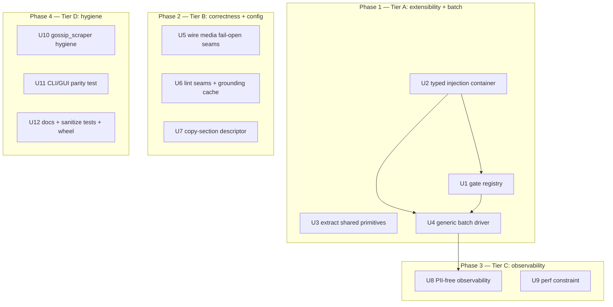

# refactor: lcp engine extensibility + operational robustness

## Overview

A behavior-preserving hardening pass on the `lcp` engine: turn extension operations
(add a gate / add an adapter / batch-process / add a copy section) from multi-file
surgery into localized, data-level edits; close verified config fail-opens; add a
generic batch worklist driver and PII-free observability; and bring `gossip_scraper`
under the project's own engineering bar. The work is **standalone engine health**,
not a gossip unblock (see Problem Frame) — but it lowers the risk of the *eventual*
auto-publish surgery owned by plan-002.

## Problem Frame

`lcp`'s internals are mature (functional-core/imperative-shell, single-authority
state machine, ~800 zero-mock tests, two-tier mypy gate) but three verified
maturity gaps remain:

1. **Extension is surgery.** The Stage-2 gate chain is a hand-written copy-paste
   sequence (`pipeline.py:402-599`); `Pipeline.__init__` takes a fixed adapter set
   so a new adapter touches every constructor + test; the atomic-0600 write
   primitive exists in **7 copies across 5 contracts**.
2. **Config seams half-built (a real fail-open).** `media_checker.py:160-168` calls
   `judge_video` without fps/size enforcement, so an oversized / wrong-fps video
   **passes silently**; `build_lint_config` (`draft_linter.py:55-64`) drops
   `hype_words`/`min_copy_chars`. (Counter-example: `DedupScoreParams` *is* wired —
   `dedup_checker.py:145` — so the fix is targeted, not blanket.)
3. **No generic batch / observability.** No "process all jobs in state X" entry;
   `crawl --input` silently uses only the first URL (`cli.py:181-191`); structured
   signal is failure-only `logger.warning` + the PII-free audit log.

**Ownership boundaries (load-bearing — verified against the working tree):**
- **plan-002** (`docs/plans/2026-06-22-002-feat-auto-publish-pipeline-plan.md`,
  `status: blocked`) owns the auto-publish actuator, the `core/state.py`
  `AUTO_PUBLISHED`/`PUBLISH_FAILED` edges, and the `Publisher` Protocol. **This plan
  does not touch `core/state.py` or add a publisher.** It only de-risks that future
  surgery by making "add a state-landing gate" (R1) and "add an adapter" (R2) clean.
- **plan-001** (`...-001-feat-gossip-pipeline-core-plan.md`, `status: active`) owns
  the gossip bridge (`ingest-gossip`), `gossip_scraper` *feature breadth* (Douyin
  etc.), and the dedup/ranking platform-decoupling. **This plan touches
  `gossip_scraper` only for engineering hygiene** (R10: URL quoting + mypy gate).
- This plan owns: generic engine refactors, the generic batch driver, observability,
  cross-cutting hygiene.

(see origin: docs/brainstorms/2026-06-22-lcp-extensibility-robustness-requirements.md)

## Requirements Trace

- **R1** [Tier A] Stage-2 gate chain → declarative ordered registry; preserve
  fail-closed order; "add a hold-producing gate" is a data edit, not a 2-site core
  change (absorbs former R11).
- **R2** [Tier A] Typed injection container for adapters; preserve the `dry_run`
  fail-loud coercion/refusal and `mypy --strict`-checkable adapter types.
- **R3** [Tier A] Extract duplicated primitives: atomic-0600 write, SQLite
  connect/init scaffolding, datamark delimiter, `_completion_advisory`.
- **R4** [Tier B] Single declarative copy-section descriptor.
- **R5a** [Tier B] Wire the fail-open media config seams (`video_fps`,
  `max_video_size_mb`); wire-or-remove the lint seams (`hype_words`,
  `min_copy_chars`); `DedupScoreParams` already wired (no change).
- **R5b** [Tier B] Fix the cross-job `lru_cache` retention in `grounding.py:118`
  (per-verify local memo, not deletion).
- **R6** [Tier A] Generic batch worklist driver (`process --all-state <state>`),
  per-job independent, aggregate `--json`; fix the `crawl --input` footgun.
- **R7** [Tier C] PII-free observability: batch-run summary, per-platform crawl
  rollup, LLM token/latency/outcome (enum codes), per-rule counts.
- **R8** [Tier C] Performance constraint: no full MinHash rebuild per dedup;
  converge `reconcile()` connection/marker fan-out (approach deferred).
- **R10** [Tier D] `gossip_scraper` hygiene: safe URL quoting + bring under the
  mypy gate (feature breadth/ranking stay with plan-001).
- **R12** [Tier D] Mechanize the CLI↔GUI 1:1 mirror with a parity test.
- **R13** [Tier D] Tests for `text_sanitize.py`.
- **R14** [Tier D] CONTRIBUTING / extension guide.
- **R-opt** [Tier D] Ship `web/` assets in the wheel (`package-data`).

## Scope Boundaries

- **No `core/state.py` edges, no `Publisher`, no auto-publish** — plan-002 owns it.
- **No gossip bridge / scraper feature breadth / ranking decoupling** — plan-001.
- **No cross-language/domain profile extraction** (the brainstorm's deferred "B"
  direction): business-policy constants stay in source; only existing config seams
  get wired.
- **No distribution work** (LICENSE/PyPI) beyond the one-line `web/` wheel fix.
- **No JS-SPA crawl** (plan-001 feasibility), **no de-watermark** (CUT 2026-06-17).
- **Behavior-preserving for R1–R3**: the ~800-test suite is the regression oracle.

## Context & Research

### Relevant Code and Patterns

- **Gate chain & injection:** `pipeline.py:123-133` (`ProcessResult`, `stopped_at`
  is a free-form literal), `:182-220` (`__init__` + dry_run coercion), `:402-599`
  (`_process_inner`), `:281-400` (`process()` marker scope + `ExternalServiceError`
  → `PROCESS_FAILED`). Gate seam: `adapters/processor/_persist.py:34-55`
  (`persist_gate_state` → `store.persist_from_processing`).
- **Pure gates** (uniform `.job_state` park-or-pass): `risk_checker.py:32`,
  `media_checker.py:46`, `dedup_checker.py:52`, `draft_linter.py:51`.
- **Primitives (R3):** atomic-0600 write in 7 places / 5 contracts —
  `storage/manifest.py:43` (no chmod), `storage/draft_store.py:45` (inline),
  `storage/config_io.py:165` (`mkstemp`/O_EXCL — the best variant),
  `publisher/review_packet.py:95`, `publisher/signoff.py:558` (inline, non-pid tmp),
  `crawler/scrapy_impl.py:376` + `crawler/ingest.py:30` (bytes, in-place,
  subprocess). SQLite: `storage/job_store.py:76/151/161` vs `storage/source_store.py:77/83`
  (`_chmod_db_0600` already shared). Delimiter: `llm/assembler.py:55` +
  `llm/copywriter.py:71`. Advisory: `cli.py:44` + `gui.py:79`.
- **Config seams (R5):** `media_checker.py:160-168`, `asset_rules.py:156-169`
  (`judge_video` has `min_fps/max_fps` but no size param), `draft_linter.py:55-64`,
  `lint_rules.py:108-121` (`LintConfig` has the fields), `config.py:33-36`
  (`MediaConfig.video_fps:int`, `max_video_size_mb:int`), `config.py:57-64`
  (`ContentConfig` lacks `hype_words`/`min_copy_chars`), `grounding.py:118-130`
  + `:147-158`.
- **Batch/obs (R6/R7):** `cli.py:167-211` (crawl `--input` first-URL-only), `:275-323`
  (process), `:506-561` (list), `pipeline.py:851-864` (`list_jobs`), `:867-885`
  (`batch_summary`), `gui.py:260-292` (Api.process), `audit_log.py:188-269` (`append`,
  PII-free, `_PROHIBITED_KEYS`).
- **gossip/parity (R10/R12):** `gossip_scraper/scrapers/{douyin.py:49,bilibili.py:44,toutiao.py:45}`,
  `pyproject.toml:46-72`, `gossip_scraper/__main__.py:43-60`, `webserver.py:166-177`
  (`public_routes`), `cli.py:100-661` (`cli.commands`).

### Institutional Learnings

- `docs/solutions/atomic-write-temp-replace.md` — the canonical atomic-0600 pattern
  R3 consolidates toward (`config_io`'s `mkstemp` variant is closest).
- `docs/solutions/begin-immediate-isolation-level.md` — `job_store`'s manual-tx
  methods (`set_state`/`persist_from_processing`) use `BEGIN IMMEDIATE`; a shared
  SQLite base must NOT force these onto `source_store`.
- `docs/solutions/fail-closed-catch-at-gate-boundary.md` — the registry (R1) must
  preserve the per-gate fail-closed catch.
- `docs/solutions/unit-tests-mask-integration-bugs.md` +
  `real-happy-path-unreachable-masked-by-green-tests.md` — R1/R2 refactor
  verification must drive the real chain, never a `persist_gate_state` shortcut.
- `docs/solutions/mypy-from-venv-not-pyenv.md` — run the type gate from `.venv`.

### External References

None. This is an internal refactor of a well-patterned codebase (>3 in-repo
examples for every pattern); no external research warranted.

## Key Technical Decisions

- **R1 registry covers the uniform park-or-pass gates only (risk/media/dedup);
  assemble + lint stay an explicit post-registry "draft phase."** Grounding
  confirmed risk/media/dedup are identical (`run_*_gate → check .job_state → return`)
  but assemble produces+saves a `Draft`, branches on `ai_copy`, and lint enriches
  notes from `lint.errors`/grounding and consumes the *media* gate's `report`
  (`has_images`). A naive uniform-list registry cannot capture them. The registry
  carries a small mutable **gate context** (so `media.report` reaches lint) and
  derives `stopped_at` from gate identity (retiring the per-call literal).
- **R2 is a typed `Adapters` dataclass / Protocol-typed slots, not a dynamic dict.**
  `pipeline.py:200-220` enforces `dry_run` by reaching `llm_client._dry_run` (force-on)
  or raising — a dynamic dict would defeat `mypy --strict` and could silently drop
  the fail-loud guarantee. The container runs the coercion/refusal **at construction**
  and keeps `crawler` optional (required only at `stage1`).
- **R3 consolidates by contract, not blindly.** One canonical text+atomic+0600 helper
  (the `mkstemp`/O_EXCL shape) replaces the 3 text+0600 copies (draft_store,
  review_packet, signoff). `manifest` (no-0600) and the crawler **bytes/in-place/
  subprocess** pair are handled deliberately (the crawler helper stays stdlib-only so
  it imports under `minimal_env`). A shared `_SqliteBase` extracts only `_connect`/
  `_init_db`, never the manual-tx methods. `make_delimiter` keeps the `DATA` prefix
  consistent with `template_lint`'s reserved-token check.
- **R5a video knobs need a config decision, not a 1:1 forward.** `config.video_fps`
  is a single int but `judge_video` wants a min/max band, and `max_video_size_mb` has
  no enforcement point. Decision: add `min_video_fps`/`max_video_fps` to `MediaConfig`
  (or a tolerance convention) and add a file-stat size check in the media adapter.
- **R6 batch driver is a thin `pipeline.process_batch` both shells call.** It reuses
  `list_jobs(store, state)` + per-job `Pipeline.process`, continues past parked jobs,
  returns aggregate per-job outcomes. Built on `process` (which the GUI already
  mirrors), not `run_until` (which has a pre-existing GUI mirror gap).
- **R7 durable counts live in the PII-free audit log; operator progress lives in
  logging.** A new `EVENT_*` code for batch-run summary (enum/counts only, respecting
  `_PROHIBITED_KEYS`), with `--verbose` progress through the existing
  `SecretRedactingFilter`-guarded loggers.

## Open Questions

### Resolved During Planning

- *Does this unblock gossip?* No — verified plan-001 reaches `REVIEW_PENDING` via the
  existing manual path with no state change; plan-002 is blocked on calibration/
  backend/copyright. Reframed as standalone engine health. [Origin]
- *Who owns the publisher / state edges?* plan-002. R9 was removed from the origin
  doc to avoid two owners of `core/state.py`. [Origin]
- *Can the registry be a uniform gate list?* No — assemble/lint need a richer
  context; scope the registry to the 3 pure gates. [Code, grounding]
- *Are all 7 atomic-write copies interchangeable?* No — 5 contracts; consolidate the
  3 text+0600 ones only. [Code, grounding]

### Deferred to Implementation

- **R5a video fps mapping:** exact config field shape (`min/max` band vs tolerance
  around a single `video_fps`) — decide against real probe output.
- **R5a lint seams:** final wire-or-remove call for `hype_words`/`min_copy_chars`
  (requires adding fields to `ContentConfig`).
- **R7 log schema/sink:** exact enum vocabulary + whether progress goes to stderr or
  a file — settle while wiring, keep PII-free.
- **R8 MinHash approach:** LSH persistence vs adapter-layer signature memoization —
  measure before choosing.
- **R3 manifest 0600:** whether to add 0600 to `manifest` writes (behavior change) or
  document why it stays world-permission under umask.

## High-Level Technical Design

> *This illustrates the intended approach and is directional guidance for review, not
> implementation specification. The implementing agent should treat it as context.*

R1 gate-registry shape (pseudo-code, directional):

```
# A gate is (name, callable) where callable(ctx) -> JobState | None
#   None  => passed, continue
#   state => parked; stop here, derive stopped_at = gate.name
PARK_GATES = [GateSpec("risk", run_risk_gate),
              GateSpec("media", run_media_gate),
              GateSpec("dedup", run_dedup_gate)]

ctx = GateContext(job_id, store, audit, ts, config, reports={})
for gate in PARK_GATES:                       # order is data, fail-closed preserved
    state = gate.run(ctx)                      # gate may stash into ctx.reports
    if state is not None:
        return ProcessResult(..., final_state=state, stopped_at=gate.name)
# assemble + lint remain explicit (Draft-producing / note-enriching), unchanged shape
draft = assemble(ctx); ... ; lint_and_ground(ctx, draft, has_images=ctx.reports["media"])
```

The whole loop stays inside `process()`'s `mark_processing` try/finally and its
`ExternalServiceError → PROCESS_FAILED` wrapper (unchanged).

## Implementation Units



### Phase 1 — Tier A (extensibility + batch)

- [ ] **Unit 1: Declarative Stage-2 gate registry**

**Goal:** Replace the copy-paste park-or-pass sequence (risk/media/dedup) with an
ordered `GateSpec` registry that preserves fail-closed order and derives `stopped_at`
from gate identity. Assemble + lint stay explicit but read from a shared gate context.

**Requirements:** R1 (absorbs R11)

**Dependencies:** U2 (cleaner if the container exists first; can also land independently)

**Files:**
- Modify: `src/lcp/pipeline.py` (`_process_inner` :402-599, `ProcessResult` :123-133)
- Create: `src/lcp/adapters/processor/gate_registry.py` (GateSpec, GateContext, runner)
- Test: `tests/test_gate_registry.py`, and existing `tests/test_pipeline*.py` /
  `tests/test_e2e_pipeline.py` as the regression oracle

**Approach:**
- Define `GateSpec(name, run)` and a `GateContext` carrying `job_id, store, audit, ts,
  config` and a `reports` dict (so the media gate's `report` reaches lint —
  `has_images`). Registry = ordered list `[risk, media, dedup]`; run in order, stop at
  the first non-`None` `JobState`, derive `stopped_at` from `gate.name`.
- Keep assemble + lint+grounding as explicit calls after the loop (they produce/enrich
  a `Draft`); do not force them into the uniform protocol.
- Keep the loop inside `process()`'s marker try/finally + `ExternalServiceError`
  mapping. Resolve any import-cycle by keeping gate imports where they are (lazy) or
  injecting the gate callables.

**Execution note:** Characterization-first — the ~800-test suite must stay green; add
new tests for registry order + `stopped_at` derivation before refactoring.

**Patterns to follow:** `_persist.py:34-55` (resting-state seam), existing
`run_*_gate` signatures (`risk_checker.py:32` et al).

**Test scenarios:**
- Happy path: a clean job runs all three park-gates → continues to assemble → reaches
  `PROCESSED` (final_state + no `stopped_at`).
- Edge case: risk parks → media/dedup/assemble never run (assert no media subprocess /
  no LLM call); `stopped_at == "risk"`.
- Edge case: media parks → `stopped_at == "media"` (previously undocumented literal).
- Edge case: dedup parks → `stopped_at == "dedup"`; assemble not reached.
- Integration: media gate's `report['image_count']` is visible to the lint gate via
  the context (proves the gate-output coupling survives).
- Integration: `ExternalServiceError` raised inside the loop → `PROCESS_FAILED`, marker
  cleared (full `process()` path, no shortcut).
- Regression: every existing pipeline/e2e test passes unchanged.

**Verification:** Gate order and fail-closed parking are identical to today; adding a
4th park-gate is one list entry + one checker, with no new `if/return` block.

- [ ] **Unit 2: Typed adapter injection container**

**Goal:** Replace the fixed `Pipeline.__init__` adapter parameters with a typed
`Adapters` container so new adapters register without touching every constructor/test,
while preserving the `dry_run` fail-loud guarantee.

**Requirements:** R2

**Dependencies:** None

**Files:**
- Modify: `src/lcp/pipeline.py` (`__init__` :182-220)
- Create: `src/lcp/adapters/container.py` (typed `Adapters` dataclass / Protocol slots)
- Test: `tests/test_pipeline_container.py`, existing pipeline tests as regression

**Approach:**
- A frozen, fully-typed `Adapters` (or keyword container) holding `store`, `audit`,
  `crawler: CrawlerProtocol | None`, `llm_client: LlmClient | None`. `crawler` stays
  optional (required only at `stage1`).
- The `dry_run` coercion/refusal (force `_dry_run = True` on an injected client, else
  raise `InputValidationError`) runs **at construction**; keep `_dry_run` reachable
  (no opaque proxy). Preserve the build-default-client path when `llm_client is None`.
- Keep `Pipeline.__init__` back-compatible enough that existing call sites migrate
  mechanically (the goal is one place to add an adapter, not a churned public API).

**Execution note:** Test-first on the dry_run guarantee — it is a security invariant.

**Patterns to follow:** `pipeline.py:200-220` (the exact coercion to preserve), the
`dry_run`/`-R32` invariant in CLAUDE.md.

**Test scenarios:**
- Happy path: container with all adapters builds a working `Pipeline`.
- Edge case: `crawler=None` builds fine; calling `stage1` raises `InputValidationError`.
- Error path (security): injecting a **live** client while `dry_run=True` → forced to
  dry (assert `_dry_run is True`); a client exposing neither `_dry_run` nor truthy
  `dry_run` → `InputValidationError` (both existing branches stay reachable).
- Integration: a new (dummy) adapter added to the container does not require editing
  unrelated test constructors.
- Regression: existing pipeline construction tests pass.

**Verification:** Adding an adapter is a one-line container field; `mypy --strict` (from
`.venv`) still type-checks every adapter access; dry_run guarantee intact.

- [ ] **Unit 3: Extract duplicated I/O + string primitives**

**Goal:** Collapse the duplicated atomic-write / SQLite / delimiter / advisory copies
into shared helpers, by contract, without changing behavior.

**Requirements:** R3

**Dependencies:** None

**Files:**
- Create: `src/lcp/adapters/storage/_fs.py` (`atomic_write_0600(path, data, *, text)`
  canonical `mkstemp`/O_EXCL helper) and a stdlib-only `write_0600_bytes` for the
  crawler subprocess pair
- Modify: `storage/draft_store.py:45`, `publisher/review_packet.py:95`,
  `publisher/signoff.py:558` (→ canonical helper); `crawler/scrapy_impl.py:376`,
  `crawler/ingest.py:30` (→ shared bytes helper); `storage/source_store.py:77/83` +
  `storage/job_store.py:151/161` (→ shared `_SqliteBase` `_connect`/`_init_db`);
  `llm/copywriter.py:71` + `llm/assembler.py:55` (→ one `make_delimiter`);
  `cli.py:44` + `gui.py:79` (→ shared `_completion_advisory`)
- Test: `tests/storage/test_fs_primitives.py`, existing storage/crawler tests

**Approach:**
- **Do not unify across contracts.** Canonical helper = text+atomic+0600 (mkstemp). Keep
  `manifest` (no-0600) explicit and decide its 0600 question (deferred). Crawler pair is
  bytes+in-place+subprocess → a separate stdlib-only helper importable under
  `minimal_env`.
- `_SqliteBase` extracts `_connect`/`_init_db` only; `job_store`'s manual-tx methods
  (`BEGIN IMMEDIATE`) stay in `job_store`.
- `make_delimiter` keeps `DATA_` prefix (consistent with `template_lint`'s reserved
  token). Fix `signoff`'s non-pid tmp collision while consolidating.
- `_completion_advisory` moves to a neutral shared module (not one shell importing the
  other); the intentionally-divergent `Ctx` config resolution is **not** merged.

**Execution note:** Characterization-first — behavior-preserving; existing suite is the
oracle. One semantic change is allowed and must be asserted: `signoff` tmp no longer
collides on concurrent backfill.

**Patterns to follow:** `config_io.py:165` (the canonical shape), `atomic-write-temp-replace.md`.

**Test scenarios:**
- Happy path: canonical helper writes a 0600 file atomically (mode asserted, content
  matches, no leftover temp).
- Edge case: write over an existing file replaces atomically; an interrupted write
  leaves no partial target.
- Edge case: concurrent backfill on the same job no longer collides on the temp name.
- Integration: crawler bytes helper still works inside the Scrapy subprocess under
  `minimal_env` (stdlib-only import).
- Integration: `make_delimiter` output still satisfies `template_lint`'s reserved-prefix
  check.
- Regression: storage/crawler/publisher/llm/shell tests pass unchanged.

**Verification:** One implementation of each primitive; a fix to the write path is a
single edit; existing suite green.

- [ ] **Unit 4: Generic batch worklist driver**

**Goal:** Add `process --all-state <state>` that processes every job in a state
independently and emits an aggregate `--json` report; mirror in the GUI; fix the
`crawl --input` first-URL-only footgun.

**Requirements:** R6

**Dependencies:** U1, U2 (cleanest on the refactored Pipeline; not strictly required)

**Files:**
- Modify: `src/lcp/pipeline.py` (`process_batch(store, state, *, ts, ...) -> list[ProcessResult]`,
  near `list_jobs` :851 / `batch_summary` :867)
- Modify: `src/lcp/cli.py` (`process` :275-323 gains `--all-state`; `crawl --input`
  :181-191 either fans out or fails loud instead of silent-first)
- Modify: `src/lcp/gui.py` (`Api.process_batch` mirror, `@bridge_safe`)
- Test: `tests/test_process_batch.py`, `tests/test_cli_process_batch.py`,
  `tests/test_webserver_process_batch.py`

**Approach:**
- `process_batch` enumerates `list_jobs(store, resolve_state(state))`, calls
  `Pipeline.process` per job, **continues past parked/failed jobs** (collect each
  `ProcessResult.final_state`), returns the list; the shells render counts / `--json`.
- Each job owns its own `.processing` marker via `Pipeline.process` (no shared marker).
- `crawl --input`: decide explicitly — either loop the URL list deriving per-URL job-ids
  (true fan-out) or raise a `UsageError` naming the limitation. No silent first-only.
- Honor the CLI↔GUI mirror (U11's parity test will enforce it).

**Execution note:** Start with a failing integration test for "5 crawled jobs, one will
park → batch processes all 5, report lists each final state."

**Patterns to follow:** `cli.py:506-561` (list/reconcile), `pipeline.py:851-885`
(`list_jobs`/`batch_summary`), `gui.py:603-645` (list/summary mirror).

**Test scenarios:**
- Happy path: N `CRAWLED` jobs → batch drives each to `PROCESSED`/park; aggregate report
  has N entries with per-job final state.
- Edge case: empty selection → zero work, clean empty report (no error).
- Error path: one job raises `ExternalServiceError` → that job lands `PROCESS_FAILED`,
  the batch continues; others unaffected.
- Edge case: a parked job (BLOCKED/DUPLICATE) is reported, not retried, not skipped
  silently.
- Edge case: `crawl --input` with 3 URLs no longer silently drops 2 (fan-out asserted,
  or a clear `UsageError`).
- Integration: `POST /api/process_batch` produces the same job states as the CLI for the
  same input (mirror parity).

**Verification:** A single command processes a whole worklist; failures are per-job, not
batch-fatal; CLI and GUI agree.

### Phase 2 — Tier B (correctness + config integrity)

- [ ] **Unit 5: Wire the fail-open media config seams**

**Goal:** Close the verified fail-open — oversized / wrong-fps videos currently pass
silently because `judge_video` is called without fps/size enforcement.

**Requirements:** R5a (media)

**Dependencies:** None

**Files:**
- Modify: `src/lcp/core/config.py:33-36` (`MediaConfig`: add `min_video_fps`/
  `max_video_fps` or a fps tolerance; `max_video_size_mb` already present)
- Modify: `src/lcp/adapters/processor/media_checker.py:160-168` (pass fps band to
  `judge_video`; add a file-size check against `max_video_size_mb`)
- Possibly modify: `src/lcp/core/rules/asset_rules.py:156-169` if a size predicate
  belongs in the pure rule (decision: size is a file fact → adapter check)
- Test: `tests/processor/test_media_fps_size_gate.py`

**Approach:**
- Forward the configured fps band to `judge_video(min_fps=..., max_fps=...)`.
- Add a file-stat size check in the adapter (the pure rule judges probed facts, not
  bytes); over-size → the same fail-closed park the other media failures use.

**Execution note:** Test-first — write the "oversized video parks" test first; it should
fail against today's code (proving the fail-open), then pass.

**Patterns to follow:** existing `_validate_videos` parking in `media_checker.py`,
`judge_video` `Decision` return.

**Test scenarios:**
- Happy path: a within-spec video passes.
- Error path: a video over `max_video_size_mb` parks (currently passes — the bug).
- Error path: a video with fps outside the band parks (currently passes).
- Edge case: missing/zero fps or unstattable file → fail-closed park, not pass.
- Edge case: `max_video_size_mb` boundary value (exactly at limit) behaves per decision.

**Verification:** No video bypasses fps/size limits; config values actually govern the
gate.

- [ ] **Unit 6: Wire-or-remove lint seams + fix grounding cross-job cache**

**Goal:** Stop the config from "pretending to be tunable" for lint, and remove the
process-global source-text retention in grounding.

**Requirements:** R5a (lint), R5b

**Dependencies:** None

**Files:**
- Modify: `src/lcp/core/config.py:57-64` (add `hype_words`/`min_copy_chars` to
  `ContentConfig`) and `src/lcp/adapters/processor/draft_linter.py:55-64`
  (forward them) — OR remove the unused `LintConfig` fields if "do not expose" is chosen
- Modify: `src/lcp/core/rules/grounding.py:118-158` (drop the module-global
  `@lru_cache`; compute source shingles once per `verify_grounding`, pass to the
  strategy)
- Test: `tests/processor/test_lint_config_wiring.py`, `tests/core/test_grounding_cache.py`

**Approach:**
- Lint: the wire path is two files (add fields, then forward). If the operator decision
  is "not tunable," delete the dangling `LintConfig` fields instead — either way the
  surface stops over-promising. (`DedupScoreParams` is already wired — no change.)
- Grounding: keep the O(claims) speedup by memoizing source shingles **locally** inside
  `verify_grounding` and passing them into `SubstringOverlapStrategy.is_grounded`; do
  not delete and reintroduce O(claims×|source|).

**Execution note:** The grounding change is correctness-neutral (pure function); assert
identical grounding verdicts before/after.

**Patterns to follow:** `dedup_checker.py:145` (the already-wired seam), `grounding.py:219-237`.

**Test scenarios:**
- Happy path: a config `hype_words`/`min_copy_chars` value actually changes the lint
  verdict (or, if removed, the field no longer exists).
- Happy path: grounding verdicts are identical before/after the cache change for a
  multi-claim draft.
- Integration: no source text is retained across two `verify_grounding` calls (assert no
  module-global cache holds the prior source).
- Edge case: empty claim / substring hit still short-circuits before shingling.

**Verification:** Every declared lint knob is wired or gone; grounding holds no cross-job
state.

- [ ] **Unit 7: Declarative copy-section descriptor**

**Goal:** Make "add a copy section" a single descriptor edit instead of a 5-file change.

**Requirements:** R4

**Dependencies:** None (conceptually relates to the Draft model)

**Files:**
- Modify/Create: a single section-descriptor source (likely `core/draft.py` +
  `adapters/llm/copywriter.py` + `core/rules/lint_rules.py` `REQUIRED_SECTIONS`)
- Test: `tests/core/test_copy_sections.py`

**Approach:**
- Characterize the current ~5 edit sites for a section (Draft field, copywriter prompt
  slot, lint required-section, packet rendering) and introduce a single descriptor list
  those sites derive from. Keep the existing 8-section output identical.

**Execution note:** Characterization-first — enumerate every place a section is named
today; the refactor must produce byte-identical packets for the current section set
before claiming the one-edit property.

**Patterns to follow:** `lint_rules.py` `REQUIRED_SECTIONS`, `copywriter.py` prompt
construction, `draft.py` Draft fields.

**Test scenarios:**
- Happy path: the current 8 sections still render/validate identically.
- Integration: adding a descriptor entry surfaces the section in Draft + lint +
  copywriter without editing each (proved by a test-only section).
- Edge case: a missing required section still parks at `NEEDS_REVISION`.

**Verification:** Adding a section is one descriptor entry; current packets unchanged.

### Phase 3 — Tier C (observability + performance)

- [ ] **Unit 8: PII-free observability**

**Goal:** Make repeated/batch runs diagnosable: batch-run summary, per-platform crawl
rollup, LLM token/latency/outcome, per-rule counts — all PII-free.

**Requirements:** R7

**Dependencies:** U4 (batch summary rides on the batch driver)

**Files:**
- Modify: `src/lcp/adapters/storage/audit_log.py:50-63` (add `EVENT_*` codes; keep
  `_PROHIBITED_KEYS` enforcement), and the gate/LLM/crawl call sites to emit counts
- Modify: relevant adapters for `--verbose` operator progress logging (through the
  existing `SecretRedactingFilter`)
- Test: `tests/storage/test_audit_observability.py`, `tests/test_verbose_logging.py`

**Approach:**
- Durable, queryable counts → new audit `EVENT_*` (enum codes + counts/hashes only;
  e.g. `{state: count}`, `{platform: {ok, fail}}`, `{outcome: clean|truncated|filtered|empty}`,
  per-`RiskCategory` fire counts). Never titles/urls (audit `append` already rejects
  `_PROHIBITED_KEYS`).
- Operator progress → `--verbose`-gated `logger.info` lines, redaction filter intact.

**Execution note:** Each new audit payload must pass the existing PII-free tripwire test;
add cases that assert prohibited keys are rejected.

**Patterns to follow:** `audit_log.py:188-269` (`append`), `iter_events`/`dashboard_stats`
read path, `runtime_hardening.py:56-71` (redaction).

**Test scenarios:**
- Happy path: a batch run emits one summary event with `{state: count}` totals.
- Happy path: per-platform crawl outcome rollup records ok/fail per source domain.
- Happy path: an LLM call records token/latency/outcome enum (no prompt/response text).
- Error path (security): attempting to log a title/url in `extra` is rejected
  (PII-free tripwire).
- Edge case: `--verbose` off → no info logging; on → progress lines, secrets redacted.

**Verification:** An operator can see cost/latency, per-platform failure, and per-rule
fire rates without any PII leaving enum/count/hash form.

- [ ] **Unit 9: Performance constraint — dedup index + reconcile fan-out**

**Goal:** Stop O(index) MinHash rebuild per dedup call and converge `reconcile()`'s
per-call connection + per-job marker `stat` fan-out before batch volume grows.

**Requirements:** R8

**Dependencies:** None (independent perf hardening)

**Files:**
- Modify: `src/lcp/adapters/processor/dedup_checker.py` (memoize/persist signatures) and/or
  `src/lcp/core/rules/dedup_rules.py:286` (accept pre-built signatures)
- Modify: `src/lcp/pipeline.py` `reconcile()` (single connection; batch the marker stats)
- Test: `tests/processor/test_dedup_perf.py` (behavior-equivalence), reconcile tests

**Approach:** Approach is **deferred** (LSH persistence vs adapter-layer memo — measure
first). The constraint: dedup results and reconcile flags must be identical to today;
this unit only removes redundant per-call work.

**Execution note:** Characterization-first — dedup verdicts and reconcile `interrupted`
flags are the oracle; perf is a non-functional improvement that must not change outcomes.

**Patterns to follow:** `dedup_checker.py:145` (current signing), `pipeline.py` reconcile.

**Test scenarios:**
- Happy path: dedup verdicts identical before/after for the same index + candidate.
- Edge case: an empty index still passes a clean job (no false DUPLICATE).
- Integration: `reconcile()` flags the same interrupted jobs with fewer DB connections
  (assert behavior parity; perf is observed, not asserted as a hard number here).

**Verification:** Dedup/reconcile behavior unchanged; redundant rebuild/fan-out removed.

### Phase 4 — Tier D (hygiene + mechanized invariants)

- [ ] **Unit 10: gossip_scraper engineering hygiene**

**Goal:** Make `gossip_scraper` URL interpolation safe and bring it under the mypy gate —
*engineering hygiene only* (feature breadth + ranking decoupling belong to plan-001).

**Requirements:** R10

**Dependencies:** None

**Files:**
- Modify: `gossip_scraper/scrapers/douyin.py:49` (path segment → `quote(word, safe="")`),
  `bilibili.py:44` (query → `quote_plus`), `toutiao.py:45` (query, **fallback branch
  only**; leave the API-provided `url` untouched)
- Modify: `pyproject.toml:46-72` (add `gossip_scraper` to `files`; add a
  `gossip_scraper.*` mypy override; `datasketch`/`httpx` missing-import handling)
- Create: `gossip_scraper/scrapers/base.py` (a `typing.Protocol` or `BaseScraper`:
  `platform: str` + `async def fetch(limit:int) -> list[GossipItem]`) and type the
  `SCRAPERS` registry / `_fetch_one` param (fixes `scraper: object`)
- Test: `tests/gossip_scraper/test_url_quoting.py`

**Approach:**
- Quoting is **asymmetric** per scraper (path vs query); do not apply one style
  uniformly. Add the Protocol to retire the `object` duck type that blocks strict mypy.
- Coordinate with plan-001: this unit must not touch ranking/dedup platform logic or add
  scrapers.

**Execution note:** Confirm `gossip_scraper` passes `mypy --strict` from `.venv` after
the Protocol + stub handling; the `scraper: object` site is the known blocker.

**Patterns to follow:** `gossip_scraper/scrapers/weibo.py`, the duck-typed
`fetch` signature, `tests/gossip_scraper/test_douyin.py`.

**Test scenarios:**
- Happy path: a title with space/`#`/`&`/CJK produces a valid, correctly-encoded URL on
  each of the three scrapers.
- Edge case: an empty keyword does not produce a malformed URL.
- Edge case (toutiao): an API-provided `url` is passed through unquoted; only the
  fallback search URL is quoted.
- Type gate: `mypy` (from `.venv`) now covers `gossip_scraper` and passes.

**Verification:** No raw title reaches a URL; `gossip_scraper` is inside the type gate.

- [ ] **Unit 11: CLI↔GUI mirror parity test**

**Goal:** Mechanize the documented 1:1 mirror so a method shipping on one shell only
fails CI.

**Requirements:** R12

**Dependencies:** U4 (so `process_batch` parity is covered)

**Files:**
- Create: `tests/test_cli_gui_parity.py`
- Possibly modify: `src/lcp/cli.py` / `src/lcp/gui.py` if the test surfaces a real gap

**Approach:**
- Enumerate `public_routes(Api)` (`webserver.py:166-177`) and `cli.commands`
  (`cli.py` click.Group). Normalize hyphen↔underscore (`review-packet`↔`review_packet`),
  map known renames (`list`↔`list_jobs`), **exclude shell-only** (`gui`, `init`), and
  **allow the Api to be a superset** (async `*_async` twins have no CLI command).
- Assert every operator-action CLI command has an `Api` twin and vice versa within the
  normalized, exception-filtered sets. Reuse the existing `public_routes` guard rather
  than re-introspecting.

**Execution note:** Document the known-exceptions list inline; this is the same set the
grounding identified (gui, init, async twins, `list`→`list_jobs`).

**Patterns to follow:** `webserver.py` `public_routes` + its existing guard test.

**Test scenarios:**
- Happy path: current command/method sets match after normalization.
- Edge case: a deliberately CLI-only stub (added in-test) fails the assertion (proves the
  test bites).
- Edge case: async twins / shell-only commands are correctly excluded (no false-fail).

**Verification:** Adding an operator action to one shell and not the other turns CI red.

- [ ] **Unit 12: Sanitize tests + extension guide + wheel assets**

**Goal:** Close the remaining hygiene gaps: test the security-load-bearing
`text_sanitize`, document the extension recipe, ship `web/` in the wheel.

**Requirements:** R13, R14, R-opt

**Dependencies:** None

**Files:**
- Create: `tests/core/test_text_sanitize.py`
- Create: `CONTRIBUTING.md` (the "decision in core → I/O in adapter → wire in pipeline →
  expose in both shells" recipe + the `persist_gate_state` seam + the gate-registry
  pattern from U1)
- Modify: `pyproject.toml` (`[tool.setuptools.package-data] lcp = ["web/*"]`); verify the
  built wheel contains `web/`
- Test: a CI/check that the wheel ships `web/` (or a documented manual verification)

**Approach:** Mostly additive. `text_sanitize` tests assert the invisible-channel
stripping + the "leave visible text to datamarking" contract. `CONTRIBUTING` captures
the now-mechanized extension pattern. The wheel fix is one `package-data` line +
verification.

**Execution note:** `Test expectation: none` for the `CONTRIBUTING.md` and
`package-data` items beyond the wheel-contents check; `text_sanitize` is feature-bearing
and gets real assertions.

**Patterns to follow:** existing `tests/core/*`, `webserver.py` `WEB_DIR` resolution.

**Test scenarios:**
- Happy path (sanitize): zero-width / bidi / control characters are stripped; visible
  text is preserved verbatim.
- Edge case (sanitize): already-clean text is unchanged; empty input returns empty.
- Integration (wheel): a built wheel contains `web/index.html` / `app.js` (so a
  non-editable `lcp gui` can serve them).

**Verification:** `text_sanitize` has dedicated coverage; a new contributor can follow
the extension recipe from `CONTRIBUTING.md`; `lcp gui` works from a clean wheel install.

## System-Wide Impact

- **Interaction graph:** U1/U2 touch the central `pipeline.py` seam that every stage
  flows through; U3 touches storage/crawler/publisher/llm/shells; U4 adds a new operator
  action across cli/gui/webserver. The webserver auto-exposes new `Api` methods, so only
  cli↔gui need manual mirroring (U11 enforces it).
- **Error propagation:** the registry (U1) must keep the per-gate fail-closed catch and
  the whole-loop `ExternalServiceError → PROCESS_FAILED` mapping; the batch driver (U4)
  converts a per-job failure into that job's hold, never a batch abort.
- **State lifecycle risks:** `PROCESSING` stays transient; resting states land only via
  `persist_gate_state`. The `.processing` marker stays caller-owned per job in the batch
  loop. U3 must not pull marker/file I/O under the WAL lock.
- **API surface parity:** U4's `process_batch` must land in cli + gui; U11 mechanizes it.
- **Integration coverage:** U1 (media report → lint), U4 (batch over real gate chain),
  U8 (audit PII-free) need real-chain tests, not `persist_gate_state` shortcuts.
- **Unchanged invariants:** `core/state.py` transition table, all gate hold states, the
  manual `approve → backfill --attest` path, `dry_run`, the PII-free index/audit, and
  the fail-closed gate order are explicitly unchanged. R1–R3 are behavior-preserving;
  the only intentional behavior change is U5 (videos that used to pass now park) and the
  U3 `signoff` temp-collision fix.

## Risks & Dependencies

| Risk | Mitigation |
|------|------------|
| Registry refactor (U1) silently changes gate order or drops the media→lint coupling | Order is data + asserted; gate context carries `media.report`; full e2e suite is the oracle; characterization-first |
| Typed container (U2) weakens the dry_run fail-loud guarantee | Coercion/refusal runs at construction; `_dry_run` stays reachable; both branches retain dedicated tests |
| Naive primitive unification (U3) changes a contract (adds 0600 to manifest, makes crawler writes atomic) | Consolidate by contract only; manifest 0600 + crawler atomicity called out as deferred decisions, not silent changes |
| U5 is a behavior change (videos now park) | Intended fail-open fix; test-first proves the old pass and the new park; documented in the changelog |
| Import cycle reintroduced by hoisting gates (U1) or primitives (U3) | Keep lazy imports / inject callables; verify import direction |
| Collision with plan-001/plan-002 ownership | Explicit boundaries in Problem Frame/Scope; U10 touches only quoting + mypy, never ranking/scrapers; no `core/state.py` edits anywhere |
| `gossip_scraper` fails `mypy --strict` once gated (U10) | Protocol retires `scraper: object`; handle `httpx`/`datasketch` stubs in the override; verify from `.venv` |

## Phased Delivery

- **Phase 1 (Tier A):** U1–U4. The extensibility + batch core. Lands the de-risking and
  the day-to-day batch value. U2 before U1/U4 is the smoothest order.
- **Phase 2 (Tier B):** U5–U7. Correctness + config integrity. U5 is the only real
  behavior change and is independent — it can land first if the fail-open is urgent.
- **Phase 3 (Tier C):** U8–U9. Observability + performance; U8 builds on U4.
- **Phase 4 (Tier D):** U10–U12. Hygiene + mechanized invariants; fully independent, can
  land any time (U11 after U4 so batch parity is covered).

## Documentation Plan

- `CONTRIBUTING.md` (U12): the extension recipe + gate-registry + `persist_gate_state`
  seam + cli/gui mirror rule.
- `CLAUDE.md`: update the Stage-2 description once the gate registry lands (the gate
  chain is now data-driven), and note the typed adapter container.
- `docs/solutions/`: add a learning if the registry or container refactor surfaces a
  non-obvious pattern (e.g. "registry for uniform gates, explicit phase for
  Draft-producing stages").

## Sources & References

- **Origin:** [docs/brainstorms/2026-06-22-lcp-extensibility-robustness-requirements.md](docs/brainstorms/2026-06-22-lcp-extensibility-robustness-requirements.md)
- **Sibling (do not collide):** `docs/plans/2026-06-22-001-feat-gossip-pipeline-core-plan.md`
  (gossip bridge + scraper breadth), `docs/plans/2026-06-22-002-feat-auto-publish-pipeline-plan.md`
  (auto-publish + `core/state.py` edges + Publisher)
- Gate chain/injection: `src/lcp/pipeline.py:123-220,281-599`; seam:
  `src/lcp/adapters/processor/_persist.py:34-55`
- Primitives: `src/lcp/adapters/storage/{manifest,draft_store,config_io,job_store,source_store}.py`,
  `src/lcp/adapters/publisher/{review_packet,signoff}.py`,
  `src/lcp/adapters/crawler/{scrapy_impl,ingest}.py`, `src/lcp/adapters/llm/{assembler,copywriter}.py`
- Config seams: `src/lcp/adapters/processor/{media_checker,draft_linter,dedup_checker}.py`,
  `src/lcp/core/config.py`, `src/lcp/core/rules/{asset_rules,lint_rules,grounding}.py`
- Batch/obs: `src/lcp/cli.py`, `src/lcp/gui.py`, `src/lcp/adapters/storage/audit_log.py`
- gossip/parity: `gossip_scraper/scrapers/*`, `pyproject.toml`, `src/lcp/webserver.py`
- Learnings: `docs/solutions/{atomic-write-temp-replace,begin-immediate-isolation-level,fail-closed-catch-at-gate-boundary,unit-tests-mask-integration-bugs,real-happy-path-unreachable-masked-by-green-tests,mypy-from-venv-not-pyenv}.md`
