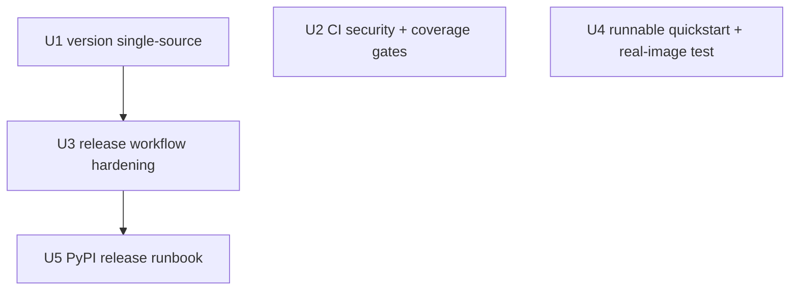

# feat: Productionization finish — release integrity, CI quality gates, runnable quickstart

## Overview

Plan-004's distribution/devex **foundation** already landed (PR #18): LICENSE, CHANGELOG,
Dockerfile, docker-compose, pre-commit, `ruff + mypy + pytest` CI, and a `release.yml`
that builds + verifies web assets + publishes via PyPI Trusted Publishing (OIDC). This
plan closes the **finishing gaps** that stand between "foundation merged" and "a stranger
can `pip install` it, a maintainer can cut a release without it silently shipping the wrong
version or unreviewed code, and the documented 5-minute quickstart actually runs."

The work is five well-bounded units across three surfaces the foundation left incomplete:
**release integrity** (version↔tag single source, a fail-closed three-job release chain with
pre-publish artifact *and* release-context gates, a runbook for the human-only PyPI
prerequisites), **CI quality gates** (dependency-vuln scan + coverage reporting), and a
**runnable quickstart** (a committed text sample that drives the real pipeline to its exact
terminal state, plus a dedicated real-decodable-image test that closes the long-standing
"real-image full e2e only unit-covered" hole).

## Problem Frame

`lcp` is an internal MVP that just grew a productionization foundation. Five concrete defects
keep it from being a trustworthy, installable, releasable open-source tool (all verified
against the current tree, not assumed):

1. **Version is hardcoded in two places and tracks nothing.** `pyproject.toml:3` and
   `src/lcp/__init__.py:3` both say `"0.1.0"`. `release.yml` triggers on a `vX.Y.Z` tag but
   `python -m build` always bakes `0.1.0` regardless of the tag — so the **second** release
   either re-uploads `0.1.0` (PyPI rejects it) or ships a version that lies about its tag.
   (A third literal, `core/models.py:57 logic_version`, is an unrelated *draft-schema*
   version and must stay decoupled.)
2. **Pre-publish validation gates only the artifact, not the release context.** The only
   integrity check is a `grep` for web assets. A broken README, an un-importable wheel, a tag
   pushed on an *unreviewed feature branch*, or an empty CHANGELOG section would all sail
   straight to an immutable PyPI upload and only be discovered afterward.
3. **The Trusted-Publishing human prerequisites are undocumented.** The OIDC publish cannot
   work until a person registers a PyPI *pending publisher* with fields matching the workflow
   exactly — there is no runbook, so the first release will stall with a cryptic error, and
   post-publish recovery (PyPI is immutable) is unplanned.
4. **CI has no security or coverage gate.** A known-vulnerable dependency or a whole untested
   module merges silently. (R2/R3 of the origin requirements remain unmet here.)
5. **The documented 5-minute quickstart does not run.** README references
   `./material/demo-001`, which does not exist (`samples/`, `material/`, `tests/fixtures/`
   are all absent). No fixture in the entire suite uses a *real decodable image*, so the
   media gate's real-image path has never executed end to end.

## Requirements Trace

Carried forward from the origin requirements (via predecessor plan-004's R1/R2/R3):

- **R1 — Distribution:** `lcp` is installable from PyPI and releasable by a maintainer with a
  pipeline that ships the *correct* version, validated artifacts, and only default-branch code
  (advances U1, U3, U5).
- **R2 — Developer experience:** a new contributor/operator can go zero-to-running fast, and
  every commit/PR is gated for style, types, security; the quickstart they follow actually
  runs (the gating part is advanced by U2; the runnable-quickstart part by U4).
- **R3 — Quality boundaries:** CI surfaces coverage; the real gate-chain happy path is proven
  by an e2e that drives the documented flow to its exact terminal state, and the real-image
  media path is covered by a dedicated test (advances U2, U4).

## Scope Boundaries

- **NOT** Stage 5/6 auto-publish (that is blocked plan-002; "publishing the *tool* to PyPI" is
  orthogonal to the project's "no auto-publish of *content*" invariant — see System-Wide
  Impact).
- **NOT** the deep error-handling boundary audit (plan-004 U7) or a deep performance pass
  (plan-004 U9). The existing `spikes/benchmark/run.py` step (currently in `release.yml`
  ~lines 42–43) is **removed from the release path** by U3 — a benchmark must never gate a
  publish; a non-blocking benchmark job on PR/main is a deferred follow-up, not part of this
  plan.
- **NOT** renaming the distribution to `lcp` on PyPI. The package name stays
  `local-content-processor` (README already documents `pip install local-content-processor`).
- **NOT** touching `core/models.py:57 logic_version` — a draft-schema version, not the package
  version.
- **NOT** a high/brittle coverage threshold (see Key Technical Decisions on the soft floor).
- **NOT** a new `lcp --version` CLI flag (would require CLI+GUI parity; deferred).
- **NOT** a reproducible/hash-pinned lockfile for the dependency audit this round — named and
  deliberately deferred in U2 (the deferral is explicit; silence would be the bug).
- **NOT** a web-asset-in-sdist guard this round — trimmed to `twine check` + the wheel grep;
  deferred to the setuptools-scm migration that would actually need it (see U3 / Alternatives).

## Context & Research

### Relevant Code and Patterns

- `pyproject.toml` — `setuptools.build_meta`, `setuptools>=68`, `src/` layout
  (`[tool.setuptools.packages.find] where=["src"]`), `[tool.setuptools.package-data]
  lcp=["web/*"]` (already present — the old wheel-asset bug is **closed**; keep the grep as a
  regression guard). **No `MANIFEST.in`** → sdist contents rely on setuptools' default
  file-finder (version-dependent). mypy `files=["src/lcp"]` is a *scope*, not an exclusion list
  — anything outside `src/lcp` (incl. a new `scripts/`) is **invisible to mypy** unless added;
  ruff lints the whole tree except `gossip_scraper` (so a new `scripts/` is auto-linted).
- `src/lcp/__init__.py` — the only place `__version__` lives; **no other module imports it**
  (verified), so switching it to `importlib.metadata` is low-blast-radius.
- `.github/workflows/ci.yml` — three parallel jobs (`lint`, `typecheck`, `test`), no `needs:`;
  matches the CLAUDE.md CI contract. A `security` job slots in as a fourth parallel job;
  coverage is a flag change on the existing `test` job.
- `.github/workflows/release.yml` — single `build-and-publish` job holding `id-token: write`
  **and** `contents: write` across every step (least-privilege violation U3 fixes); no
  `concurrency:` block. Its CHANGELOG awk matcher looks for `## [v<ver>` but the CHANGELOG
  writes `## <ver> — <date>` (no `v`, no bracket, em-dash + date suffix) → release notes
  silently fall back to `[Unreleased]` (latent bug; the fix must match `^## X.Y.Z` as a
  **prefix**, not the whole line).
- **Gate-chain facts that constrain U4** (verified in source): `has_images` is derived from the
  media gate's OK-decoded image count (`pipeline.py:561`); `lint_rules.py:217` fails **closed**
  (`if has_images and not draft.image_sections` → `NEEDS_REVISION`); `image_sections` is
  populated **only** by a copywriter `CAPTION:` line (`copywriter.py:126-127,215-221`), which
  must itself be grounded + under the copied-too-much length limit. The media gate parks at
  `NEEDS_REVISION` for any image below **640×360** (`asset_rules.py:25-26`,
  `media_checker.py:248`). `src/lcp/adapters/crawler/ingest.py` — ingest-dir contract:
  `title.txt` + one of `body.txt`/`content.txt`/`text.txt`/`source.txt` + optional flat media
  (subdirs ignored); ingest writes the manifest, refuses to overwrite an existing job dir.
- `tests/support/pipeline_fakes.py` — `DualModeChatClient.COPY` emits **no CAPTION** ("fine for
  a text-only bundle"); `seed_clean_index`, 25–35-char title, <40-char redline-free Chinese
  paragraphs. `tests/test_e2e_pipeline.py` reaches `REVIEW_PENDING` precisely because its
  `FakeCrawler` has `assets=[]`. No `conftest.py`; `tests/support/` is the only helper home.
- `docs/2026-06-18-e2e-operator-runbook.md` — the runbook format to mirror for U5.

### Institutional Learnings

- `docs/solutions/real-happy-path-unreachable-masked-by-green-tests.md` — **directly governs
  U4.** The quickstart e2e must drive the **real CLI/pipeline path**, assert the **exact**
  terminal state, and **ban `persist_gate_state`**.
- `docs/solutions/unit-tests-mask-integration-bugs.md` — over-clean fixtures hide real bugs.
  The sample must be realistically imperfect; the release install-smoke must be a **real
  `pip install dist/*.whl` into a fresh venv**, not a mock.
- `docs/solutions/fail-closed-catch-at-gate-boundary.md` — the repo's gate philosophy, applied
  to the release chain: decisive-first ordering, **hard-stop on any failure**, never
  warn-and-continue (and never `|| true` a gate — that silently defeats it).
- `docs/solutions/mypy-from-venv-not-pyenv.md` — keep every new CI gate on the CI-matching
  `.venv` with pinned tool versions (a prior PATH-pin drift, stabilization U18, was masked
  locally and only CI caught it).
- `docs/solutions/atomic-write-temp-replace.md` — reuse the atomic-write primitive for any
  config/version file write; model version-bump edits as all-or-nothing.

### External References

Official-source guidance (full URLs in Sources & References):

- **Version↔tag sync:** `setuptools-scm` (rejected this round; three footguns on a
  compliance-critical packaging path) vs the chosen **tag==version assertion gate +
  `importlib.metadata` runtime read** (plan-004 already chose `importlib.metadata`).
- **Pre-publish integrity:** `twine check --strict dist/*` + a fresh-venv `pip install
  dist/*.whl` import smoke, **before** any PyPI contact; PyPA pattern is build → separate
  gated publish job(s).
- **Trusted Publishing:** register a PyPI *pending publisher* with fields matching the workflow
  exactly; a pending publisher does **not** reserve the name; gate publish behind a GitHub
  Environment `pypi`; `id-token: write` job-scoped; PEP 740 attestations default-on; OIDC
  removes the long-lived `PYPI_API_TOKEN` secret. SHA-pin every action.
- **pip-audit:** exit code is the gate; gating on PR/main, advisory on the release tag.
- **pytest-cov / coverage.py:** configure in `[tool.coverage.*]`; a **low** `--cov-fail-under`
  soft floor (ratchet upward).

## Key Technical Decisions

- **Version source = tag==version assertion gate + `importlib.metadata` runtime read** (NOT
  setuptools-scm). Eliminates the `__init__.py` drift; avoids setuptools-scm's footguns on the
  first release. `pyproject.version` stays the one declared string (manual bump). **Scope of
  the gate (do not overstate):** the assertion is a **CI-path control on the tag-triggered
  build job** comparing `tag == "v"+pyproject.version` — it is not a property of the artifact.
  A manual/local `python -m build`, an sdist→wheel rebuild, or a publish path that skips the
  tag-triggered job bypasses it. "Fail loud on a forgotten bump" holds for the tag-triggered
  release path only; the runbook (U5) routes maintainers exclusively through that path.
- **Release pipeline is a fail-closed, decisive-first chain split into THREE jobs** —
  `build → publish-pypi → github-release` — with a workflow-level `concurrency:` block (group
  on the workflow ref, `cancel-in-progress: false`) so two close tag pushes serialize instead
  of racing two OIDC-privileged pipelines. The build job runs every validation gate (no
  privilege); `publish-pypi` does **only** download-artifact → **re-verify the dist/* SHA256
  against the build-recorded digest** → publish (the one irreversible step); `github-release`
  (idempotent, mutable) runs **last**. Rationale (load-bearing, not ceremony): a GitHub
  Environment gates a *job*, so the split is the only way to express "human approval after gates
  pass, before PyPI contact"; it enforces **per-job least privilege** (`id-token: write` on
  `publish-pypi` only, `contents: write` on `github-release` only — the current single job holds
  both everywhere); ordering the immutable PyPI step *before* the cosmetic Release means a
  Release flake never strands a successful upload. The human required-reviewer on the `pypi`
  environment is **recommended** for a compliance-first first release but is the maintainer's
  configurable choice (the split earns its keep on least-privilege + non-stranding recovery
  even without it).
- **The version-sync check is a tested, type-checked release gate** using **stdlib `tomllib`**
  (no unlisted dep): a pure comparison that is unit-tested, with `scripts/` added to mypy's
  `files` so the headline gate is typed in place (ruff already lints it).
- **All GitHub Actions pinned to commit SHAs** (40-char, version in a trailing comment). The
  `publish-pypi` job holds `id-token: write`; a moving tag on any action it runs is the
  highest-value supply-chain target. Bumping a SHA is a deliberate, reviewed step (U5).
- **PEP 740 attestations stay default-on** — a documented invariant; never set
  `attestations: false`.
- **Coverage = report + LOW soft floor.** A mild, *explicitly flagged* divergence from
  plan-004 U5 ("collect for visibility, no fail gate yet"): the floor will be a low
  `--cov-fail-under` set just below the measured baseline (exact number deferred to
  implementation) — cheap regression insurance that will not red-build ordinary refactors.
- **pip-audit gates PRs/main, advisory on release.** Stated residual: because release-time
  pip-audit is advisory and deps are unpinned ranges, a known-vulnerable transitive dependency
  can be live on PyPI under our name until the deferred hash-pinned-lockfile audit lands.

## Open Questions

### Resolved During Planning

- *Wheel tracks the git tag how?* → Assertion gate + `importlib.metadata` (verified working in
  the editable venv: returns `0.1.0`). Gate scoped to the tag-triggered CI path.
- *Anything consume `lcp.__version__`?* → No (verified); safe to change.
- *Single publish job or split?* → Three jobs for environment-gating, least privilege, and
  non-stranding recovery; concurrency-serialized.
- *U4 shape — one image-bearing sample, or decouple?* → **Decouple.** A real decodable image
  makes `image_sections` lint-required, which the text-only copy fake cannot satisfy; coupling
  "quickstart runs" with "real-image coverage" forces a fragile grounded-CAPTION fixture.
  Instead: a **text-only quickstart sample** drives the full chain to `REVIEW_PENDING`, and a
  **separate dedicated test** proves the real-image media-gate path. Simpler, more focused.
- *sdist web-asset assertion?* → **Trimmed.** Rely on `twine check --strict` + the wheel grep;
  defer a web-in-sdist guard to the setuptools-scm migration.
- *Benchmark in the release path?* → No; removed by U3.

### Deferred to Implementation

- Exact `--cov-fail-under` number — measure baseline first, set a round number just below it.
- Exact `pip-audit` invocation + initial `ignore-vulns` set (and the deferred hash-pinned
  lockfile audit) — decide when the first run surfaces real advisories.
- Exact sample `body.txt`/`title.txt` wording so lint (title 25–35 chars) + grounding
  (bigram-overlap) pass deterministically.
- Whether to pin `setuptools` (sdist inclusion) and `Pillow` (byte-stable PNG) for the
  release/build path — both the trimmed-but-present checks and the deterministic-PNG step are
  sensitive to those tool versions.

## High-Level Technical Design

> *This illustrates the intended approach and is directional guidance for review, not
> implementation specification. The implementing agent should treat it as context, not code
> to reproduce.*

**Release as a fail-closed, concurrency-serialized three-job chain** (a `vX.Y.Z` tag push; any
✗ hard-stops — nothing reaches PyPI on failure). The build job also runs on PRs (minus the
tag-only gates) so the chain is exercised *before* release. `concurrency: {group: release,
cancel-in-progress: false}` at workflow level. pip-audit runs in PR/main CI only (advisory on
release), so it is not a node in this release chain.

```
 build job   (runs on PR + tag; NO id-token, NO contents:write)
   1. checkout fetch-depth:0  +  explicit `git fetch origin main` (materialize the ref)
   2. tag-only: tag-is-ancestor-of-default-branch (merge-base --is-ancestor vs origin/main)
                  ✗ off-branch / ref-absent ─► FAIL CLOSED (never `|| true`)
   3. tag-only: version-sync  tag == "v"+pyproject.version   (stdlib tomllib)  ✗ ─► FAIL
   4. tag-only: CHANGELOG has a non-empty `^## X.Y.Z` section (prefix match)   ✗ ─► FAIL
   5. python -m build (sdist + wheel) → twine check --strict dist/*           ✗ ─► FAIL
   6. wheel-asset grep (lcp/web/index.html)                                   ✗ ─► FAIL
   7. fresh venv: pip install dist/*.whl; import lcp; lcp --help              ✗ ─► FAIL
   8. upload-artifact dist/* ; emit dist/* SHA256 as a job output
        │  needs: build, if: tag
        ▼
 publish-pypi job   (environment: pypi [recommended reviewer]; id-token: write ONLY)
   download-artifact ► re-hash dist/*, compare to build's SHA256  ✗ mismatch ─► FAIL CLOSED
                     ► pypa/gh-action-pypi-publish@<sha>   (OIDC, attestations on; never rebuilds)
        │  needs: publish-pypi
        ▼
 github-release job   (contents: write ONLY; idempotent/re-runnable)
   download-artifact ► awk-extract `^## X.Y.Z` CHANGELOG ► softprops/action-gh-release@<sha>
```

**One-time human prerequisites (U5), without which `publish-pypi` cannot succeed:** register a
PyPI *pending publisher*; create the GitHub `pypi` Environment; add a **tag-protection ruleset**
restricting who can create `v*` tags — all with fields matching `release.yml` exactly.

## Implementation Units

Dependency graph (U2 and U4 are independent; U1→U3→U5 is the release spine):



- [x] **U1: Version single-source (runtime)**

**Goal:** `lcp.__version__` reads the installed package metadata, eliminating the
pyproject↔`__init__.py` drift.

**Requirements:** R1 · **Dependencies:** None

**Files:** Modify `src/lcp/__init__.py` · Create `tests/test_version_single_source.py`

**Approach:**
- Replace `__version__ = "0.1.0"` with `importlib.metadata.version("local-content-processor")`,
  wrapped in `try/except PackageNotFoundError` → sentinel `"0.0.0+unknown"` (never raises from
  an uninstalled tree). Add an explicit `__version__: str` annotation.
- Leave `pyproject.version` as the single declared string; do **not** touch `models.py:57`.

**Patterns to follow:** stdlib only; `__init__.py` is the non-strict mypy baseline.

**Test scenarios:**
- Happy path: `lcp.__version__` == `importlib.metadata.version("local-content-processor")` ==
  `pyproject.version`.
- Edge case: `lcp.__version__` is valid PEP 440 (`^\d+\.\d+\.\d+`).
- Error path: monkeypatch `version` to raise `PackageNotFoundError` → sentinel, no raise.

**Verification:** `python -c "import lcp; print(lcp.__version__)"` prints the metadata version;
`pytest tests/test_version_single_source.py -q` passes; `mypy` clean.

- [x] **U2: CI quality gates — pip-audit + pytest-cov**

**Goal:** every PR/push is scanned for vulnerable deps and reports coverage with a low soft
floor, without disrupting the existing parallel jobs.

**Requirements:** R2, R3 · **Dependencies:** None

**Files:** Modify `.github/workflows/ci.yml` (add `security` job; coverage flags on `test`;
SHA-pin all `actions/*`) · Modify `pyproject.toml` (`pytest-cov` in `dev`; `[tool.coverage.*]`)

**Approach:**
- **Security:** a fourth parallel job — checkout → setup-python 3.11 → `pip install -e
  ".[crawl,media,llm,dedup,dev]"` → `pip-audit` (exit code is the gate). Advisory on the
  release workflow. Reviewed no-fix advisories → dated `ignore-vulns`, not a blanket disable.
- **Audit reproducibility (named decision):** this round audits the resolved editable env
  (drifts within version ranges). Record the hash-pinned-lockfile audit as a **deferred
  follow-up**; release-time artifact-closure `pip-audit` is **advisory**. State plainly the
  residual: a vulnerable transitive dep can be live on PyPI until the lockfile audit lands.
- **Coverage:** add `pytest-cov` to `dev`; `[tool.coverage.run] source=["lcp"], branch=true,
  omit=["*/tests/*"]`; `[tool.coverage.report] show_missing=true, exclude_also=[...]`; change
  the `test` job to `pytest -q --cov=lcp --cov-report=term-missing --cov-fail-under=<N>`.
- Keep all gates on the CI-matching venv with pinned tool versions; SHA-pin every action.

**Execution note:** config/infra change — verified by gate execution (local must match CI).

**Test scenarios:** Test expectation: none — CI/config change; verified by gate execution.

**Verification:** `pytest -q --cov=lcp --cov-report=term-missing` prints a table and exits 0 at
the floor; `pip-audit` runs locally; `ci.yml` valid YAML with four jobs, all actions SHA-pinned.

- [x] **U3: Release workflow hardening (fail-closed three-job chain)**

**Goal:** a `vX.Y.Z` tag builds the correct version from default-branch code, validates artifact
+ release context, re-verifies the artifact digest, publishes, and records the release — with
per-job least privilege, concurrency serialization, and non-stranding recovery.

**Requirements:** R1 · **Dependencies:** U1

**Files:** Modify `.github/workflows/release.yml` · Create `scripts/check_tag_matches_version.py`
· Create `tests/test_release_tag_version_check.py` · Modify `pyproject.toml` (add `scripts/` to
mypy `files`)

**Approach (decisive-first, fail-closed — see Technical Design):**
- **Three jobs + workflow `concurrency: {group: release, cancel-in-progress: false}`.** `build`
  (all gates, no privilege, on PR + tag) → `publish-pypi` (`needs: build`, `if: tag`,
  `environment: pypi`, `id-token: write` only; download-artifact → **re-hash dist/* and
  fail-closed compare to the build job's recorded SHA256 output** → publish action; never
  rebuilds, runs no first-party code) → `github-release` (`needs: publish-pypi`,
  `contents: write` only, idempotent). Ordering = immutable PyPI **before** cosmetic Release.
- **Build-job gates, cheapest/most-decisive first:**
  1. tag-only **tag-is-ancestor-of-default-branch**: full checkout (`fetch-depth: 0`) **plus an
     explicit `git fetch origin main`** to materialize the ref (a tag-triggered
     `actions/checkout` does **not** create `origin/main` by default), then
     `git merge-base --is-ancestor`. **Fail closed** if the tag is not an ancestor *or* the ref
     is absent — never paper over with `|| true`.
  2. tag-only **version-sync** via `scripts/check_tag_matches_version.py` (stdlib `tomllib`;
     nonzero + clear message on `tag != "v"+pyproject.version`).
  3. tag-only **CHANGELOG section** present and non-empty, matched as a **prefix** `^## X.Y.Z`
     (the header carries an em-dash + date) — fail closed, no silent `[Unreleased]` fallback.
  4. `python -m build` → `twine check --strict dist/*` → keep the wheel-asset grep. (Web-in-sdist
     assertion **trimmed**: `twine check` validates sdist metadata and the wheel is the install
     path; a web-in-sdist guard is deferred to the setuptools-scm migration. `samples/` and
     `scripts/` are not intended in the distributions.)
  5. fresh-venv `pip install dist/*.whl` smoke (`import lcp` + `lcp --help`) — a **real** install
     in the **build** job precisely because build holds **no `id-token`**.
  6. `upload-artifact` and emit the `dist/*` SHA256 as a **job output** (consumed by step in
     `publish-pypi` for the digest re-verification — enforced, not just logged).
- **Type-gate the headline check:** add `scripts/` to mypy `files` so the comparison is typed in
  place (ruff already lints it); unit-test the pure comparison.
- **Remove the benchmark** (`spikes/benchmark/run.py`) and its `ffmpeg`/editable-install deps
  from `release.yml` entirely.
- **`skip-existing` stays OFF** on the normal path (a forgotten bump must fail loud); used only
  for a deliberate documented recovery re-run (U5).
- Fix the `github-release` awk matcher to `^## X.Y.Z` (drop the `v` prefix and `[` bracket).

**Test scenarios (for the tag↔version comparison):**
- Happy path: tag `v0.2.0` + `version = "0.2.0"` → match / exit 0.
- Error path: tag `v0.2.0` + `version = "0.1.0"` → mismatch, message names both values.
- Edge case: a tag without the `v` prefix (`0.2.0`) → fail with a clear "expected v0.2.0" msg.
- Error path: missing/malformed `[project].version` → fail loud, not a silent pass.

**Verification:** `pytest tests/test_release_tag_version_check.py -q` passes and `mypy` sees the
comparison; `release.yml` valid YAML (`actionlint`), all actions SHA-pinned, three jobs with the
documented per-job permissions + concurrency; a TestPyPI rehearsal (U5 §3) publishes a throwaway
version end to end via a real `vX.Y.Z` tag (so it exercises the assertion gate).

- [x] **U4: Runnable quickstart (text sample + full-chain e2e) + dedicated real-image test**

**Goal:** the documented quickstart runs from zero (text sample drives the real pipeline to
**exactly** `REVIEW_PENDING`), and the real-decodable-image media path — never exercised by any
fixture — is proven by a separate, focused test. Decoupling avoids the fragile grounded-CAPTION
fixture a single image-bearing happy-path sample would require.

**Requirements:** R2 (runnable-quickstart part), R3 · **Dependencies:** None

**Files:**
- Create: `samples/demo-001/title.txt`, `samples/demo-001/body.txt` (text-only quickstart)
- Create (test): `tests/e2e/test_quickstart_sample.py` (full chain → `REVIEW_PENDING`)
- Create (test): `tests/e2e/test_real_image_media_gate.py` (real-image media path)
- Create (test asset): a deterministically-generated ≥640×360 real PNG (or generate it in-test)
- Modify: `README.md` (align `./material/demo-001` → `./samples/demo-001`)
- Modify: `docker-compose.yml` (add `- ./samples:/app/samples:ro` so the Docker quickstart can
  see the sample), **or** switch the README Docker quickstart to host-CLI ingest — state which.

**Approach:**
- **Quickstart sample (text-only):** `title.txt` 25–35 neutral redline-free Chinese chars;
  `body.txt` short (<40 char) **fully synthetic** (no real PII) grounded paragraphs. No image →
  `has_images=False` → `image_sections` not required → the existing `DualModeChatClient` copy
  fake reaches `REVIEW_PENDING` cleanly. The full-chain e2e drives the **real** `Pipeline` (real
  `LocalIngestCrawler`, real Stage-2 gates, clean seeded index, fake LLM), asserting **exactly**
  `REVIEW_PENDING`; **ban `persist_gate_state`**; never assert a disjunction.
- **Dedicated real-image test:** ingest a ≥640×360 **real decodable** PNG (deterministically
  generated, metadata-free; the media gate parks anything below 640×360, and "small" would
  fail), run the real media gate, and assert the manifest records the asset `OK` with
  `image_count ≥ 1` (the previously-untested real-decode path). It need **not** reach
  `REVIEW_PENDING` — proving the media path decodes a real image is the gap; coupling it to the
  full chain would require a grounded `CAPTION:` (lint-required once `has_images=True`), which is
  the complexity this decoupling avoids.
- README: replace `./material/demo-001` with `./samples/demo-001`. Note the README Docker
  quickstart stops at `lcp list`; "the documented quickstart runs" is proven by the e2e driving
  ingest→process→review-packet over the same sample.

**Execution note:** Integration-first — write the failing e2e (exact terminal state) first, then
make the fixture satisfy it.

**Patterns to follow:** `tests/test_ingest_mixed_folder.py`, `tests/support/pipeline_fakes.py`,
`tests/test_e2e_pipeline.py` (reaches `REVIEW_PENDING` with `assets=[]`).

**Test scenarios:**
- Happy path (quickstart e2e): ingest text `samples/demo-001/` → process → **exactly**
  `REVIEW_PENDING`; a review packet is produced. (Exact state; no `persist_gate_state`.)
- Integration (real-image test): the media gate **decodes** the ≥640×360 real PNG → manifest
  asset `OK`, `image_count ≥ 1`, job not parked at media.
- Edge case: dedup over a freshly seeded clean index returns UNIQUE → not parked at dedup.
- Edge case: the quickstart title is within 25–35 chars (a regression would silently park at
  lint).
- Error path: re-ingesting the same `--job-id` → ingest refuses (create-only).

**Verification:** `pytest tests/e2e/ -q` passes; the sample is confirmed fully synthetic (no real
PII); the real PNG regenerates byte-stably from the documented command (note Pillow-version
sensitivity); `lcp ingest --dir ./samples/demo-001 --job-id demo-001` by hand produces a bundle.

- [x] **U5: PyPI release runbook (prerequisites + per-release + recovery)**

**Goal:** a maintainer can perform the one-time Trusted-Publishing setup, run every release, and
recover from the immutable-PyPI failure modes without guessing.

**Requirements:** R1 · **Dependencies:** U3

**Files:** Create `docs/2026-06-22-pypi-release-runbook.md`

**Approach (mirror `docs/2026-06-18-e2e-operator-runbook.md`: h1 + invariant blockquote +
numbered sections + copy-paste `sh` + go/no-go table + `- [ ]` checklist):**
- **Invariant blockquote (disambiguation):** "This runbook publishes the *Python package* (the
  tool). It has nothing to do with content publishing, which remains human-only and is never
  automated."
- **§0 One-time setup:** register the PyPI **pending publisher** (fields match `release.yml`
  exactly: project `local-content-processor`, owner, repo, workflow `release.yml`, environment
  `pypi`); **name-reservation warning** (a pending publisher does not reserve the name — claim
  early); create the GitHub Environment `pypi` (maintainer-only reviewers **recommended**;
  restrict deployment to `v*` from the default branch); add a **tag-protection ruleset** so only
  maintainers can create `v*` tags (the enforced first boundary; the ancestor gate is
  defense-in-depth); note all actions are SHA-pinned and bumping a SHA is a reviewed step.
- **§1 Per-release happy path:** bump `pyproject.version` → move CHANGELOG `[Unreleased]` under
  `## X.Y.Z — <date>` (**non-empty section is a verified precondition**) → commit to default
  branch → `git tag vX.Y.Z` → push → watch build-job gates → **approve the `pypi` environment
  after verifying: all gates green, version intended, tag on default branch** (a concrete
  checklist, not a blind approve) → verify on PyPI.
- **§2 No-go / recovery table:** assertion fail → bump & re-tag; off-branch tag → re-tag on
  default branch; `twine check`/smoke fail → fix & re-tag; **PyPI upload OK but `github-release`
  failed → do NOT re-tag/bump (version is live); re-run only the idempotent `github-release` job
  — valid *within the live, unexpired workflow run*; if the artifact retention window has expired
  or the run was deleted, re-running the whole tagged workflow with `skip-existing: true` for
  that recovery is the path**; **a truly broken published version is never deleted-reuploaded —
  `yank` it on PyPI and cut a new patch `vX.Y.Z+1`**; re-tagging an existing version is never
  recovery.
- **§3 First-release rehearsal:** optional one-time TestPyPI dry-run via a real `vX.Y.Z`-shaped
  tag (so it exercises the assertion gate), `repository-url: https://test.pypi.org/legacy/`.
- **§N Go/no-go checklist** (`- [ ]`): version bumped, CHANGELOG section present, tag on default
  branch + created by a maintainer, actions SHA-pinned, env reviewer set, attestations on.

**Test scenarios:** Test expectation: none — documentation. Verified by cross-checking field
names against `release.yml` and the §2 recovery rows against the U3 three-job failure modes.

**Verification:** §0 field names match `release.yml`; §1/§2 map 1:1 onto the U3 chain and its
failure modes; the artifact-retention caveat is stated.

## System-Wide Impact

- **Interaction graph:** `lcp.__version__` has no in-tree consumers (verified) → U1 is
  low-blast-radius. CI jobs stay independent; the release workflow gains a
  `build → publish-pypi → github-release` chain, concurrency-serialized.
- **Error propagation:** every build-job gate fails closed before any PyPI contact (off-branch
  tag, version mismatch, empty CHANGELOG section, twine/asset/smoke failure, **digest
  mismatch**). The one irreversible step (`publish-pypi`) is isolated; a `github-release` flake
  never strands it. `pip-audit` gates PRs; the coverage floor gates the test job.
- **Privilege / secrets:** per-job permissions replace the current blanket grant. Trusted
  Publishing **removes the long-lived `PYPI_API_TOKEN` secret** (OIDC mints a short-lived token)
  — an affirmative win for the "no long-lived tokens" posture. `id-token: write` is
  `publish-pypi`-only; the smoke install runs in the unprivileged `build` job; the privileged
  job runs **no first-party code** and publishes only the **digest-re-verified** downloaded
  artifact. All actions SHA-pinned; only maintainers can create `v*` tags.
- **State-lifecycle risks:** none for the runtime pipeline — no `core/state.py` / gate-order
  change. U4's full-chain e2e exercises the **real** path to `REVIEW_PENDING`; the real-image
  test exercises the **real** media-decode path.
- **API-surface parity (CLI↔GUI):** **unchanged** — no new operator action; `lcp --version`
  deferred to avoid a parity change.
- **Integration coverage:** U4's two tests are precisely the cross-layer coverage unit tests
  with fake image bytes have been missing.
- **Unchanged invariants:** the state machine, the fail-closed Stage-2 gate order, the PII-free
  index/manifest/audit, and **"no auto-publish of content"** all stay exactly as they are.
  Publishing the *Python package* to PyPI is orthogonal to the content-publishing invariant; the
  machine still never writes content to a CMS, and U5's header makes that explicit.

## Risks & Dependencies

| Risk | Mitigation |
|------|------------|
| Forgotten `pyproject.version` bump before tagging | U3 version-sync gate fails loud (tag-triggered path); U5 §1 step 1; `skip-existing` OFF so a double-publish can't be masked. |
| Unreviewed / off-branch code reaches PyPI | U3 tag-ancestor gate (with explicit `git fetch origin main`, fail-closed, never `|| true`); U5 tag-protection ruleset (maintainer-only `v*`) as the enforced first boundary; `pypi` env restricted to `v*` on default branch. |
| `publish-pypi` OK but `github-release` fails (PyPI immutable) | Separate idempotent `github-release` ordered after PyPI; U5 §2 recovery — re-run only that job **within the live run**; after retention expiry, re-run the tagged workflow with `skip-existing`; `yank` + patch for a broken version. |
| Artifact tampered/swapped across the job boundary | `publish-pypi` re-hashes `dist/*` and fail-closed compares to the build job's recorded SHA256 before upload. |
| Two close `v*` pushes race two OIDC pipelines | Workflow-level `concurrency: {group: release, cancel-in-progress: false}` serializes releases. |
| Moving-tag action repointed in the privileged job | All actions SHA-pinned; bumping a SHA is a reviewed step. |
| `pypi` reviewer rubber-stamps a bad release | U5 §1 gives the reviewer a concrete checklist (gates green, version intended, tag provenance). |
| Vulnerable transitive dep live on PyPI (pip-audit advisory on release; unpinned ranges) | Stated residual; gating on PR/main; hash-pinned-lockfile audit named as a deferred follow-up; release-time artifact-closure audit advisory. |
| First PyPI publish blocked / name lost | U5 §0: a pending publisher does not reserve the name — claim early. |
| Coverage floor too high → red builds | Measure baseline first; set `--cov-fail-under` just below it; ratchet upward. |
| `lcp --help` bare-wheel smoke breaks on a future eager extra import | `cli.py` lazily imports optional deps today (smoke holds); a future top-level import of an extra would break the release smoke — a fragile invariant to watch. |
| `setuptools`/`Pillow` upgrades shift sdist inclusion / PNG bytes | Consider pinning both for the release/build path (deferred decision); the trimmed sdist check + deterministic-PNG step are sensitive to these versions. |
| Sample bundle accidentally carries real PII | Fully synthetic, verified in U4; PNG generated deterministically, metadata-free. |
| Quickstart/real-image test flakiness | Fakes for LLM/network; real only for local ingest + deterministic gates; exact-state assertion. |

## Alternative Approaches Considered

- **setuptools-scm dynamic versioning** — rejected as the primary path (file-finder swap risking
  `web/*`, `fetch-depth: 0` + `.git`-at-build-time, PyPI-rejected local segment). Documented as a
  future migration; the assertion gate composes with it; the deferred web-in-sdist guard belongs
  with that migration, not this round.
- **setuptools `dynamic version = {attr=…}`** — still needs a hardcoded literal; does not solve
  tag↔version sync. Rejected.
- **Single-job release workflow** — cannot express environment-gated approval before PyPI, cannot
  enforce per-job least privilege, entangles the immutable upload with the mutable Release.
  Rejected; the three-job split is load-bearing.
- **One image-bearing quickstart sample** — would force a grounded `CAPTION:` fixture (lint
  requires `image_sections` once an image decodes) that must also pass grounding and the
  copied-too-much limit — fragile. Rejected for the **decoupled** U4 (text-only quickstart + a
  dedicated real-image media test), which proves both concerns with simpler, focused tests.
- **Web-asset-in-sdist assertion** — its only live justification was pre-empting an un-adopted
  setuptools-scm; trimmed in favor of `twine check` + the wheel grep (the wheel is the install
  path). Re-add it with the setuptools-scm migration.
- **Coverage hard high threshold** — brittle; rejected for a low soft floor (flagged divergence
  from plan-004 U5's visibility-only stance).

## Phased Delivery

### Phase 1 — Foundational, low risk (U1, U2)
Version single-source + CI security/coverage gates. Independent; ships immediately.

### Phase 2 — Close the known quality hole (U4)
Runnable text quickstart + dedicated real-image test. Independent of the release path.

### Phase 3 — Release path, highest risk (U3, U5)
Three-job release hardening then the runbook. Ordered last (U3 depends on U1, U5 on U3),
**critical to release credibility**, gated by a one-time TestPyPI rehearsal (via a real
`vX.Y.Z` tag) before any real publish.

## Documentation / Operational Notes

- After landing U1+U3, **add a `docs/solutions/` entry** for the version↔tag single-source +
  fail-closed-release-chain invariant — none exists yet and CLAUDE.md asks for one after a
  non-obvious fix.
- Update `CHANGELOG.md` `[Unreleased]` as each unit lands; the first real `vX.Y.Z` tag exercises
  the whole U3 chain (and its CHANGELOG-section pre-publish gate).
- The U5 runbook is the operational source of truth for releases; keep its field names,
  pinned-SHA notes, and the artifact-retention recovery caveat in sync with `release.yml`.

## Sources & References

- **Origin / predecessor:** `docs/brainstorms/2026-06-22-lcp-extensibility-robustness-requirements.md`,
  `docs/plans/2026-06-22-004-feat-distribution-devex-quality-plan.md`
- **Repo:** `pyproject.toml`, `src/lcp/__init__.py`, `.github/workflows/{ci,release}.yml`,
  `src/lcp/adapters/crawler/ingest.py`, `src/lcp/core/rules/{lint_rules,asset_rules}.py`,
  `src/lcp/adapters/processor/media_checker.py`, `src/lcp/adapters/llm/copywriter.py`,
  `src/lcp/pipeline.py`, `tests/support/pipeline_fakes.py`, `tests/test_e2e_pipeline.py`,
  `docs/2026-06-18-e2e-operator-runbook.md`, `CHANGELOG.md`
- **Learnings:** `docs/solutions/real-happy-path-unreachable-masked-by-green-tests.md`,
  `unit-tests-mask-integration-bugs.md`, `fail-closed-catch-at-gate-boundary.md`,
  `mypy-from-venv-not-pyenv.md`, `atomic-write-temp-replace.md`
- **External (official):**
  setuptools-scm <https://setuptools-scm.readthedocs.io/en/stable/usage/> ·
  <https://setuptools-scm.readthedocs.io/en/stable/integrations/> ·
  PyPA publishing with GitHub Actions
  <https://packaging.python.org/en/latest/guides/publishing-package-distribution-releases-using-github-actions-ci-cd-workflows/> ·
  gh-action-pypi-publish <https://github.com/pypa/gh-action-pypi-publish> ·
  PyPI Trusted Publishers (OIDC) <https://docs.pypi.org/trusted-publishers/creating-a-project-through-oidc/> ·
  twine <https://twine.readthedocs.io/en/stable/> ·
  PyPI-friendly README <https://packaging.python.org/guides/making-a-pypi-friendly-readme/> ·
  pip-audit <https://github.com/pypa/pip-audit> · gh-action-pip-audit <https://github.com/pypa/gh-action-pip-audit> ·
  pytest-cov <https://pytest-cov.readthedocs.io/en/latest/config.html> ·
  coverage.py <https://coverage.readthedocs.io/en/latest/config.html>
