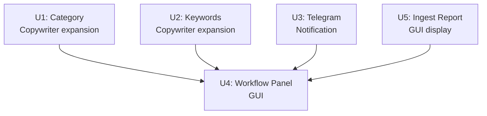

# feat: 10-Step Editorial SOP Workflow Integration

## Overview

The operator follows a formal 10-step editorial SOP for every piece of gossip content. The system already covers steps 01–03 (intake + inspection + dedup), 05–07 (media processing, cover, hedged copywriting), and 09 (draft freeze). Three functional gaps remain: category/direction suggestion (step 04), keyword generation by SOP-defined type dimensions (step 08), and Telegram group notification before final publish (step 10). Two surfacing gaps exist: the ingest completeness report is generated but never shown in the GUI (step 01), and the operator has no single-glance view of where a job sits in the 10-step sequence (all steps). This plan fills all five gaps.

## Problem Frame

| Step | Description | Status |
|------|-------------|--------|
| 01 接收素材 | Receive + verify completeness | ✅ Both intake paths exist; `ingest_report.json` generated but not displayed |
| 02 素材检查 | Inspect clarity, source, watermarks, risk | ✅ risk/media gates automated |
| 03 站内查重 | Dedup by person/account/platform/event | ✅ Jaccard+LSH dedup gate |
| 04 确认内容方向 | Classify category/focus; escalate if unclear | ⚠️ `Draft.category` field exists; assembler never outputs it |
| 05 处理图片视频 | Standard size/format/watermark/export | ✅ `normalizer.py`; media gate |
| 06 制作封面 | 1300×640 cover, safe zone | ✅ `make_cover()` complete |
| 07 撰写标题正文 | Faithful rewrite; hedging for unverified claims | ✅ assembler + copywriter; hedging in system prompt |
| 08 填写标签关键词 | 3–5 tags; keywords by person/place/platform/event/type | ⚠️ Tags enforced (3–5); `Draft.keywords` unpopulated |
| 09 存入草稿箱自检 | Freeze draft; self-check; NO direct publish | ✅ `REVIEW_PENDING` + `review_packet` |
| 10 发群审核后发布 | Send cover+title to Telegram work group; publish after approval | ❌ No notification (pipeline.py: "no push notification in MVP") |

## Requirements Trace

- R1. Category suggestion: LLM suggests `Draft.category` during assembly; operator confirms in GUI review
- R2. Keyword generation: copywriter produces 5-dimension typed keywords (人物/地點/平台/事件/內容類型); stored in `Draft.keywords`
- R3. Telegram notification: operator triggers send for REVIEW_PENDING job; fire-and-forget; failure audited, never parks job
- R4. Workflow progress panel: GUI derives current SOP step from job state + draft fields and renders a 10-step checklist in the job view
- R5. Ingest completeness display: GUI shows `ingest_report.json` summary after LOCAL_DIR intake

## Scope Boundaries

- Does NOT add automatic NER/dedup query extraction from content (Jaccard text-similarity already covers duplicates; NER is a separate spike)
- Does NOT validate hedging language as a post-hoc rule (stays an LLM instruction; grounding gate covers factual backing)
- Does NOT add ad/link detection in body text (deferred to a separate hygiene pass)
- Telegram only (operator confirmed); no generic webhook abstraction needed now
- Notification is operator-triggered (GUI button + CLI command), not automatic on state transition — preserves the "machine never publishes" invariant
- Does NOT enforce the "publish after group approval" gate: the system provides the notification tool only; whether the group has actually approved before the operator publishes is an operator SOP responsibility, not a system constraint (adding a Telegram approval reply listener is deferred)

## Context & Research

### Relevant Code and Patterns

- `src/lcp/adapters/llm/copywriter.py:_PREFIXES` — line-prefix protocol to extend for keyword types
- `src/lcp/adapters/llm/assembler.py:build_system_prompt()` — where `CATEGORY:` output rule is added
- `src/lcp/core/draft.py:keywords` / `category` — both fields already defined; unpopulated
- `src/lcp/core/state.py:ReviewReason` — extend with `CLASSIFICATION`
- `src/lcp/core/config.py:Config` — add `notification: NotificationConfig` (parallel to existing sub-configs)
- `src/lcp/adapters/publisher/signoff.py` — fire-and-forget audit pattern to replicate in notifier
- `src/lcp/adapters/storage/config_io.py` — keyring secret loading pattern for TG bot token
- `src/lcp/adapters/container.py` — typed `Adapters` dataclass; add `notifier` field
- `src/lcp/cli.py` + `src/lcp/gui.py` — 1:1 mirror contract (CLAUDE.md: any operator action added to one must exist in the other)
- `src/lcp/webserver.py` — route dispatch pattern; `authorize()` must be called on all new endpoints
- `src/lcp/web/app.js` + `app.css` — existing `renderJobBanner()` + pill patterns to mirror

### Institutional Learnings

- **Gate fail-closed** (`docs/solutions/fail-closed-catch-at-gate-boundary.md`): missing/unknown category from LLM must park job as `NEEDS_HUMAN_REVIEW+CLASSIFICATION` at the gate boundary, never raise a raw exception through `_process_inner`
- **Producer→consumer chain risk** (`docs/solutions/real-happy-path-unreachable-masked-by-green-tests.md`): extending copywriter (producer) + lint (consumer) is the highest e2e test gap class — both U1 and U2 must have an integration test that reaches `PROCESSED` without the `persist_gate_state` shortcut
- **New endpoints must pass `authorize()`** (`docs/solutions/localhost-http-api-csrf-defense.md`): all new `/api/*` endpoints must go through `webserver.authorize()` Host→token→Origin/Sec-Fetch chain
- **Notification fire-and-forget**: failure writes audit log (`NOTIFICATION_FAILED`), never changes job state
- **Atomic file write**: any new file written to `data/jobs/<id>/` uses `adapters/storage/_fs.py:atomic_write_0600`

## Key Technical Decisions

- **Category via copywriter expansion, not assembler**: `assemble()` already accepts `category` as a pass-through parameter and writes the full LLM response blob to `event_body` without a line-prefix parser — adding `CATEGORY:` there would contaminate `event_body` with a metadata line. The copywriter already has `_parse()` and `_PREFIXES`; adding `CATEGORY:` there is one data-edit that fits the existing protocol. No extra LLM roundtrip: the copywriter call already exists when `ai_copy=True`. **Execution order**: in `pipeline.py`, `assemble()` runs first (producing the article body draft), and the copywriter call runs second. Category is merged into the draft via `apply_copy_to_draft(draft, copy)` in the existing copywriter integration block — not by passing it to the assembler call.
- **Typed keyword prefixes in copywriter, not structured JSON**: extend the existing `KEY: value` line-prefix protocol (`KEYWORD_PERSON:`, `KEYWORD_PLACE:`, `KEYWORD_PLATFORM:`, `KEYWORD_EVENT:`, `KEYWORD_TYPE:`). Stored in `Draft.keywords` as type-prefixed strings (e.g., `"人物:周冬雨"`). The orphan-keyword lint check must strip the type prefix before body-text matching (`kw.split(":", 1)[-1]`); backward-compatible with non-prefixed keywords.
- **TG bot token in keyring, not `config.yaml`**: parallel to `LCP_LLM_API_KEY`; keyring service `local-content-processor`, user `tg_bot`. `chat_id` is a public channel ID, not a secret; goes in `config.yaml`.
- **Notification is operator-triggered, respects `--dry-run`**: the REVIEW_PENDING state already encodes the human-pause; "发群审核" is a deliberate operator action, not a pipeline side-effect. When `--dry-run` is set, `send_notification()` validates config and reads cover but sends nothing (no Telegram API call, no audit event). This preserves the no-auto-publish invariant and the dry-run "no external mutation" guarantee.
- **Workflow panel derives category/keywords from `get_packet()`**: `get_job()` returns only state/review_reason; draft fields (`category`, `keywords`) are in `get_packet()` (via `sanitize_draft()`). The JS calls `get_packet()` for PROCESSED+ jobs to determine step 04/08 completion. For pre-PROCESSED states, `draft` is null and steps 04–09 are shown as "not yet reached."
- **Step-derivation logic lives in `core/`**: `stepsFor(state, draft_fields)` maps (JobState, draft field presence) → per-step completion status. This is business judgment, not view logic — it belongs in the functional core where it can be unit-tested without the GUI. The frontend calls this function and renders the result.

## Open Questions

### Resolved During Planning

- Notification channel: Telegram (operator confirmed)
- Material intake paths: both URL crawl and LOCAL_DIR already work end-to-end
- Category source: copywriter LLM output (copywriter already has `_parse()`; no assembler change needed)
- Notification trigger: operator-initiated (not automatic)
- `config.categories` empty → category lint check is bypassed; U1 only provides value when `categories` is populated. `lcp init` should pre-populate a non-empty default list (e.g., `["娛樂", "社會", "體育", "影視", "科技"]`) with a comment marking it as operator-tunable — so U1 works out-of-box rather than silently doing nothing

### Deferred to Implementation

- **Category park vs. warn when missing**: **Decision: park at `NEEDS_HUMAN_REVIEW+CLASSIFICATION`** when `LintConfig.categories` is non-empty and the copywriter produces no `CATEGORY:` line or an unrecognized value. When `LintConfig.categories = []`, the check is skipped entirely (no-op). This matches the fail-closed pattern of all other lint gates and makes category mandatory once the operator populates the allowed list.
- **Keyword coverage lint severity**: start with warn-only when a keyword type dimension has no entry; escalate to NEEDS_REVISION after calibration with real content
- **TG sendPhoto fallback**: if `cover.jpg` is absent (dry-run or review packet not yet built), fall back to text-only `sendMessage`; exact API shape confirmed during implementation

## High-Level Technical Design

> *This illustrates the intended approach and is directional guidance for review, not implementation specification.*

**Pipeline extension (U1 + U2 — both in copywriter; assemble runs BEFORE copywriter):**
```
Stage 2: risk gate → media gate → dedup gate
  → assemble()                       [article body draft; category= param unused here]
  → copywriter [+CATEGORY: +KEYWORD_*]
      U1: CATEGORY: prefix added → CopyResult.category
      U2: KEYWORD_* prefixes    → CopyResult.keywords (type-prefixed)
  → apply_copy_to_draft(draft, copy)  [merges category → Draft.category; keywords → Draft.keywords]
  → lint [+CLASSIFICATION check]      [U1: category lint; U2: keyword orphan prefix-strip]
  → grounding
```

**Notification flow (U3):**
```
REVIEW_PENDING → operator clicks "发群审核" →
  Api.notify(job_id) → notifier.send_tg(cover_path, title, chat_id, bot_token)
    ├── success → audit NOTIFICATION_SENT (chat_id, job_id, photo_size)
    └── failure → audit NOTIFICATION_FAILED (error_type) → ExternalServiceError (GUI shows error)
  Job state: unchanged (still REVIEW_PENDING)
```

**GUI step-to-state mapping (U4, client-side logic):**

| SOP Step | Shown as complete when | Shown as blocked when |
|----------|------------------------|-----------------------|
| 01 接收素材 | `state != 'NEW'` | — |
| 02 素材检查 | `state` in `{CRAWLED, CRAWLED_WARN, PROCESSING, PROCESSED, REVIEW_PENDING, APPROVED, PUBLISHED_RECORDED}` | `state == BLOCKED` (redline); label: "內容風險攔截" |
| 03 站内查重 | same as 02 AND `state != DUPLICATE` | `state == DUPLICATE`; label: "站內重複" |
| 04 确认方向 | `draft?.category` is truthy | `review_reason == CLASSIFICATION`; label: "需人工確認分類" |
| 05–06 媒體/封面 | `state` in `{PROCESSED, REVIEW_PENDING, APPROVED, PUBLISHED_RECORDED}` | — |
| 07 撰写文案 | same as 05–06 | `review_reason in {GROUNDING, LINT}`; label: "文案需修訂" |
| 08 填写关键词 | same as 07 AND `draft?.keywords` contains at least one entry for each of the 5 dimension prefixes (人物/地點/平台/事件/內容類型) | — (warn-only when incomplete) |
| 09 草稿箱 | `state` in `{REVIEW_PENDING, APPROVED, PUBLISHED_RECORDED}` | — |
| 10 发群/发布 | `state == PUBLISHED_RECORDED` | — (pending when REVIEW_PENDING + notification not yet sent) |

Pre-PROCESSED states: `draft` is null; steps 04–09 shown as "未到達" (not yet reached), not "incomplete".

## Implementation Units



**Sequencing constraint:** U1 and U2 both modify `src/lcp/adapters/llm/copywriter.py` and `src/lcp/core/rules/lint_rules.py` — they must land in the same PR, or U1 must merge before U2 begins. U3 and U5 are fully independent. U4 assembles all four into the GUI.

---

- [x] **U1: Category suggestion via copywriter expansion**

**Goal:** Populate `Draft.category` from copywriter LLM output; park at `NEEDS_HUMAN_REVIEW+CLASSIFICATION` when category is missing or unrecognized (with categories list configured).

**Requirements:** R1

**Dependencies:** None

**Files:**
- Modify: `src/lcp/adapters/llm/copywriter.py` (add `CATEGORY:` to `_PREFIXES`; add `category` field to `CopyResult`; update `build_system_prompt`; parse `CATEGORY:` in `_parse`)
- Modify: `src/lcp/adapters/llm/copywriter.py:apply_copy_to_draft` (merge `copy.category` into `draft.category`)
- Modify: `src/lcp/pipeline.py` (`_process_inner`, in the existing copywriter integration block) — category is merged via `apply_copy_to_draft(draft, copy)`, no change to the `assemble()` call site needed
- Modify: `src/lcp/core/state.py` (add `ReviewReason.CLASSIFICATION`)
- Modify: `src/lcp/core/rules/lint_rules.py` (wire `ReviewReason.CLASSIFICATION` when existing category check at L246–250 fails)
- Test: `tests/llm/test_copywriter.py`
- Test: `tests/processor/test_draft_linter.py` (category lint with CLASSIFICATION reason)

**Approach:**
- Add `"CATEGORY"` to `_PREFIXES`; update `CopyResult` with `category: str | None = None`; in `_parse()`, assign parsed value to `result.category`
- System prompt addition: `"Output: CATEGORY: <value> — one of the site's topic categories (e.g., 娛樂/社會/體育/影視). If the content fits no category, omit the line."`
- In `apply_copy_to_draft()`: `draft.model_copy(update={"category": copy.category or draft.category})`
- No change to the `assemble()` call in `_process_inner()` — assembler runs first, copywriter runs second; `apply_copy_to_draft` handles the merge
- `lint_rules.py` L246–250 already checks `draft.category` against `LintConfig.categories`. Wire `ReviewReason.CLASSIFICATION` as the review_reason when this check fires.
- **Gate routing structural change** (critical): the existing `run_draft_lint_gate` maps ALL lint failures to `NEEDS_REVISION` (draft_linter.py line ~162). To route category failure to `NEEDS_HUMAN_REVIEW+CLASSIFICATION` instead, add a pre-lint category check in `run_draft_lint_gate`: before the general lint pass, if `LintConfig.categories` is non-empty and `draft.category` is missing or unrecognized, call `persist_gate_state(store, job_id, JobState.NEEDS_HUMAN_REVIEW, review_reason=ReviewReason.CLASSIFICATION, ...)` and return early. The general lint NEEDS_REVISION path is unchanged.
- Empty `LintConfig.categories` list → check is skipped (no-op); U1 provides value only when `config.categories` is populated

**Execution note:** Start with a failing test in `tests/llm/test_copywriter.py`: `_Stub` returning `"CATEGORY: 娛樂\nSUBHEAD: x\n"` → assert `result.category == "娛樂"`.

**Patterns to follow:**
- `copywriter._PREFIXES` and `_parse()` — exact prefix→field protocol to mirror
- `apply_copy_to_draft()` tags merge — same pattern for `category`
- `ReviewReason.GROUNDING` in lint gate — same park mechanism for `CLASSIFICATION`

**Test scenarios:**
- Happy path: `_Stub` returning `"CATEGORY: 娛樂\n"` → `result.category == "娛樂"`
- No CATEGORY line: `result.category is None` → `draft.category` stays None → lint parks `NEEDS_HUMAN_REVIEW+CLASSIFICATION` when `categories` configured
- Unknown category: LLM outputs value not in `LintConfig.categories` → lint parks `NEEDS_HUMAN_REVIEW+CLASSIFICATION`
- Empty categories config: `LintConfig.categories = []` → category check skipped; job reaches PROCESSED
- Dry-run: copywriter with dry client → `result.category is None`; `draft.category = None`
- E2E integration: full pipeline without `persist_gate_state` shortcut, stub returning `CATEGORY:` line → PROCESSED with `draft.category` set

**Verification:**
- `generate_structural_copy()` with a `CATEGORY:`-returning stub → `result.category` is non-None
- Missing/unknown category (with `categories` configured) routes to `NEEDS_HUMAN_REVIEW+CLASSIFICATION`
- Existing copywriter and lint tests remain green

---

- [x] **U2: Keyword generation by type in copywriter**

**Goal:** Populate `Draft.keywords` with 5-dimension typed keywords matching the SOP categories (人物/地點/平台/事件/內容類型).

**Requirements:** R2

**Dependencies:** None (parallel to U1)

**Files:**
- Modify: `src/lcp/adapters/llm/copywriter.py` (add 5 `KEYWORD_*` prefixes; update `_parse`; update `CopyResult`; update `build_system_prompt`; add `_clean_keywords`)
- Modify: `src/lcp/adapters/llm/copywriter.py:apply_copy_to_draft` (merge `CopyResult.keywords` into `draft.keywords`)
- Modify: `src/lcp/core/rules/lint_rules.py` (1. update orphan-keyword check to strip type prefix before body-text match; 2. add warning when `draft.keywords` is empty)
- Test: `tests/llm/test_copywriter.py`
- Test: `tests/processor/test_draft_linter.py` (orphan-keyword-prefix scenarios)

**Approach:**
- Add to `_PREFIXES`: `KEYWORD_PERSON → "kw_person"`, `KEYWORD_PLACE → "kw_place"`, `KEYWORD_PLATFORM → "kw_platform"`, `KEYWORD_EVENT → "kw_event"`, `KEYWORD_TYPE → "kw_type"`
- System prompt addition: `"For each of the five dimensions — 人物 (KEYWORD_PERSON), 地點 (KEYWORD_PLACE), 平台 (KEYWORD_PLATFORM), 事件 (KEYWORD_EVENT), 內容類型 (KEYWORD_TYPE) — output 1–3 relevant keywords. Use only terms that appear in the source."`
- Store in `Draft.keywords` as type-prefixed strings (e.g., `"人物:張三"`, `"平台:微博"`) — no schema change to `Draft`
- `CopyResult.keywords: list[str]` carries the prefixed strings; `_clean_keywords()` caps each dimension to 3 (parallel to `_clean_tags`)
- `apply_copy_to_draft` merges `copy.keywords` into `draft.keywords` (same pattern as `tags`)
- **Lint orphan-keyword fix** (`lint_rules.py` L239-240): change `kw.strip().lower()` to `kw.split(":", 1)[-1].strip().lower()` — strips the type prefix before checking if the keyword appears in body text. Backward-compatible: non-prefixed keywords (e.g., `"周冬雨"`) are unchanged since `"周冬雨".split(":", 1)[-1] == "周冬雨"`
- Lint coverage warning: emit a warning (not `NEEDS_REVISION`) when `draft.keywords` is empty; escalate to park after calibration

**Execution note:** Start with a failing integration test calling `generate_structural_copy()` with celebrity gossip content and asserting at least one `KEYWORD_PERSON:` and one `KEYWORD_PLATFORM:` entry appear in `result.keywords`.

**Patterns to follow:**
- `copywriter._PREFIXES` and `_parse()` — exact prefix→field protocol to extend
- `copywriter._clean_tags()` — cap/filter pattern; write a parallel `_clean_keywords()`
- `apply_copy_to_draft` `tags` merge — same pattern for keywords

**Test scenarios:**
- Happy path: stub returning `"KEYWORD_PERSON: 周冬雨\nKEYWORD_PLATFORM: 微博\n"` → `result.keywords == ["人物:周冬雨", "平台:微博"]`
- Multi-dimension: stub with PLACE + EVENT keywords → both dimensions present in `result.keywords`
- Cap enforcement: stub returns 5 `KEYWORD_PERSON` entries → `_clean_keywords` caps to 3 for that dimension
- Dry-run: no keywords produced; `result.keywords = []`; `draft.keywords = []`
- Lint orphan-prefix fix: `draft.keywords = ["人物:周冬雨"]` + body containing "周冬雨" → no orphan warning (prefix stripped before check)
- Lint orphan-prefix fix: `draft.keywords = ["人物:周冬雨"]` + body NOT containing "周冬雨" → orphan warning fires
- Lint warning: `draft.keywords = []` → warning in lint_report; job still reaches `PROCESSED` (warn-only)
- E2E integration: full pipeline without shortcut → `PROCESSED` with `draft.keywords` non-empty

**Verification:**
- `draft.keywords` contains type-prefixed strings (e.g., `"人物:xxx"`) after a copywriter call
- Dimension caps respected (≤3 per type)
- Lint orphan check correctly strips prefix before matching
- Empty keywords list produces lint warning but does not park the job

---

- [x] **U3: Telegram group notification for Step 10**

**Goal:** Operator can send `cover.jpg` + title to a configured Telegram group from REVIEW_PENDING state. Fire-and-forget: failure is audited, never changes job state.

**Requirements:** R3

**Dependencies:** None (independent)

**Files:**
- New: `src/lcp/adapters/publisher/notifier.py`
- Modify: `src/lcp/core/config.py` (add `NotificationConfig`; add `notification` field to `Config`)
- Modify: `src/lcp/adapters/storage/config_io.py` (load TG bot token from keyring, parallel to LLM key)
- Modify: `src/lcp/adapters/container.py` (add `notifier: Notifier | None = None` field)
- Modify: `src/lcp/cli.py` (new `notify` subcommand; new `setup --set-tg-token` subcommand reading token from stdin via `getpass()`)
- Modify: `src/lcp/gui.py` (new `Api.notify(job_id)`; new `Api.set_tg_token()` mirroring CLI setup)
- Modify: `src/lcp/webserver.py` (route `/api/notify`)
- Test: `tests/test_notifier.py`
- Test: `tests/test_webserver_notify.py` (endpoint auth check)

**Approach:**
- `NotificationConfig` (pure core): `enabled: bool = False`, `telegram_chat_id: str = ""`; bot token is a credential — stored in keyring service `local-content-processor`, user `tg_bot` (parallel to `llm`)
- `notifier.send_notification(job_id, review_dir, title, config, audit, store, *, bot_token, dry_run: bool = False)`:
  0. **State guard**: verify `store.get_job(job_id).state == JobState.REVIEW_PENDING` — raise `InputValidationError` if job is in any other state (prevents leaking a blocked/redline job's cover to Telegram before the operator completes the recovery workflow)
  1. Validate: `config.enabled`, `config.telegram_chat_id`, `bot_token` all present — else `InputValidationError`
  2. If `dry_run=True`: log "DRY RUN: would send Telegram notification"; return immediately — no API call, no audit event (consistent with LLM client dry-run semantics)
  3. Read `review_dir / "cover.jpg"` (produced by `review_packet`). If absent, fall back to text-only `sendMessage`
  4. `sendPhoto` (or `sendMessage`) to Telegram Bot API with `chat_id` + caption `"{title}\n📋 {job_id}"` — **no `parse_mode`** (plain text only; `title` is LLM-generated from crawled content, HTML-escaped before embedding to prevent injection if Telegram ever enables markup). Use multipart file upload for cover.jpg (never a URL — `data/jobs/` is never served)
  5. On success: `audit.append(job_id, EVENT_NOTIFICATION_SENT, {"chat_id": chat_id, "has_photo": bool})` — no token in audit
  6. On network failure: `audit.append(..., EVENT_NOTIFICATION_FAILED, {"error": error_type_str})`; raise `ExternalServiceError`
  7. Job state: NEVER changed by this method
- Audit event constants in `notifier.py`: `EVENT_NOTIFICATION_SENT = "NOTIFICATION_SENT"`, `EVENT_NOTIFICATION_FAILED = "NOTIFICATION_FAILED"` (same pattern as `signoff.py:EVENT_SIGNOFF_APPROVE` etc.)
- CLI: `lcp notify <job_id>` — validates job is `REVIEW_PENDING`; passes `c.dry_run` to `send_notification`
- GUI: `Api.notify(job_id)` mirrors CLI; button `"发群审核"` rendered **inline with step 10 in the workflow panel** (U4) for `REVIEW_PENDING` jobs when `notification.enabled` is true — not in `#job-actions` (canonical location is the workflow panel)
- Button interaction states: in-flight → button disabled + spinner text "發送中…"; success → brief "✓ 已送出" label for 3s then reset; failure → ExternalServiceError message shown in the job error div (`#job-error`) consistent with other API error handling
- `/api/notify` must pass `webserver.authorize()` Host→token→Origin chain

**Patterns to follow:**
- `publisher/signoff.py:EVENT_SIGNOFF_APPROVE` — module-level `EVENT_*` string constant pattern
- `adapters/storage/config_io.py` — keyring secret loading for `tg_bot` user
- `gui.py:_run_bg()` (threading) — fire-and-forget pattern if needed for async send
- `gui.py:cover_report()` — how `@bridge_safe` + OSError handling works for file reads
- `webserver.py` dispatch — how `/api/approve` route is registered

**Test scenarios:**
- Happy path: `send_notification` with monkeypatched HTTP → `NOTIFICATION_SENT` audit event; job state unchanged
- Network failure: Telegram 5xx → `ExternalServiceError`; `NOTIFICATION_FAILED` audit event; job state unchanged
- Config disabled (`enabled=False`): → `InputValidationError` before any network call; no audit event
- Missing bot token (keyring empty): → `DependencyError`; no audit event; job state unchanged
- Dry-run: `send_notification(dry_run=True)` → returns immediately; no network call; no audit event
- Non-`REVIEW_PENDING` job: CLI/GUI raises `InputValidationError` before calling `send_notification`
- Cover absent: fallback to text-only `sendMessage`; `has_photo=False` in audit
- Auth: `POST /api/notify` without CSRF token → 403 from `webserver.authorize()`

**Verification:**
- `lcp notify <job_id>` on a `REVIEW_PENDING` job produces `NOTIFICATION_SENT` audit event
- Job remains `REVIEW_PENDING` after notify
- `lcp --dry-run notify <job_id>` exits 0 without any Telegram call or audit write
- `config.enabled=False` blocks before any network attempt

---

- [x] **U4: GUI 10-step workflow progress panel**

**Goal:** Job detail view renders a persistent 10-step SOP progress checklist — completed steps marked ✓, current step highlighted, blocked steps flagged. Derived entirely from existing API data; no new server endpoint.

**Requirements:** R4

**Dependencies:** U1 (category field for step 04), U3 (notification action for step 10)

**Files:**
- Modify: `src/lcp/web/app.js` (add `renderWorkflowPanel(job, draft)` + step-derivation logic `stepsFor(state, draft)`)
- Modify: `src/lcp/web/app.css` (workflow panel styles: `.workflow-steps`, `.step--done`, `.step--current`, `.step--blocked`)
- Modify: `src/lcp/web/index.html` (placeholder `<div id="job-workflow"></div>` in the job section)

**Approach:**
- Pure client-side; no new API endpoint. `Api.get_job()` already returns `state` and draft data
- `Api.get_job()` returns `state`/`review_reason`; `Api.get_packet()` returns draft fields including `category` and `keywords` (from `sanitize_draft()`). Calls both; JS derives step completion from the merged view
- `stepsFor(state, draft)` returns an array of `{label, done, current, blocked}` objects for each of the 10 SOP steps using the mapping table in the High-Level Technical Design section; step 04 done when `draft.category` is truthy; step 08 done when `draft.keywords.length > 0`
- Render as an `<ol>` with CSS classes; `textContent` only (no `innerHTML`), consistent with XSS defence model in `app.js`
- Blocked-step reason labels: use the text in the mapping table above (e.g., "內容風險攔截" for BLOCKED, "站內重複" for DUPLICATE, "需人工確認分類" for CLASSIFICATION)
- The "发群审核" action button appears inline with step 10 when the job is `REVIEW_PENDING` and `notification.enabled` is true. When `notification.enabled=false`, step 10 shows as "⚠ Telegram 通知未設定" with a skippable indicator (step is visible but not actionable by the system)
- `notification.enabled` is exposed to the frontend via a `<meta name="lcp-notification-enabled">` tag injected by `webserver.py` at page load (same pattern as the CSRF token meta tag); no new API endpoint needed. Add to U3 Files: modify `webserver.py` to inject this meta tag.
- Panel position: placed **between the state banner and the packet/draft content area** in the job detail view (operator reads state → sees SOP progress → reviews content)
- Panel is always visible in the job view once a job is loaded; does not require a separate user action

**Files (additional):**
- New: `src/lcp/core/rules/sop_steps.py` (pure `stepsFor(state: JobState, draft_fields: dict) -> list[StepStatus]` function)
- Test: `tests/core/test_sop_steps.py` (unit tests for the pure step-derivation function — no GUI needed)

**Test scenarios (core step-derivation):**
- REVIEW_PENDING + category set + all 5 keyword dimensions present → steps 01–09 done, step 10 pending
- BLOCKED + review_reason=RISK → step 02 blocked, steps 03–10 not-yet-reached
- DUPLICATE → step 03 blocked
- PROCESSED + category=None + `config.categories` non-empty → step 04 not done (category missing)
- PROCESSED + keywords only has KEYWORD_PERSON entries → step 08 not done (missing 4 dimensions)

**Patterns to follow:**
- `app.js:renderJobBanner()` — state-derived UI construction
- `app.css` pill and band patterns — extend with step classes

**Verification:**
- Manual: load a job at `REVIEW_PENDING` → steps 01–09 show ✓, step 10 shows pending with "发群审核" button (if notification enabled)
- Manual: job at `BLOCKED` → risk-related step shows blocked indicator in red
- Manual: `Draft.category` set (returned by `get_packet()`) → step 04 shows ✓
- Manual: `Draft.keywords` non-empty (returned by `get_packet()`) → step 08 shows ✓

---

- [x] **U5: Ingest completeness report display in GUI**

**Goal:** After LOCAL_DIR intake reaches `CRAWLED`/`CRAWLED_WARN`, the GUI displays `ingest_report.json` summary (images imported, missing body/title, failed files). Surfaces the step-01 completeness check that currently produces data silently.

**Requirements:** R5

**Dependencies:** None (independent)

**Files:**
- Modify: `src/lcp/gui.py` (new `Api.get_ingest_report(job_id)`)
- Modify: `src/lcp/webserver.py` (route `/api/get_ingest_report`)
- Modify: `src/lcp/cli.py` (add `lcp show-ingest-report <job_id>` subcommand or `--ingest-report` flag to existing `show`)
- Modify: `src/lcp/web/app.js` (call `get_ingest_report` for LOCAL_DIR jobs; render completeness panel)
- Test: `tests/test_gui_api.py` (new `test_get_ingest_report_*` cases)

**Approach:**
- `Api.get_ingest_report(job_id)`: read `data/jobs/<id>/raw/ingest_report.json` using `safe_join` (path-traversal guard); return parsed dict or `None` if absent
- GUI: call `get_ingest_report` and render the panel only when the return value is non-null (file-presence is the guard — `JobRecord` has no `source_type` field; URL-crawled jobs simply have no `ingest_report.json` so `get_ingest_report` returns `None`):
  - `"✓ 已匯入 N 張圖片、M 支影片"` when images/videos > 0
  - `"⚠ 缺少正文 (body.txt)"` when `has_body=False`
  - `"⚠ N 個檔案匯入失敗: [names]"` when `failed` is non-empty
- CLI mirror: `lcp show-ingest-report <job_id>` prints the same summary to stdout; exits 0 if complete, 1 if warnings
- `/api/get_ingest_report` must pass `webserver.authorize()` chain

**Patterns to follow:**
- `gui.py:Api.get_job()` — how job-dir files are safely read
- `net_guard.safe_join` — path-traversal guard pattern
- `app.js:renderJobBanner()` — conditional panel rendering

**Test scenarios:**
- Happy path: `get_ingest_report` for LOCAL_DIR job with `complete=True` → returns dict with correct counts
- Partial import: report with `has_body=False` and `failed=[{"name":"x.jpg","reason":"..."}]` → returned correctly
- URL-crawled job: no `ingest_report.json` → `get_ingest_report` returns `None` without error
- Path traversal: `job_id` containing `"../etc"` → `InputValidationError` via `safe_join`
- Auth: `/api/get_ingest_report` without CSRF token → 403
- Missing file (unexpected state): file absent for a LOCAL_DIR job → returns `None` gracefully

**Verification:**
- `Api.get_ingest_report()` returns correct image/video counts for a LOCAL_DIR job
- URL-crawled job returns `None` without error or exception
- GUI renders completeness panel beneath the job state banner for a `CRAWLED` LOCAL_DIR job

## System-Wide Impact

- **Interaction graph:** U1 extends the assembler→lint chain (new output field + new lint check); U2 extends the copywriter→lint chain (new prefixes); U3 adds a `notifier` field to `Adapters` and a new operator-triggered action with no pipeline auto-calls; U4/U5 are read-only GUI changes with new GET-like endpoints
- **Error propagation:** `ExternalServiceError` from Telegram (`notifier`) is caught at CLI level (non-zero exit + stderr) and GUI level (error status div); it never enters the pipeline state machine
- **State lifecycle risks:** U3 is explicitly state-inert (`send_notification` has no `store` write path); only audit events are written. U1 adds a new park reason to the existing lint gate (no new state edge)
- **API surface parity:** cli.py and gui.py must mirror 1:1 for U3 (`notify`), U5 (`get-ingest-report`) — CLAUDE.md invariant
- **Integration coverage:** U1 and U2 both require a full e2e integration test (no `persist_gate_state` shortcut) reaching `PROCESSED` state — the highest-risk gap identified in `docs/solutions/real-happy-path-unreachable-masked-by-green-tests.md`
- **Unchanged invariants:** State machine edges unchanged; `REVIEW_PENDING` is still the only frozen-draft state; no automatic state transitions added; "machine never publishes" invariant preserved

## Risks & Dependencies

| Risk | Mitigation |
|------|------------|
| Category suggestion degrades for unusual gossip content types | `LintConfig.categories` is operator-tunable; broad defaults; park-to-review is the safety valve; empty categories list bypasses the check |
| TG Bot API rate limiting if operator sends many notifications | Fire-and-forget; failure logs `NOTIFICATION_FAILED`; operator re-clicks; no job is blocked |
| Producer→consumer chain (copywriter→lint) masks integration bugs | Mandatory e2e test for U1 and U2 per institutional learning |
| TG bot token leaked into `config.yaml` or audit log | Token stored in keyring only; audit events record `chat_id` + `has_photo`, never the token; `config.yaml` has no token field |
| URL-crawled jobs calling `get_ingest_report` → 500 | `get_ingest_report` returns `None` for absent file; GUI renders the panel only when return value is non-null (no `source_type` field needed) |
| U4 GUI panel shows incorrect step completion if draft data not returned by `get_job` | Confirm `Api.get_job()` response includes draft fields; add null-guard in `stepsFor()` |

## Documentation / Operational Notes

- `config.yaml` gains two new fields: `notification.enabled: false`, `notification.telegram_chat_id: ""`
- Bot token is set once via `lcp setup --set-tg-token` (reads token from **stdin via `getpass()`**, never from a CLI argument value — shell history exposure). Alternatively set `LCP_TG_BOT_TOKEN` env var. The `setup` subcommand must be added to `cli.py` as part of U3 (add to U3 Files list).
- After landing: create three `docs/solutions/` entries: (1) `typed-keyword-generation-line-prefix.md` — using line-prefix protocol for multi-dimension keyword output; (2) `telegram-notification-fire-and-forget.md` — audit-only failure pattern for external notification; (3) `llm-category-suggestion-via-existing-call.md` — extending copywriter for classification without extra LLM roundtrip
- CLASSIFICATION hold exit path: `signoff.resolve()` currently clears GROUNDING holds via `relint_clears_hold()`. A `NEEDS_HUMAN_REVIEW+CLASSIFICATION` job needs the same exit: either extend `relint_clears_hold` to also clear CLASSIFICATION, or add a dedicated `confirm_category(job_id, category)` API. Confirm approach during U1 implementation.

## Sources & References

- Existing code: `src/lcp/adapters/llm/copywriter.py`, `assembler.py`, `publisher/signoff.py`, `core/config.py`
- Institutional: `docs/solutions/fail-closed-catch-at-gate-boundary.md`, `docs/solutions/real-happy-path-unreachable-masked-by-green-tests.md`, `docs/solutions/localhost-http-api-csrf-defense.md`
- Pipeline.py comment: `# no push notification in MVP` (the explicit gap this plan fills for step 10)
