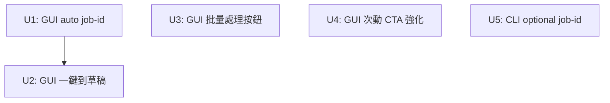

# feat: Streamline pipeline UX

## Overview

當前 pipeline 的每個操作（crawl / process / review-packet）都是獨立的「單功能工具」，操作員必須手動串接步驟、手填 job ID、逐一點開每個工作才能推進。本計劃讓系統感覺像一條流水線，而不是一袋散裝命令。

**改前動線（GUI）：**
```
新工作 → 手填 ID → 填 URL → 建立並抓取 → 等待
→ 回 Inbox → 點工作 → 開始處理 → 等待 → 建立審閱包
```

**改後動線（GUI 快速模式）：**
```
新工作 → (自動 ID) → 填 URL → 一鍵到草稿 → 等待 → 直接看審閱包
```

**改後動線（GUI 批量）：**
```
Inbox：進行中 band 顯示「全部處理 (N個)」→ 一鍵送出 → 等各工作完成
```

**改後動線（CLI）：**
```
lcp run --url URL --until draft   # --job-id 可省略，自動推導
lcp process --all-state crawled --ai-copy   # 已存在，不需改
```

## Problem Frame

根本問題是 **流程不像系統，像工具箱**：
1. 建立工作需要手填 job ID — 對非技術操作員是負擔
2. 爬取完成後必須離開 + 重新進入才能處理 — 兩段 async 等待，動線斷裂
3. Inbox 只能查看每個工作的狀態，沒有 batch 行動按鈕
4. 狀態 banner 告訴操作員「你可以：點『開始處理』」，但不是可點擊的 CTA
5. CLI 的 `--job-id` 是 required，每次都要手造 ID

## Requirements Trace

- R1. 建立工作不應該要求操作員手填 ID（GUI + CLI）
- R2. 從 URL 到草稿應該是一個背景操作，不是兩段等待
- R3. Inbox 層面應能對 crawled 工作批量發起處理
- R4. Job 狀態頁面的「下一步」應該是明確的視覺 CTA，不只是說明文字
- R5. CLI `run` 和 `crawl` 命令的 `--job-id` 應可省略（自動推導）

## Scope Boundaries

- 不改核心 pipeline 邏輯（state machine / gate chain）
- 不新增 CLI 命令（只修改現有命令參數）
- 不改 webserver.py 的認證鏈（只加 Api 方法）
- 不做「自動處理」或「自動核可」— 機器永不自動推進 REVIEW_PENDING 以後的步驟
- 「一鍵到草稿」上限是 PROCESSED（TARGET_DRAFT），不到 REVIEW_PENDING

## Context & Research

### Relevant Code and Patterns

- `src/lcp/web/app.js` L1468 `openCreate()` — 新工作表單入口；`create-job-id` 目前是空 input，`btn-create` 呼叫 `create_and_crawl_async`
- `src/lcp/web/app.js` L380 `BANDS` + `refreshInbox()` — Inbox band 渲染，目前 band head 只有 label + 數量，無動作按鈕
- `src/lcp/web/app.js` L984 `renderBanner()` — 渲染 `lx.why` + `lx.next` 為純文字 `<p>`
- `src/lcp/web/lex.js` `STATE_ACTIONS` — 每個 state 的合法操作清單（驅動 `renderActions`）
- `src/lcp/gui.py` L393 `create_and_crawl_async` / L397 `process_async` — 現有 async 背景執行模式，透過 `_run_bg` + polling
- `src/lcp/gui.py` L319 `process_batch` — 同步批量處理，已存在但無 async 變體且無 GUI 入口
- `src/lcp/pipeline.py` L644 `Pipeline.run_until(spec, target=TARGET_DRAFT, ts, ai_copy=True)` — 完整端對端路徑已存在，GUI 目前未直接呼叫
- `src/lcp/cli.py` L184 `crawl` / L697 `run` — `--job-id` 目前是 `required=True`
- `tests/test_cli_gui_parity.py` L66 `_GUI_ONLY` — async twin 方法不需 CLI 鏡像，在此列出即可
- `tests/test_gui_batch1.py` — 現有 batch + GUI surface 測試格式參考

### Institutional Learnings

- `docs/solutions/unit-tests-mask-integration-bugs.md` — 純 unit test 驗不到 async 路徑的跨層整合；U2 的 `run_until_draft_async` 需要至少一個帶 dry_run 的 integration-style test
- `docs/solutions/real-happy-path-unreachable-masked-by-green-tests.md` — 新路徑要驗到 happy path 真正可達

### External References

無需外部研究；所有模式已在 repo 中有直接示例（`create_and_crawl_async`、`process_async`、`_run_bg`）。

## Key Technical Decisions

- **auto-ID 在前端生成，不需新的 Api 方法**：`hostname-YYMMDD-xxxx`（4位隨機英數），純 JS，無網路呼叫。理由：後端不需知道 UI 的便利措施；job_id 只要唯一且人類可識別即可；若 ID 衝突 `create_and_crawl` 已有 error 回傳。
- **`run_until_draft_async` 作為 GUI 專用 async twin**，加入 `_GUI_ONLY`：CLI 的 `run --until draft` 已經鏡像了這個行為；新方法只是讓 GUI 可以透過 `_run_bg` 非同步執行它。符合「async twins 不需 CLI mirror」慣例。
- **批量處理重用現有 `process_async`，不新增 `process_batch_async`**：對 crawled band 的 N 個工作，各發一個 `process_async(job_id, ...)` 呼叫；`_run_bg` 的 inflight guard 防重複；比引入一個批量 async key（`__batch__crawled`）更透明，且 inbox 可以看到各工作個別的狀態變化。
- **CLI auto-ID 格式與 GUI 統一**：`hostname-YYMMDD-xxxx`（4位隨機英數），與前端 `_suggestJobId` 格式完全一致。`--job-id` 由 `required=True` 改為 `default=None`，若 None 則自動推導並 echo 出來。理由：格式統一讓操作員在 GUI 和 CLI 之間切換時 ID 視覺一致；隨機後綴解決腳本批量呼叫的同秒碰撞問題。

## Open Questions

### Resolved During Planning

- **Q: auto-ID 是否需要 uniqueness check？** A: 不需要。若 ID 衝突，`create_and_crawl` / `crawl` 已回傳 InputValidationError（job already exists）；前端顯示 error，操作員換 ID 重試即可。
- **Q: 批量處理的進度顯示？** A: 各工作的 `process_async` 各自 polling，若操作員開啟某個工作就看到個別進度；Inbox 層面只顯示 toast + 手動/自動重整。不加 inbox 層面 spinner（增加複雜性但收益低）。
- **Q: `run_until_draft_async` 的 watermark/template 需要嗎？** A: 快速模式用 config 預設（`watermark=None`，`template=None`），讓 pipeline 依 config 決定；若需客製化，操作員用一般模式（先 crawl，再 process 調整參數）。
- **Q: 一鍵模式遇到 CRAWLED_WARN 要停還是繼續？** A: 繼續 Stage 2。`CRAWLED_WARN` 是 pipeline 可繼續的有效狀態，由 Stage 2 gate 判定是否 park；操作員可從工作狀態頁面看到警告原因。一鍵模式不中斷，否則「一鍵」的目的落空。

### Deferred to Implementation

- **auto-ID 生成函數的確切 JS 實作**（`Date` API 格式化細節）
- **Inbox 自動重整頻率**（批量送出後是否加 setInterval）— 先不做，看操作回饋

## High-Level Technical Design

> *以下說明系統各部分的關係，作為方向性參考，非實作規格。*

```
┌─────────────────── GUI new-job form ──────────────────────┐
│  URL input ──────────────────────── auto-fill job-id      │
│  [快速模式 checkbox]                                       │
│  ┌─ 快速模式 ON ─┐     ┌─ 快速模式 OFF ─┐               │
│  │ ai_copy=true  │     │ 只做 Stage 1   │               │
│  │ 按鈕: 一鍵到草稿   │     │ 按鈕: 建立並抓取 │               │
│  └───────────────┘     └────────────────┘               │
│        │                      │                          │
│   run_until_draft_async   create_and_crawl_async         │
│        │                      │                          │
│   Pipeline.run_until      Pipeline.stage1                │
│   (target="draft")                                       │
└──────────────────────────────────────────────────────────┘

┌───────────────── Inbox "進行中" band ─────────────────────┐
│  進行中（5）   [全部處理 (3個)] ← 只在 crawled > 0 時顯示  │
│  ────────────────────────────────────────────────────── │
│  job-a   素材已就緒   [打開 ›]                            │
│  job-b   素材已就緪   [打開 ›]                            │
│  job-c   處理中       [打開 ›]  ← process_async 已送出   │
└──────────────────────────────────────────────────────────┘

Job banner (crawled state):
┌────────────────────────────────────────────────┐
│ ● 素材已就緪                                   │
│ 素材抓乾淨了，可以開始處理。                    │
│ ╔═══════════════════════════════════════╗      │
│ ║  → 點「開始處理」  ▼ 下方行動區        ║      │  ← CTA box
│ ╚═══════════════════════════════════════╝      │
└────────────────────────────────────────────────┘
```

## Implementation Units



- [x] **U1: GUI — URL 輸入自動填寫 job ID**

**Goal:** 操作員輸入 URL 後，job-id 欄位自動填入建議值（hostname + 日期 + 4位隨機英數），可手動覆寫

**Requirements:** R1

**Dependencies:** None

**Files:**
- Modify: `src/lcp/web/app.js` — `openCreate()` + URL input change handler
- Test: `tests/test_web_assets.py` — 靜態 assert auto-id 生成邏輯已接線

**Approach:**
- 在 `openCreate()` 裡，對 `create-url` input 綁定 `input` 事件，當值改變且 `create-job-id` 為空或等於前次自動填值時，呼叫 `_suggestJobId(url)` 更新
- `_suggestJobId(url)`: 解析 hostname（`new URL(url).hostname.replace(/[^a-z0-9]/g, "-")`）+ `YYMMDD` + 4位隨機英數（`Math.random().toString(36).slice(2,6)`）
- 追蹤「是否為自動填值」狀態（boolean flag `_jobIdAutofilled`），操作員手動編輯後不再自動覆蓋
- URL 無法解析時不填（try/catch，保持現況）

**Patterns to follow:**
- `src/lcp/web/app.js` L1468 `openCreate()` — 表單初始化模式
- 已有 `textInput()` / `setText()` 等 DOM helper，保持同樣風格

**Test scenarios:**
- Happy path: 填入 `https://example.com/article` → job-id 自動填成 `example-com-260623-xxxx` 格式
- Edge case: job-id 已被手動編輯 → URL 改變不覆蓋 job-id
- Edge case: URL 無法解析（非 http/https）→ job-id 保持空白
- Happy path (靜態): `tests/test_web_assets.py` assert app.js 包含 `_suggestJobId` 或等效函數引用

**Verification:**
- 開 GUI 的「+ 新工作」，輸入 URL，job-id 自動填入且格式符合 `hostname-date-xxxx`
- 手動修改 job-id 後再改 URL，job-id 不被覆蓋

---

- [x] **U2: GUI — 一鍵到草稿模式（端對端 Stage 1 + 2）**

**Goal:** 新工作表單加「一鍵到草稿」切換；勾選後一個背景操作完成爬取+處理，省去中間的回 Inbox 再進入再點處理步驟

**Requirements:** R2

**Dependencies:** U1（共用同一表單區域）

**Files:**
- Modify: `src/lcp/gui.py` — 新增 `run_until_draft_async(job_id, url, ai_copy=True)`
- Modify: `src/lcp/web/app.js` — 新工作表單加 checkbox + 改 `btn-create` 邏輯 + `stageLabel("run")` case
- Modify: `tests/test_cli_gui_parity.py` — 把 `run_until_draft_async` 加入 `_GUI_ONLY`
- Test: 新增 `tests/test_gui_run_async.py`

**Approach:**

`gui.py` 新增：
```
run_until_draft_async(job_id, url, ai_copy=True) -> dict
```
- 不加 `@bridge_safe`（同 `create_and_crawl_async`/`process_async` 模式）
- 呼叫 `_run_bg(job_id, lambda: _do_run_until_draft(job_id, url, ai_copy))`
- 內部 helper `_do_run_until_draft` 建立 `SourceSpec`（同 `create_and_crawl` 的模式），呼叫 `p.run_until(spec, target=TARGET_DRAFT, ts=_now(), ai_copy=ai_copy, watermark=None, template=None, source_urls=[spec.url])`；`watermark=None`/`template=None` 讓 pipeline 依 config 預設；`source_urls=[spec.url]` 確保 review packet 有來源歸因（同 CLI `run` 命令的行為）
- 回傳 `_run_bg` 的標準 `{job_id, status:"running"}` 結構

`app.js` 修改：
- 在 create 表單的「建立並抓取」按鈕旁加一個 `<label><input type="checkbox" id="create-quick-mode"> 一鍵到草稿（爬取＋處理）</label>`
- `btn-create` click handler：若 `create-quick-mode` 勾選，改呼叫 `a.run_until_draft_async(jobId, url, true)` 並 `enterProgress(jobId, "run")`；否則維持原有 `create_and_crawl_async` + `enterProgress(jobId, "crawl")` 邏輯。注意：這是 **either/or** — 快速模式直接呼叫 `run_until_draft_async`（內部已含 Stage 1 + Stage 2），不需先呼叫 `create_and_crawl_async`，不存在兩個呼叫共搶同一 inflight slot 的情況
- `stageLabel("run")` → `"正在爬取並處理草稿（一鍵模式）…"`
- `settle()` 函數已能處理任何 outcome，不需額外修改

`test_cli_gui_parity.py`：
- `_GUI_ONLY` 加入 `"run_until_draft_async"`

**Patterns to follow:**
- `src/lcp/gui.py` L393 `create_and_crawl_async` — 完全相同的 async twin 模式
- `src/lcp/web/app.js` L1500 `btn-create` click handler — 改條件分支，不重寫

**Test scenarios:**
- Happy path: `api.run_until_draft_async("j1", "https://example.com")` 在 dry_run 環境回傳 `{status:"running"}`
- Integration (dry_run): 等 `job_status` 變成 `done`，工作最終狀態是 `needs_revision`（dry_run 不呼叫 LLM，所以 copywriter 空，但 pipeline 有跑過）或更早的 gate 狀態
- Error path: URL 無效 → `job_status` 最終是 `error` shape（`_run_bg` 的 exception handler 保證不會 hang）
- 靜態: `tests/test_web_assets.py` — app.js 包含 `run_until_draft_async` 呼叫 + `"run"` case in stageLabel

**Verification:**
- GUI 勾選「一鍵到草稿」送出，spinner 持續到 draft 完成；不需中間回 Inbox
- `test_cli_gui_parity.py` 通過（parity 測試不誤報新方法）

---

- [x] **U3: GUI — Inbox 批量處理按鈕**

**Goal:** 當「進行中」band 有 crawled/crawled_warn 工作時，band head 顯示「全部處理 (N個)」按鈕，一鍵對所有 crawled 工作發起 `process_async`

**Requirements:** R3

**Dependencies:** None（不依賴 U1/U2）

**Files:**
- Modify: `src/lcp/web/app.js` — `refreshInbox()` 的 "inflight" band 渲染

**Approach:**
- 在 `refreshInbox()` 裡，渲染 inflight band 時，篩出 `state === "crawled" || state === "crawled_warn"` 的工作（已有 `rows` 陣列）
- 若 crawled 數 > 0，在 `band-head` 加一個「全部處理 (N個)」按鈕（`btn-secondary` 樣式）
- 點擊 handler：對每個 crawled job 依序呼叫 `a.process_async(job.job_id, title="", dry_run=false, watermark=null, template=null, ai_copy=true)` — 標題空白、不 dry run、watermark=config、template 無、ai_copy=true
- 每個呼叫回傳後不等 done（fire and forget）；最後 `showToast("已送出 " + n + " 個工作排隊處理", "success")`
- 不做 inbox 自動重整（由操作員手動點「重新整理」或打開個別工作）
- 按鈕在點擊後短暫 disabled（防止二次點擊送出），toast 出現後恢復；per-job 錯誤只在個別工作頁面可見，Inbox 層不顯示 per-job error（設計決定：保持批量 CTA 簡單）

**Patterns to follow:**
- `src/lcp/web/app.js` L448 `refreshInbox()` band 渲染 — 在 section.band-head 加 button 的位置
- `src/lcp/web/app.js` L1176 `process_async` 呼叫模式 in `buildActionRow` — 同樣的 params 順序

**Test scenarios:**
- Happy path (靜態): `tests/test_web_assets.py` assert app.js 包含 `process_async` 在 band-head 情境的呼叫
- Integration: 無法在純 unit test 驗 UI 渲染，透過 e2e 或手動 GUI 驗

**Verification:**
- Inbox 的「進行中」band 在有 crawled 工作時顯示「全部處理 (N個)」
- 點擊後 toast 出現，工作逐漸進入 processing 狀態

---

- [x] **U4: GUI — 狀態 banner 強化 next-action CTA**

**Goal:** 對「有明確下一步」的關鍵 state，在 banner 的 `lx.next` 文字旁加一個視覺指引 box（CSS highlight），讓操作員視線能直接從狀態說明找到行動按鈕

**Requirements:** R4

**Dependencies:** None

**Files:**
- Modify: `src/lcp/web/app.js` — `renderBanner()` 函數
- Modify: `src/lcp/web/app.css` — 新增 `.banner-cta-hint` CSS class

**Approach:**
- 定義「有明確 CTA」的 state 集合：`crawled`、`crawled_warn`、`processed`、`review_pending`（這些狀態的 `lx.next` 文字對應到 `job-actions` 的主要按鈕）
- 在 `renderBanner()` 裡，若 state 在上述集合中，把 `lx.next` 文字包在一個 `<div class="banner-cta-hint">` 而非普通 `<p>`
- CSS: `.banner-cta-hint` — 左邊有色邊框（`border-left: 3px solid var(--color-ready)`）+ 淺背景色 + `→ 見下方行動` 前綴文字，輕量視覺區隔
- 不做 scroll-to / 動畫（保持簡單，避免干擾）
- `.banner-cta-hint` 是**純資訊性 div**，不加 click handler、不加 `role="button"`；操作員看到提示後自行找下方行動列

**Patterns to follow:**
- `src/lcp/web/app.js` L984 `renderBanner()` — `el("p", lx.next)` 改為條件 `el("div", ...).className`
- `src/lcp/web/app.css` 現有 `.banner` 系列 class — 新增同層 class
- `src/lcp/web/lex.js` 不需改（純渲染層改動）

**Test scenarios:**
- 靜態: `tests/test_web_assets.py` assert app.js 包含 `banner-cta-hint` 字串
- 無 behavioral test 需要（純 CSS/DOM 樣式，不影響業務邏輯）

**Verification:**
- crawled 工作的 banner 底部顯示有顏色邊框的 next-action hint
- terminal state（rejected、superseded、published_recorded）banner 不顯示 hint

---

- [x] **U5: CLI — `--job-id` 改為可選，自動推導**

**Goal:** `lcp crawl`、`lcp run`、`lcp ingest` 的 `--job-id` 改為 optional，不填時從 URL hostname + 時間戳自動推導，並 echo 推導出的 ID

**Requirements:** R1, R5

**Dependencies:** None

**Files:**
- Modify: `src/lcp/cli.py` — `crawl` / `run` / `ingest` 命令的 `--job-id` option + `_auto_job_id()` helper
- Test: `tests/test_cli_skeleton.py` 或新增 `tests/test_cli_auto_job_id.py`

**Approach:**

新增 helper（在 CLI module 頂層，共用三個命令）：
```
_auto_job_id(url=None, directory=None) -> str
```
- URL 模式：`hostname = urlparse(url).hostname.replace(".", "-").lower()` + `YYMMDD`（用現有 `_now()` helper 推導，cli.py 已有此 helper）+ 4位隨機英數（與 GUI `_suggestJobId` 同格式）
- 目錄模式：`Path(directory).name.lower().replace(" ", "-")` + `YYMMDD` + 4位隨機英數
- 最多 40 chars，超過截斷
- 只含 `[a-z0-9-]`（replace 非法字符為 `-`，包括 `urlparse` 可能產生的 `.`、`[`、`]`、`@`）
- **路徑遍歷防護**：replace 後的結果必須不含 `/` 或 `..`；若 `urlparse(url).hostname` 回傳 `None`（malformed URL）或空字串，fallback 到 `"job"` + 時間戳，不拋例外（確保 `lcp crawl --url <bad>` 的失敗發生在 crawl 階段，不在 ID 生成）

命令修改：
- `@click.option("--job-id", "job_id", default=None, ...)` — 移除 `required=True`
- 命令開頭：若 `job_id is None`，呼叫 `_auto_job_id(url=url, directory=None)` 並 echo `"auto job-id: {job_id}"`
- `run` 命令同理（已有 `--url` 和 `--input` 可推導）
- 回傳的 JSON / human output 一律包含 `job_id`（已是現況）

**Patterns to follow:**
- `src/lcp/cli.py` L184 `crawl` 命令 — 現有 `click.option` 模式
- `src/lcp/cli.py` L697 `run` 命令 — 現有 `if not url and not input_dir` guard 模式
- `tests/test_cli_skeleton.py` — 現有 CLI test helper + `CliRunner` 模式

**Test scenarios:**
- Happy path: `lcp crawl --url https://example.com` (無 `--job-id`) → 自動生成 ID，回傳 JSON 包含 `job_id` 且格式符合 `example-com-YYMMDD-xxxx`
- Happy path: `lcp run --url https://example.com --until draft` → 同上
- Happy path: `lcp ingest --dir ./material` → ID 從目錄名推導
- Edge case: 同一秒兩次 `lcp crawl` — 第二個會因 job 已存在回傳 InputValidationError（已有 guard，不改行為）
- Backward compat: `lcp crawl --url URL --job-id my-id` 仍照舊（明確給值時不推導）

**Verification:**
- `lcp crawl --url https://xiaohongshu.com/post/xxx` 不加 `--job-id` 成功執行，輸出包含自動生成的 ID
- `lcp run --url ... --until draft` 同上
- 既有 test suite 全綠（確保不 break required=True 的舊呼叫方式）

---

## System-Wide Impact

- **Interaction graph:** U2 的 `run_until_draft_async` 新增一個新的 Api 方法，webserver 的 `public_routes(Api)` 自動 expose 它（現有機制），無需改 webserver.py
- **SSRF guard：** `_do_run_until_draft` 透過 `SourceSpec` → `Pipeline.run_until` 進入 Stage 1，此路徑與現有 `create_and_crawl` 的 `Pipeline.stage1` 相同入口，SSRF 防護（scheme allowlist + DNS `is_global`）在 crawler adaptor 層自動生效，不需額外呼叫
- **Error propagation:** `_run_bg` 的 exception handler 已 catch all exceptions → error dict；U2 的新 lambda 在此保護下，任何 pipeline error 都變成 `{error: ..., exit_code: ...}`，不 hang
- **State lifecycle risks:** U2 的 `run_until_draft_async` 和 `create_and_crawl_async` 共用同一個 `job_id` inflight slot；若操作員（在正常單一步驟流程中）的某個工作仍在 crawl inflight 時又觸發「開始處理」，inflight guard 回傳已有的 `running` dict，不 double-run。快速模式為 either/or（見 U2 approach），不存在同一 job_id 兩個呼叫同時在途的情況
- **U3 inflight silent-skip：** 批量發送的 N 個 `process_async` 各自持有獨立的 job_id slot，互不阻塞。唯一的 skip 情況是：某個工作在上一輪 batch 觸發後仍在 inflight（例如上次 batch 還未完成）；此時 `_run_bg` 靜默回傳現有 `running` dict，toast 顯示的「N 個已送出」可能高於實際新啟動數。若需確認實際狀態，操作員透過各工作的個別頁面或 list_jobs 查看
- **run_until 磁碟中間態：** `Pipeline.run_until` 先跑 Stage 1（寫 disk artifacts），若 Stage 2 前崩潰，job 停在 `CRAWLED`。下次重新呼叫 `run_until_draft_async` 會再觸發 Stage 1 — 爬取是否 idempotent 取決於 crawler 對已有 artifacts 的行為（現有 `reconcile()` 會偵測 `.processing` marker，但不自動重跑）；實作時確認 Stage 1 的 idempotency 或在 `_do_run_until_draft` 加「job 已 CRAWLED → 直接跳 Stage 2」的快路徑
- **API surface parity:** `run_until_draft_async` 加入 `_GUI_ONLY`（test_cli_gui_parity.py）；CLI mirror 是現有的 `lcp run --until draft`，不需新命令；此安排滿足 CLAUDE.md 1:1 parity 要求（CLI 路徑已存在）
- **Integration coverage:** U2 的 async path 需驗到 `_run_bg` → `run_until` → `job_status` polling 可達（dry_run 下）；單純 unit mock 驗不到這條路

## Risks & Dependencies

| Risk | Mitigation |
|------|------------|
| auto-ID 碰撞（同秒建兩個工作）| create/crawl 已有 job-exists error；CLI 會明顯報錯；GUI 會顯示 error banner；acceptable |
| U3 一次發出 N 個 process_async 超載 | 每個 process_async 是 LLM-bound I/O；Scrapy + LLM 各有自己的網路限制；N 通常 < 20；可接受 |
| U5 auto-job-id 包含特殊字符 | `_auto_job_id` 明確 replace `[^a-z0-9-]` → `-`；長度截斷 40 chars |
| U2 的 `run_until_draft_async` 被誤加入 parity 白名單後又被刪除 | 加入 `_GUI_ONLY` 使 CI 直接保護 |

## Documentation / Operational Notes

- `lcp run --help` 需在 `--job-id` 說明加 `(可省略 — 自動推導)` 字樣
- CLAUDE.md 不需更新（架構不變，只擴展 operator 動線）
- 「一鍵到草稿」在 UI 中應有小字說明：「ai-copy 預設開啟，草稿到 PROCESSED 後可手動調整」

## Sources & References

- Related code: `src/lcp/gui.py` L393 `create_and_crawl_async`, L319 `process_batch`
- Related code: `src/lcp/pipeline.py` L644 `run_until`
- Related code: `src/lcp/web/app.js` L1468 `openCreate`, L448 `refreshInbox`
- Related code: `tests/test_cli_gui_parity.py` `_GUI_ONLY`
- Institutional: `docs/solutions/unit-tests-mask-integration-bugs.md`
