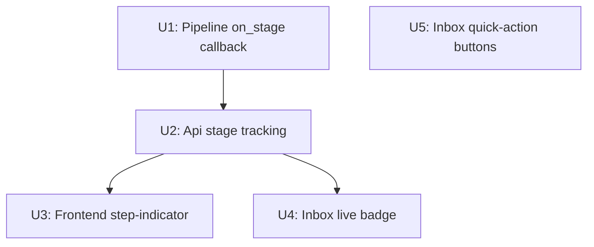

# feat: Real-time Job Progress Tracking

## Overview

The GUI spinner currently shows only elapsed time — a black box with no stage visibility. This plan adds a **step-indicator progress bar** in the job workspace that names each processing gate as it runs (`risk → media → dedup → assemble → lint`), a **live mini badge** on each inbox row while its background task is active, and **per-row quick-action buttons** so operators can process or retry individual jobs without opening the full workspace.

No behavioral change to the pipeline's gate chain or state machine.

## Problem Frame

When a job is processing, the operator sees a spinning glyph and `00:00` elapsed. They have no feedback about:
- Which gate is currently running (the LLM-heavy `assemble` step dominates wall-clock time)
- Whether the job is stuck or just slow
- Which stage is remaining

Additionally, the inbox inflight band (UI label "进行中") requires opening each job to process it individually — a friction point for batch management.

## Requirements Trace

- R1. Operator can see the current processing stage (gate name) in the job workspace during any async operation
- R2. Operator can see live stage information on inbox rows without navigating away
- R3. Operator can process a single CRAWLED job from the inbox without opening its workspace
- R4. No change to pipeline gate behavior, state transitions, or audit events
- R5. Reduced-motion users still get textual stage information (no glyph-only fallback)

## Scope Boundaries

- **Not**: server-sent events or WebSockets — polling interval stays at 1500ms
- **Not**: progress percentage (we have 5 discrete stages, not a continuous scale)
- **Not**: elapsed time per-stage (only global elapsed stays)
- **Not**: changes to `process_batch` CLI flow (no callback there)
- **Not**: changes to any state machine edge or audit event shape

## Context & Research

### Relevant Code and Patterns

- `src/lcp/pipeline.py` — `Pipeline.process()` (line 317), `Pipeline._process_inner()` (line 441), `Pipeline.run_until()` (line 641). The `on_stage` callback threads through these three.
- `src/lcp/adapters/processor/gate_registry.py` — `PARK_GATES: list[GateSpec]` (lines 114–118), `run_gate_chain()` iterates gates. This is where per-gate callbacks fire.
- `src/lcp/gui.py` — `Api._run_bg()` (line 356) wraps a synchronous fn; `_status` dict (line 148); `Api.job_status()` (line 466) reads from `_status` with idle fallback.
- `src/lcp/web/app.js` — `mountSpinner(kind)` (line 252), `updateSpinner(p)` (line 273), `pollTick(jobId)` (line 310), `jobRow(job)` (line 412), inflight band rendering (line 485). The `pollers` dict maps `job_id → {kind, ticks, errors, ui, timer, cap}`.

### Institutional Learnings

- `docs/solutions/unit-tests-mask-integration-bugs.md` — progress callback tests must verify the callback is called in gate order at the pipeline level, not just that `job_status` returns a field (the seam).
- `docs/solutions/begin-immediate-isolation-level.md` — gate callbacks run in a background thread; any db access inside them must honor the SQLite isolation pattern.

### External References

No external research needed — the step-indicator pattern is well-established locally (see the existing `stateColors` / `stacked-bar` in app.js lines 649–671) and the callback threading follows the existing `@bridge_safe` / `GateContext` patterns.

## Key Technical Decisions

- **Callback over shared dict**: `on_stage: Callable[[str], None] | None` threaded through the pipeline instead of a global thread-local dict. Rationale: keeps the progress update co-located with the gate execution, avoids a new shared state surface, and makes the call site explicit. The callback is a closure created in `Api` that writes to the already-thread-safe `_status` dict entry.

- **Stage written into existing `_status` dict**: `on_stage` writes `_status[job_id]["stage"] = name` while the job is running. `job_status()` already returns the full `_status` dict entry — `stage` appears automatically at no extra read cost. On job completion, the `done/error` write replaces the entire entry (stage is implicitly cleared).

- **Kind field added to `_run_bg` + `job_status`**: `job_status` response gains `"kind": "crawl|process|run|process_dry"` so the frontend knows which step sequence to render without a separate call. `kind` is written by `_run_bg` into `_status[job_id]` at task start.

- **Inbox badge keyed by DOM ID**: `jobRow()` emits `<span id="live-stage-{job_id}">` when `pollers[job_id]` is active. `pollTick` updates that element's text directly without re-rendering the row. On settle, `refreshInbox()` rebuilds all rows and the element is naturally gone.

- **Step sequences are frontend-only data**: The step sequence for each kind is a simple JS object (no server-side enumeration needed). Six stages total: `crawl | risk | media | dedup | assemble | lint`.

## Open Questions

### Resolved During Planning

- **Can `_status[job_id]["stage"]` be written from the background thread safely?** Yes, with the guard pattern below. The `_run_bg._worker` calls `fn()` while holding NO lock; it only acquires `_status_lock` after `fn()` returns (the completion write). The `on_stage` callback fires inside `fn()` (inside the background thread, before `fn()` returns), so it acquires `_status_lock` independently. This is safe — two separate, non-nested lock acquisitions. **Required guard pattern** in the closure: `with self._status_lock: if self._status.get(job_id, {}).get("status") == "running": self._status[job_id]["stage"] = name`. The `status == "running"` check prevents a late-arriving callback from overwriting a completion entry that has already landed.

- **Does `run_gate_chain` need the callback for the stopped-early case?** Yes — if `risk` parks the job, the operator should see "risk" as the active stage before it settles. The callback fires BEFORE the gate's `run()` call; if the gate parks, the UI shows the gate name briefly before the next `job_status` poll returns `done`.

- **Quick-action "处理" vs. navigate-to-job-view?** Stay in inbox. The button calls `process_async` + starts a local poller. The live badge on the row shows stage progress. The operator can open the full workspace anytime via "打开 ›".

- **How does the crawl-only path emit stage info?** For `kind="crawl"`, there is only one stage and it runs the entire task. Rather than adding `on_stage` to `create_and_crawl()`, `_run_bg` initializes `_status[job_id]["stage"] = "crawl"` directly at task start when `kind="crawl"`. No callback threading needed for the crawl path.

- **`kind` field: redundant or needed?** Keep it in `job_status` response for page-refresh recovery: after a browser reload, `pollers` is empty and `kind` from the server is the only way to select the correct step sequence when re-opening a running job's workspace.

## High-Level Technical Design

> *This illustrates the intended approach and is directional guidance for review, not implementation specification.*

**Backend data flow:**

```
Api.process_async(job_id, ...)
  │
  ├─ _run_bg(job_id, kind="process", fn=lambda: self.process(job_id, on_stage=callback))
  │     └─ _status[job_id] = {"status": "running", "kind": "process", "stage": None}
  │
  └─ background thread:
       Pipeline.process(on_stage=callback)
         └─ _process_inner(on_stage=callback)
              └─ run_gate_chain(PARK_GATES, ctx, on_stage=callback)
                   ├─ callback("risk")   → _status[job_id]["stage"] = "risk"
                   ├─ callback("media")  → _status[job_id]["stage"] = "media"
                   ├─ callback("dedup")  → _status[job_id]["stage"] = "dedup"
              ├─ callback("assemble") → _status[job_id]["stage"] = "assemble"
              └─ callback("lint")     → _status[job_id]["stage"] = "lint"

job_status(job_id) polls → returns {"status": "running", "kind": "process", "stage": "dedup"}
```

**Frontend step-indicator (kind="process"):**

```
Step bar in #job-inflight:
  [✓ 风险]  [✓ 媒体]  [✓ 去重]  [◉ 草稿]  [○ 校验]
              is-done   is-done   is-active  is-pending

pollTick sees stage="assemble" → advances active step → updateStepBar(p, "assemble")
```

**Inbox live badge update:**

```
jobRow(job) where pollers[job.job_id] exists:
  → appends <span id="live-stage-51" class="live-stage-badge">去重</span>

pollTick(jobId) on "running":
  → if resp.stage: el = document.getElementById("live-stage-" + jobId); if (el) setText(el, stageShort(resp.stage))
  → existing updateSpinner path unchanged
```

## Implementation Units



---

- [ ] **U1: Pipeline on_stage callback**

**Goal:** Thread `on_stage: Callable[[str], None] | None = None` through `Pipeline.process()`, `Pipeline._process_inner()`, `Pipeline.run_until()`, and `run_gate_chain()`. Emit the current gate name before each gate run (`run_gate_chain` covers `risk`/`media`/`dedup`); emit named signals before `assemble` and `lint` as explicit calls in `_process_inner` (outside the registry loop); emit `"crawl"` in `run_until` before calling `stage1()`.

Backward-compatibility note: `process_batch` (CLI) calls `Pipeline.process()` with no `on_stage` argument — safe with `None` default. No call-site change needed for CLI callers.

**Requirements:** R1, R4

**Dependencies:** None

**Files:**
- Modify: `src/lcp/pipeline.py` — `process()`, `_process_inner()`, `run_until()`
- Modify: `src/lcp/adapters/processor/gate_registry.py` — `run_gate_chain()`
- Test: `tests/processor/test_gate_registry.py` (create)
- Test: `tests/test_pipeline_progress.py` (create)

**Approach:**
- `run_gate_chain(gates, ctx, *, on_stage=None)`: keyword-only `on_stage` keeps all existing positional call sites backward-compatible. Call `on_stage(gate.name)` before each `gate.run(ctx)`. If `on_stage` is None, skip (no-op). (`Callable` is already imported in `gate_registry.py` line 22.)
- `_process_inner(... on_stage=None)`: pass `on_stage` to `run_gate_chain`; call `on_stage("assemble")` before the `assemble()` call; call `on_stage("lint")` before the grounding/lint call.
- `process(... on_stage=None)`: pass to `_process_inner`.
- `run_until(... on_stage=None)`: call `on_stage("crawl")` before `self.stage1()`; pass `on_stage` to `self.process()`.
- Callback exceptions must be caught silently (the operator UI failing must NOT crash gate execution).

**Execution note:** Implement test-first — write the callback-order assertions before adding the parameter.

**Patterns to follow:**
- Existing `GateContext` optional fields pattern in `gate_registry.py`
- `@bridge_safe` exception isolation pattern in `gui.py` — apply same `try/except` inside callback call

**Test scenarios:**
- Happy path: `run_gate_chain` with 3 gates and a callback → callback called in order `["risk", "media", "dedup"]`
- Gate stops early: risk gate parks → callback called once with `"risk"`, not `"media"` or `"dedup"`
- `on_stage=None`: pipeline runs normally, no AttributeError
- `_process_inner` callback sequence: a passing run calls `["risk", "media", "dedup", "assemble", "lint"]` in order
- `run_until` callback sequence: passes, emits `["crawl", "risk", "media", "dedup", "assemble", "lint"]`
- Callback raises: exception is swallowed; gate execution continues and completes normally

**Verification:**
- All existing pipeline and gate tests still pass (no regression)
- New tests confirm callback call order and early-stop behavior

---

- [ ] **U2: Api stage tracking — kind + stage in job_status**

**Goal:** Wire the `on_stage` callback from U1 into `Api`, tracking the current stage in the existing `_status` dict. `job_status` response gains `"stage"` and `"kind"` fields while the task is running.

**Requirements:** R1, R2

**Dependencies:** U1

**Files:**
- Modify: `src/lcp/gui.py` — `Api._run_bg()`, `Api.process()`, `Api.process_async()`, `Api.create_and_crawl()`, `Api.create_and_crawl_async()`, `Api.run_until_draft_async()`, `Api._do_run_until_draft()`, `Api.job_status()`
- Test: `tests/test_gui_run_async.py` (extend)
- Test: `tests/test_gui_api.py` (extend)

**Approach:**
- `_run_bg(job_id, fn, *, kind="process")`: add `kind` param. At task start, write `_status[job_id] = {"job_id": ..., "status": "running", "kind": kind, "stage": "crawl" if kind == "crawl" else None}`. The `"crawl"` stage is set immediately for crawl-only tasks (no on_stage callback needed on that path).

- Call-site `kind` values (all three must be updated):
  - `create_and_crawl_async` → `_run_bg(..., kind="crawl")`
  - `process_async` → `_run_bg(..., kind="process_dry" if dry_run else "process")`
  - `run_until_draft_async` → `_run_bg(..., kind="run")`

- `on_stage` closure (created inside `Api.process_async` and `Api._do_run_until_draft`): **Required guard pattern**: `with self._status_lock: if self._status.get(job_id, {}).get("status") == "running": self._status[job_id]["stage"] = stage_name`. The guard prevents late callbacks from overwriting a completion entry.
- `Api._do_run_until_draft()` (called via `run_until_draft_async`): creates the `on_stage` callback closure and passes it to `p.run_until()`. `run_until_draft_async` uses `kind="run"`. `Pipeline.run_until()` in turn passes `on_stage` to its internal `self.process()` call — both signatures need the `on_stage` parameter added (U1 covers the `run_until` signature; U2 covers the `_do_run_until_draft` wiring).
- `Api.process_async()` uses `kind="process"` (or `kind="process_dry"` when `dry_run=True`).
- `job_status()` return shape when running: `{"job_id": ..., "status": "running", "kind": "process", "stage": "dedup"}`. `stage` and `kind` are naturally present from the `_status` dict — no extra code needed.
- When task completes, `_run_bg._worker` writes the final `done/error` entry which has no `stage` key — that's the implicit clear.

**Patterns to follow:**
- Existing `_status_lock` acquire pattern in `_run_bg._worker` (lines 383–390 of `gui.py`)
- `_api(tmp_path)` + `_wait_settled()` test pattern in `tests/test_gui_run_async.py`

**Test scenarios:**
- Happy path with blocking gate: inject a mock gate that uses `threading.Event` to pause mid-chain; poll `job_status` while the event is not set → response includes `{"status": "running", "kind": "process", "stage": "risk"}`. Release event → job completes. (Do NOT use `time.sleep` — mock gates run in microseconds in CI, making time-based polls race.)
- `create_and_crawl_async` → `job_status` immediately returns `{"status": "running", "kind": "crawl", "stage": "crawl"}` (set at task start, no callback needed)
- `run_until_draft_async` → `job_status` returns `kind="run"` and advances through stages
- After task completes → `job_status` returns `done` with no `stage` or `kind` key
- Idle fallback (`job_status` for non-running job) → no `stage` key (unchanged behavior)
- Thread safety: two concurrent `process_async` on different job_ids — each sees its own stage, no cross-contamination
- Late callback guard: simulate a callback firing after the completion entry lands → stage field does NOT overwrite `status="done"` entry

**Verification:**
- Existing `test_gui_run_async.py` tests still pass
- New assertions confirm `stage` and `kind` appear in in-flight `job_status` response

---

- [ ] **U3: Frontend step-indicator progress bar**

**Goal:** Replace `mountSpinner(kind)` with a step-indicator that shows named stages. Active step is visually prominent; completed steps are marked ✓; pending steps are muted. `pollTick` updates the active step on each tick.

**Requirements:** R1, R5

**Dependencies:** U2 (needs `stage` + `kind` in `job_status` response)

**Files:**
- Modify: `src/lcp/web/app.js` — `mountSpinner`, `updateSpinner`, `pollTick`
- Modify: `src/lcp/web/app.css` — step-indicator styles

**Approach:**
- Define `STEP_SEQUENCES`:
  ```js
  var STEP_SEQUENCES = {
    crawl:       [{id:"crawl",  label:"爬取"}],
    process:     [{id:"risk",label:"风险"},{id:"media",label:"媒体"},{id:"dedup",label:"去重"},{id:"assemble",label:"草稿"},{id:"lint",label:"校验"}],
    process_dry: [{id:"risk",label:"风险"},{id:"media",label:"媒体"},{id:"dedup",label:"去重"},{id:"assemble",label:"预览"},{id:"lint",label:"校验"}],
    run:         [{id:"crawl",label:"爬取"},{id:"risk",label:"风险"},{id:"media",label:"媒体"},{id:"dedup",label:"去重"},{id:"assemble",label:"草稿"},{id:"lint",label:"校验"}]
  };
  ```
- Replace `mountSpinner(kind)` with `mountStepBar(kind)` that renders the appropriate sequence. Returns a UI handle with `{bar, elapsed, steps, kind}` so `updateStepBar` can find step elements.
- `updateStepBar(p, stage)`: if `stage` is null/falsy → render all steps as `is-pending` (normal pre-first-gate window). If `stage` is a known step ID → mark prior steps `is-done`, current step `is-active`, remaining `is-pending`. Update `elapsed` counter as before. **Do not fall back to `updateSpinner` for null stage** — `updateSpinner` references `p.ui.glyph` which will not exist in the new UI handle shape.
- Backward compat for absent `resp.kind` (version skew): fall back to the locally cached `p.kind` from the poller entry to select the step sequence.
- Reduced-motion: `mountStepBar` must carry over the `window.matchMedia('(prefers-reduced-motion: reduce)')` detection from the existing `mountSpinner`. When reduced-motion is detected, the `is-active` step gets a `◉` text prefix instead of a CSS animation (same behavior as the existing text-glyph fallback in `mountSpinner`). Step labels are always `textContent`, so text is always readable regardless of motion preference.
- CSS classes: `.step-bar` (flex row), `.step-item`, `.step-item.is-done`, `.step-item.is-active`, `.step-item.is-pending`. Color token mapping:
  - `.is-done` → `--c-go-bd` (✓ completed stages)
  - `.is-active` → `--c-progress-bd` (◉ currently executing)
  - `.is-pending` → `--c-neutral-bd` (○ not yet started)
- In `pollTick`: on `"running"` status, call `updateStepBar(p, resp.stage)` if `resp.stage` is truthy; else fall back to `updateSpinner`-style elapsed-only update.
- The `pollers[jobId]` object: `ui` field now holds the step-bar handle. No other structural change.

**Patterns to follow:**
- Existing `stateColors` + `lane--tone` class pattern for color tokens (app.js lines 652–658)
- Existing `el()` / `setText()` / `clear()` DOM discipline (never innerHTML)
- CSS `.stacked-bar` / `.stacked-seg` in `app.css` for horizontal step visual reference

**Test scenarios:**
- Test expectation: none — pure frontend visual rendering; verified manually via browser
- Manual: start a process job → step bar shows `[○ 风险] [○ 媒体] ...` → advances to `[✓ 风险] [◉ 媒体] ...` on stage update
- Manual: `prefers-reduced-motion` media query → `◉` text prefix instead of CSS animation on active step
- Manual: kind="crawl" → only `[爬取]` step shown; kind="run" → full 6-step bar

**Verification:**
- `mountSpinner` (old name) no longer referenced anywhere
- All step elements use `textContent` only (no innerHTML)
- Elapsed counter still advances on every poll tick

---

- [ ] **U4: Inbox live stage badge**

**Goal:** When an inbox job row has an active background poller, show a `<span id="live-stage-{jobId}">` badge with the current stage name. `pollTick` updates it directly without re-rendering the row. Badge is absent for jobs with no active poller.

**Requirements:** R2

**Dependencies:** U2 (stage in `job_status`), U3 (stage label mapping)

**Files:**
- Modify: `src/lcp/web/app.js` — `jobRow()`, `pollTick()`
- Modify: `src/lcp/web/app.css` — `.live-stage-badge` style

**Approach:**
- In `jobRow(job)`: after appending the "打开 ›" button, check `if (pollers[job.job_id])`. If true, read the current stage from the poller: `var initStage = pollers[job.job_id].lastStage || null`. Append `<span id="live-stage-{job.job_id}" class="live-stage-badge">{initStage ? stageShort(initStage) : "处理中"}</span>`. This ensures `refreshInbox()` re-renders the badge with the live stage text rather than resetting to "处理中".
- `stageShort(stageName)` helper: maps `"assemble"` → `"草稿"`, `"dedup"` → `"去重"`, etc. (shared with U3 step labels).
- In `pollTick(jobId)` on `"running"` status where `resp.stage` is truthy: store the stage on the poller entry (`p.lastStage = resp.stage`), then update the badge: `var lbl = document.getElementById("live-stage-" + jobId); if (lbl) setText(lbl, stageShort(resp.stage));`. The `if (lbl)` guard handles the race where `refreshInbox()` has already replaced the node.
- The badge element is identified only by `id`, never by class selector, to avoid fragile querySelectorAll.
- When `settle(jobId, outcome)` calls `refreshInbox()`, all rows are rebuilt — the badge naturally disappears for settled jobs.
- If the operator starts polling via the inbox "处理" button (U5) and navigates to the job workspace, `#job-inflight` shows the full step bar; the inbox badge is also live for the same job if the inbox view is ever re-rendered.

**Patterns to follow:**
- Existing `job.job_id` DOM ID pattern: `row.dataset.jobId = job.job_id` (line 418)
- `.badge` class and `setText()` discipline from existing `badgeFor()` (line 404)

**Test scenarios:**
- Test expectation: none — pure frontend visual rendering; verified manually
- Manual: trigger `process_async` from inbox, stay in inbox view → row shows "去重" badge that advances to "草稿" when LLM call starts
- Manual: navigate away and back → badge appears if `refreshInbox` is called while poller is still active

**Verification:**
- `id="live-stage-{jobId}"` is unique in DOM (one per job row, jobId is the unique key)
- No orphaned badges after a job settles (row rebuild removes them)

---

- [ ] **U5: Inbox per-row quick-action buttons**

**Goal:** Add per-row quick-action buttons to the inflight band, complementing the existing "全部处理" batch button (which processes all CRAWLED jobs at once without inbox visibility). These per-row buttons add single-job granularity and live progress badges. Clicking starts the background task and a local poller; the operator stays in the inbox view.

**State → action mapping:**

| State | Button label | Action |
|-------|-------------|--------|
| `crawled`, `crawled_warn` | 处理 | `process_async(job_id, ...)` |
| `process_failed`, `needs_revision` | 重试处理 | `process_async(job_id, ...)` |
| `crawl_failed` | 重新抓取 | `create_and_crawl_async(job_id, "")` (re-crawl from stored URL) |
| `new`, `processed`, `blocked`, `approved`, etc. | (no button) | — |

**Requirements:** R3

**Dependencies:** U4 (live badge to show progress after action)

**Files:**
- Modify: `src/lcp/web/app.js` — `jobRow()`, inflight band rendering section
- Modify: `src/lcp/web/app.css` — spacing for the extra button

**Approach:**
- Follow the state→action mapping table above. For each applicable row, insert the button before "打开 ›".
  - Click handler: `e.stopPropagation()`, disable button via `setBusy(btn, true)`, call the appropriate `process_async` or `create_and_crawl_async`, start poller via `startPollInbox(job.job_id, kind)`.
  - `setBusy(btn, false)` is NOT needed: `settle()` calls `refreshInbox()` which rebuilds the entire row, naturally removing the button. If `refreshInbox` fails, the button stays disabled — acceptable; the next manual refresh corrects it.
- `startPollInbox(jobId, kind)`: like `startPoll` but does NOT switch view (`showView("job")`). Uses the same `pollers` dict and `pollTick` mechanism. The `ui` field is `null` (no step bar in inbox). The `mountStepBar` is only mounted in `startPoll` (job-workspace path). The `pollers[jobId]` entry includes `lastStage: null` for badge rehydration (updated by `pollTick`). Cap-reached behavior: when `ticks >= cap`, show a toast ("处理时间较长，请稍后查看"), call `refreshInbox()` to update the row from persisted state, and clear the poller (same as workspace path's settle logic). **Do not call `capReached()` directly** — that function writes into `#job-inflight` which doesn't apply here.
- Duplicate guard: if `pollers[job_id]` already exists, clicking "处理" is a no-op (idempotent, same guard as `_run_bg`).
- After clicking, the button is visually disabled (via `setBusy(btn, true)` pattern from existing batch button).

**Patterns to follow:**
- Existing `setBusy(batchBtn, true)` pattern (line 490) and `batchBtn.addEventListener` pattern (line 488)
- Existing `e.stopPropagation()` on "打开 ›" button (line 442) — same needed here to avoid row click opening the job

**Test scenarios:**
- Test expectation: none — pure frontend; verified manually
- Manual: inbox shows CRAWLED job → "处理" button visible → click → button disabled, badge appears → job eventually settles and row updates to new state

**Verification:**
- "处理" / "重试" buttons only appear for the listed states, not for BLOCKED, APPROVED, etc.
- Clicking doesn't navigate away from inbox
- Duplicate click protection works (no double processing)

---

## System-Wide Impact

- **Interaction graph:** `Pipeline.process()` / `_process_inner()` / `run_gate_chain()` gain a new optional parameter. All existing callers (CLI, direct Pipeline use in tests) pass no argument → `None` default → no behavioral change. Only `Api.process_async` / `run_until_draft_async` supply the callback.
- **Error propagation:** Callback exceptions are swallowed at the call site (try/except around `on_stage(name)`). A broken callback must never surface as a gate failure or PROCESS_FAILED.
- **State lifecycle risks:** The stage update writes to `_status[job_id]` via a short `_status_lock` acquisition inside the `on_stage` closure. The completion write replaces the whole dict entry in a single assignment under `_status_lock` (not the same acquisition). A window exists between the last `on_stage("lint")` callback and the completion write — a poll in that window correctly sees `{status: "running", stage: "lint"}`. This is expected and cosmetically harmless; the next poll returns `done`.
- **API surface parity:** CLI (`lcp process`, `lcp run`) does not expose progress — acceptable (the callback is `None` on the CLI path).
- **Integration coverage:** U2 tests must poll `job_status` at least once *before* the background task finishes and assert `stage` is present. The `_wait_settled` helper in `test_gui_run_async.py` polls until done — a new helper that samples mid-flight is needed.
- **Unchanged invariants:** Gate order, park behavior, state machine edges, audit events, and `_run_bg`'s duplicate-worker guard are unchanged. `job_status`'s idle fallback to SQLite is unchanged.

## Risks & Dependencies

| Risk | Mitigation |
|------|------------|
| Callback timing: stage emitted BEFORE gate runs, so `job_status` may show "risk" while risk is still executing | This is intentional and correct — "risk" means "entering risk gate", not "risk passed". Label in UI is "正在检查 风险" not "风险已通过". |
| `assemble` (LLM call) is the slowest step; operators may think the step bar is stuck | Add elapsed timer next to the active step label. The existing elapsed counter in the step bar head covers this. |
| Inbox badge DOM ID collision if two tabs open | Both tabs poll the same job; both update their own DOM — safe, no shared DOM. |
| Quick-action on CRAWL_FAILED | The correct action is **re-crawl** (`create_and_crawl_async`), NOT `process_async` — calling `process_async` on a `CRAWL_FAILED` job raises `InputValidationError`. If `data/jobs/<id>/source.json` is absent, show a toast and do not launch. |
| `startPollInbox` with `ui=null` in the poller — `updateSpinner` / `updateStepBar` may NPE | Both functions guard `if (!p.ui) return;` — verify this guard is respected. |
| `on_stage` callback raises an exception during gate execution | Exception is caught and swallowed silently (`try/except Exception: pass` around `on_stage(name)`). Gate execution continues normally. This is intentional — UI failures must never cause `PROCESS_FAILED`. To debug, inspect the callback closure directly. |

## Documentation / Operational Notes

- No operator-facing documentation change needed — the progress bar is self-describing.
- No config.yaml change.
- No new API endpoints; `job_status` is extended with optional fields (`stage`, `kind`) that are absent when idle — backward-compatible.

## Sources & References

- Related code: `src/lcp/pipeline.py` (lines 317–599), `src/lcp/adapters/processor/gate_registry.py`, `src/lcp/gui.py` (lines 148–480), `src/lcp/web/app.js` (lines 233–382, 412–444, 485–512)
- Test patterns: `tests/test_gui_run_async.py` — `_api(tmp_path)`, `_wait_settled()` helpers
- CSS token reference: `app.css` — `--c-progress-bd`, `--c-go-bd`, `--c-neutral-bd`, `--c-attention-bd`
