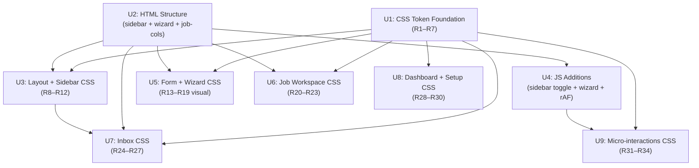

# feat: Full GUI visual redesign — new design language

## Overview

Complete visual overhaul of the lcp GUI webui. The functional architecture (state machine, async polling, CSRF, CSP, lex translations, fail-closed coloring) is **unchanged**. The redesign replaces the flat `.row` form layout, warm-grey card palette, and top-tab navigation with a deep indigo sidebar, cooler blue-grey neutrals, saturated state color tokens, vertical `.field-group` form layout, a 3-step create wizard, and a 2-column job workspace. Three files change: `app.css` (full rewrite, ~400 lines), `index.html` (structural additions), and `app.js` (< 100 lines of new sidebar/wizard/animation logic).

## Problem Frame

The existing GUI looks like an engineer's prototype, not a tool a non-technical operator opens daily. All functional gaps (state-driven affordances, async polling, lex human-text, CSRF, fail-closed coloring) were solved in a prior plan (`2026-06-16-003-feat-operator-gui-uiux-plan.md`). What remains is the **visual language**: `.row`-flat forms, warm-grey canvas, and header-tab navigation produce low perceived quality. The operator's mental model — *"I know where I am, what to do next, this is a serious tool"* — requires visual hierarchy, a brand shell, and form ergonomics that the current CSS cannot provide.

See origin: `docs/brainstorms/2026-06-24-gui-redesign-requirements.md`

## Requirements Trace

**Color & Typography**
- R1. Sidebar/header background: deep indigo `#1a1f36`, content area white
- R2. State color family bg+border tokens upgraded in saturation; badge text preserved as dark ink on tinted background (WCAG ≥7:1 maintained via existing `-tx` token mechanism)
- R3. Neutrals: canvas `#f1f5f9`, border `#cbd5e1`, ink-500 `#64748b`, ink-900 `#0f172a`
- R4. All CSS custom property names unchanged — zero JS change
- R5. `--fs-display: 2rem` (Job title), `--fs-heading: 1.25rem` (section titles)
- R6. Body line-height 1.55 → 1.65
- R7. Label/badge font-weight → 500

**Navigation**
- R8–R12. Left sidebar (220px desktop): brand, nav links, inbox search (R26), readiness pill at bottom; `main` becomes `flex:1 max-width:52rem`; mobile: hamburger → fixed overlay; active link: 3px left indicator; honesty note moves to sidebar bottom

**Form Elements**
- R13–R15. Input/select 40px, 8px radius, 1.5px border, focus indigo ring; `.field-group` vertical label-above-input stack; `.form-card` grouping (24px pad, border, 8px radius)

**Create Wizard**
- R16–R19. 3-step wizard (Source → Options → Confirm); step indicator (number nodes + connecting line); card radio for mode selection; step state in JS module vars (`.hidden` toggle, no HTML changes); re-crawl opens at Step 2 with Step 1 pre-filled and locked; Step 3 shows label/value summary; URL validation on "Next" click (not blur); submit disables wizard → `enterProgress()` → wizard hides; API error: toast + stay at Step 3

**Job Workspace**
- R20–R23. 2-column (`#job-cols`): left 60% packet+steps+banner, right 40% sticky actions; mobile: single column, actions sticky bottom; horizontal stepper (desktop) / vertical timeline (mobile); status banner 12px radius + 6px left color stripe; actions panel title "你現在可以做" (active) / "此工作已停止" (terminal hold) / "已完成" (fully terminal)

**Inbox**
- R24–R27. Band heads: 8px color dot + count pill badge; job rows: 56px height, 3-column (id+badge / reason / time+button), hover lift `translateY(-1px)`; search box in sidebar (ID preserved); empty state with CSS geometry illustration

**Dashboard + Setup**
- R28–R30. KPI cards: full-color bg block, `2.5rem` number, uppercase label; section title separator (`.dash-section h3::after` scoped); setup: `max-width:480px` centered card, readiness list card separate from settings card

**Micro-interactions**
- R31. View-enter: `opacity + translateX(20px→0)` via `requestAnimationFrame` in `showView()` (~5 JS lines); in-place refresh does not trigger animation
- R32. Job-row hover: `translateY(-1px)` + deeper shadow, 150ms
- R33. Toast: left-bottom position (above sidebar), 12px radius
- R34. Button ripple: CSS-only `::after @keyframes ripple`, `overflow:hidden` on `.btn-primary/.btn-secondary`; `prefers-reduced-motion` suppresses via existing block

**Success criteria:**
- Non-technical operator perceives a professional editorial tool, not a developer prototype
- All API calls, lex translations, state-gate logic, CSRF/CSP boundaries unchanged
- `app.js` net-new < 100 lines; `lex.js` zero changes; all backend unchanged
- `app.css` fully rewritten (~400 lines); all programmatic class names preserved
- ≥768px sidebar, <768px top bar + overlay; all functionality mobile-reachable

## Scope Boundaries

- No dark mode (`prefers-color-scheme: dark`)
- No icon fonts, SVG sprites, custom web fonts (CSP `style-src 'self'`)
- No build step, framework, or CDN dependency
- No keyboard-shortcut changes (command palette already handles this)
- State semantic color families (AMBER/RED/GREEN/INDIGO/BLUE/GREY/SLATE) keep their MEANING — only token values change
- `lex.js`, `gui.py`, `webserver.py`, `pipeline.py`, all backend APIs: no changes
- The 5 dashboard `element.style.*` inline assignments (bar/segment widths and heights) are data-proportional and remain; CSP allows JS property assignment, only HTML `style=""` attributes are blocked

## Context & Research

### Relevant Code and Patterns

**File inventory:**
- `src/lcp/web/index.html` (160 lines) — all views present in DOM at load time; `showView()` toggles `element.hidden`
- `src/lcp/web/app.css` (434 lines) — single file, zero build, CSP-compliant; `[hidden] { display: none !important }` is load-bearing
- `src/lcp/web/app.js` (1957 lines) — no framework; 55+ element IDs referenced by string literal; 100+ class names set programmatically

**CSS custom property structure:**
- Type scale: `--fs-300` (.78rem) → `--fs-900` (1.85rem) — 6 steps, all must survive rewrite
- Spacing: `--sp-1` (.25rem) → `--sp-7` (3rem) — 7-step 4px grid
- Radius: `--radius-sm` 4px, `--radius-md` 8px, `--radius-pill` 999px
- State color 3-token pattern: `--c-{family}-bg / -bd / -tx` for each of: neutral, progress, attention, stop, go, frozen, void
- Tone classes (set by app.js): `badge--{tone}`, `lane--{tone}`, `tone--{x}` where tone ∈ {neutral, ready, caution, busy, review, retry, stop, frozen, done, void}

**Existing @keyframes (all must survive, in same names):**
`tray-in`, `spin`, `badge-in`, `toast-in`, `toast-out`, `shimmer` — all suppressed in `@media (prefers-reduced-motion: reduce)` block

**showView() mechanics:**
Sets `section.hidden = (v !== name)` for each view; updates `aria-current` on `<button id="nav-{name}">`. For the rAF animation: removing `hidden`, then in the next frame adding a CSS class, then removing it on `animationend`. The sidebar overlay uses a different mechanism (class toggle, not `hidden`) since it is `position:fixed` and always in the DOM.

**bindCreate() DOM dependencies (IDs that must survive into wizard containers):**
`create-mode-url`, `create-mode-dir`, `create-url-row`, `create-dir-row`, `create-source-pick`, `create-source-del`, `create-url`, `create-job-id`, `create-quick-mode`, `create-dry`, `btn-create`, `create-save-source`, `create-save-label`, `create-status`, `create-reuse-row`

**Mobile nav:** Currently `<select id="nav-select">` (hidden on desktop, visible on mobile). The sidebar redesign replaces this; `nav-select` can be hidden permanently or removed.

**Programmatic class names that MUST NOT be renamed in CSS:**
`job-row`, `action-row`, `ready-row`, `skeleton-row`, `band`, `band-head`, `band-body`, `band--attention`, `band--stopped`, `band--inflight`, `band--closed`, all `badge--*`, all `lane--*`, all `tone--*`, `btn-primary`, `btn-secondary`, `btn-danger`, `is-armed`, `is-frozen`, `is-leaving`, `is-active`, `is-exhausted`, `pill--ready`, `pill--block`, `inflight`, `inflight-head`, `spin`, `elapsed`, `banner`, `banner--state`, all `banner--*`, `job-id`, `job-why`, `job-when`, `job-interrupted`, `count-chip`, `empty`, `confirm-tray`, `confirm-actions`, `confirm-backdrop`, `confirm-wrap`, `hold-panel`, `packet`, `frozen-ribbon`, `hash-chip`, `inert-link`, `inert-link__tag`, `inert-link__url`, `field`, `toast`, `toast--*`, `toast-msg`, `toast-close`, `skeleton`, `kpi-grid`, `kpi-card`, `kpi-card--*`, `kpi-value`, `kpi-label`, `stacked-bar`, `stacked-seg`, `gate-bar-wrap`, `gate-bar-label`, `gate-bar-track`, `gate-bar-fill`, `gate-bar-fill--*`, `daily-chart`, `daily-col`, `daily-bar`, `daily-label`, `daily-value`, `palette-item`, `palette-item-key`, `palette-empty`, `workflow-panel`, `workflow-steps`, `step`, `step--done`, `step--blocked`, `step--not-yet`, `step-mark`, `step-label`, `step-blocked-reason`, `step-notify`, `step-notify-hint`, `ready-row`, `ready-list`, `handoff`, `cover-report`, `ingest-report`

### Institutional Learnings

- **CSP `style-src 'self'`**: Zero `style=""` attributes in HTML, zero `<style>` blocks. Use `className` / `.classList` toggling. JS `element.style.foo` property assignments are CSP-safe (only HTML-source inline styles are blocked). Source: active CSP in `index.html:14` + `webserver.py`.
- **textContent only**: Never use `.innerHTML`. Covers XSS + PII exfiltration in one rule. Source: `docs/security/pii-inventory.md`.
- **CSRF token delivery**: `<meta name="lcp-csrf">` is the canonical source. Never put in URLs, logs, or cookies. Sent as `Authorization: Bearer` on every `/api/*` POST. This meta tag must survive the HTML restructure. Source: `docs/solutions/localhost-http-api-csrf-defense.md`.
- **State machine terminals**: `BLOCKED`, `DUPLICATE`, `SUPERSEDED` have no automatic exit. UI must reflect this — no retry buttons, no ambiguous affordances. Source: `docs/solutions/begin-immediate-isolation-level.md` + `CLAUDE.md`.
- **`PROCESSING` is transient**: Never persisted to SQLite. Poll-based UI should handle state jumping `CRAWLED → PROCESSING → resting` without a stable `PROCESSING` observation. Source: `CLAUDE.md`.
- **No CSS/DOM tests**: Zero automated visual regression. Any class rename is a silent UI break. This is the biggest risk of the CSS rewrite. Source: repo research (no pytest DOM tests found).

### External References

None required — stack is vanilla HTML/CSS/JS with no framework dependencies. All patterns derivable from existing codebase.

## Key Technical Decisions

- **Single `app.css` complete rewrite**: The existing file is a monolith; there is no build step to split it. The rewrite replaces it in full while preserving all programmatic class name contracts. Alternative (incremental patching) would leave dead CSS and conflicting token values.

- **All `create-*` IDs survive into wizard step containers**: The wizard adds wrapper `<div id="wizard-step-N">` divs but keeps every existing element and its ID intact inside them. `bindCreate()` reads IDs by string literal — zero JS change needed for the DOM traversal. The wizard JS only adds step visibility control.

- **Sidebar toggle uses CSS class, not `hidden` attribute**: The sidebar is `position:fixed` and always in the DOM. On mobile, toggling class `sidebar--open` on `<body>` (or a wrapper) lets CSS set `transform: translateX()` for the overlay. Using `hidden` would cause `display:none` which cannot animate.

- **Mobile hamburger replaces `nav-select`**: The `<select id="nav-select">` becomes permanently hidden. The sidebar overlay handles mobile navigation. `nav-select`'s `change` handler in `bind()` can remain (harmless if element is hidden) or be removed in the same JS edit.

- **Inbox search (`#inbox-search`) moves to sidebar HTML**: The element ID is preserved. `bindInboxSearch()` uses `$('inbox-search')` by ID — zero JS change. When the sidebar is collapsed on mobile, the search is temporarily inaccessible; the planning decision is to add a mobile-visible fallback dot in the top bar (deferred to planning per requirements doc).

- **`showView()` gets rAF wrapper for view-enter animation**: `[hidden] { display: none !important }` prevents CSS transitions on elements going from `hidden → visible`. Solution: remove `hidden` first, then in `requestAnimationFrame` callback add `.view-entering` class (triggers keyframe), then remove the class on `animationend`. This is ~5 lines of JS change inside `showView()`.

- **`--c-attention-tx` (and all `-tx` tokens) stay as dark-ink-on-tinted**: WCAG compliance is maintained by the existing 3-token mechanism where `-bg` is a light tint and `-tx` is a dark readable ink color. The upgrade in R2 changes only `-bg` and `-bd` to use more saturated values; `-tx` values are re-verified to ensure ≥4.5:1 contrast on the new `-bg`.

- **Horizontal stepper for workflow steps (desktop)**: `stepsFor()` returns ordered steps for rendering. CSS converts the `<ol class="workflow-steps">` to a horizontal flex layout on desktop. All existing `step`, `step--done`, `step--blocked`, `step--not-yet`, `step-mark`, `step-label` classes are preserved. Overflow strategy: when ≥7 steps cannot fit, use compact label (icon + abbreviated text), with tooltip on hover (CSS `title` attribute, zero JS).

## Open Questions

### Resolved During Planning

- **R2 WCAG compliance mechanism**: Saturated colors used only as `-bg` and `-bd` tokens. The `-tx` tokens keep dark ink on tinted background (existing ≥7:1 mechanism). Resolved: confirmed in requirements doc by user.
- **R31 animation technical approach**: `showView()` adds one-frame `requestAnimationFrame` delay to allow `[hidden]` removal to process before animation class is added. Resolved: confirmed by user (5 JS lines, within budget).
- **3-step wizard vs flat form**: Wizard retained. Step 3 shows label/value summary. Error/loading states specified in R16 (requirements doc). Resolved: confirmed by user.
- **Terminal state actions panel**: R23 specifies three title variants (active / hold / fully-terminal). Resolved in requirements doc.
- **`position:sticky` for actions panel**: `#job-cols` wrapper has no `overflow` property; `<main>` has no overflow; sticky works because the scroll container is the viewport. `align-self: stretch` ensures the right column is tall enough for sticky to function. Confirmed feasible by feasibility reviewer.
- **R29 `h3::after` scope**: Must be scoped to `.dash-section h3` only, not global `h3`. All other h3s (job workspace, packet sections) remain `display:block`.

### Deferred to Implementation

- **Sidebar search mobile fallback**: The requirements doc defers the mobile fallback for `#inbox-search` (hidden in collapsed sidebar) to planning. Implementation choice: add a search icon in the mobile top bar that auto-opens the sidebar; or accept that mobile search requires opening the sidebar first. Implementer to choose the lower-complexity option.
- **Stepper compact mode cutoff**: Exact breakpoint where horizontal stepper switches from full-label to icon-only compact mode is left to the implementer's visual judgment (context: left column is ~60% of `max-width:52rem` = ~30rem ≈ 480px).
- **`nav-select` removal vs hide**: Either `display:none` on `#nav-select` in CSS (zero HTML change) or removing the element from `index.html` entirely. The `change` listener in `bind()` is harmless if element is hidden. Implementer to choose.
- **R26 cross-view search behavior**: Sidebar search visible on non-inbox views. Implementer to choose: (a) disable/gray input when not on inbox view (~3 JS lines), or (b) `showView('inbox')` on first keypress (~5 JS lines).

## High-Level Technical Design

> *This illustrates the intended approach and is directional guidance for review, not implementation specification.*

### Implementation Unit Dependency Graph



U1 and U2 are independent roots (can be done in parallel). After both complete, U3/U4/U5/U6/U8 can proceed in parallel. U7 waits on U3 (sidebar search position). U9 waits on U4 (rAF in showView).

### State Color Token Upgrade Pattern

```
Before (warm-grey approach):
  --c-attention-bg: #fdf3da   (very light amber tint)
  --c-attention-bd: #c8901b   (medium amber)
  --c-attention-tx: #6b4900   (dark amber ink)

After (saturated bg+border, same dark-ink text):
  --c-attention-bg: #fef3c7   (Tailwind amber-100, high saturation tint)
  --c-attention-bd: #f59e0b   (Tailwind amber-400, saturated border)
  --c-attention-tx: #92400e   (Tailwind amber-800, dark ink — WCAG ≥7:1 on bg)
```

Same 3-token structure, same CSS property names. Only values change. The `-tx` color is always the dark-family member providing ≥4.5:1 contrast against the `-bg` tint.

## Implementation Units

- [ ] **U1: CSS Token Foundation** (R1–R7)

**Goal:** Replace all CSS custom property values in `app.css` with the new design-language tokens. No structural CSS changes — only `:root {}` values update.

**Requirements:** R1, R2, R3, R4, R5, R6, R7

**Dependencies:** None

**Files:**
- Modify: `src/lcp/web/app.css` — `:root {}` block only

**Approach:**
- Replace neutral canvas `#eef0f4` → `#f1f5f9`; paper stays `#fff`; border `#d4d8df` → `#cbd5e1`; ink-500 `#5e6671` → `#64748b`; ink-900 `#1a1d21` → `#0f172a`
- Add `--c-sidebar-bg: #1a1f36`, `--c-sidebar-tx: #e2e8f0`, `--c-sidebar-active: #818cf8`
- Update each `--c-{family}-bg/-bd` pair to saturated values per R2; verify each `-tx` achieves ≥4.5:1 on its paired `-bg` (WebAIM checker before committing)
- Add `--fs-display: 2rem`, `--fs-heading: 1.25rem`
- Change body `line-height` from `1.55` to `1.65`
- Add `--font-weight-label: 500` or apply `font-weight: 500` to label/badge selectors
- All 6 type-scale names (`--fs-300` → `--fs-900`), spacing names (`--sp-1` → `--sp-7`), and radius names unchanged
- Add `--sidebar-width: 220px` — referenced in U3 sidebar width and U9 toast offset; prevents 220px magic-number duplication
- Add z-index scale: `--z-sticky: 10`, `--z-sidebar: 100`, `--z-sidebar-backdrop: 99`, `--z-toast: 200`, `--z-confirm-backdrop: 150`, `--z-confirm-tray: 160` — ensures confirm-tray renders above sticky actions panel on mobile and above sidebar overlay
- **Migration note:** The existing `.view { transition: opacity .15s ease }` and `.view[hidden] { opacity: 0 }` rules in the current `app.css` **must be removed** in this rewrite. The rAF-based view-enter animation (U4/U9) replaces them entirely. Leaving both active causes a double-fade flicker (the opacity transition fires immediately on `hidden` removal; then the rAF class fires a second keyframe animation on the same property in the same frame).

**Patterns to follow:**
- Existing `:root {}` block in `app.css` lines 1–45 — exact same variable names, only values change
- Existing state color 3-token naming: `--c-{family}-{bg|bd|tx}`

**Test scenarios:**
- Happy path: Page loads, `--c-attention-bg` resolves to the new amber tint; all existing badges render with new hue but same tone contrast
- **WCAG gate (blocking):** For each of the 7 color families, verify computed `-tx` on computed `-bg` achieves ≥4.5:1 on WebAIM Contrast Checker before committing. U1 is not done until all 7 families pass. Attach verification screenshot or paste ratios in the PR.
- Regression: All existing component styles that reference `var(--c-*)` continue to render (no undefined variable reference); `console.errors` in DevTools: zero
- Regression: `pytest -q` passes (no Python test reads CSS token values)

**Verification:**
- Loading the page in browser shows noticeably cooler neutrals and more vibrant state badges
- No yellow/orange `var(--undefined)` rendering artifacts

---

- [ ] **U2: HTML Structure Additions**

**Goal:** Add the new structural elements to `index.html` without breaking any existing element IDs or JS wiring. This unit adds the sidebar wrapper, hamburger button, 3-step wizard containers, and the 2-column job workspace wrapper.

**Requirements:** R8, R10, R16, R18, R20 (structural parts only)

**Dependencies:** None (parallel with U1)

**Files:**
- Modify: `src/lcp/web/index.html`

**Approach:**

*App shell wrapper (layout root):* Add `<div class="app-shell">` immediately after `<body>` opening tag, wrapping `<aside id="sidebar">` and `<main>`. The `<header>` (mobile top bar) stays **outside** `.app-shell` as a full-width `position:sticky; top:0` bar above it. This preserves `body { display: block; margin: 0 auto; max-width: 62rem }` unchanged — only `.app-shell` becomes the flex row. **Do NOT set `display:flex` on `body` directly — doing so breaks the existing header sticky positioning and centering.**

*Sidebar content:* `<aside id="sidebar">` contains: brand/logo `<div>`, `<nav>` with **5 links** — inbox, dashboard, `+ 新工作` (must be present on mobile; maps to same `openCreate(null)` action as desktop `nav-new`), setup, and settings — then `<input id="inbox-search">` (moved from `#view-inbox`), readiness pill `<span id="ready-pill">` (moved from header), honesty note `<p>` (moved from header) in a `.sidebar-footer` div.

*Mobile top bar:* The existing `<header>` is repurposed as the mobile-only top bar. Remove `<nav class="nav">` buttons and `<select id="nav-select">` from it. Add `<button id="sidebar-hamburger" type="button" aria-label="開啟導覽選單" aria-expanded="false" aria-controls="sidebar">` inside the header. The header keeps the `<h1>` text as the app name.

Add `<div id="sidebar-backdrop">` as a sibling of `#sidebar` inside `.app-shell` (full-screen dimmer for overlay close).

*3-step wizard:* Inside `<div id="job-create">`, wrap existing form elements in three `<div>` containers: `<div id="wizard-step-1">` (source: mode radio + url/dir rows + source-pick), `<div id="wizard-step-2">` (options: dry/quick-mode + job-id + save-source), `<div id="wizard-step-3">` (confirm: summary area + submit button). Add `<div id="wizard-indicator">` above with 3 `<span class="wizard-node">` nodes (distinct from the workflow `step-mark` class). Add `<button id="wizard-prev">` and `<button id="wizard-next">` navigation. All existing `create-*` IDs stay in their elements — only the parent wrapper changes.

*Validation error DOM:* Add two new `<span>` elements immediately after their respective inputs:
- After `#create-url`: `<span class="field-error" id="create-url-error" aria-live="assertive"></span>`. Add `aria-describedby="create-url-error"` to `#create-url`.
- After `#create-dir`: `<span class="field-error" id="create-dir-error" aria-live="assertive"></span>`. Add `aria-describedby="create-dir-error"` to `#create-dir`.
These spans are always in the DOM; U4 writes textContent to them on validation fail and clears on pass.

*Job workspace 2-column:* Inside `<section id="view-job">`, wrap `#job-banner`, `#job-workflow`, `#job-inflight`, `#job-packet`, `#job-status` in `<div id="job-left-col">` and wrap `#job-actions` in `<div id="job-right-col">`. Add `<div id="job-cols">` around both columns.

*Key invariants:*
- All 55+ IDs listed in research remain exactly where `$()` expects them
- `<meta name="lcp-csrf">` is in `<head>` — untouched
- `<meta name="lcp-notification-enabled">` — untouched
- CSP `<meta http-equiv>` — untouched
- `<script src="lex.js">` and `<script src="app.js">` at end of `<body>` — untouched
- `<div id="toast-container">`, `<div id="command-palette">`, `<button id="scroll-top">` — untouched positions

**Patterns to follow:**
- Existing `hidden` attribute pattern for show/hide (no `class`-based hide)
- Existing element IDs: never rename, only re-parent

**Test scenarios:**
- Structural completeness: All 55+ hardcoded IDs still present in document (`grep -c 'id="'` count stable)
- No lost elements: `nav-inbox`, `nav-dashboard`, `nav-new`, `nav-setup`, `ready-pill`, `inbox-search`, `job-create`, `job-banner`, `job-workflow`, `job-actions`, `job-packet`, `create-mode-url`, `create-url`, `create-job-id`, `btn-create` — all reachable via `document.getElementById()`
- CSP meta and CSRF meta both present in `<head>` (grep confirms)
- Page loads without JS errors (no `Cannot read property of null` for detached element references)
- `pytest -q` continues to pass (Python tests that check for page structure do so via the Api, not DOM parsing)

**Verification:**
- `index.html` parses without HTML validation errors
- DevTools Elements panel shows sidebar, job-cols, wizard-step-1/2/3 in correct positions
- Existing Python test suite passes unchanged

---

- [ ] **U3: Layout + Sidebar CSS** (R8–R12)

**Goal:** Implement the new 2-pane layout (sidebar + main), sidebar visual design, mobile top bar, and hamburger overlay behavior in CSS.

**Requirements:** R8, R9, R10, R11, R12

**Dependencies:** U1 (tokens), U2 (HTML structure in place)

**Files:**
- Modify: `src/lcp/web/app.css` — layout and sidebar sections

**Approach:**
- `.app-shell { display: flex; min-height: 100vh }` — flex row; `body` stays `display: block` (preserving existing `margin: 0 auto; max-width: 62rem`)
- `header { position: sticky; top: 0; display: none }` on desktop (≥768px); visible on mobile as the top bar; contains hamburger + app title
- `#sidebar { width: var(--sidebar-width); flex-shrink: 0; background: var(--c-sidebar-bg); color: var(--c-sidebar-tx); display: flex; flex-direction: column; position: sticky; top: 0; height: 100vh; overflow-y: auto }`
- `main { flex: 1; max-width: 52rem; min-width: 0 }` — min-width:0 prevents flex overflow
- Sidebar nav links: `display: block`, hover `background: rgba(255,255,255,.07)`, active `background: rgba(255,255,255,.12)` with `border-left: 3px solid var(--c-sidebar-active)`, `color: #fff`
- Readiness pill at sidebar bottom: `.sidebar-footer { margin-top: auto; padding: var(--sp-3) }` — `#ready-pill` inside this
- Mobile (`<768px`): sidebar `transform: translateX(calc(-1 * var(--sidebar-width)))` + `position: fixed; z-index: var(--z-sidebar); height: 100%`. Body gets `sidebar--open` class when open; CSS rule `body.sidebar--open #sidebar { transform: translateX(0) }`. Header (hamburger bar) visible. `.app-shell { padding-top: 0 }` (header is fixed, not in flex flow on mobile).
- Backdrop: `#sidebar-backdrop { display: none; position: fixed; inset: 0; background: rgba(0,0,0,.4); z-index: var(--z-sidebar-backdrop) }`. `body.sidebar--open #sidebar-backdrop { display: block }`.
- `#view-inbox .view-head` search row removed (inbox-search moved to sidebar)
- Cross-view search (R26): when on a non-inbox view, `#inbox-search` placeholder changes to `'只在收件匣中搜索'` (set via `showView()` in U4; ~2 lines). The input remains enabled — focus is not confusing, but the placeholder sets expectations.

**Patterns to follow:**
- Existing `@media (max-width: 40rem)` breakpoint pattern (update to `48rem` = 768px for sidebar threshold)
- Existing `[hidden] { display: none !important }` — sidebar uses class toggle, not hidden, to avoid this

**Test scenarios:**
- Happy path desktop (≥768px): Sidebar visible at 220px, main content fills remainder, nav links visible, readiness pill at bottom
- Happy path mobile (<768px): Sidebar hidden behind hamburger, top bar shows app name, hamburger click opens sidebar overlay
- Active link state: Clicking "收件匣" link adds active class, shows 3px indigo left border
- Overlay close: Clicking backdrop (outside sidebar) closes the overlay; Escape key closes it
- Layout integrity: Content area `max-width: 52rem` not exceeded on wide viewports
- Regression: None of the JS-set class names listed in research are affected by layout rules

**Verification:**
- Desktop: sidebar occupies left 220px, content is right-aligned with appropriate max-width
- Mobile: hamburger shows, sidebar slides in from left on click, closes on backdrop click
- Readiness pill position: bottom of sidebar, not in top header bar

---

- [ ] **U4: JS Additions** (R8/R10 sidebar toggle, R16–R19 wizard, R31 rAF)

**Goal:** Add the ~90 lines of new JS logic: sidebar toggle + mobile overlay, 3-step wizard step control, `bindCreate()` updates for wizard flow, and `showView()` rAF wrapper for view-enter animation.

**Requirements:** R8, R10, R16, R17, R18, R19, R31 (JS parts)

**Dependencies:** U2 (wizard and sidebar HTML elements must exist in DOM)

**Files:**
- Modify: `src/lcp/web/app.js`

**Approach:**

*Module-level additions:*
```
let currentWizardStep = 1;   // wizard step state (1–3)
```

*Sidebar toggle (~20 lines):* `bindSidebar()` function called from `bind()`. Exact wiring:
- `$('sidebar-hamburger').addEventListener('click', openSidebar)` — where `openSidebar`: adds `sidebar--open` to `document.body`, sets `aria-expanded='true'` on hamburger, calls `$('main').setAttribute('inert', '')` to trap focus inside sidebar, then moves focus to first focusable nav link in `#sidebar`
- `$('sidebar-backdrop').addEventListener('click', closeSidebar)` — where `closeSidebar`: removes `sidebar--open`, sets `aria-expanded='false'`, calls `$('main').removeAttribute('inert')`, returns focus to `$('sidebar-hamburger')`
- `document.addEventListener('keydown', e => { if (e.key === 'Escape' && document.body.classList.contains('sidebar--open')) closeSidebar() })`
- Sidebar nav link click → call `closeSidebar()` after the nav action (close overlay on mobile after navigation)

*Wizard control (~55 lines):* `showStep(n)` and nav handlers called from `bindCreate()`:
- `showStep(n)`: sets `currentWizardStep = n`; iterates step-1/2/3 divs setting `hidden`; updates step indicator nodes with `wizard-node--active`/`wizard-node--done`/`wizard-node--pending` classes (note: **not** `step--active/done/pending` — those names collide with existing workflow `.step--done/.step--blocked` classes); shows/hides `#wizard-prev` (hidden on step 1) and `#wizard-next` (hidden on step 3); then moves focus to first focusable child of the newly revealed step div (`stepDiv.querySelector('input, select, button, [tabindex]').focus()`)
- `#wizard-next` click: validate current step (on step 1: check URL non-empty or dir non-empty); on pass → `showStep(currentWizardStep + 1)`; on fail → write error text to `#create-url-error` or `#create-dir-error` via `textContent`, then `$('create-url-error').focus()` (the `aria-live='assertive'` announces it) — step does NOT advance
- `#wizard-prev` click: `showStep(currentWizardStep - 1)` unconditionally
- Step 3 render (`renderWizardSummary(recrawl, jobId)`):
  - **New-job mode:** populate `#wizard-confirm-summary` with label/value pairs (source type, source value full-text, AI copy toggle, dry-run state, job ID + "Edit" link back to step 2) using `textContent` only
  - **Re-crawl mode:** render `"重新抓取：{jobId}"` as a prominent banner; omit editable job-id row and "Edit" back-link (source is locked); populate remaining rows (AI copy, dry-run) normally

*`bindCreate()` updates (~15 lines delta):*
- On `openCreate(jobId, recrawl)`: call `showStep(recrawl ? 2 : 1)` instead of (or in addition to) current form init; call `renderWizardSummary(recrawl, jobId)` so step 3 is pre-populated before user reaches it
- On submit (`#btn-create` click): (a) disable `#wizard-prev`, `#wizard-next`, `#btn-create`, (b) call existing crawl/ingest logic, (c) on success: hide `#job-create`, call `enterProgress(jobId, promise)`, (d) on API error: toast + re-enable all three buttons, stay at step 3
- `create-quick-mode` moves to step 2 in the HTML; update the read line to still use `$('create-quick-mode').checked`

*`showView()` rAF update (~10 lines delta):*
```
// Guard: same-view clicks must NOT replay the animation
if (name === currentView) {
  // still update aria-current if needed
  return;
}
// After setting element.hidden = false for the incoming view:
requestAnimationFrame(() => {
  el.classList.add('view-entering');
  el.addEventListener('animationend', () => el.classList.remove('view-entering'), { once: true });
});
```
Also update `showView()` to set `$('inbox-search').placeholder` — `'搜索工作…'` when on inbox, `'只在收件匣中搜索'` on other views (~2 lines).

**Patterns to follow:**
- Existing `$()` helper (alias for `document.getElementById`)
- Existing `setText(el, str)` for textContent
- Existing `afterAction()` pattern for readiness re-check after any state change
- `bind()` function structure (add `bindSidebar()` call inside `bind()`)
- Existing `enterProgress(jobId, promise)` — wizard calls this after successful submit, then hides

**Test scenarios:**
- Happy path wizard (URL mode): Step 1 opens with URL field visible, "下一步" enabled; fill URL, click next → Step 2 shows options; click next → Step 3 shows summary with URL value; click "建立並抓取" → wizard disabled → crawl starts → wizard hidden, progress mode active
- Happy path wizard (re-crawl): `openCreate(jobId, true)` → Step 2 shows with source pre-filled locked + "重新抓取 job-xyz" banner; Step 1 indicator shows `✓` done
- Validation: Empty URL in Step 1 → "下一步" click → inline error appears, step does NOT advance
- Error path: API returns error on submit → toast shown, wizard stays at Step 3, buttons re-enabled
- Sidebar toggle: `sidebar-hamburger` click → `body.sidebar--open` present in classList; backdrop click → class removed; Escape → class removed
- View animation: `showView('dashboard')` while on 'inbox' → `view-entering` class added to dashboard section in next frame, removed after animation
- In-place refresh guard: `refreshInbox()` calls `showView('inbox')` while already on inbox → no animation class added
- Regression: All existing `bind()` listeners still fire; `bindCreate()` still reads `create-mode-url`, `create-url`, `create-job-id`, etc. correctly; `pytest -q` passes

**Verification:**
- JS budget: `git diff --stat src/lcp/web/app.js` shows ≤ 100 added lines net
- All test_gui_*.py tests pass (no API behavior changed)
- No `console.error` from undefined IDs or broken listeners

---

- [ ] **U5: Form Elements + Wizard CSS** (R13–R19 visual)

**Goal:** Style the form system: `.field-group` vertical layout, `.form-card` section wrapper, input/select visual upgrade, card radio selection, and the step wizard indicator.

**Requirements:** R13, R14, R15, R16 (visual), R17

**Dependencies:** U1 (tokens), U2 (HTML)

**Files:**
- Modify: `src/lcp/web/app.css` — form and wizard sections

**Approach:**
- `.field-group { display: flex; flex-direction: column; gap: 6px; margin-bottom: var(--sp-3) }` — label on top, input below
- `.field-group label { font-size: var(--fs-300); color: var(--ink-500); font-weight: var(--font-weight-label) }`
- `.form-card { background: var(--paper); border: 1px solid var(--line); border-radius: var(--radius-md); padding: 24px; margin-bottom: 16px }` — `var(--line)` is the border token
- `.form-card h3 { font-size: var(--fs-heading); margin-bottom: var(--sp-3) }`
- Input/select/password base: `height: 40px; border: 1.5px solid var(--border); border-radius: 8px; padding: 0 12px; font-size: var(--fs-500); background: var(--paper); color: var(--ink-900); width: 100%; box-sizing: border-box`
- Focus ring: `border-color: var(--c-progress-bd); box-shadow: 0 0 0 3px rgba(99,102,241,.15)` (remove previous `--focus-ring` approach or align it)
- Card radio (`.card-radio`): `display: block; border: 2px solid var(--line); border-radius: var(--radius-md); padding: 16px; cursor: pointer; transition: border-color .15s`. When the radio input is `:checked`: `border-color: var(--c-frozen-bd); background: var(--c-frozen-bg)` (indigo family). The `<input type="radio">` inside is visually hidden (`position:absolute; opacity:0`), only the label card is visible. **Focus-visible state (WCAG 2.4.11):** `.card-radio:has(input:focus-visible) { outline: 2px solid var(--c-progress-bd); outline-offset: 2px }` — CSS `:has()` supported in all modern browsers as of 2024. This makes the focused-but-unselected card visible to keyboard operators.
- Step indicator (`#wizard-indicator`): `display: flex; align-items: center`. Each node: `<span class="wizard-node">` (distinct from workflow `.step-mark`). Node base: `width: 1.75rem; height: 1.75rem; border-radius: 50%; display: flex; align-items: center; justify-content: center; font-size: var(--fs-300); flex-shrink: 0`. Connecting line between nodes: `flex: 1; height: 2px; background: var(--line)` (a separate `<span class="wizard-connector">` element). State classes set by JS: `.wizard-node--active { background: var(--c-progress-bd); color: #fff }`, `.wizard-node--done { background: var(--c-go-bd); color: #fff }`, `.wizard-node--pending { background: var(--line); color: var(--ink-500) }`.
- `.field-error { color: var(--c-stop-tx); font-size: var(--fs-300); margin-top: 4px; min-height: 1.2em; display: block }` — always in DOM (min-height prevents layout shift when error appears); JS writes `textContent` to announce via `aria-live='assertive'` on the element.
- Form field rows: the existing `.row` class in `index.html` is the semantic equivalent of `.field-group`. U5 CSS redefines `.row { display: flex; flex-direction: column; gap: 6px; margin-bottom: var(--sp-3) }` — no new HTML class needed. Label becomes top, input becomes bottom automatically.
- Wizard navigation buttons: standard `.btn-secondary` for "上一步", `.btn-primary` for "下一步"

**Patterns to follow:**
- Existing `.row` class in HTML is preserved — U5 CSS redefines its layout (column direction), requiring no HTML changes
- Existing `.btn-primary`, `.btn-secondary` button styles (extend, not replace)
- Existing `var(--radius-md)` convention for card radius

**Test scenarios:**
- Happy path: All text inputs render at 40px height with 8px radius and indigo focus ring
- Card radio selected state: Clicking a card-radio label shows indigo border + tint on that card
- `.form-card` visuals: Groups have white background, border, rounded corners, `h3` heading visible
- `.field-group`: Label renders above input (column direction), not beside it
- Step indicator: Step 1 active shows `1` in filled circle; completing step 1 shows `✓` in green; Step 2 becomes active
- Regression: Existing `.btn-primary`, `.btn-secondary`, `.btn-danger` styles unchanged in function; no overflow from `.row` replacement affecting outside-form layout

**Verification:**
- Create form opens in browser showing card layout, vertical field groups, and indigo card radios
- Step indicator advances when "下一步" is clicked

---

- [ ] **U6: Job Workspace + Banner CSS** (R20–R23)

**Goal:** Implement 2-column job workspace layout with sticky actions panel, redesigned status banner, and horizontal/vertical workflow stepper.

**Requirements:** R20, R21, R22, R23

**Dependencies:** U1 (tokens), U2 (HTML: `#job-cols`, `#job-left-col`, `#job-right-col` in place)

**Files:**
- Modify: `src/lcp/web/app.css` — job workspace section

**Approach:**
- `#job-cols { display: flex; gap: var(--sp-4); align-items: flex-start }`
- `#job-left-col { flex: 0 0 60%; min-width: 0 }`
- `#job-right-col { flex: 0 0 40%; min-width: 0; position: sticky; top: var(--sp-3) }` — `align-self: stretch` on the parent ensures sticky has scroll height
- `.banner { border-radius: 12px; border-left: 6px solid var(--tone-bd); padding: var(--sp-3) var(--sp-4) }` where `--tone-bd` is set per tone via `.tone--{x}` modifier
- Banner title: `font-size: 18px; font-weight: 700`; description: `font-size: 14px`; CTA hint: separate line with arrow character
- `.hold-panel` (actions card): `background: var(--paper); border: 1px solid var(--line); border-radius: var(--radius-md); padding: var(--sp-4)`
- Actions panel title `h3`: content driven by JS via `textContent` (three variants per R23). The `h3` must have `aria-live="polite"` and must **persist across `renderActions()` re-renders** (update `textContent` in place, do not recreate the element). This ensures screen readers announce state transitions.
- Workflow stepper (`.workflow-steps`): desktop → `display: flex; list-style: none; align-items: center`, each `li.step { display: flex; align-items: center }`. Step mark circle: `.step-mark { width: 1.5rem; height: 1.5rem; border-radius: 50%; display: flex; align-items: center; justify-content: center; font-size: var(--fs-300); flex-shrink: 0 }`. Connecting line: `.step::after { content:''; flex:1; height:2px; background: var(--line) }`. State variants: `.step.step--done::after { background: var(--c-go-bd) }`, `.step.step--blocked::after { background: var(--c-stop-bd) }`, `.step:last-child::after { display: none }` — prevents orphaned line on final step.
- Mobile (`<768px`): `#job-cols { flex-direction: column }; #job-right-col { position: sticky; bottom: 0; z-index: var(--z-sticky); background: var(--paper) }; .workflow-steps { flex-direction: column }`. The confirm-tray (`--z-confirm-backdrop: 150; --z-confirm-tray: 160`) renders above the sticky panel — the z-index scale in U1 ensures the redline second-confirm dialog is never obscured.
- `#job-cols` z-index context: set no `z-index` on `#job-cols` itself (avoids stacking context trap for the confirm-tray backdrop)

**Patterns to follow:**
- Existing `tone--{x}` modifier classes (keep, already provide `background` and `color` on `.banner`)
- Existing `step`, `step--done`, `step--blocked`, `step--not-yet`, `step-mark`, `step-label` class names (keep all, only alter layout)
- Existing `.hold-panel` (repurposed as actions card; existing animation `tray-in` may be retained or replaced)

**Test scenarios:**
- Desktop 2-col: `#job-cols` shows left 60% / right 40% at ≥768px; right panel sticky while scrolling long packet
- Mobile single-col: Below 768px, columns stack; actions panel sticky at bottom with `z-index:10`
- Banner appearance: `banner--state tone--caution` shows amber left stripe and tinted background
- Terminal state panel: JS sets title to "此工作已停止" (BLOCKED/DUPLICATE) — title renders via `textContent`, not innerHTML
- Horizontal stepper: 6-step job shows stepper inline, nodes with connecting lines, step-mark circles
- Regression: `step--done`, `step--blocked` CSS still applied by app.js (class names unchanged)

**Verification:**
- Open any job in browser; left column shows banner + workflow + packet; right column shows actions
- Scrolling past a long review packet keeps actions panel visible (sticky works)

---

- [ ] **U7: Inbox CSS** (R24–R27)

**Goal:** Redesign inbox bands, job rows, and empty state. Restyle the search box in its new sidebar location.

**Requirements:** R24, R25, R26, R27

**Dependencies:** U1 (tokens), U2 (HTML: `#inbox-search` moved to sidebar), U3 (sidebar rules for search position)

**Files:**
- Modify: `src/lcp/web/app.css` — inbox and band sections

**Approach:**
- Band head (`.band-head`): `display: flex; align-items: center; gap: var(--sp-2)`. Left dot: `::before { content:''; width:8px; height:8px; border-radius:50%; background: var(--tone-bd) }`. **`--tone-bd` must be explicitly set inside each modifier:** `.band--attention { --tone-bd: var(--c-attention-bd) }`, `.band--stopped { --tone-bd: var(--c-stop-bd) }`, `.band--inflight { --tone-bd: var(--c-progress-bd) }`, `.band--closed { --tone-bd: var(--c-go-bd) }`. The variable is not auto-derived from other tone rules. Right pill badge: `<span class="count-chip">` (existing class) styled as pill (`border-radius:var(--radius-pill); padding:2px 8px; background:var(--tone-bg); color:var(--tone-tx); font-size:var(--fs-300); font-weight:500`).
- Job row (`.job-row`): `min-height: 56px; display: flex; align-items: center; gap: var(--sp-2); padding: 0 var(--sp-4)`. Hover: `transform: translateY(-1px); box-shadow: 0 4px 12px rgba(0,0,0,.1); transition: transform 150ms, box-shadow 150ms`. **Note: grid layout was considered but rejected — `app.js:jobRow()` appends `.job-id`, `.badge`, `.job-why`, `.job-when` as flat siblings with no column wrappers; a 3-column grid cannot group id+badge without a JS wrapper change that would exceed the <100 line budget. Flex achieves equivalent visual appearance without JS changes.**
- Job row flex children: `.job-id { flex: none }`, `.badge { flex: none; margin-right: var(--sp-2) }`, `.job-why { flex: 1; min-width: 0; font-weight: 600; overflow: hidden; text-overflow: ellipsis; white-space: nowrap }`, `.job-when { flex: none; color: var(--ink-500); font-size: var(--fs-300) }` — id and badge appear visually adjacent without a wrapper.
- Search box in sidebar: `#inbox-search { display: block; width: 100%; height: 36px; margin: var(--sp-2) 0; background: rgba(255,255,255,.1); border: 1px solid rgba(255,255,255,.2); border-radius: var(--radius-sm); color: var(--c-sidebar-tx) }` — sidebar dark background variant.
- Empty state has **two variants** (CSS-driven, JS sets attribute):
  - **(a) No jobs:** `refreshInbox()` sets `data-empty="true"` on `#inbox-bands` when result set is empty. Text: "還沒有工作 — 點「+ 新工作」開始".
  - **(b) Search filtered:** `filterInbox()` sets `data-empty="filtered"` on `#inbox-bands` when all rows are hidden. Text: "搜索無結果 — 試試清除搜索".
  - CSS: `[data-empty] .empty-msg { display: block }`. Default: `.empty-msg { display: none }`.
  - Decorative illustration: `div.empty-icon { width:80px; height:60px; border:4px solid var(--line); border-radius:8px; aria-hidden="true" }` — `aria-hidden` required (purely decorative).

**Patterns to follow:**
- Existing `.band--attention/.band--stopped/.band--inflight/.band--closed` modifier classes (set by app.js — must remain, CSS only changes their visual expression)
- Existing `lane--{tone}` on `.job-row` (keep the existing `box-shadow: inset 4px 0 0 var(--lane)` left-stripe pattern)
- Existing `count-chip` class (set by app.js `refreshInbox`)

**Test scenarios:**
- Band heads: Each band shows a colored 8px dot and a count pill badge matching the band tone
- Job rows: Rows are 56px, showing 3-column layout (id+badge / reason / time+button)
- Row hover: `translateY(-1px)` and deeper shadow visible on hover
- Empty state: When inbox has no jobs, CSS geometry illustration + text shown
- Search in sidebar: Input visible in sidebar with sidebar-themed styling (light on dark background)
- Regression: `band--attention`, `band--stopped`, `band--inflight`, `band--closed` classes still produce distinct visual tones; `lane--{tone}` left-stripe still visible on job rows

**Verification:**
- Inbox with jobs: band heads show dots + counts, rows are tall card-style with hover animation
- Empty inbox: illustration + guidance text displayed

---

- [ ] **U8: Dashboard + Setup CSS** (R28–R30)

**Goal:** Redesign KPI cards (full-color blocks), add section title separators, and narrow the setup form card.

**Requirements:** R28, R29, R30

**Dependencies:** U1 (tokens)

**Files:**
- Modify: `src/lcp/web/app.css` — dashboard and setup sections

**Approach:**
- KPI cards (`.kpi-card`): `background: var(--kpi-bg); color: var(--kpi-tx); border-radius: var(--radius-md); padding: var(--sp-4)`. Each `kpi-card--{tone}` sets `--kpi-bg` and `--kpi-tx`. `.kpi-value { font-size: 2.5rem; font-weight: 700 }`. `.kpi-label { font-size: var(--fs-300); text-transform: uppercase; letter-spacing: 0.05em }`
- Dashboard section separator: `.dash-section h3 { display: flex; align-items: center; gap: var(--sp-2) }`. `.dash-section h3::after { content:''; flex:1; border-bottom: 1px solid var(--line) }` — scoped to `.dash-section` only, not global `h3`
- Setup form: `#settings { max-width: 480px; margin: 0 auto }`. Readiness section (`#setup-readiness`) and settings section (`#settings`) as separate `.form-card` cards (existing markup already has these as distinct elements)
- Existing dashboard bar chart, gate progress bars, stacked distribution — only color tokens change, not structure. The 5 `element.style.*` property assignments in app.js for these remain unchanged (they use `var(--c-*)` tokens and will pick up new values automatically)

**Patterns to follow:**
- Existing `.kpi-card--*` modifier classes (set by app.js)
- Existing `.dash-section` wrapper class (set by app.js `renderDashboard()`)
- Existing `.gate-bar-fill--*` classes for gate progress colors

**Test scenarios:**
- KPI cards: Full-color background blocks (not left-border style), large `2.5rem` numbers, uppercase labels
- Section separator: `.dash-section h3` shows text + extending line to the right edge; other `h3` elements NOT affected
- Setup width: `#settings` section is max 480px wide, centered in the content area
- Regression: Dashboard bar charts still render (`.daily-chart`, `.gate-bar-track` layout unchanged); existing `kpi-card--{tone}` modifier classes still apply

**Verification:**
- Dashboard view: KPI cards are full-color blocks with large numbers; section titles have trailing separator lines
- Setup view: Settings form is narrower, centered card layout

---

- [ ] **U9: Micro-interactions CSS** (R31–R34)

**Goal:** Add view-enter animation, job-row hover animation (already in U7), redesign toast position, and implement button ripple via pure CSS.

**Requirements:** R31 (CSS part), R32, R33, R34

**Dependencies:** U1 (tokens), U4 (JS `showView()` rAF wrapper adds `.view-entering` class)

**Files:**
- Modify: `src/lcp/web/app.css` — animations, toast, button sections

**Approach:**
- `@keyframes view-enter { from { opacity: 0; transform: translateX(20px) } to { opacity: 1; transform: translateX(0) } }`
- `.view-entering { animation: view-enter .2s ease forwards }` — added by JS `showView()` rAF (U4)
- Job-row hover: already handled in U7 (`transform: translateY(-1px) + box-shadow` on `.job-row:hover`) — coordinate to avoid duplication
- Toast position — desktop: `#toast-container { position: fixed; bottom: var(--sp-4); left: calc(var(--sidebar-width) + var(--sp-4)); right: auto; top: auto; z-index: var(--z-toast) }`. References `--sidebar-width` token from U1 (not the magic number `220px`). Mobile override (breakpoint `max-width: 47.999rem`, matching U3): `#toast-container { left: var(--sp-3); right: var(--sp-3); bottom: var(--sp-3); top: auto; max-width: none }`. Toast card: `border-radius: 12px; padding: var(--sp-3) var(--sp-4); min-width: 280px`.
- Button ripple: Add to `.btn-primary`, `.btn-secondary`: `position: relative; overflow: hidden`. `@keyframes ripple { from { transform: scale(0); opacity: .4 } to { transform: scale(4); opacity: 0 } }`. `.btn-primary::after, .btn-secondary::after { content: ''; position: absolute; width: 100%; height: 100%; border-radius: inherit; background: rgba(255,255,255,.3); transform: scale(0) }`. `:active::after { animation: ripple .4s ease-out }`.
- **Remove** the existing `.btn-primary:active { transform: scale(.97) }` and `.btn-secondary:active { transform: scale(.97) }` rules from the rewritten CSS. The ripple replaces the scale press effect — both produce conflicting tactile feedback (a shrinking button clipping an expanding ripple). Also remove any reduced-motion suppression that targeted these scale rules.
- `@media (prefers-reduced-motion: reduce)` block: add `@keyframes view-enter { from { opacity:0 } to { opacity:1 } }` (opacity-only override), `.btn-primary::after, .btn-secondary::after { animation: none }`. Keep all existing suppressions.

**Patterns to follow:**
- Existing 6 `@keyframes` (same file, add new ones alongside them)
- Existing `@media (prefers-reduced-motion: reduce)` block — extend, do not duplicate

**Test scenarios:**
- View-enter: Switching from inbox to dashboard plays `translateX(20px→0)` animation (visible in browser)
- In-place guard: Manual `refreshInbox()` call while on inbox view does NOT play animation (U4 guard)
- Toast position: Toast messages appear bottom-left, above the sidebar bottom area; not bottom-right
- Ripple: Clicking a primary button shows expanding ripple ring during `:active` state
- prefers-reduced-motion: With system motion preference off, view switch is opacity-only; ripple does not animate
- Regression: Existing `tray-in`, `badge-in`, `toast-in/out`, `spin`, `shimmer` animations unchanged and still suppressed by reduced-motion block

**Verification:**
- View transition plays on every view switch (observable in browser at normal motion preference)
- Toast appears bottom-left (not bottom-right as in original)
- Ripple visible on button click

## System-Wide Impact

- **Interaction graph:** No new `/api/*` endpoints; no new `Api` methods; all existing JS listeners (CSRF token read, fetch proxy, polling, settle, openJob, etc.) remain in `bind()` and downstream. Sidebar `bindSidebar()` is a pure addition. Wizard step control adds module-level `currentWizardStep` variable but touches no existing module state variables (`currentJobId`, `currentView`, `pollers`).

- **Error propagation:** No change to API error flow. Wizard UI catches API errors from the existing `crawl_async`/`ingest_dir` paths and re-enables the wizard at Step 3 — the underlying `isError(res)` → `toast()` pattern is preserved.

- **State lifecycle risks:** R23 (terminal state actions panel) changes the title text displayed via `textContent` (not state machine logic). The state-gate logic (`renderActions`) is unchanged. `PROCESSING` transience (never persisted) is not affected. `BLOCKED/DUPLICATE` terminalness is not affected.

- **API surface parity:** No new API methods added. `cli.py` and `gui.py` remain in 1:1 parity (zero additions to either). `webserver.py` has no new routes.

- **Integration coverage:** Python test suite (`test_gui_*.py`, `test_webserver_*.py`) covers `Api` and transport — unaffected by CSS/HTML changes. `test_lex_completeness.py` checks `lex.js` state coverage — unaffected. `test_cli_gui_parity.py` checks API method parity — unaffected. Zero browser DOM tests exist; visual regression is manual only.

- **Unchanged invariants:**
  - `[hidden] { display: none !important }` — the `!important` rule stays; sidebar uses class toggle (`sidebar--open`), not `hidden`
  - `textContent` only — wizard Step 3 summary uses `setText()` (textContent) for all user-data values; no `innerHTML` introduced
  - CSRF: `<meta name="lcp-csrf">` stays in `<head>`; `Authorization: Bearer` header sent on every `/api/*` fetch — neither touched
  - `data/jobs/` never served — no `img src=` or `a href=` pointing at local files introduced
  - CSP `<meta http-equiv>` and matching response header — both unchanged; zero `style=""` attributes added to HTML

## Risks & Dependencies

| Risk | Mitigation |
|------|------------|
| **JS class-name rename breaks UI silently** — no CSS/DOM tests | Maintain the programmatic class name list in U2 notes; grep-verify each class before renaming in CSS; `git grep 'className.*=\|classList.*add'` confirms app.js still sets expected names |
| **`[hidden]` + animation incompatibility** | U4 implements rAF solution; U9 tests the animation. If rAF doesn't work on a browser, fallback is opacity-only (degrade gracefully, not break). |
| **Wizard step containers break `bindCreate()` getElementById calls** | U2 keeps all `create-*` IDs unchanged; only parent wrappers are added. Verify with `document.getElementById('create-url')` still returning non-null after restructure. |
| **`#inbox-search` move to sidebar loses filterInbox() DOM scope** | filterInbox() queries `#inbox-bands .job-row` which still exists in `#view-inbox`. The search input moving to sidebar is irrelevant to filterInbox. Zero behavior change. |
| **Sticky actions panel fails on overflow:auto ancestor** | Confirmed no overflow property on `main` or `#job-cols` wrapper. Right column gets `align-self: stretch`. If sticky silently fails in an edge case, the worst outcome is a non-sticky actions panel — degraded UX, not broken functionality. |
| **Brand/visual quality misses subjective goal** | The plan is grounded in specific design decisions (deep indigo, 56px rows, 2.5rem KPI numbers). If the operator's "serious tool" perception fails, a targeted CSS iteration is low-risk (all class names preserved, no structural risk). |
| **WCAG contrast regression in new `-tx` values** | Moved to U1 success criteria as a blocking gate. U1 is not done until all 7 families pass WebAIM ≥4.5:1 check with results attached to PR. |
| **Z-index stacking failures on mobile** | U1 defines explicit z-index scale (`--z-confirm-backdrop: 150` > `--z-sidebar: 100` > `--z-sticky: 10`). All z-index values in U3/U6/U9 reference these tokens, not magic numbers. |
| **`.view` transition double-fires with rAF animation** | U1 CSS rewrite explicitly removes old `.view { transition: opacity }` and `.view[hidden] { opacity: 0 }` rules. This is listed in U1 approach as a migration note. |

## Documentation / Operational Notes

- No operator runbook changes required (the GUI operator workflow is unchanged — same actions, same state machine)
- `CLAUDE.md` frontend section may need updating to reflect new sidebar navigation structure and wizard form pattern
- No `config.yaml` changes
- No `webserver.py` route changes — static files still served from `web/` directory unchanged

## Sources & References

- **Origin document:** [docs/brainstorms/2026-06-24-gui-redesign-requirements.md](docs/brainstorms/2026-06-24-gui-redesign-requirements.md)
- Related plan (prior GUI functional work): `docs/plans/2026-06-16-003-feat-operator-gui-uiux-plan.md`
- Related plan (webui HTTP migration): `docs/plans/2026-06-18-003-refactor-gui-localhost-webui-plan.md`
- Security model: `docs/solutions/localhost-http-api-csrf-defense.md`
- PII surface: `docs/security/pii-inventory.md`
- Fail-closed pattern: `docs/solutions/fail-closed-catch-at-gate-boundary.md`
- Integration test philosophy: `docs/solutions/unit-tests-mask-integration-bugs.md`
- Frontend files: `src/lcp/web/app.css`, `src/lcp/web/app.js`, `src/lcp/web/index.html`, `src/lcp/web/lex.js`
