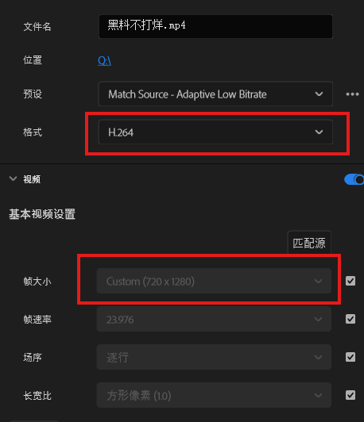
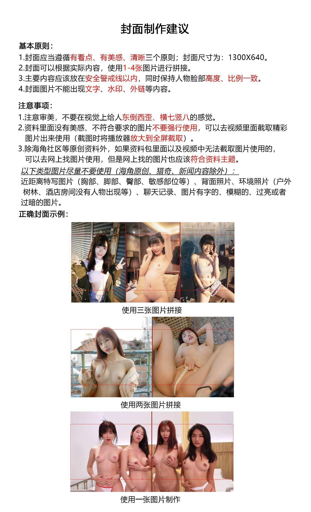
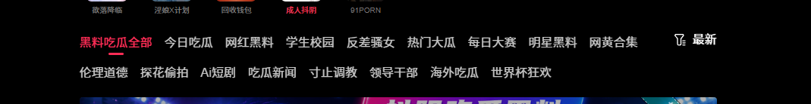
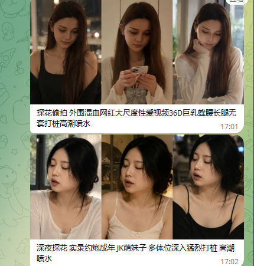

# 远程内容编辑发布流程 SOP（新媒体内容运营版）

| 使用范围：本 SOP 适用于远程内容编辑（撰稿人）的选题素材接收、内容加工、后台草稿、工作群终审与正式发布。任何步骤未完成、未通过审核或与审核版本不一致，均不得直接发布。 |
| --- |

> **行业说明：** 本文以「新媒体 / 数字内容运营」为基准场景编写。换行业时，通常只需替换三处：**第二章「内容红线与合规要求」**（各行业法规不同）、**第八/九章「标签与分类体系」**（各平台分类不同）、**第四/五章「图片与视频技术参数」**（各渠道规格不同）。其余流程骨架可直接复用。

---

# 一、完整发布流程

| 流程 | 执行要求 |
| --- | --- |
| 01 接收选题素材 | 核对素材包是否完整，确认图片、视频、采访/资料记录及补充说明均可正常打开。 |
| 02 素材审核 | 检查清晰度、完整性、来源授权、第三方水印、广告、外链与版权/合规风险。 |
| 03 站内查重 | 使用主题词、人物/品牌名、栏目名与事件关键词进行站内搜索，避免重复发布。 |
| 04 确认内容方向 | 根据素材判断所属栏目与文章重点，无法判断时先反馈编辑主管。 |
| 05 处理图片和视频 | 按统一尺寸、格式、水印与导出参数完成处理，并检查成品。 |
| 06 制作封面 | 制作 1300×640 封面，确保清晰、整齐、有信息点，主体位于安全区域。 |
| 07 撰写标题和正文 | 标题、正文必须与素材一致；未经核实信息使用"据报道、疑似、有待证实"等限定词。 |
| 08 填写标签和关键词 | 标签控制在 3–5 个；关键词围绕人物/品牌、地点、平台、事件与内容类型填写。 |
| 09 存入草稿箱并自检 | 完成后台录入和预览后存入草稿箱，不得直接发布。 |
| 10 发群终审后发布 | 将最终封面和标题按规定格式发到编辑工作群，审核通过后再正式发布。 |

# 二、素材审核与内容红线

- 素材必须完整，图片和视频能够正常打开、播放，不能存在严重模糊、黑屏、卡顿、缺失或无声。

- 图片和视频原则上不能保留其他来源的网址、水印、广告、二维码或外站导流信息。

- 来源不清、授权不明、真实性无法判断或素材严重缺失时，必须先反馈编辑主管，不得自行补编事实。

- 严禁发布涉及未成年人、违法违规、暴力血腥、侵犯他人肖像权/隐私权/名誉权及未获授权的内容。

- 重大事件和新闻类内容必须基于可核实来源，不加入未经证实的结论或主观臆断。

- 涉及他人个人信息、商业机密或受版权保护的素材，须确认已获得合法授权或符合合理使用范围后方可使用。

| 重点：素材存在明显合规/版权风险、无法处理干净或关键信息不完整时，必须停止制作并反馈编辑主管。 |
| --- |

# 三、站内查重与重复内容处理

- 发布前至少使用 2 组搜索词查重：人物/品牌名 + 事件词；地点、机构或平台 + 核心事件词。

- 已发布同一事件且素材高度重复的，不得仅更换标题后重复发布。

- 同一事件出现明确的新进展、新素材或新信源时，可以重新整理发布，但标题和正文必须突出新增内容。

- 查重后仍无法判断是否重复，先将搜索结果截图发给编辑主管确认。

# 四、图片处理要求

- 正文图片统一输出宽度 800px，高度按比例缩放，导出画质建议 90%。

- 图片必须去除黑边、白边、第三方水印、网址、广告和无关字幕。

- 处理后添加本平台最新官方水印，水印不能遮挡主体、关键字幕和核心画面。

- 正文图片必须按照事件发展或内容逻辑排列，不能照搬其他来源顺序，也不能随意堆放。

- 所有图片需重新命名，用简短文字概括主题，不使用特殊符号或外站名称。

# 五、视频处理要求

- 统一使用 Premiere Pro 或指定剪辑工具处理，未经确认不得更换导出方式。

- 横屏视频：1280×720；竖屏视频：720×1280。原则上不再使用其他输出尺寸。

- 导出格式必须选择 H.264；帧率建议 30fps；比特率根据清晰度设置，建议不低于 1.5Mbps。

- 单个视频建议不超过 500MB；视频过长可拆分为 2–3 段。

- 固定的第三方水印应遮挡或模糊处理；浮动水印根据画面情况处理，不能影响正常观看。

- 画面不能出现黑边、白边或空白区域；原视频无法铺满时增加模糊背景。

- 导出完成后必须检查画面、声音、字幕、比例及播放是否正常。



视频导出示例：格式选择 H.264，并核对画面尺寸

> **图内文字（PR 导出设置）：**
> - 文件名：内容标题.mp4
> - 预设：Match Source - Adaptive Low Bitrate
> - **格式：H.264**（重点）
> - 基本视频设置 — **帧大小：Custom（720 × 1280，竖屏）**（重点）
> - 帧速率：23.976　场序：逐行　长宽比：方形像素 (1.0)

# 六、封面制作要求

- 封面尺寸统一为 1300×640，发布前必须检查裁切和预览效果。

- 根据素材情况使用 1–4 张图拼接，优先保证清晰、整齐、有信息点。

- 主体高度和比例尽量统一，避免头重脚轻、横七竖八和画面拥挤。

- 主要内容放在安全区域内，封面不能出现文字、第三方水印、网址、广告、黑边或白边。

- 优先使用素材包中的图片；确实无法制作时，可选择与主题高度相关且已获授权/合规的补充图片。



封面拼接和安全线示例（保留原规范图片示例）

> **图内文字（封面制作建议）：**
>
> **基本原则：**
> 1. 封面应当遵循 **有信息点、有美感、清晰** 三个原则；封面尺寸为 **1300×640**。
> 2. 封面可以根据实际内容，使用 **1-4 张** 图片进行拼接。
> 3. 主要内容应该放在 **安全警戒线以内**，同时保持主体 **高度、比例一致**。
> 4. 封面图片不能出现 **文字、水印、外链** 等内容。
>
> **注意事项：**
> 1. 注意审美，不要在视觉上给人 **东倒西歪、横七竖八** 的感觉。
> 2. 素材里没有美感、不符合要求的图片 **不要强行使用**，可以从视频里截取关键画面使用（截图时将播放器 **放大到全屏截取**）。
> 3. 如素材包及视频中无法截取可用图片，可使用 **已获授权或可商用** 的图库图片，且必须 **符合内容主题**。
> 4. 以下类型图片尽量不要使用：背面照片、空环境照片（无主体出现）、纯聊天记录截图、带字图片、模糊图、过亮或过暗的图片。
>
> **正确封面示例：** 使用三张图片拼接 / 使用两张图片拼接 / 使用一张图片制作

# 七、标题与正文撰写规范

## 标题要求

- 标题建议控制在 25–35 字，使用纯文本表达，不添加无意义符号。

- 标题结构优先使用：人物/品牌或平台 + 事件关键词 + 核心看点；确有地点、机构或身份信息时可自然加入。

- 标题要突出核心信息，但不得脱离素材、过度夸张或把未经证实的信息写成事实。

- 不确定的信息统一使用"据报道""疑似""有待证实""消息称"等限定词。

- 发布前必须检查错字、病句、重复词，以及标题与正文是否一致。

| 标题参考结构：地点/平台/机构/身份 + 人物或品牌 + 事件关键词 + 核心看点。 |
| --- |

| 防重复要求：同一编辑连续发布时，不要长期套用完全相同的开头、段落和结尾，应根据素材内容自然调整结构。 |
| --- |

## 文章排版格式

**1. 标题格式**

人物/品牌或平台 + 事件关键词 + 核心看点

标题必须与正文内容一致，不得直接复制其他来源标题，不得只替换少量词语后使用。

**2. 开头简介**

用 80–120 字介绍人物/主体、事件背景、主要看点和当前进展。

直接进入主题，不重复标题。

不写无关内容，不复制其他来源开头。

未经核实信息使用"据报道""疑似""有待证实"等限定词。

**3. 预览图片**

插入 1 张素材中最有信息点、最能代表文章内容的图片。图片必须清晰，不得带第三方水印、网址或广告。

**4. 一分钟快速看懂**

根据文章内容提取 5–7 项关键信息。没有明确的信息可删除对应项目，不得为了凑数量自行编造。

人物/主体：

发生地点：

所属平台：

内容类型：

事件关键词：

核心看点：

当前进展：

**5. 事件经过**

## 事件经过

用 100–200 字按照时间顺序整理事件的起因、发展和当前情况。内容必须以现有可核实资料为准，不得添加素材中不存在的信息。

**6. 图片展示**

按照事件发展或内容逻辑插入图片，数量根据实际素材调整，不固定为 5 张。

图片

图片

图片

图片

图片

图片较多时可分组展示，并根据每组内容生成小标题。小标题必须根据图片内容重新编写，不能长期使用完全相同的名称。

## 相关资料整理

## 人物/主体动态

## 现场画面展示

## 事件细节说明

**7. 视频介绍**

根据视频实际内容生成小标题，用简短文案说明主要过程、时长、画质和重点信息，再插入视频；不得只放视频不写说明。

## 相关视频内容

视频介绍文案

视频

**8. 常见问题解答 FAQ**

根据整篇文章内容生成 3–5 个用户最可能关心的问题。FAQ 必须结合当前文章生成，不能每篇复制同一套问答。

Q：这件事情已经核实了吗？

A：目前相关信息主要来自公开报道，部分内容尚未得到当事方公开确认。

Q：文章包含哪些内容？

A：文章主要整理了事件经过、相关图片、主体动态和视频信息。

Q：事件目前有什么进展？

A：根据现有公开信息填写，没有可靠信源时不得自行编写。

**9. 结尾总结**

用 80 字左右总结事件重点和当前进展，不重复开头和前文，不添加未经证实的信息。

## 完整排版顺序

文章标题

开头简介

预览图片

一分钟快速看懂

## 事件经过（100-200 字）

图片展示

根据内容生成小标题

视频介绍 + 视频

## 常见问题解答 FAQ

结尾总结

## 排版去重要求

禁止照搬其他来源的标题、开头、小标题、段落顺序、图片顺序、FAQ 和结尾模板。

图片和视频必须根据本篇素材重新排序，不能沿用参考来源的展示顺序。

同一编辑连续发布时，小标题和表达方式要自然变化，避免所有文章完全相同。

参考其他来源时，只能参考事实信息，不能复制整篇文章结构（避免构成抄袭/侵权）。

发布前检查排版是否与参考来源高度相似；相似度过高时必须重新调整。

**重点：文章不仅要修改文字，图片顺序、小标题、FAQ 和整体排版也必须重新整理。**

# 八、标签与关键词规范

- 每条内容标签控制在 3–5 个，优先保留最核心、最便于检索的词。

- 标签只填写内容中客观存在、用户已经使用或已形成固定称呼的词。

- 禁止自行创造事件名，禁止使用"爆款、必看、震惊、刺激到不行"等营销或主观评价词。

- 关键词可包含人物/品牌、账号、平台、地点、机构、事件名和内容类型，必须与标题、正文一致。

- 标签用于分类，关键词用于检索；不要把整句标题直接当作标签或关键词。

| 类型 | 可以使用 | 禁止使用 |
| --- | --- | --- |
| 基础标签 | 平台、主体属性、题材、场景等客观词 | 顶级、最好看、必看 |
| 事件标签 | 真实存在且已形成固定称呼的事件词 | 自行概括或创造事件名 |
| 用户称呼 | 评论区、讨论中已反复使用的称呼 | 个人觉得更好听的改写词 |

# 九、栏目分类选择

| 分类原则：根据内容选择最合适的栏目，避免乱选和重复多选；不确定时先向编辑主管确认。 |
| --- |



平台当前栏目分类示例

> **图内文字（站点导航分类）：**
> - 顶部栏：首页　热点　视频　专题　订阅
> - 分类栏：**资讯全部**　今日热点　行业观察　校园教育　社会民生　深度报道　每日精选　文娱动态　创作合集　｜ 最新
> - 第二行：评论观点　实地探访　AI 解读　新闻速递　生活方式　职场观察　海外资讯　赛事专题

| 栏目 | 适用内容 |
| --- | --- |
| 今日热点 | 普通资讯、日常热点内容 |
| 行业观察 | 行业、企业、从业者相关分析 |
| 校园教育 | 学校、教育、校园相关事件 |
| 深度报道 | 热度高、影响大、讨论度高的事件 |
| 每日精选 | 系列、合集、固定更新内容 |
| 文娱动态 | 影视、文化、娱乐相关 |
| 创作合集 | 创作者、栏目合集类 |
| 社会民生 | 民生话题、社会议题 |
| 实地探访 | 现场探访、实地报道相关 |
| AI 解读 | AI 制作或 AI 辅助解读内容 |
| 新闻速递 | 社会新闻、真实热点事件 |
| 生活方式 | 生活、消费、方式类内容 |
| 职场观察 | 职场、机构、从业人员相关 |
| 海外资讯 | 海外人物、海外事件、国外平台内容 |
| 赛事专题 | 体育赛事及活动相关内容 |

# 十、后台草稿保存流程

- 登录后台并进入文章发布页面，确认账号和栏目无误。

- 上传最终封面，确认尺寸为 1300×640，裁切、清晰度和预览效果正常。

- 填写最终标题、正文、标签、关键词、分类和其他必填项，禁止使用临时内容。

- 按正文内容顺序插入图片，上传视频并等待处理完成。

- 选择最合适的主分类及必要属性，避免乱选、错选或重复多选。

- 预览页面，检查标题、封面、图片顺序、段落间距、视频播放和移动端显示。

- **每篇内容制作完成后，必须先存入后台草稿箱，不得直接发布。**

# 十一、发布前工作群终审流程

每篇内容存入草稿箱后，编辑必须将最终封面和最终标题发送到指定编辑工作群，等待审核确认。

- 工作群统一按照"封面在上、标题在下"的格式发送；一篇内容对应一张封面和一个标题，不要将多篇内容混在同一条消息中。

- 发送到群里的封面必须是后台草稿实际使用的最终版本，尺寸为 1300×640，不得发送临时封面或未处理图片。

- 发送到群里的标题必须是准备正式发布的最终标题，不得使用素材原名、临时标题或未修改的原标题。

- **只有审核人员明确确认通过后，编辑才可进入后台正式发布对应草稿。**

- 如审核人员提出修改意见，需先修改后台草稿，再将修改后的封面和标题重新发群确认，不得未通过审核直接发布。

- 文章标题：填写最终发布标题

- （先发送封面图片）

- 【工作群发送格式示例】


> **图内文字（工作群发送标题示例）：**
> - 行业观察 | 某新消费品牌门店扩张提速 单季新增门店数创同期新高
> - 深度报道 | 实地探访城市更新项目 多方走访还原改造进展
>
> *（示例为群内发送的"封面图 + 最终标题"格式，实际标题以审核通过版本为准）*

- 未按要求发群审核、审核未通过直接发布，或正式发布版本与审核版本不一致的，均视为流程不合格并需返工。

- 正式发布使用的标题和封面必须与群内审核通过的版本一致，不得审核通过后自行更换。

# 十二、发布前最终检查

| 序号 | 检查项目 | 确认 |
| --- | --- | --- |
| 1 | 素材是否完整、来源是否明确且已获授权 | □ |
| 2 | 是否完成站内查重并确认非重复内容 | □ |
| 3 | 封面是否为 1300×640 且预览正常 | □ |
| 4 | 正文图片是否为 800px 宽并按内容逻辑排列 | □ |
| 5 | 图片和视频是否已去除第三方水印、网址和广告 | □ |
| 6 | 是否添加本平台最新官方水印 | □ |
| 7 | 视频是否为 H.264 且画面、声音、字幕正常 | □ |
| 8 | 标题是否通顺、无错字并与内容一致 | □ |
| 9 | 正文是否按规定结构完成且信息真实可核实 | □ |
| 10 | 标签是否为 3–5 个且客观准确 | □ |
| 11 | 关键词是否与标题、正文一致且无堆砌 | □ |
| 12 | 分类是否选择正确 | □ |
| 13 | 页面排版是否整洁，图片、视频位置是否合理 | □ |
| 14 | 是否已存入草稿箱并将最终封面、标题发群审核 | □ |

# 十三、退回、返工与任务认定

- 标题、正文、标签、分类、封面、水印、视频参数或排版不符合要求的，必须按审核意见返工。

- 直接照搬其他来源内容、未查重导致重复发布、虚构信息、照搬排版、侵犯版权或跳过审核流程的，可判定当条任务无效。

- 同一问题反复出现时，应在每日复盘中记录原因和改进动作。

- 全部检查合格、群内审核通过且正式发布完成后，才计入当天有效完成量。

—— 本 SOP 后续根据后台功能、栏目调整和实际执行问题持续更新 ——
```
